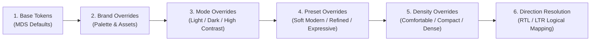

# MDS Token Architecture & Repository Specification
**Module:** Canonical Token Repository (Layer 02)  
**Version:** 1.2.0 (Hardened Architectural Specification)  
**Status:** APPROVED (Foundations & Token Repository Approved for Phase 4)  
**Format Standard:** W3C Design Tokens Community Group (DTCG) Specification  
**Lead Architect:** Mohamed Khalid (Senior Full Stack & Flutter Developer)  
**Last Updated:** 2026-09-14  

---

## 1. Primary Objective & Architectural Scope

The **Master Design System (MDS) Token Repository** transforms MDS from design documentation into an authoritative, machine-readable, platform-agnostic token infrastructure.

### The Canonical Single Source of Truth (SSOT)
> **The structured MDS Token Repository is the single canonical source of truth for all design token definitions, references, and mathematical relationships across all platforms.**

- **Foundations (Layer 01):** Define high-level principles, semantic roles, spatial concepts, and behavioral constraints.
- **Token Repository (Layer 02):** Defines canonical token names, types, relationships, metadata, and theme override mappings.
- **Primitives (Layer 03) & Components (Layer 04):** Strictly consume tokens without locally hardcoding visual values.
- **Platform Outputs (Web, Flutter, Future):** Downstream derived artifacts compiled from this canonical source. No platform implementation owns the source of truth.

---

## 2. DTCG Compatibility & Scaffolding Status

### Architectural Draft Strategy (Option A + Typed Metadata)
To strictly uphold the **Zero Invention Policy** without introducing fake hex colors or arbitrary numbers:
1. **Repository Status:** The current token files are explicitly classified as **Architectural Drafts / DTCG-Structured Scaffolding**.
2. **Value Representation:** Tokens whose visual values have not been approved by the Lead Architect contain explicit `[TBD — requires design decision]` markers.
3. **Draft Boundary:** These files represent canonical taxonomy, schema structure, and metadata relationships. They are intentionally **not yet compiled production data**. Final production values will be populated during visual calibration in later phases.

---

## 3. Canonical Token Layering

MDS enforces a strict, unidirectional 3-tier token hierarchy:

```text
┌────────────────────────────────────────────────────────┐
│                   PRIMITIVE TOKENS                     │
│ Foundational scales & raw values (no component context)│
└───────────────────────────┬────────────────────────────┘
                            │ feeds / referenced by
                            ▼
┌────────────────────────────────────────────────────────┐
│                   SEMANTIC TOKENS                      │
│ Public Design Language API (intent, role, and context) │
└───────────────────────────┬────────────────────────────┘
                            │ feeds / referenced by
                            ▼
┌────────────────────────────────────────────────────────┐
│                  COMPONENT TOKENS                      │
│ Component-specific decisions, variants, and states     │
└────────────────────────────────────────────────────────┘
```

### Layer Definitions:
- **Primitive Tokens:** Foundational raw design values (scales of color, spacing, radius, typography, motion, elevation). They encode zero component or semantic context.
- **Semantic Tokens:** The primary public design language API. They express intent, role, and context (e.g., `color.surface.canvas`, `color.action.primary`, `color.text.primary`).
- **Component Tokens:** Encapsulate component-specific styling decisions across variants, slots, and interactive states.

### Strict Direct Primitive Usage Rule:
Direct consumption of primitive tokens by UI components is **prohibited as a general pattern**.
- **Exception (Documented & Restricted):** Low-level layout primitives (`Stack`, `Inline`, `Grid`) may directly consume primitive modular spacing tokens (`space.scale.*`) for structural layout gaps where semantic roles do not apply.
- **Enforcement:** Components must consume Semantic or Component tokens. Bypassing semantics to use raw color, typography, or shape primitives is an architectural violation.

---

## 4. Reference Depth & Aliasing Policy

To prevent uncontrolled alias chains while supporting rich theme composition, MDS formalizes two distinct dimensions of reference depth:

```text
Structural Reference Chain (Static Depth <= 3):
[Component Token] ──(Hop 1)──> [Semantic Token] ──(Hop 2)──> [Primitive Token]

Theme Dynamic Resolution (Single-Hop Pointer Substitution):
Active Theme (Mode/Preset) substitutes the target of [Semantic Token] without increasing chain depth.
```

### Disambiguated Depth Rules:
1. **Structural Reference Depth (Static Limit = 3):**
   - Maximum static chain: `Component` → `Semantic` → `Primitive` (2 hops).
   - Maximum nested primitive alias (e.g. palette alias to neutral): $\le 3$ hops total.
2. **Theme Resolution (Single-Hop Substitution):**
   - Themes (Dark mode, High Contrast, Presets) do not add chained links to the resolution graph. They perform a **deterministic single-hop pointer substitution** at the semantic token level.
3. **Anti-Circularity:** Circular dependencies ($A \to B \to A$) are strictly forbidden and validated statically at build time.

---

## 5. Multi-Dimensional Theming Architecture

MDS theming resolves through a deterministic, 6-stage composable pipeline:

$$\text{Resolved Token Set} = \text{Base} \xrightarrow{} \text{Brand} \xrightarrow{} \text{Mode} \xrightarrow{} \text{Preset} \xrightarrow{} \text{Density} \xrightarrow{} \text{Direction}$$



### Deterministic Precedence Rules:
1. **Base Tokens:** Establishes all default primitive scales and semantic aliases.
2. **Brand Overrides:** Substitutes brand-specific color palettes and typography choices.
3. **Mode Overrides:** Remaps semantic surfaces, text, and borders for luminance (Light, Dark, High Contrast).
4. **Preset Overrides:** Modifies shape (radius) and elevation tokens without changing component logic.
5. **Density Overrides:** Modifies vertical block padding, control dimensions, and layout gaps.
6. **Direction Resolution:** Binds logical directional tokens (`inline-start`/`inline-end`) to physical rendering properties at compile/runtime.

---

## 6. Theme Coverage Taxonomy: Themeable vs. Required vs. Inherited

To avoid ambiguity regarding theme completeness, MDS establishes three explicit classifications:

| Category | Definition | Architectural Implication |
| :--- | :--- | :--- |
| **Themeable** | A token that is architecturally permitted to vary across themes. | Declared via `$extensions.mds.themeable: true`. Does NOT mean every theme must override it. |
| **Theme Override Required** | A token that a specific theme MUST explicitly define. | For example, `mode.dark` *must* supply an explicit mapping for `color.surface.canvas` to guarantee contrast. |
| **Inherited** | A token that a theme intentionally leaves unchanged. | The theme inherits the base/preceding token value without duplication, preventing redundant data. |

- **Semantic Coverage:** 100% of required semantic tokens must exist in the Base system.
- **Override Coverage:** A theme file contains only its necessary delta overrides.

---

## 7. Semantic Token Identity & Separation

> [!IMPORTANT]
> **Semantic identity must never be inferred from current resolved equality.**

Two semantic tokens may temporarily resolve to the identical primitive value in a baseline theme (e.g. `color.surface.default` and `color.surface.raised` may both reference `{color.neutral.0}` in a flat light theme).
- They remain **distinct architectural tokens**.
- In dark mode, elevated presets, or branded themes, their resolution diverges intentionally.
- Tools and compilers must treat them as separate semantic entities.

---

## 8. Dark Mode & High Contrast Validation Requirements

### 8.1 Dark Mode Architecture: Intentional Luminance Re-mapping
Dark Mode is **not** mathematical color inversion. It is an intentional, layered luminance re-mapping that preserves spatial hierarchy:
- **Surface Layering:** Elevated surfaces must have higher luminance than the canvas background (`surface.raised` > `surface.canvas`).
- **Border Separation:** Container borders must remain distinguishable against dark backgrounds.
- **Text Contrast Hierarchy:** `text.primary`, `text.secondary`, and `text.muted` must maintain distinct contrast ratios.
- **Interactive State Contrast:** Hover, active, and focus states must remain clearly distinguishable on dark surfaces.

### 8.2 High Contrast Mode Architecture: Targeted WCAG AAA
High Contrast Mode provides enhanced contrast-oriented semantic overrides, targeting WCAG AAA contrast levels (≥ 7:1 for text) where applicable:
- **Focus Ring Visibility:** High-contrast focus rings must maintain ≥ 3:1 contrast against both the control and adjacent surfaces.
- **Non-Text Contrast:** Form field borders, switch tracks, and active tabs must achieve ≥ 3:1 contrast against backgrounds.
- **State Differentiation:** Selected, active, and error states must remain distinguishable without relying solely on color (e.g. accompanied by border thickness or shape changes).

---

## 9. Visual Preset Architecture & Primitive Immutability

MDS visual presets (Refined Minimal, Soft Modern, Expressive) alter visual expression through **semantic and component token re-mapping**:

### The Immutability Rule:
> **Presets must change semantic/component mappings. Presets must NEVER redefine primitive token meanings.**

- **Forbidden Semantic Drift:** A preset overriding `{elevation.level1}` to point to `{elevation.level0}` destroys the meaning of the primitive.
- **Approved Architectural Re-mapping:** Refined Minimal remaps `component.card.elevation` to `{elevation.level0}` and `component.button.radius` to `{radius.sm}`. The primitive definitions `{elevation.level1}` and `{radius.md}` remain completely unchanged.

---

## 10. Density Architecture

Density in MDS controls **information throughput and layout rhythm**, not merely spacing:

### Domains Influenced by Density:
1. **Vertical Block Padding:** Control heights and container interior padding.
2. **Interactive Control Dimensions:** Button, input, and badge height scales (`size.control.*`).
3. **Layout Rhythm:** Grid gaps, list item heights, and table row heights.
4. **Typography Leading:** Tighter line-height where appropriate for dense data tables.

### Density Tiers:
- **Comfortable (Default / Implemented):** Touch-first mobile, consumer web, relaxed reading.
- **Compact (Scaffolded):** High-efficiency administrative forms and enterprise dashboards.
- **Dense (Planned):** Maximum throughput data grids, financial sheets, and developer consoles.

*Constraint: Density must NEVER reduce touch/click targets below ergonomic accessibility minimums (minimum 44x44px for touch viewports).*

---

## 11. State-Aware Component Token Architecture

Component tokens represent interactive states through a standardized grammatical structure:

```text
component.[componentName].[variant].[property].[state]
```

### Scalable Component State Structure (Example: Button):
```text
component.button.primary.background.default
component.button.primary.background.hover
component.button.primary.background.pressed
component.button.primary.background.focus
component.button.primary.background.disabled
component.button.primary.foreground.default
component.button.primary.foreground.disabled
component.button.primary.radius
component.button.primary.focusRing
```

### Disambiguation Matrix:
- **State Token:** Represents transient interaction (`default`, `hover`, `pressed`, `focus`, `disabled`).
- **Variant Token:** Represents visual style tier (`primary`, `secondary`, `outline`, `destructive`).
- **Size Token:** Represents dimension scale (`sm`, `md`, `lg`).
- **Component Token:** The concrete token combining component, variant, property, and state.
- **Semantic Token:** The cross-component intent token that feeds the component token.

---

## 12. Token Domains Status Audit

MDS categorizes all design tokens into 11 formal domains:

| Domain | Status | File Location | Scope & Responsibility |
| :--- | :---: | :--- | :--- |
| **1. Color** | Calibrated Candidate | `primitives/color.tokens.json`<br>`semantic/color.tokens.json` | Brand, Neutral, Palette, Text, Surface, Border, Action, Feedback. |
| **2. Typography** | Calibrated Candidate | `primitives/typography.tokens.json` | Multilingual Font Families (Cairo/JetBrains Mono), Weights, Sizes, Leading. |
| **3. Space** | Calibrated Candidate | `primitives/space.tokens.json`<br>`semantic/space.tokens.json` | Base 4px modular grid, logical inline/block spacing. |
| **4. Shape** | Calibrated Candidate | `primitives/shape.tokens.json` | Radii scale (none to full, 10px default), border widths (thin to thick). |
| **5. Size** | Calibrated Candidate | `primitives/size.tokens.json` | Control height scales (32/40/48px), icon dimensions (14–32px). |
| **6. Elevation** | Calibrated Candidate | `primitives/elevation.tokens.json` | Hierarchy shadow levels (0 Flat to 3 Overlay), surface stepping. |
| **7. Motion** | Calibrated Candidate | `primitives/motion.tokens.json` | Duration scales (0–350ms), deceleration curves, reduced-motion. |
| **8. Layer (Z-Index)**| Calibrated Candidate | `primitives/layer.tokens.json` | Stacking order planes (base, raised, dropdown, overlay, toast). |
| **9. Opacity** | Calibrated Candidate | `primitives/opacity.tokens.json` | Alpha transparency steps for backdrops and disabled states. |
| **10. Density** | Calibrated Candidate | `themes/density.compact.tokens.json` | Spatial and dimension scaling across density presets. |
| **11. Component** | Calibrated Candidate | `components/button.tokens.json` | State-aware component token definitions. |

---

## 13. RTL & Bidirectionality Token Model

At the token layer, **direction is resolved through logical semantics**, not by duplicating the entire token tree:
- **Direction-Neutral Tokens:** Color, typography size, motion, elevation, opacity (100% identical in RTL and LTR).
- **Logical Spatial Tokens:**
  - `space.inline.start`: Beginning of horizontal reading flow.
  - `space.inline.end`: End of horizontal reading flow.
  - `space.block.start`: Top of vertical layout block.
  - `space.block.end`: Bottom of vertical layout block.
- **Directional Mirroring:** Navigation icons (arrows, chevrons) mirror at the component rendering layer based on runtime direction; the token repository supplies the logical token.

---

## 14. Token Metadata Schema

Every token definition in the repository adheres to this standardized DTCG metadata structure:

```json
{
  "$type": "color | dimension | duration | cubicBezier | fontWeight | number | shadow",
  "$value": "{alias.path} | [TBD — requires design decision]",
  "$description": "Human and machine-readable explanation of token intent",
  "$extensions": {
    "mds": {
      "layer": "primitive | semantic | component",
      "status": "proposed | reviewed | approved | experimental | beta | stable | deprecated",
      "themeable": true,
      "overridePolicy": "optional | required | forbidden",
      "introducedIn": "1.0.0",
      "deprecated": false,
      "replacement": null,
      "wcagTarget": "AA | AAA | null"
    }
  }
}
```

---

## 15. Token Governance & Lifecycle

Tokens progress through the official 8-stage MDS lifecycle:
$$\text{Proposed} \to \text{Reviewed} \to \text{Approved} \to \text{Experimental} \to \text{Beta} \to \text{Stable} \to \text{Deprecated} \to \text{Removed}$$

### Deprecation Rules:
1. A token marked `deprecated: true` must provide a non-null `replacement` pointer.
2. Compilers emit deprecation warnings when a deprecated token is consumed.
3. Deprecated tokens remain functional for at least one major release before physical removal.

---

## 16. Comprehensive Token Validation Suite

Before any downstream compilation, the token validator runs eight automated verification checks:

1. **Structural Validation:** Valid JSON syntax, adherence to DTCG format, well-formed `$type` and `$value`.
2. **Reference Integrity:** All aliases (`{...}`) resolve to existing tokens; zero broken pointers; static chain depth $\le 3$.
3. **Anti-Circularity:** Static cycle detection algorithm guarantees zero circular alias loops.
4. **Architectural Boundary Enforcement:** Primitives do not reference Semantics; Components do not reference other Components; no unauthorized primitive bypass.
5. **Primitive Immutability:** Presets do not override primitive token values.
6. **Accessibility Verification:** Contrast algorithms verify `color.text.*` against `color.surface.*` for WCAG AA/AAA compliance across Light, Dark, and High Contrast.
7. **Internationalization Audit:** Verification that zero token names contain physical direction keys (`left`, `right`).
8. **AI Readability Audit:** All tokens contain non-empty `$description` strings and valid metadata blocks.

---

## 17. Downstream Platform Compilation Pipeline

The token repository is canonical and technology-agnostic. Platform outputs are derived artifacts:

```text
Canonical Tokens (W3C DTCG JSON)
        ↓
Validation Suite (8 Stages)
        ↓
Compiler Engine
 ├── Web Platform:
 │    ├── tokens.css (CSS Custom Properties with :root and [data-theme])
 │    ├── tailwind.preset.js (Tailwind CSS theme configuration)
 │    └── tokens.d.ts (TypeScript type definitions)
 │
 ├── Flutter Platform:
 │    ├── mds_colors.dart (Custom ThemeExtension<MdsColors>)
 │    ├── mds_theme.dart (Material 3 ThemeData builder)
 │    └── mds_typography.dart (TextTheme bindings)
 │
 └── Design Tooling:
      └── Tokens Studio for Figma JSON synchronization
```

---

## 18. Formal Design Decision Log (Phase 2 Hardening)

| Decision | Reason | Alternatives Considered | Why Rejected | Impact |
| :--- | :--- | :--- | :--- | :--- |
| **DTCG JSON as Canonical Format** | Industry standard, framework-agnostic, native Style Dictionary & Figma support. | YAML, TypeScript files, Dart classes. | Language-locked; poor cross-toolchain interoperability. | Tokens compile to any platform seamlessly. |
| **Architectural Draft Classification (Option A)** | Avoids inventing fake hex/pixel numbers to satisfy strict schema validators. | Option B: Fake placeholder values (e.g. `#000000`). | Violates zero-invention rule and creates dangerous false-complete appearance. | Clean distinction between structure and visual data. |
| **Deterministic Resolution Order** | Guarantees predictable token values across theme combinations. | Ad-hoc runtime merging. | Prone to race conditions and combinatorial explosion. | Multi-dimensional themes resolve predictably. |
| **Preset Primitive Immutability** | Preserves stable foundational meanings of primitive tokens. | Allowing presets to redefine primitive values. | Causes catastrophic semantic drift across the design system. | Presets override component/semantic tokens only. |
| **Disambiguated Reference Depth** | Clarifies static alias chain ($\le 3$) vs single-hop theme substitution. | Blanket depth limit of 3 without distinction. | Would restrict legitimate multi-dimensional theme composition. | Prevents alias bloat while supporting themes. |

---

## 19. Calibration Status & Remaining Deferred Scope
 
The core visual foundations and token repository of MDS have completed the Phase 3.5 Calibration & Consistency Gate and are **APPROVED (Phase 4 Authorized to Begin)**:
- **Color Values:** Approved (Chromatic Slate neutrals 0–1000, Royal Sapphire brand 50–950, and semantic palettes).
- **Typography Scale:** Approved (Cairo unified bilingual font, JetBrains Mono, Discretized Typographic Scale 12–48px, context-aware leading).
- **Spacing Scale:** Approved (4px base grid, `space.0` to `space.16`, 1152px / 1440px container max-widths).
- **Shape & Radii:** Approved (`radius.none` to `radius.full` with 10px `radius.md` default, 1px/1.5px/2px borders).
- **Elevation Shadows:** Approved (Levels 0–3 multi-layer physical shadows, dark mode luminance stepping).
- **Motion Timing:** Approved (0/150/250/350ms durations, cubic-bezier deceleration curves).
- **Size & Density:** Approved (Controls 32/40/48px, Icons 14–32px, mandatory 44×44px touch target enforcer).
 
### Deferred Scope (Scheduled for Subsequent Phases):
1. **Proposal 1: Continuous Loop Motion Tokens (`motion.loop.*`):** Formally **`DEFERRED — FUTURE PHASE`**. To be evaluated when concrete Loading, AI, and Streaming components are designed in Phase 5. Zero loop tokens in active repository.
2. **Proposal 2: Dense Tier Primitives (`size.control.xs = 28px`):** Formally **`DEFERRED — FUTURE PHASE`**. Active scale strictly remains 32/40/48px until dense desktop data-grid requirements are empirically validated in Phase 5.
3. **Component-Specific Tokens Beyond Button:** Inputs, Cards, Dialogs, Badges, Tabs (Phase 4 / 5).
4. **Downstream Compilation Artifacts:** Platform CSS, Tailwind plugin, and Flutter theme generators (Phase 5).
