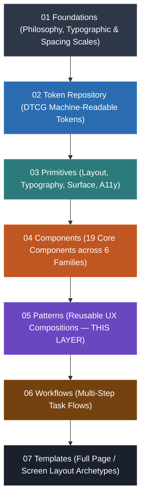

# MDS Layer 05: Patterns & Composition Architecture

**Document Layer:** 05-Patterns  
**Status:** APPROVED (Phase 6 Implementation)  
**Lead Architect:** Mohamed Khalid (Senior Full Stack & Flutter Developer)  
**Last Updated:** 2026-09-16  

---

## 1. Executive Summary & Purpose

The **Patterns & Composition Layer (Layer 05)** establishes the canonical architectural standard for assembling existing Master Design System (MDS) Primitives (Layer 03) and Core Components (Layer 04) into reusable, context-aware user experience solutions.

A Pattern answers a fundamental UX engineering question:
> *"Given an established user intent or recurring interface challenge, how should existing MDS primitives and components be composed into a coherent, accessible, and resilient solution?"*

Patterns sit strictly above atomic Components and below full multi-step product Workflows and page Templates.

---

## 2. The Unidirectional Architectural Flow

MDS strictly enforces a unidirectional layer hierarchy where lower layers never depend on, import, or reference higher layers:



### 2.1 The Composition Law
$$\text{Foundation} \longrightarrow \text{Token} \longrightarrow \text{Primitive} \longrightarrow \text{Component} \longrightarrow \mathbf{\text{Pattern}} \longrightarrow \text{Workflow} \longrightarrow \text{Template}$$

- **Components** provide self-contained, atomic interactive building blocks (`Button`, `Input`, `Badge`, `Card`, `Alert`).
- **Patterns** coordinate these components into standard UI arrangements solving recurrent user intents (`Form-Section`, `Search-Filter-Bar`, `Empty-State`, `Page-Header`).
- **Patterns DO NOT** define new primitive tokens, invent raw styles, or implement encapsulated atomic state machines.

---

## 3. Clear Definition & Boundaries

### 3.1 What a Pattern IS:
1. **A Reusable Composition:** A standardized assembly of existing Layer 03 Primitives and Layer 04 Components.
2. **Context-Aware:** Integrates responsive recomposition, experience states (loading, error, empty), and density modes.
3. **Semantically Stable:** Solves a recognized, recurring UX challenge with consistent information hierarchy and keyboard flow.
4. **Platform-Agnostic Contract:** Provides a universal architectural specification translatable to Flutter widgets, React/Next.js components, or web views.

### 3.2 What a Pattern IS NOT:
- **NOT a Disguised Component:** If a pattern requires its own encapsulated, atomic state machine, dedicated hit-box math, and custom primitives, it is a **Component** and belongs in Layer 04.
- **NOT a Template or Page:** If a composition dictates the entire viewport layout or full-screen scaffold, it is a **Template** (Layer 07).
- **NOT a Workflow:** If a composition spans multiple sequential screens, routes, or asynchronous multi-page transitions, it is a **Workflow** (Layer 06).
- **NOT a One-Off Layout:** Custom layouts unique to a single screen belong to product implementation, not the design system pattern library.
- **NOT a Hardcoded CSS Recipe:** Patterns must never inject raw visual literals (hex colors, arbitrary pixels, custom cubic-beziers).

---

## 4. Mandatory 22-Point Pattern Anatomy Standard

Every production Pattern specification in Layer 05 must strictly document all 22 required architectural points. No section may be omitted:

```text
┌─────────────────────────────────────────────────────────────────────────┐
│                    MDS 22-POINT PATTERN ANATOMY                         │
├─────────────────────────────────────────────────────────────────────────┤
│  1. Purpose                 │ 12. Responsive Behavior                   │
│  2. User Intent             │ 13. Accessibility (a11y)                  │
│  3. Problem Solved          │ 14. RTL & Logical Progression             │
│  4. When to Use             │ 15. Density Behavior                      │
│  5. When Not to Use         │ 16. Motion & Animation                    │
│  6. Composition Architecture│ 17. Token Usage                           │
│  7. Required Components     │ 18. Contextual Variants                   │
│  8. Optional Components     │ 19. Composition Rules                     │
│  9. Information Hierarchy   │ 20. Anti-Patterns & Prohibitions          │
│ 10. Interaction Model       │ 21. AI Usage & Generation Rules           │
│ 11. Experience States       │ 22. Verification & Validation Criteria    │
└─────────────────────────────────────────────────────────────────────────┘
```

### Detailed Anatomy Breakdown:
1. **Purpose:** Succinct summary of what the pattern accomplishes.
2. **User Intent:** The primary goal the end-user is attempting to achieve (e.g., "Filter a dataset by category", "Confirm a destructive operation").
3. **Problem Solved:** The specific cognitive or structural interaction friction this pattern eliminates.
4. **When to Use:** Prescriptive criteria and UI contexts where this pattern is the mandatory solution.
5. **When Not to Use:** Scenarios where another pattern, component, or workflow is required.
6. **Composition Architecture:** ASCII diagram and structural layout showing how primitives and components nest.
7. **Required Components:** Explicit list of non-negotiable Layer 03/04 elements.
8. **Optional Components:** Contextual accessory elements permitted within the pattern.
9. **Information Hierarchy:** Step-by-step visual and scanning order (Primary $\to$ Secondary $\to$ Tertiary).
10. **Interaction Model:** Complete state transitions, keyboard shortcuts, mouse/touch behaviors, and event flows.
11. **Experience States:** Specific handling for `Loading`, `Empty`, `Partial`, `Success`, `Error`, `Unsaved Changes`, and `Disabled`.
12. **Responsive Behavior:** Explicit recomposition behaviors across `Compact` (<640px), `Standard` (640–1024px), `Wide` (1024–1440px), and `Full` (>1440px).
13. **Accessibility (a11y):** Heading levels, ARIA landmark roles, accessible names, focus loops, reading order, and contrast compliance.
14. **RTL & Logical Progression:** Native inline-axis progression (`inline-start` $\to$ `inline-end`), logical icon flipping, and zero `row-reverse`.
15. **Density Behavior:** Visual adjustments between `Comfortable`, `Compact`, and `Dense` tiers (strictly respecting control size invariants; 0 unapproved 28px).
16. **Motion & Animation:** Timing and curves strictly bound to approved tokens (`motion.duration.fast`, `motion.duration.normal`, `motion.ease.standard`); reduced-motion 0s collapse.
17. **Token Usage:** Exact list of semantic and primitive tokens consumed by the composition.
18. **Contextual Variants:** Explicitly approved structural variations (e.g., `Stacked` vs. `Split`).
19. **Composition Rules:** Binding layout invariants (Parent-Owned Spacing, Surface Elevation Triad, Hit-box preservation).
20. **Anti-Patterns & Prohibitions:** Explicit list of developer mistakes that violate design system integrity.
21. **AI Usage & Generation Rules:** Deterministic rules for LLMs and AI coding assistants when synthesizing this pattern.
22. **Verification & Validation Criteria:** Testable checkboxes covering structural, accessibility, responsive, and token integrity.

---

## 5. Cross-Cutting Systems Integration

### 5.1 Parent-Owned Spacing Invariant (CDR-001)
> **Law:** Patterns and components never declare external margins. All spacing between components within a pattern is owned exclusively by layout primitives (`Stack`, `Inline`, `Grid`, `Cluster`).

### 5.2 Surface & Depth Triad (CDR-006)
> **Law:** Patterns respect the 4-layer depth hierarchy:
> `Canvas (Base 0)` $\longrightarrow$ `Surface (Layer 1)` $\longrightarrow$ `Raised / Card (Layer 2)` $\longrightarrow$ `Overlay / Modal (Layer 3)`.
> Patterns must never skip layers (e.g., placing an Overlay directly on Canvas without an intermediate backdrop).

### 5.3 Interaction Hit-Box Preservation (CDR-002)
> **Law:** Patterns must never visually compress or physically restrict interactive controls below the **$44 \times 44\text{px}$ touch hit-box requirement** (`PressTarget`), regardless of viewport size or density tier.

### 5.4 RTL Logical Flow Invariant (PDR-009 / CDR-003)
> **Law:** Patterns flow naturally along the inline axis. `flex-direction: row-reverse` is strictly prohibited. Under LTR, visual order mirrors DOM order from left to right. Under RTL, visual order mirrors DOM order from right to left, preserving **WCAG 2.1/2.2 SC 2.4.3 Focus Order**.

---

## 6. Strict Anti-Bloat & Enterprise System Invariant

Per Master Specification Sections 11 and 34, complex enterprise systems are **strictly deferred**:
1. `DataGrid` (Virtual scrolling, cell editing, inline sorting columns)
2. `RichTextEditor` (WYSIWYG formatting engine)
3. `Calendar` (Full month/week scheduling grid)
4. `DateRangePicker` (Multi-month range selection overlay)
5. `CommandSystem` (Quick-palette / spotlight overlay)
6. `Tree` (Multi-level collapsible file-tree)
7. `Combobox` (Full searchable fuzzy dropdown autocomplete)
8. `VirtualizedList` (Infinite virtualized list scrolling engine)
9. `FileUploadManager` (Chunked multi-file upload queue)

> [!IMPORTANT]
> **Pattern Discipline:** Patterns in Phase 6 **must not** attempt to secretly build or fake any of these 9 deferred systems. Any data table pattern uses the approved static `Table` component with standard responsive pagination or horizontal scrolling.

---

## 7. Pattern Taxonomy & Family Classification

MDS Layer 05 organizes patterns into 6 functional families:

| Family | Problem Domain | Canonical Representative Patterns |
| :--- | :--- | :--- |
| **Forms** | User data entry, validation, submission | `Form-Section`, `Inline-Validation-Group` |
| **Search & Discovery** | Information querying, filtering, sorting | `Search-Filter-Bar` |
| **Data Interaction** | Structured presentation of entities & metrics | `Data-List-Card`, `Table-Actions-Toolbar` |
| **Feedback & Recovery** | Status announcements, empty data, confirmations | `Empty-State`, `Confirmation-Dialog` |
| **Navigation & Context** | Wayfinding, hierarchy, contextual actions | `Page-Header` |
| **AI Interaction** | Generative input prompts, streaming, response evaluation | `AI-Input-Prompt`, `AI-Result-Review` |

---

## 8. Pattern Lifecycle & Governance

Every pattern progresses through the canonical MDS lifecycle:

```text
Proposed ──► Reviewed ──► Approved ──► Experimental ──► Beta ──► Stable ──► Deprecated ──► Removed
```

- **Phase 6 Target:** Representative core patterns enter **Stable** (architecture, 22-point anatomy, accessibility, and validation sandbox complete).
- **Modification Protocol:** Modifying an approved pattern requires an architectural decision record (PAT-XXX) in `Pattern-Decision-Log.md`.
