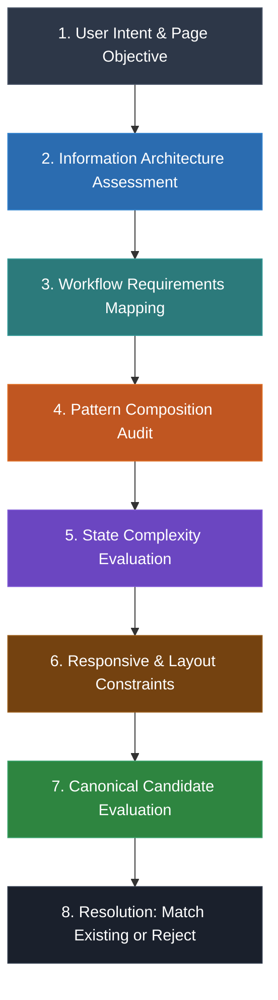

# Master Design System (MDS) — Template Selection Rules & Engine

**Document Layer:** 07-Templates / Selection Engine  
**Status:** APPROVED (Phase 8.1.3 Delivery)  
**Lead Architect:** Mohamed Khalid (Senior Full Stack & Flutter Developer)  
**Last Updated:** 2026-09-17  

---

## 1. Executive Summary & Purpose

The **Template Selection Engine (TSE)** is an 8-stage deterministic decision framework that guides system architects and product engineers from high-level user intent to the exact canonical MDS Template. It enforces the principle of parsimony, prevents template proliferation ("Template Explosion"), and eliminates redundant custom page layouts.

---

## 2. The 8-Stage Deterministic Selection Pipeline

### Stage 1: User Intent & Page Objective
Analyze the fundamental reason why the user visits this screen:
- To monitor telemetry, metrics, and high-level health $\to$ Branch A (Overview)
- To browse, filter, and manage a collection of entities $\to$ Branch B (Collection Management)
- To inspect, verify, or edit a single rich entity $\to$ Branch C (Single Entity)
- To perform a focused data-entry or creation task $\to$ Branch D (Task / Form)
- To configure application preferences or account settings $\to$ Branch E (Settings)
- To interact with generative AI, prompts, and artifact generation $\to$ Branch F (AI Workspace)

### Stage 2: Information Architecture Assessment
- Does the view require a multi-metric KPI header and heterogeneous dashboard widgets? $\to$ `Dashboard-Overview`
- Does the view require a centralized search/filter toolbar above a homogeneous table or card grid? $\to$ `List-Management`
- Does the view require a dual-pane master-detail relationship (primary content on start, metadata sidebar on end)? $\to$ `Detail-Entity`
- Does the view require a single-column, focused width-constrained form (768px–1152px)? $\to$ `Form-Edit`
- Does the view require a persistent vertical category navigation rail alongside preference sections? $\to$ `Settings-Workspace`
- Does the view require a multi-pane studio layout (prompt input, live canvas, side-by-side citations)? $\to$ `AI-Workspace`

### Stage 3: Workflow Requirements Mapping
Identify the primary Layer 06 Workflow hosted:
- `Search-Discovery` $\to$ Hosts cleanly in `List-Management`
- `Form-Submission` $\to$ Hosts cleanly in `Form-Edit`
- `Settings-Update` (Autosave or Batched) $\to$ Hosts cleanly in `Settings-Workspace` or `Detail-Entity`
- `Destructive-Action` $\to$ Triggers modal within `List-Management`, `Detail-Entity`, or `Form-Edit`
- `AI-Synthesis-Review` $\to$ Hosts cleanly in `AI-Workspace`
- `Error-Recovery` $\to$ Universal error interceptor across all templates

### Stage 4: Pattern Composition Audit
Verify that required Layer 05 Patterns are supported:
- `Page-Header` $\to$ Universal header slot across all 6 templates
- `Search-Filter-Bar` $\to$ Toolbar slot in `List-Management`
- `Data-List-Card` $\to$ Entity slot in `List-Management` and `Dashboard-Overview`
- `Form-Section` $\to$ Main slot in `Form-Edit` and `Settings-Workspace`
- `Empty-State` $\to$ Dedicated empty state slot across all templates
- `Confirmation-Dialog` $\to$ Modal overlay slot across all templates
- `AI-Input-Prompt` & `AI-Result-Review` $\to$ Dedicated workspace slots in `AI-Workspace`

### Stage 5: State Complexity Evaluation
Verify that the selected template provides structural slots for:
- Loading skeleton (matching specific template geometry)
- Zero-data empty state (diagnostic message + CTA)
- Filtered empty state (clear filters CTA)
- Full-page error banner or card with contextual retry
- Access restriction boundary (Authentication Required / Permission Denied)

### Stage 6: Responsive & Layout Constraints
Evaluate reflow behavior across screen sizes:
- Compact (< 768px): Single column, drawer/sheet conversion, bottom sticky action bar ($\ge 44\text{px}$ targets).
- Standard (768px–1151px): Adaptive dual-pane or stacked layouts.
- Wide (1152px–1439px): Canonical 1152px max-width container.
- Full ($\ge$ 1440px): Canonical 1440px max-width container (`container.xl`).

### Stage 7: Canonical Candidate Evaluation
Select the closest canonical match:
1. `MDS-TMP-001: Dashboard-Overview`
2. `MDS-TMP-002: List-Management`
3. `MDS-TMP-003: Detail-Entity`
4. `MDS-TMP-004: Form-Edit`
5. `MDS-TMP-005: Settings-Workspace`
6. `MDS-TMP-006: AI-Workspace`

### Stage 8: Resolution & Anti-Explosion Gate
- **Match Found:** Compose the existing Canonical Template by injecting product-specific data into defined slots.
- **No Direct Match:** Apply the **Parsimony Test**: Can the layout be satisfied by configuring optional slots or combining an existing template with a workflow? If yes, use existing template. If no, document a formal Architectural Proposal for a new template (Level 5 Authority). Never create unapproved ad-hoc templates.

---

## 3. The Template Decision Matrix

| User Objective | Primary Regions | Hosted Workflows | Canonical Match |
| :--- | :--- | :--- | :--- |
| High-level operational overview, metrics, KPIs, recent updates | Header, Metric Cards Grid, Activity Feed, Actions | `Search-Discovery` (filter), `Destructive-Action` | **`Dashboard-Overview`** (`MDS-TMP-001`) |
| Browse, filter, sort, paginate, bulk-manage entities | Header, Filter Toolbar, Data Grid/Cards, Pagination | `Search-Discovery`, `Destructive-Action` | **`List-Management`** (`MDS-TMP-002`) |
| Inspect entity properties, view audit history, related items | Header, 2-Pane Split (Primary Info + Context Sidebar) | `Settings-Update` (inline), `Destructive-Action` | **`Detail-Entity`** (`MDS-TMP-003`) |
| Structured data entry, creation wizard, checkout flow | Focused Header, Scoped Form Sections, Sticky Actions | `Form-Submission`, `Destructive-Action` (cancel) | **`Form-Edit`** (`MDS-TMP-004`) |
| Configure system preferences, user profile, security | Rail Navigation, Active Preference Section Form | `Settings-Update` (instant & batched) | **`Settings-Workspace`** (`MDS-TMP-005`) |
| Generative prompt execution, artifact canvas, review citations | Workspace Header, 3-Pane Split (Prompt, Canvas, Review) | `AI-Synthesis-Review`, `Error-Recovery` | **`AI-Workspace`** (`MDS-TMP-006`) |

---

## 4. Comprehensive Anti-Pattern Catalog

To prevent systemic degradation, the following anti-patterns are strictly prohibited:

### ❌ Anti-Pattern 1: The One-Off Custom Page ("Snowflake Page")
- **Violation:** Creating a bespoke layout template for a single product screen instead of composing an existing canonical template.
- **Remediation:** Map the screen's information architecture to one of the 6 canonical templates and inject domain content into standard slots.

### ❌ Anti-Pattern 2: The Template Duplicator ("Template Explosion")
- **Violation:** Creating a "Search Results Template" or "Approval Template" that differs from `List-Management` or `Detail-Entity` only in action button text or minor filter placement.
- **Remediation:** Use `List-Management` for search results and `Detail-Entity` for approval flows, configuring optional regions.

### ❌ Anti-Pattern 3: The Business-Coupled Template ("God Template")
- **Violation:** Hardcoding product-specific data structures (e.g. `patient_id`, `stripe_card_token`, `order_status_enum`) into template markup.
- **Remediation:** Templates must declare abstract named slots (`slot="primary"`, `slot="metadata"`). Data binding belongs exclusively to application code.

### ❌ Anti-Pattern 4: The Lower-Layer Inversion ("Bypassing Patterns")
- **Violation:** A template creating its own raw header layout using flexbox and buttons instead of consuming the approved `Page-Header` pattern.
- **Remediation:** Templates must consume approved Layer 05 Patterns and Layer 04 Components.

### ❌ Anti-Pattern 5: The Unconstrained Wide-Screen Stretched Layout ("The Tennis Match")
- **Violation:** Allowing full-width form inputs or table cells to expand uncontrollably across a 4K display, creating unreadable line lengths.
- **Remediation:** Enforce canonical max-width container constraints (`container.lg: 1152px`, `container.xl: 1440px`) defined in `01-Foundations/03-Spacing-and-Grid.md`.
