# MDS Component Implementation Contract & Anatomy Standard

**Layer:** 13-Implementation  
**Target Specification:** [`MDS-Implementation-Architecture.md`](file:///d:/Work/Dev/Master%20Design%20System/MDS/13-Implementation/MDS-Implementation-Architecture.md)  
**Status:** APPROVED  
**Lead Architect:** Mohamed Khalid (Senior Full Stack & Flutter Developer)  
**Ratification Date:** 2026-09-20  
**Target Consumer:** Phase 9.4 (Core Component Runtime)  

---

## 1. Architectural Mission

The **Component Implementation Contract** establishes the rigorous engineering standard that every component in MDS must satisfy.

Every component built in Phase 9 must comply with the **16-Point Component Anatomy Standard**:
1. **Semantic Identifier:** Unique kebab-case name with `.mds-[component]` namespace.
2. **DOM Anatomy:** Clean, valid HTML5 semantic markup (e.g. `<button>`, `<input>`, `<dialog>`).
3. **Slot Topology:** Explicit slots for Prefix/Leading, Label/Body, and Suffix/Trailing content.
4. **Variant Hierarchy:** Defined intents (Primary, Secondary, Outline, Ghost, Danger).
5. **Standardized Control Scale:** 32px (`sm`), 40px (`md`), 48px (`lg`) heights.
6. **State Coverage:** Default, Hover, Pressed, Focus, Disabled, Selected, Loading, Error, Success.
7. **Token Binding:** 100% mapped to DTCG tokens; 0 raw hex or pixel constants.
8. **Keyboard Protocol:** Full Tab navigation, Enter/Space activation, Esc dismiss, arrow roving.
9. **Accessibility & ARIA:** Valid roles, dynamic `aria-*` state flags, labeled inputs.
10. **44×44px Hit Target:** Guaranteed touch target via `PressTarget` contract.
11. **Bidirectional RTL Symmetrical Flow:** CSS Logical Properties, directional icon mirroring.
12. **Responsive Recomposition:** Adapts across 320px, 768px, 1024px, 1440px viewports.
13. **Custom Event Interface:** Dispatches typed standard DOM CustomEvents (`mds-change`, etc.).
14. **Error Affordances:** Non-color-only validation (icons, text, aria-invalid).
15. **Reduced-Motion Safe:** Instant transitions under `prefers-reduced-motion`.
16. **Parent-Owned Spacing:** Exactly zero outer margins; spacing owned by parent layouts.

---

## 2. The 19 Core Component Canonical Registry

MDS strictly codifies **19 Core Components** across 6 families:

```mermaid
graph TD
    MDS[MDS Component Registry - 19 Components]
    
    MDS --> Actions[Actions: 3]
    MDS --> Inputs[Inputs: 7]
    MDS --> Feedback[Feedback: 3]
    MDS --> Data[Data Display: 3]
    MDS --> Nav[Navigation: 1]
    MDS --> Overlays[Overlays: 2]

    Actions --> C1[Button]
    Actions --> C2[IconButton]
    Actions --> C3[Link]

    Inputs --> C4[Field]
    Inputs --> C5[Input]
    Inputs --> C6[Textarea]
    Inputs --> C7[Checkbox]
    Inputs --> C8[Radio]
    Inputs --> C9[Switch]
    Inputs --> C10[Select]

    Feedback --> C11[Alert]
    Feedback --> C12[Spinner]
    Feedback --> C13[Skeleton]

    Data --> C14[Badge]
    Data --> C15[Card]
    Data --> C16[Table]

    Nav --> C17[Tabs]

    Overlays --> C18[Dialog]
    Overlays --> C19[Tooltip]

    style Actions fill:#2B6CB0,stroke:#3182CE,color:#fff
    style Inputs fill:#2C7A7B,stroke:#319795,color:#fff
    style Feedback fill:#D69E2E,stroke:#ECC94B,color:#fff
    style Data fill:#C05621,stroke:#DD6B20,color:#fff
    style Nav fill:#6B46C1,stroke:#805AD5,color:#fff
    style Overlays fill:#744210,stroke:#975A16,color:#fff
```

### 2.1 Family 1: Actions (3 Components)
1. **`Button`:** Standard interactive trigger.
   - *Heights:* 32px (`sm`), 40px (`md`), 48px (`lg`).
   - *Variants:* Primary, Secondary, Outline, Ghost, Danger.
   - *Tokens:* `--mds-component-button-*`.
2. **`IconButton`:** Square icon trigger for compact toolbars.
   - *Sizes:* 32×32px, 40×40px, 48×48px.
   - *A11y:* Mandatory accessible label via `aria-label` or ``.
   - *Hit-box:* Guaranteed $\ge 44 \times 44\text{px}$ on touch viewports.
3. **`Link`:** Navigational anchor.
   - *Variants:* Default (underline on hover), Subdued, Standalone.
   - *Focus:* 2px offset focus ring.

### 2.2 Family 2: Form & Input (7 Components)
4. **`Field`:** Structural wrapper grouping Label, Control, HelperText, and ErrorMessage.
   - *A11y:* Connects `for`/`id`, `aria-describedby`, and `aria-errormessage`.
5. **`Input`:** Single-line textual control (text, email, password, search, number).
   - *Slots:* Prefix icon, suffix icon, clear button.
   - *Tokens:* `--mds-component-input-*`.
6. **`Textarea`:** Multi-line text input with vertical resizing and character counter.
7. **`Checkbox`:** Tri-state boolean selection (`checked`, `unchecked`, `indeterminate`).
   - *Anatomy:* Native hidden checkbox + custom visual box + label.
8. **`Radio`:** Mutually exclusive option selector within a radio group (`name`).
9. **`Switch`:** Instantaneous boolean setting trigger.
   - *Semantics:* Role `switch`, `aria-checked="true/false"`.
10. **`Select`:** Selection dropdown.
    - *Baseline Tier:* Native `<select>` enhanced with MDS styling for universal accessibility.
    - *Enterprise Custom Tier:* Custom listbox specification reserved for complex requirements.

### 2.3 Family 3: Feedback (3 Components)
11. **`Alert`:** Prominent contextual notification banner.
    - *Intents:* Info (Cerulean), Success (Emerald), Warning (Amber), Danger (Crimson).
    - *A11y:* Role `alert` for errors; `status` for informational updates.
12. **`Spinner`:** Indeterminate loading indicator.
    - *Motion:* Smooth deceleration rotation (`--mds-motion-duration-slow`).
    - *Fallback:* Replaced with text label when `prefers-reduced-motion` is active.
13. **`Skeleton`:** Layout placeholder preventing Cumulative Layout Shift (CLS).
    - *Visual:* Shimmer gradient animation matching the surface Depth Triad.

### 2.4 Family 4: Data Display (3 Components)
14. **`Badge`:** Compact metadata tag and status indicator.
    - *Intents:* Neutral, Brand, Success, Warning, Danger.
    - *Tokens:* `--mds-component-badge-*`.
15. **`Card`:** Container surface grouping related content and actions.
    - *Depth Triad:* Level 0 (Bordered Flat), Level 1 (Raised Surface), Level 2 (Floating).
16. **`Table`:** Tabular data presentation.
    - *Features:* Sticky header, tabular numerals (`font-variant-numeric: tabular-nums`), responsive horizontal scroll wrapper.

### 2.5 Family 5: Navigation (1 Component)
17. **`Tabs`:** Content section switcher.
    - *Semantics:* Role `tablist`, `tab`, `tabpanel`.
    - *Keyboard:* Roving tabindex (Left/Right arrow keys in LTR, Right/Left in RTL).

### 2.6 Family 6: Overlays (2 Components — Phase 5 Specified)
18. **`Dialog`:** Modal dialog overlay.
    - *Implementation:* Built on native `<dialog>` element with HTML5 `showModal()` API.
    - *Safety Invariant:* Cancel button receives initial focus on destructive dialogs, NEVER Delete.
    - *Behavior:* Focus trap inside modal; Esc key closes; background inert.
19. **`Tooltip`:** Contextual hover/focus text snippet.
    - *Trigger:* Keyboard focus (`:focus-visible`) and pointer hover.
    - *Invariant:* Never used as the sole carrier of critical action instructions.

---

## 3. Strict Deferral of 9 Complex Enterprise Systems

The following 9 complex systems are formally **DEFERRED to Phase 9 Enterprise / Future Phase**:
1. `DataGrid` (Virtual scrolling, column reordering, multi-column sorting)
2. `RichTextEditor` (WYSIWYG formatting, inline blocks)
3. `Calendar` (Multi-month grid, date picking)
4. `DateRangePicker` (Dual-calendar interval selection)
5. `CommandSystem` (Global `Ctrl+K` omni-bar palette)
6. `Tree` (Hierarchical multi-level nested folders)
7. `Combobox` (Fuzzy autocomplete with virtualized dropdown)
8. `VirtualizedList` (Infinite scrollDOM recycle window)
9. `FileUploadManager` (Chunked drag-and-drop upload queue)

**Invariant Rule:** No partial or mock implementations of these 9 systems may be introduced into the core component layer.

---

## 4. State Matrix & Visual Communication

Components must communicate states using multiple redundant cues (**WCAG 1.4.1 Non-color-only communication**):

| State | CSS Selector / Attribute | Visual Treatment | Non-Color Cue |
| :--- | :--- | :--- | :--- |
| **Default** | `:not(:disabled)` | Base background, border, text tokens | Standard geometry |
| **Hover** | `:hover:not(:disabled)` | Darkened/lightened surface tone | Cursor pointer |
| **Pressed** | `:active:not(:disabled)` | Scaled/inset surface luminance | Tactile scale transform (0.98) |
| **Focus** | `:focus-visible` | 2px solid `var(--mds-color-border-focus)` | 2px offset high-contrast ring |
| **Disabled** | `:disabled`, `[aria-disabled="true"]` | `opacity: 0.5`, `cursor: not-allowed` | `disabled` HTML attribute |
| **Loading** | `[aria-busy="true"]`, `.is-loading` | Spinner icon replaces slot content | `aria-busy="true"`, pointer-events none |
| **Selected** | `[aria-selected="true"]`, `[aria-checked="true"]` | Accent background token | Checkmark icon / active indicator dot |
| **Error** | `[aria-invalid="true"]`, `.has-error` | Crimson border token | Exclamation icon + error message text |
| **Success** | `.has-success` | Emerald border token | Check circle icon + confirmation text |
