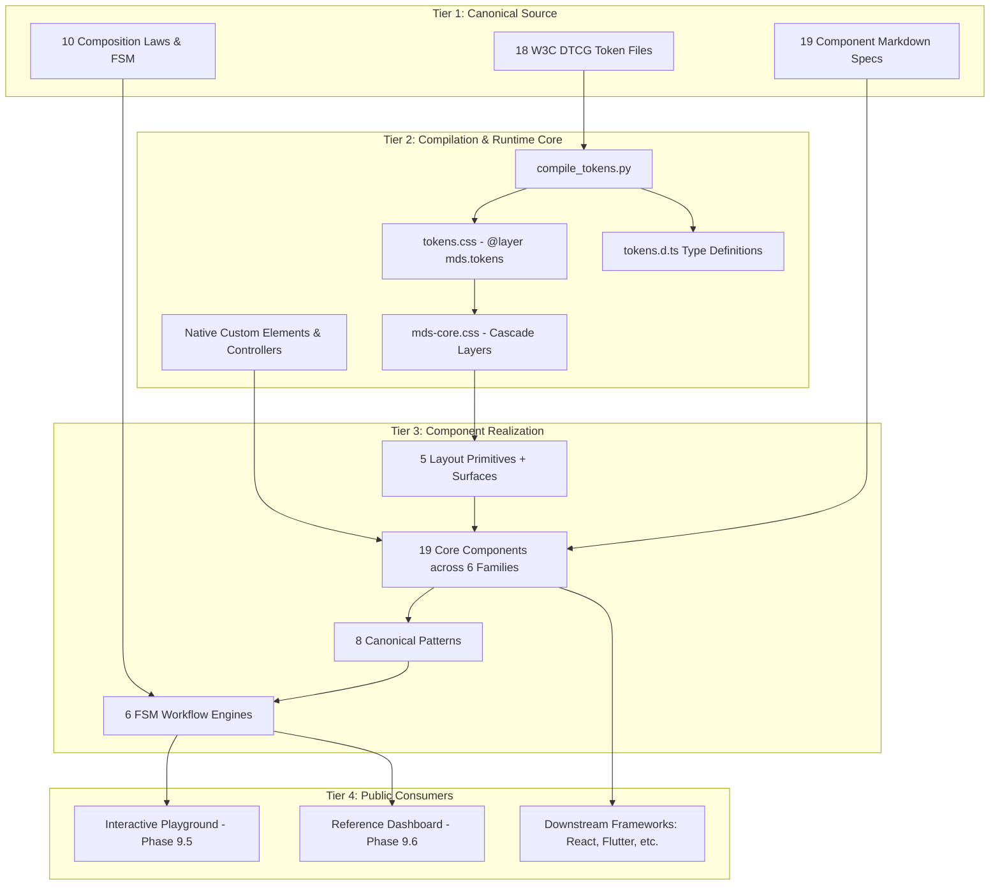

# MDS Layer 13 — Web Reference Implementation Architecture

**Specification Version:** 1.0.0  
**Phase:** 9.1 (Implementation Architecture)  
**Status:** APPROVED (Architecture Specification Only — Implementation Unstarted)  
**Lead Architect:** Mohamed Khalid (Senior Full Stack & Flutter Developer)  
**Ratification Date:** 2026-09-20  
**Target Consumer:** Phase 9.2 (Token Runtime) through Phase 9.7 (Validation)  

---

## 1. Executive Summary & Architectural Mission

The **MDS Web Reference Implementation** is the canonical, executable, platform-neutral realization of the approved **MDS Architecture Baseline v1.0.0**.

### 1.1 The Core Operating Principle
> **The Reference Implementation is strictly a CONSUMER of MDS, never a competing source of truth.**

```text
MDS Architecture Baseline v1.0.0 (Source of Truth)
                         │
                         ▼
             Token Runtime Engine (Phase 9.2)
                         │
                         ▼
          Foundations & Primitives Runtime (Phase 9.3)
                         │
                         ▼
            Core Components Runtime (Phase 9.4)
                         │
                         ▼
             Composite Patterns & Workflows
                         │
        ┌────────────────┴────────────────┐
        ▼                                 ▼
Interactive Playground (Phase 9.5)   Reference Application (Phase 9.6)
```

The Reference Implementation proves that every design principle, token, primitive, component contract, composition law, and workflow FSM codified in MDS translates into high-performance, accessible, and responsive production software without requiring developers or AI agents to invent ad-hoc design decisions.

---

## 2. Technology Selection & Architectural Evaluation

To identify the optimal implementation technology, three distinct architectures were evaluated against 12 core project priorities:

### 2.1 Evaluation Matrix of Implementation Options

| Evaluation Dimension | Option A: Heavy Framework (React / Next.js) | Option B: Minimal Vanilla (Pure HTML + CSS) | Option C: Hybrid Standards (Native Custom Elements + Cascade Layers + DTCG Compiler) |
| :--- | :--- | :--- | :--- |
| **1. Platform Neutrality** | Poor (locks reference to React ecosystem) | Excellent (runs everywhere) | **Optimal** (native web standards wrap cleanly into any downstream framework) |
| **2. Dependency Cost** | High (npm, package.json, Node build toolchain) | Zero | **Zero Runtime Dependencies** (Python compiler for build; 0 runtime npm deps) |
| **3. Type Safety** | High (TypeScript JSX) | None (loose JS strings) | **High** (Generated `tokens.d.ts` and component contract interfaces) |
| **4. Longevity & Stability** | Medium (vulnerable to framework version churn) | Maximum (standard web APIs) | **Maximum** (W3C Custom Elements + CSS `@layer` standards never deprecate) |
| **5. AI-Agent Readability** | Medium (obscured by JSX transpilation & hooks) | High (plain DOM) | **Optimal** (Self-documenting DOM anatomy, explicit attributes, zero magic) |
| **6. Theming & Density** | Requires CSS-in-JS or Tailwind plugins | Native CSS custom properties | **Native CSS Custom Properties** via deterministic cascade resolution |
| **7. RTL & Bidirectionality** | Requires framework RTL plugins | 100% CSS Logical Properties | **100% CSS Logical Properties** with zero `row-reverse` |
| **8. Accessibility (A11y)** | Risk of synthetic event / hydration mismatches | Native HTML semantics | **Native HTML5 Semantics** with standard WAI-ARIA state contracts |
| **9. Local Development** | Requires `npm install` and dev server | Instant (`file://` or static server) | **Instant** (`file://` or python `http.server`; zero installation barrier) |
| **10. Downstream Utility** | Difficult for non-React teams (Flutter, Laravel) | Easy to inspect | **Universal Benchmark** (Flutter & Web teams can inspect pure DOM/CSS contracts) |

### 2.2 Selected Architecture: Option C (Hybrid Web Standards)
MDS adopts **Option C: Hybrid Modern Web Standards Architecture**:
1. **DTCG Token Compiler:** Native, zero-dependency Python build utility transforming 18 `.tokens.json` files into CSS Custom Properties (`tokens.css`) and TypeScript declarations (`tokens.d.ts`).
2. **CSS Cascade Layers:** Modern `@layer` architecture isolating Reset, Tokens, Foundations, Primitives, Components, Patterns, and Templates to eliminate specificity wars.
3. **Semantic HTML5 & Native Custom Elements:** Components are built as semantic HTML5 elements enhanced with native Custom Elements (`<mds-dialog>`, `<mds-tabs>`, `<mds-switch>`) or lightweight vanilla controllers. Zero third-party runtime dependencies.

---

## 3. High-Level System Topology

The Phase 9 runtime is structured into four clearly decoupled tiers:



---

## 4. Architectural Rules of Implementation

1. **The Single Source Invariant:** Runtime styles and behaviors must strictly derive from `MDS/01-Foundations/` through `MDS/07-Templates/`. An implementer is forbidden from inventing colors, spacing, radii, or interaction states.
2. **Zero Raw Hex Colors:** All color declarations must use `var(--mds-color-*)`. No `#hex` or `rgb()` literals in component stylesheets.
3. **Strict CSS Logical Properties:** All spacing and positioning must use logical properties (`margin-inline`, `padding-inline`, `inset-inline`, `border-inline`). Physical `left`/`right` and `row-reverse` are strictly forbidden.
4. **44×44px Interaction Target:** Every interactive element on touch viewports must guarantee a 44×44px hit-box via the `PressTarget` primitive contract.
5. **Universal Experience States:** Every view and data-driven component must support all five operational states: `Loading`, `Empty`, `Error`, `Partial`, and `Success`, paired with actionable `Recovery` paths.
6. **Security Triad Decoupling:** In all workflow controllers: $\text{User Confirmation} \ne \text{Authentication} \ne \text{Authorization}$.
7. **Accessibility First:** Semantic HTML elements (`<button>`, `<input>`, `<dialog>`, `<table>`) are mandatory. ARIA is applied strictly to bridge dynamic states (`aria-expanded`, `aria-busy`, `aria-live`).

---

## 5. Phase 9 Execution Roadmap

Phase 9 is executed sequentially across 7 strictly bounded sub-phases:

| Sub-Phase | Title | Scope | Deliverables | Status |
| :--- | :--- | :--- | :--- | :---: |
| **9.1** | **Implementation Architecture** | Architecture & technical decisions | 8 Architecture Specifications in `MDS/13-Implementation/` | **APPROVED** ✅ |
| **9.2** | **Token Runtime** | Compiler & token distribution | `compile_tokens.py`, `dist/tokens/tokens.css`, `tokens.d.ts` | ⏳ Pending |
| **9.3** | **Primitive Runtime** | Layout engines & surface triad | Primitives CSS layer, Container, Stack, Grid, Surface | ⏳ Pending |
| **9.4** | **Component Runtime** | 19 Core Components | HTML/CSS/JS for 19 components across 6 families | ⏳ Pending |
| **9.5** | **Interactive Playground** | Component laboratory & inspector | Unified Playground web app with live state/theme controls | ⏳ Pending |
| **9.6** | **Reference Application** | 6 Page templates & workflows | Real-world application executing all 6 canonical workflows | ⏳ Pending |
| **9.7** | **Validation & CI** | Automated verification & sign-off | Test suite execution, A11y audit, baseline lock | ⏳ Pending |

---

## 6. Implementation Governance & Change Boundaries

- **Safe Changes (Implementer Autonomous):**
  - Composing existing approved components into templates.
  - Applying approved token custom properties.
  - Adding internal implementation unit tests.
- **Controlled Changes (Requires Review):**
  - Adding component variants or internal private helper classes.
  - Adding custom element lifecycle hooks.
- **Architectural Changes (Requires Full MDS Governance):**
  - Modifying token values or token schema.
  - Adding new components, patterns, workflows, or templates.
  - Altering visual DNA, breakpoints, or container max-widths.
