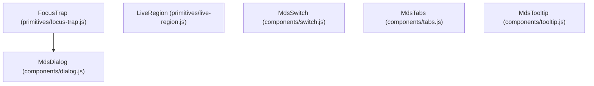

<!-- Classification: CURRENT_SPECIFICATION -->
# Master Design System (MDS) — Architecture Specification
## Phase 10.3: Production Artifact Compilation & Zero-NPM Distribution

**Document Reference:** `MDS-ARCH-10.3-REV4`  
**Phase:** 10.3 (Production Artifact Compilation & Zero-NPM Distribution)  
**Layer:** Layer 13 (Implementation, Tooling & Operationalization)  
**Date:** 2026-10-02  
**Lead Architect:** Mohamed Khalid (Senior Full Stack & Flutter Developer)  
**Audit Stage:** Strict Independent Architecture Audit Final Micro-Remediation (REV4)  
**Status:** **DRAFT (ARCHITECTURE STAGE REMEDIATION REV4) — AWAITING INDEPENDENT ARCHITECTURE AUDIT**  
**Execution Context:** Microsoft Windows, Google Chrome v153, Python 3.12.8 (Pure Standard Library)  
**Implementation Guard:** Phase 10.3 Implementation STRICTLY BLOCKED until Independent Architecture Audit approval  

---

## 1. Executive Summary & Architectural Mission

The **Master Design System (MDS)** represents an enterprise-grade, mathematically verified design system and standards-based web runtime. Having locked the DSSE Operational CLI in **Phase 10.1** and the Agent Bootstrap & Handoff Contract in **Phase 10.2**, Phase 10.3 establishes the architectural blueprint for the **Production Artifact Compilation & Zero-NPM Distribution Engine**.

### 1.1 Architectural Mission
Phase 10.3 codifies:
1. **The Production Compilation Pipeline:** A deterministic 6-stage compiler that transforms canonical compilation sources into deployable, production-ready distribution artifacts.
2. **The Zero-NPM Distribution Model:** A distribution architecture that completely eliminates Node.js and npm runtime dependencies. MDS delivers a standards-based web runtime built on modern W3C web standards (CSS Cascade Layers, CSS Custom Properties, Native HTML5 Custom Elements, WAI-ARIA) that executes in any browser, framework, or clean offline machine without requiring `package.json` or `npm install`.
3. **Standalone Operational Tooling (`tools/compiler/`):** A compiler, verification CLI, and packager built exclusively with the Python 3.12+ standard library (zero pip dependencies), guaranteeing reproducible, bit-exact builds across environments.
4. **Canonical Source Manifest Trust Chain (G-011):** A cryptographic trust chain binding `canonical_source_manifest.json` directly to the locked MDS Governance Root Trust Anchor (`trust_anchor.json` / `MDS-ROOT-ANCHOR-v1`) via a sealed trust binding record.
5. **Exact Canonical 61 Source vs 94 Protected Core Partition Law (G-012-A):** A formal mathematical partition proving that the 61 compilation sources are an exact subset of the 94 Protected Core files using exact canonical filesystem paths (permanently eliminating logical path aliases such as `Runtime/core` and affirming `MDS/Runtime/css/`), completely isolating 33 protected non-source files (`Playground/`, `Reference-Application/`, and internal runtime tests/docs).
6. **Complete Build Environment Determinism & Eight-Tier Build Identity Model (G-013-A):** An exhaustive identity model incorporating Source Identity ($I_{src}$), Compiler Identity ($I_{cmp}$), Build Config Identity ($I_{cfg}$), Build Environment Contract Identity ($I_{env}$), Build Epoch ($T_{epoch}$), Unified Build Identity ($I_{build}$), Release Identity ($I_{rel}$), and Artifact Identity ($I_{art}$), establishing the absolute invariant: Same canonical source + same compiler identity + same build configuration + same build environment contract + same build epoch MUST produce byte-identical artifacts.
7. **Strict Reproducible Build Epoch Contract (G-014):** A bifurcated build contract where reproducible mode mandates explicit `SOURCE_DATE_EPOCH` injection with zero silent fallbacks, paired with complete archive metadata normalization.
8. **Executable Read-Only Bootstrap Distribution Gate (ADR-210):** A strict, read-only verification command (`verify`) acting as an inviolable precondition before Step 8 of `MDS_AGENT_BOOTSTRAP.md`.

```text
┌────────────────────────────────────────────────────────────────────────┐
│ Root Trust Anchor (MDS-ROOT-ANCHOR-v1 — Fingerprint Pinned)             │
│ MDS/10-Testing/baselines/historical/trust_anchor.json                  │
└───────────────────────────────────┬────────────────────────────────────┘
                                    │ Cryptographically Binds
                                    ▼
┌────────────────────────────────────────────────────────────────────────┐
│ Canonical Source Manifest & Trust Binding                              │
│ MDS/10-Testing/baselines/compilation/canonical_source_manifest.json     │
│ Verified via source_trust_binding.json & compiler authoritative constant│
└───────────────────────────────────┬────────────────────────────────────┘
                                    │ Authorizes & Verifies
                                    ▼
┌────────────────────────────────────────────────────────────────────────┐
│ 61 Allowlisted Compilation Sources (Subset of 94 Protected Core)       │
│ 18 DTCG Tokens | 4 Core CSS | 12 Primitive CSS | 2 Primitive JS        │
│ 20 Component CSS | 5 Component JS                                      │
└───────────────────────────────────┬────────────────────────────────────┘
                                    │ Pure Ingestion in Reproducible Mode
                                    │ (Requires explicit SOURCE_DATE_EPOCH)
                                    ▼
┌────────────────────────────────────────────────────────────────────────┐
│ Standalone Compiler Engine (tools/compiler/ — Python Stdlib Only)      │
│ Ingestion → Dependency DAG → Layer Scoping → Custom Elements → Manifest│
└───────────────────────────────────┬────────────────────────────────────┘
                                    │ Emits (Standards-Based Zero-NPM Runtime)
                                    ▼
┌────────────────────────────────────────────────────────────────────────┐
│ Production Distribution Package (dist/)                                │
│ ├── Bundles: mds.all.css, mds.all.js, mds.all.esm.js                   │
│ ├── Modular: mds.tokens.css, mds.primitives.css, mds.components.css   │
│ ├── Data & Types: tokens.json, tokens.d.ts, components.d.ts            │
│ ├── Integrity: mds_dist_manifest.json, mds_dist_manifest.sha256        │
│ └── Archives: mds-v1.0.0-dist.zip, mds-v1.0.0-dist.tar.gz              │
└───────────────────────────────────┬────────────────────────────────────┘
                                    │ Precondition Verification (Read-Only)
                                    ▼
┌────────────────────────────────────────────────────────────────────────┐
│ MDS_AGENT_BOOTSTRAP Step 8 Verification Gate                           │
│ (Downstream AI Agent executes verify before synthesizing UI code)      │
└────────────────────────────────────────────────────────────────────────┘
```

---

## 2. Scope & Inviolable Non-Goals

### 2.1 In Scope
- Comprehensive architectural specification of the **Production Compilation Pipeline**.
- Formal definition of the **Zero-NPM Distribution Model** and standards-based web runtime contracts.
- Architectural design of **Standalone Tooling (`tools/compiler/`)** and CLI subcommands (`compile`, `verify`, `pack`).
- Exhaustive **Source Inventory Model** and exact mathematical partition of 61 sources vs 94 Protected Core files.
- Formal **Canonical Source Manifest Trust Chain** anchored cryptographically to the Root Trust Anchor.
- Canonical **JavaScript Compilation Graph**, topological dependency ordering, and custom element registration semantics.
- Explicit resolution of **Flutter / Dart Scope** under Option A (platform-neutral token dictionary).
- Formal specification of the **Bootstrap Distribution Verification Gate** as a mandatory, read-only precondition of Step 8 in `MDS_AGENT_BOOTSTRAP.md`.
- Comprehensive **Reproducible Build Model** requiring explicit `SOURCE_DATE_EPOCH` in reproducible mode.
- Complete **Seven-Tier Build Identity Model** incorporating reproducibility-critical build configuration.
- Comprehensive **Testing & Verification Architecture** spanning 5 discrete test suites.
- Formal definition of the exact architectural boundary between **Phase 10.3 (Distribution)** and **Phase 10.4 (Production Certification)**.

### 2.2 Inviolable Non-Goals
1. **NO Implementation Code in Architecture Stage:** Writing Python compiler scripts, bash scripts, or build utilities during this stage is strictly prohibited.
2. **NO Artifact Generation in Architecture Stage:** Creating files in `dist/` or `release/` is strictly prohibited until architecture is audited and implementation is authorized.
3. **NO Modification of Protected Core:** The 94 files across `02-Tokens/`, `Runtime/`, `Playground/`, and `Reference-Application/` are globally immutable.
4. **NO Modification of Historical Phase Guard:** The 53 documents across 12 historical phases in `MDS/10-Testing/baselines/historical/` are immutable.
5. **NO Modification of Phase 10.1 or Phase 10.2 Deliverables:** `tools/dsse/`, `tools/agent_bootstrap/`, `MDS_AGENT_BOOTSTRAP.md`, and `schemas/` remain locked.
6. **NO Premature Execution of Phase 10.4:** Production certification, multi-browser matrix sign-offs, and final v1.0.0 production stamps are strictly reserved for Phase 10.4.
7. **NO Introduction of Node.js or npm Runtime Dependencies:** MDS runtime artifacts must never require npm packages, node_modules, or Node.js runtime engines.
8. **NO Generation of Dart Code in Phase 10.3:** Dart code generation is out of scope; Phase 10.3 produces `tokens.json` as the platform-neutral source of truth.

---

## 3. Current Locked Inputs & Upstream Precedents

Phase 10.3 builds upon immutable foundations established and ratified in earlier phases:

| Source Phase | Locked Deliverable | Precedent & Authority Established | Consumption in Phase 10.3 |
| :--- | :--- | :--- | :--- |
| **Phase 9.1** | `MDS-Implementation-Architecture.md` | Selected Option C: Hybrid Web Standards (Native Custom Elements, CSS `@layer`, Zero npm runtime deps). | Direct architectural mandate for Zero-NPM runtime packaging. |
| **Phase 9.2** | `Token-Runtime-Architecture.md` | Proved token DAG resolution, $\le 3$ hop limit, multi-dimensional theme override cascading. | Ingested into compiler token pipeline stage. |
| **Phase 9.3** | `CSS-Architecture.md` | Ratified CSS Cascade Layers: `@layer mds.reset, mds.tokens, mds.foundations, mds.primitives, mds.components, mds.themes`. | Scoping architecture for bundled and modular CSS. |
| **Phase 9.7.9** | `trust_anchor.json` | Root Trust Anchor `MDS-ROOT-ANCHOR-v1` with cryptographic fingerprint `20c240e650a4...`. | Cryptographic trust anchor for the source manifest chain. |
| **Phase 9.7.10** | `snapshot.py` | NIST SHA-256 pre/post cryptographic snapshots over Protected Core. | Reused for compile-time mutation verification. |
| **Phase 9.7.11** | `ci_artifact_manifest.json` | Non-circular SHA-256 self-integrity verification protocol (ADR-146). | Adopted and extended for distribution manifest verification. |
| **Phase 10.1** | `tools/dsse/` | Standalone CLI tooling architecture, pure Python stdlib execution, discrete exit codes. | Architectural blueprint for `tools/compiler/` CLI design. |
| **Phase 10.2** | `MDS_AGENT_BOOTSTRAP.md` | Downstream 12-step agent startup protocol and governance lock. | Host for mandatory Step 8 distribution verification gate. |

---

## 4. Canonical Source Manifest Trust Chain (G-011 / ADR-206)

### 4.1 The Manifest Tampering Threat
A compiler cannot blindly trust `canonical_source_manifest.json` simply because it exists on disk. If an adversary or compromised script modifies a canonical source file AND simultaneously modifies the expected hash inside `canonical_source_manifest.json`, a naive compiler checking disk files against the on-disk manifest would falsely report that the sources are valid.

### 4.2 Cryptographic Trust Chain Specification
To guarantee that the manifest itself has not been altered, Phase 10.3 binds `canonical_source_manifest.json` directly to the locked MDS Governance Root Trust Anchor:

```text
┌────────────────────────────────────────────────────────────────────────┐
│ Root Trust Anchor (MDS-ROOT-ANCHOR-v1)                                  │
│ File: MDS/10-Testing/baselines/historical/trust_anchor.json            │
│ Hardcoded Fingerprint: 20c240e650a447299690d0e2f65c65a0dbed2acc...     │
└───────────────────────────────────┬────────────────────────────────────┘
                                    │ Asserts Bit-Exact Fingerprint
                                    ▼
┌────────────────────────────────────────────────────────────────────────┐
│ Compilation Source Trust Binding Record                                │
│ File: MDS/10-Testing/baselines/compilation/source_trust_binding.json    │
│ Contains:                                                              │
│   - root_trust_anchor_id: "MDS-ROOT-ANCHOR-v1"                         │
│   - root_trust_anchor_fingerprint: "20c240e650a447299690d0e2..."       │
│   - canonical_source_manifest_digest: SHA-256(canonical_source_manifest)│
│   - authorized_by: "Lead Architect Mohamed Khalid"                     │
│   - authorization_timestamp: "2026-10-02T01:30:00Z"                    │
│   - authorizing_adr: "ADR-206"                                         │
└───────────────────────────────────┬────────────────────────────────────┘
                                    │ Verifies Manifest Digest & Authoritative Constant
                                    ▼
┌────────────────────────────────────────────────────────────────────────┐
│ Canonical Source Baseline Manifest                                     │
│ File: MDS/10-Testing/baselines/compilation/canonical_source_manifest.json│
│ Contains: Roster of 61 COMPILATION_SOURCE paths + expected SHA-256     │
└───────────────────────────────────┬────────────────────────────────────┘
                                    │ Verifies Disk Source Files
                                    ▼
┌────────────────────────────────────────────────────────────────────────┐
│ 61 Allowlisted Source Files on Disk                                    │
│ Computes SHA-256 on disk and asserts: actual_sha256 == expected_sha256 │
└────────────────────────────────────────────────────────────────────────┘
```

### 4.3 Verification Algorithm & Dual Anchoring
When the compiler executes Stage 1 pre-flight validation:
1. **Step 1 (Root Anchor Verification):** Computes NIST SHA-256 of `MDS/10-Testing/baselines/historical/trust_anchor.json` and asserts bit-exact match with the authoritative constant `ROOT_TRUST_ANCHOR_FINGERPRINT` (`20c240e650a447299690d0e2f65c65a0dbed2acc4aba9de9997c4a093f2ed114`).
2. **Step 2 (Trust Binding Verification):** Reads `MDS/10-Testing/baselines/compilation/source_trust_binding.json`. Asserts that its `root_trust_anchor_fingerprint` matches the verified Root Anchor.
3. **Step 3 (Manifest Digest Verification):** Computes the SHA-256 digest of `MDS/10-Testing/baselines/compilation/canonical_source_manifest.json`. Asserts bit-exact match against:
   - `source_trust_binding.json.canonical_source_manifest_digest`
   - The authoritative constant `AUTHORITATIVE_SOURCE_MANIFEST_DIGEST` compiled into `tools/compiler/engine.py`.
   - **Tamper Response:** If `canonical_source_manifest.json` does not match, the compiler immediately aborts with:
     `Exit 3: INTEGRITY_VIOLATION` (`TAMPERED_SOURCE_MANIFEST`).
4. **Step 4 (Source File Verification):** Iterates over the 61 entries in the verified manifest. Reads each file from disk, computes NIST SHA-256, and asserts equality with `expected_sha256`. Any mismatch aborts with:
   `Exit 3: INTEGRITY_VIOLATION` (`CORRUPTED_CANONICAL_SOURCE`).

### 4.4 Bootstrap, Amendment & Governance Protocols
- **Bootstrap Protocol:** Created during Phase 10.3 authorization. The Lead Architect runs the initial hashing over the 61 source files, generates `canonical_source_manifest.json`, signs `source_trust_binding.json`, and ratifies `AUTHORITATIVE_SOURCE_MANIFEST_DIGEST`.
- **Amendment Protocol:** Canonical sources can ONLY be updated via an approved Architecture Decision Record (ADR). The Lead Architect executes the formal ratification utility:
  ```bash
  python tools/compiler/cli.py ratify-sources --author "Lead Architect Mohamed Khalid" --adr "ADR-xxx"
  ```
  This command updates the manifest, updates the binding record with the new digest, and records the architectural justification.
- **Ownership & Authorization:** Exclusively owned and signed by **Lead Architect Mohamed Khalid**.

---

## 5. Source Inventory Model: Exact Canonical 61 Source vs 94 Protected Core Partition (G-012-A / ADR-207)

### 5.1 Architecture Reconciliation: Canonical Filesystem Paths vs Logical Categories
An essential finding of the Architecture Audit (`G-012-A`) identified potential ambiguity regarding the directory `Runtime/core/`. 
- **The Reconciliation Fact:** In earlier architectural conceptualizations, the foundational stylesheet layers were referred to by the logical moniker `Runtime/core/`. However, the **authoritative on-disk canonical architecture** established in Phase 9.7 partitions the runtime strictly into:
  ```text
  MDS/Runtime/
  ├── css/            <-- Authoritative canonical directory (4 CSS files)
  ├── primitives/     <-- Authoritative canonical directory (12 CSS + 2 JS files)
  ├── components/     <-- Authoritative canonical directory (20 CSS + 5 JS files)
  └── tokens/         <-- Internal legacy build tool (13 files — PROTECTED_NON_SOURCE)
  ```
- **The Inviolable Law:** **No directory named `Runtime/core/` exists or may exist on disk.** Logical aliases are strictly prohibited from substituting for filesystem paths. The compiler ingestion engine, the source manifest, and the verification tooling operate exclusively on **exact canonical filesystem paths**.

---

### 5.2 The Mathematical Partition Law
MDS Protected Core encompasses exactly **94 files** across 4 canonical directory trees (`MDS/02-Tokens`, `MDS/Runtime`, `MDS/Playground`, `MDS/Reference-Application`). The compilation engine operates under a formal mathematical partition dividing the Protected Core into **61 Compilation Sources** and **33 Protected Non-Sources**:

$$\mathbf{ProtectedCore} = \mathbf{CompilationSourceSet} \cup \mathbf{ProtectedNonSourceSet}$$
$$\mathbf{CompilationSourceSet} \cap \mathbf{ProtectedNonSourceSet} = \emptyset$$
$$|\mathbf{ProtectedCore}| = 94, \quad |\mathbf{CompilationSourceSet}| = 61, \quad |\mathbf{ProtectedNonSourceSet}| = 33$$

```text
┌────────────────────────────────────────────────────────────────────────────────────────┐
│ PROTECTED CORE (94 FILES TOTAL)                                                        │
├───────────────────────────────────────────┬────────────────────────────────────────────┤
│ CompilationSourceSet (61 Files)           │ ProtectedNonSourceSet (33 Files)           │
│   ├── MDS/02-Tokens/: 18 files            │   ├── MDS/02-Tokens/ Spec: 1 file          │
│   ├── MDS/Runtime/css/: 4 files           │   ├── MDS/Playground/: 7 files             │
│   ├── MDS/Runtime/primitives/: 14 files   │   ├── MDS/Reference-Application/: 7 files  │
│   │   ├── CSS: 12 files                   │   ├── MDS/Runtime/tokens/: 13 files        │
│   │   └── JS: 2 files                     │   ├── MDS/Runtime/primitives/ tests: 3 file│
│   └── MDS/Runtime/components/: 25 files   │   └── MDS/Runtime/components/ tests: 2 file│
│       ├── CSS: 20 files                   │                                            │
│       └── JS: 5 files                     │                                            │
│   └── (EXPLICIT ALLOWLIST INGESTION)      │   └── (STRICTLY FORBIDDEN / READ BLOCKED)  │
└───────────────────────────────────────────┴────────────────────────────────────────────┘
```

---

### 5.3 Complete Enumeration of CompilationSourceSet (Exact 61 Canonical Paths)

Every path below is an exact canonical POSIX relative path that exists on disk:

#### Category 1: Design Tokens — DTCG Formats (`MDS/02-Tokens/` — 18 files)
1. `MDS/02-Tokens/components/badge.tokens.json`
2. `MDS/02-Tokens/components/button.tokens.json`
3. `MDS/02-Tokens/components/input.tokens.json`
4. `MDS/02-Tokens/primitives/color.tokens.json`
5. `MDS/02-Tokens/primitives/elevation.tokens.json`
6. `MDS/02-Tokens/primitives/layer.tokens.json`
7. `MDS/02-Tokens/primitives/motion.tokens.json`
8. `MDS/02-Tokens/primitives/opacity.tokens.json`
9. `MDS/02-Tokens/primitives/shape.tokens.json`
10. `MDS/02-Tokens/primitives/size.tokens.json`
11. `MDS/02-Tokens/primitives/space.tokens.json`
12. `MDS/02-Tokens/primitives/typography.tokens.json`
13. `MDS/02-Tokens/semantic/color.tokens.json`
14. `MDS/02-Tokens/semantic/space.tokens.json`
15. `MDS/02-Tokens/themes/density.compact.tokens.json`
16. `MDS/02-Tokens/themes/mode.dark.tokens.json`
17. `MDS/02-Tokens/themes/mode.high-contrast.tokens.json`
18. `MDS/02-Tokens/themes/preset.refined.tokens.json`

#### Category 2: Foundation & Core Stylesheets (`MDS/Runtime/css/` — 4 files)
19. `MDS/Runtime/css/foundations.css`
20. `MDS/Runtime/css/mds-core.css`
21. `MDS/Runtime/css/primitives.css`
22. `MDS/Runtime/css/reset.css`

#### Category 3: Interaction & Layout Primitives (`MDS/Runtime/primitives/` — 14 files)
- **Primitive CSS (12 files):**
  23. `MDS/Runtime/primitives/icon/icon.css`
  24. `MDS/Runtime/primitives/interaction/focus-ring.css`
  25. `MDS/Runtime/primitives/interaction/press-target.css`
  26. `MDS/Runtime/primitives/interaction/reduced-motion.css`
  27. `MDS/Runtime/primitives/interaction/visually-hidden.css`
  28. `MDS/Runtime/primitives/layout/cluster.css`
  29. `MDS/Runtime/primitives/layout/container.css`
  30. `MDS/Runtime/primitives/layout/grid.css`
  31. `MDS/Runtime/primitives/layout/inline.css`
  32. `MDS/Runtime/primitives/layout/stack.css`
  33. `MDS/Runtime/primitives/surface/surface.css`
  34. `MDS/Runtime/primitives/typography/typography.css`
- **Primitive JS (2 files):**
  35. `MDS/Runtime/primitives/interaction/focus-trap.js`
  36. `MDS/Runtime/primitives/interaction/live-region.js`

#### Category 4: Web Components (`MDS/Runtime/components/` — 25 files)
- **Component CSS (20 files):**
  37. `MDS/Runtime/components/alert/alert.css`
  38. `MDS/Runtime/components/badge/badge.css`
  39. `MDS/Runtime/components/button/button.css`
  40. `MDS/Runtime/components/card/card.css`
  41. `MDS/Runtime/components/checkbox/checkbox.css`
  42. `MDS/Runtime/components/components.css`
  43. `MDS/Runtime/components/dialog/dialog.css`
  44. `MDS/Runtime/components/field/field.css`
  45. `MDS/Runtime/components/icon-button/icon-button.css`
  46. `MDS/Runtime/components/input/input.css`
  47. `MDS/Runtime/components/link/link.css`
  48. `MDS/Runtime/components/radio/radio.css`
  49. `MDS/Runtime/components/select/select.css`
  50. `MDS/Runtime/components/skeleton/skeleton.css`
  51. `MDS/Runtime/components/spinner/spinner.css`
  52. `MDS/Runtime/components/switch/switch.css`
  53. `MDS/Runtime/components/table/table.css`
  54. `MDS/Runtime/components/tabs/tabs.css`
  55. `MDS/Runtime/components/textarea/textarea.css`
  56. `MDS/Runtime/components/tooltip/tooltip.css`
- **Component JS (5 files):**
  57. `MDS/Runtime/components/components.js`
  58. `MDS/Runtime/components/dialog/dialog.js`
  59. `MDS/Runtime/components/switch/switch.js`
  60. `MDS/Runtime/components/tabs/tabs.js`
  61. `MDS/Runtime/components/tooltip/tooltip.js`

---

### 5.4 Complete Enumeration of ProtectedNonSourceSet (Exact 33 Canonical Paths)

Every path below is an exact canonical POSIX relative path that belongs to Protected Core but is strictly forbidden from compiler ingestion:

#### Category 1: Documentation & Specifications (3 files)
1. `MDS/02-Tokens/MDS-Token-Architecture.md` (Architecture specification for design tokens)
2. `MDS/Runtime/primitives/README.md` (Primitives subsystem documentation)
3. `MDS/Runtime/components/README.md` (Components subsystem documentation)

#### Category 2: Interactive Playground Sandbox (7 files)
4. `MDS/Playground/README.md`
5. `MDS/Playground/fixtures/sample_data.json`
6. `MDS/Playground/index.html`
7. `MDS/Playground/playground.css`
8. `MDS/Playground/playground.js`
9. `MDS/Playground/tests/__init__.py`
10. `MDS/Playground/tests/test_playground.py`

#### Category 3: Reference Application Sandbox (7 files)
11. `MDS/Reference-Application/README.md`
12. `MDS/Reference-Application/app.css`
13. `MDS/Reference-Application/app.js`
14. `MDS/Reference-Application/fixtures/workspace_data.json`
15. `MDS/Reference-Application/index.html`
16. `MDS/Reference-Application/tests/__init__.py`
17. `MDS/Reference-Application/tests/test_reference_app.py`

#### Category 4: Internal Token Compiler Utility (13 files)
18. `MDS/Runtime/tokens/README.md`
19. `MDS/Runtime/tokens/compile_tokens.py`
20. `MDS/Runtime/tokens/dist/tokens.css`
21. `MDS/Runtime/tokens/dist/tokens.d.ts`
22. `MDS/Runtime/tokens/dist/tokens.json`
23. `MDS/Runtime/tokens/src/__init__.py`
24. `MDS/Runtime/tokens/src/compiler.py`
25. `MDS/Runtime/tokens/src/loader.py`
26. `MDS/Runtime/tokens/src/models.py`
27. `MDS/Runtime/tokens/src/resolver.py`
28. `MDS/Runtime/tokens/src/validator.py`
29. `MDS/Runtime/tokens/tests/__init__.py`
30. `MDS/Runtime/tokens/tests/test_token_runtime.py`

#### Category 5: Runtime Unit Test Suites (3 files)
31. `MDS/Runtime/primitives/tests/__init__.py`
32. `MDS/Runtime/primitives/tests/test_primitives_runtime.py`
33. `MDS/Runtime/components/tests/test_components_runtime.py`

---

### 5.5 Strict Ten-Point Partition Governance Law (G-012-A)
1. **Exhaustive Enumeration:** The 61 compilation sources and 33 protected non-sources are explicitly and individually enumerated by their canonical POSIX path.
2. **Canonical Path Existence:** Every enumerated path exists as a concrete, readable file on disk in the verified baseline.
3. **Prohibition of Aliases:** No logical aliases, virtual directory mounts, or symlinks may substitute for canonical filesystem paths.
4. **Authoritative Directory Structure:** The stylesheet foundation path is exclusively `MDS/Runtime/css/`. `Runtime/core/` is permanently rejected.
5. **Exact Count Preservation:** The compilation source count is an immutable invariant: $|\mathbf{CompilationSourceSet}| = 61$.
6. **Mathematical Completeness:** $\mathbf{ProtectedCore} = \mathbf{CompilationSourceSet} \cup \mathbf{ProtectedNonSourceSet}$, where $|\mathbf{ProtectedCore}| = 94$.
7. **Disjoint Partition:** $\mathbf{CompilationSourceSet} \cap \mathbf{ProtectedNonSourceSet} = \emptyset$.
8. **Binary Classification:** Every file in Protected Core belongs to exactly one category: `COMPILATION_SOURCE` or `PROTECTED_NON_SOURCE`. Zero unclassified files may exist.
9. **Total Ingestion Exclusion:** The compiler is strictly barred from opening, inspecting, or concatenating any file in `ProtectedNonSourceSet` or any file outside the allowlist. Any attempted violation raises `CompilerScopeViolationError` and halts with `Exit 3: INTEGRITY_VIOLATION`.
10. **Duplicate & Collision Prohibition:** Any duplicate, ambiguous, or conflicting canonical path in the source roster triggers a hard architectural compilation halt.

---

## 6. JavaScript Compilation Graph, Ordering & Registration Semantics (G-003 / ADR-208)

### 6.1 Canonical JavaScript Source Inventory
The JavaScript runtime consists of exactly **6 modular source files** in `MDS/Runtime/` (which combine into the monolithic `components.js`):
- **Interaction Primitives (2 files):**
  1. `MDS/Runtime/primitives/interaction/focus-trap.js` (`FocusTrap`)
  2. `MDS/Runtime/primitives/interaction/live-region.js` (`LiveRegion`)
- **Native Custom Elements (4 files):**
  3. `MDS/Runtime/components/switch/switch.js` (`MdsSwitch` $\to$ `<mds-switch>`)
  4. `MDS/Runtime/components/tabs/tabs.js` (`MdsTabs` $\to$ `<mds-tabs>`)
  5. `MDS/Runtime/components/tooltip/tooltip.js` (`MdsTooltip` $\to$ `<mds-tooltip>`)
  6. `MDS/Runtime/components/dialog/dialog.js` (`MdsDialog` $\to$ `<mds-dialog>`)

### 6.2 Topological Dependency Graph & Ordering
The dependencies between these JavaScript modules form a strict Directed Acyclic Graph (DAG):



- `FocusTrap` has **0 dependencies**.
- `LiveRegion` has **0 dependencies**.
- `MdsSwitch` has **0 dependencies**.
- `MdsTabs` has **0 dependencies**.
- `MdsTooltip` has **0 dependencies**.
- `MdsDialog` depends strictly on **`FocusTrap`** (calls `FocusTrap.activate(dialogElement)` on open and `FocusTrap.deactivate()` on close).

### 6.3 Deterministic Topological Concatenation Order
The compiler concatenates sources in topological dependency order:
$$\mathbf{FocusTrap} \longrightarrow \mathbf{LiveRegion} \longrightarrow \mathbf{MdsSwitch} \longrightarrow \mathbf{MdsTabs} \longrightarrow \mathbf{MdsTooltip} \longrightarrow \mathbf{MdsDialog}$$

Alphabetical concatenation is strictly prohibited because `dialog.js` precedes `focus-trap.js` alphabetically, which would break the runtime dependency.

### 6.4 Idempotent Custom Element Registration
Every custom element component enforces safe, idempotent registration guarding against multi-load crashes:
```javascript
if (typeof window !== "undefined" && window.customElements) {
  if (!window.customElements.get("mds-dialog")) {
    window.customElements.define("mds-dialog", MdsDialog);
  }
}
```

### 6.5 Output Formatting: IIFE vs ESM

| Artifact | Path | Format | Execution & Loading Pattern | Primary Target |
| :--- | :--- | :---: | :--- | :--- |
| **Monolithic IIFE** | `dist/bundles/mds.all.js` | Self-Executing IIFE / UMD | Immediately executes on `<script>` insertion; registers all 4 Custom Elements; exposes namespace `window.MDS`. | Vanilla HTML, PHP/Laravel, Django, Static Sites. |
| **Monolithic ESM** | `dist/bundles/mds.all.esm.js`| Clean ES Module | Exports named classes and functions: `export { FocusTrap, LiveRegion, MdsSwitch, MdsTabs, MdsTooltip, MdsDialog, registerMdsCustomElements };`. Zero auto-registration side-effects. | Modern Bundlers (Vite, Next.js, Rollup, Astro, Remix). |
| **Modular Primitives**| `dist/js/mds.primitives.js` | UMD / IIFE | Standalone accessible interaction utilities (`FocusTrap`, `LiveRegion`). | Custom component developers. |
| **Modular Components**| `dist/js/mds.components.js` | UMD / IIFE | Native Custom Elements registry with built-in dependency closure. | Granular script imports. |

---

## 7. Flutter / Dart Scope Decision: Option A (G-004 / ADR-209)

### 7.1 Formal Decision: Selection of OPTION A
Phase 10.3 formally ratifies **OPTION A: Platform-Neutral Token Dictionary Contract**.
- **Scope Boundary:** Phase 10.3 produces **canonical `dist/tokens/tokens.json` only**.
- **Exclusion:** Phase 10.3 **DOES NOT** build a Dart code generator and **DOES NOT** emit `.dart` files.

### 7.2 Architectural Rationale
1. **Clean Separation of Concerns:** MDS Core is a design system architecture and web runtime. Dart code generation belongs to the downstream Flutter project or a dedicated Flutter SDK toolset (`package:mds_flutter`), not the core distribution compiler.
2. **Elimination of Toolchain Coupling:** Emitting Dart code in Phase 10.3 would require the compiler to track Dart SDK formatting rules, null-safety conventions, flutter/material dependencies, and Dart package layouts, polluting a pure Python stdlib compiler.
3. **Canonical Interoperability:** `dist/tokens/tokens.json` is a 100% resolved, flat DTCG dictionary containing primitive hex codes, pixel sizes, durations, and theme overrides. Any Flutter project can consume it via a standard build script or `build_runner` generator to produce type-safe `MdsTokens` classes.

---

## 8. Mandatory Read-Only Bootstrap Distribution Gate (G-005 / ADR-210)

### 8.1 Integration with `MDS_AGENT_BOOTSTRAP.md`
Phase 10.3 ratifies that the **MDS Distribution Verification Gate** is an **ENFORCEABLE, MANDATORY PRECONDITION of Step 8 (Synthesize UI Code & Styles)**:

```text
Step 7: Lock Project Design Configuration (project_design_config.json)
                         │
                         ▼
┌────────────────────────────────────────────────────────────────────────┐
│ MANDATORY PRECONDITION: Distribution Verification Gate (READ-ONLY)     │
│ Command: python tools/compiler/cli.py verify --dist <path>             │
│ 1. Verify existence of dist/ or vendor/mds/ package                    │
│ 2. Check Manifest Self-Integrity: SHA-256(manifest) == manifest.sha256 │
│ 3. Check Artifact Integrity: SHA-256(mds.all.css) matches manifest     │
│ 4. Check Artifact Integrity: SHA-256(mds.all.js) matches manifest      │
│ 5. Check Reproducibility Flag: manifest.reproducible === true          │
│ 6. Check Major Version Lock-Step: pkg_major == config_schema_major     │
└───────────────────────────────────┬────────────────────────────────────┘
                                    │
           ┌────────────────────────┴────────────────────────┐
           │ PASS (Exit 0)                                   │ FAIL (Exit 2 / Exit 3)
           ▼                                                 ▼
Step 8: Synthesize UI Code & Styles              ABORT CODE GENERATION
(Allowed to generate HTML/CSS)                   Emit CONTRACT_VIOLATION & Halt
```

### 8.2 Strict Read-Only Contract for `verify`
The `verify` command executed before Step 8 is strictly **READ-ONLY**:
- It **MUST NEVER** compile or generate artifacts.
- It **MUST NEVER** pack or create archives.
- It **MUST NEVER** modify any file in `MDS/` or `dist/`.
- It opens files strictly with read flags (`"r"`, `"rb"`).
- It computes hashes, evaluates invariants, and returns a deterministic exit code.

### 8.3 Failure Behavior Matrix
- **Missing Manifest:** `VERIFICATION_FAILED_MISSING_MANIFEST` $\implies$ Execution Aborted (`Exit 4`).
- **Manifest Hash Mismatch:** `VERIFICATION_FAILED_TAMPERED_MANIFEST` $\implies$ Execution Aborted (`Exit 3`).
- **Artifact Hash Mismatch:** `VERIFICATION_FAILED_TAMPERED_ARTIFACT` $\implies$ Execution Aborted (`Exit 3`).
- **Non-Reproducible Build Detected:** `VERIFICATION_FAILED_NON_REPRODUCIBLE_PACKAGE` $\implies$ Execution Aborted (`Exit 2`).
- **Version Incompatible:** `VERIFICATION_FAILED_VERSION_INCOMPATIBLE` $\implies$ Execution Aborted (`Exit 2`).
- **Agent Mandate:** If verification fails, the AI Agent is **STRICTLY PROHIBITED** from generating UI code or referencing MDS classes.

---

## 9. Reproducible Build Model & Dual Mode Contract (G-006, G-014, G-009 / ADR-211)

### 9.1 Mode Bifurcation: Reproducible Mode vs Convenience Mode
To eliminate environment-induced hash drift while preserving local developer ergonomics, Phase 10.3 enforces a strict dual-mode build contract:

```text
┌────────────────────────────────────────────────────────────────────────┐
│ MODE A: REPRODUCIBLE MODE (--reproducible / Production Build)          │
├────────────────────────────────────────────────────────────────────────┤
│ 1. SOURCE_DATE_EPOCH is an EXPLICIT, MANDATORY INPUT.                  │
│ 2. If $SOURCE_DATE_EPOCH or --epoch is missing: ABORT with Exit 2.     │
│ 3. NO SILENT FALLBACK to Git timestamp or current clock.               │
│ 4. Manifest sets: "reproducible": true.                                │
│ 5. Archives and all byte outputs are 100% BIT-EXACT across all hosts.  │
│ 6. Approved for production certification and distribution.             │
└────────────────────────────────────────────────────────────────────────┘

┌────────────────────────────────────────────────────────────────────────┐
│ MODE B: CONVENIENCE MODE (--dev / Local Scratch Debugging Only)        │
├────────────────────────────────────────────────────────────────────────┤
│ 1. SOURCE_DATE_EPOCH is optional.                                      │
│ 2. Falls back to Git commit timestamp or current wall clock.           │
│ 3. Manifest sets: "reproducible": false.                               │
│ 4. Strictly REJECTED by Bootstrap Distribution Gate (ADR-210).         │
│ 5. FORBIDDEN from production certification or public release.          │
└────────────────────────────────────────────────────────────────────────┘
```

### 9.2 Complete Build Environment Determinism Contract (G-013-A)
The reproducibility contract mandates the absolute architectural law:
> **"Every input capable of changing generated artifact bytes MUST either be represented in Build Identity OR be explicitly prohibited/pinned by the reproducibility contract."**

To guarantee that across different execution environments, operating systems, and clean CI/CD machines, the compilation produces bit-for-bit identical outputs:

1. **Python Runtime Version Pinning:**
   - The supported compilation build runtime is strictly pinned to **Python 3.12.x** (`sys.version_info[:2] == (3, 12)`).
   - In `--reproducible` mode, any execution on an unpinned runtime (e.g. Python 3.11, 3.13) immediately halts with `Exit 4: CONFIGURATION_ERROR (UNSUPPORTED_PYTHON_RUNTIME)`.
2. **Archive Engine & Algorithm Pinning:**
   - Archives are constructed strictly using pure Python stdlib modules (`zipfile` and `tarfile` with `gzip.GzipFile`).
   - Zero external system binaries (`zip`, `tar`, `gzip`) are invoked, eliminating OS utility variation.
3. **Filesystem Ordering Normalization:**
   - All file directory discovery, concatenation order, and archive entry insertion MUST use strict Unicode codepoint ascending order: `sorted(paths, key=lambda p: p.as_posix())`.
   - Native OS filesystem directory traversal order (`os.walk`, `os.listdir`) is strictly prohibited.
4. **Text Encoding & Newline Normalization:**
   - All source reads and emitted file writes enforce `encoding="utf-8"` with `newline="\n"`.
   - Windows CRLF (`\r\n`) is strictly converted to LF (`\n`) upon ingestion and emission.
5. **Locale & Collation Normalization:**
   - All string comparisons, sorting, and representations operate on Unicode code points (`C.UTF-8` semantics).
   - Host locale-dependent collation (`locale.strcoll`) is strictly prohibited.
6. **Timezone Normalization:**
   - All timestamp conversions operate strictly in UTC (`datetime.timezone.utc` / `time.gmtime`).
   - Local wall-clock timezone offset is strictly prohibited from altering archive entry headers.
7. **Archive Header & Metadata Normalization:**
   - ZIP: `ZipInfo.date_time` set to `time.gmtime(T_epoch)[:6]`. Permissions pinned to `0644` (files) / `0755` (dirs). Extra fields stripped to empty `b""` (eliminates OS-dependent 0x5455 / 0x7875 extensions). `create_system` pinned to `3` (Unix).
   - TAR.GZ: `TarInfo.mtime` pinned to `T_epoch`. `uid=0`, `gid=0`, `uname="root"`, `gname="root"`. Permissions `0644` / `0755`. Gzip stream `mtime=T_epoch`, `os=255` (unknown OS), no original filename embedded.
8. **Environment Variable Isolation:**
   - Host environment variables (`USER`, `USERNAME`, `HOSTNAME`, `TEMP`, `HOME`, `PATH`) are strictly prohibited from leaking into emitted artifacts or manifest metadata.

---

### 9.3 Complete Archive Normalization Matrix

| Determinism Parameter | ZIP Archive Normalization (`.zip`) | Tarball Archive Normalization (`.tar.gz`) |
| :--- | :--- | :--- |
| **File Traversal Ordering** | Strictly sorted alphabetically by POSIX path | Strictly sorted alphabetically by POSIX path |
| **Directory Entries** | Sorted alphabetically; trailing slashes normalized | Sorted alphabetically; directory entries normalized |
| **Timestamps** | File date/time pinned to `build_epoch` (DOS time format) | Header `mtime` pinned to `build_epoch` integer |
| **File Permissions** | Regular files: `0644` (`-rw-r--r--`) | Regular files: `0644` (`-rw-r--r--`) |
| **Directory Permissions**| Directories: `0755` (`drwxr-xr-x`) | Directories: `0755` (`drwxr-xr-x`) |
| **UID / GID** | Not applicable in standard ZIP | Pinned to `uid = 0`, `gid = 0` |
| **User / Group Names** | Not applicable | Pinned to `uname = "root"`, `gname = "root"` |
| **Extra Fields** | Stripped completely (`extra = b""`) | Not applicable |
| **Gzip Header Normalization**| Not applicable | `mtime` set to `build_epoch`; `os` byte set to `255` (unknown); zero original filename embedded in gzip header |
| **Compression Parameters** | `zipfile.ZIP_DEFLATED`, level 9 | `tarfile` with deterministic `gzip.GzipFile` (level 9) |

---

## 10. Complete Eight-Tier Build Identity Model (G-013-A / ADR-193, ADR-212)

### 10.1 Eight-Tier Identity Hierarchy
To ensure that any input capable of altering output bytes is mathematically bound into build identity:

```text
1. Source Identity ($I_{src}$)            = SHA-256(Sorted concatenation of 61 canonical source hashes)
2. Compiler Identity ($I_{cmp}$)          = SHA-256(compiler_version + ":" + engine_source_digest)
3. Build Config Identity ($I_{cfg}$)      = SHA-256(Canonical JSON of Reproducibility-Critical Config)
4. Build Environment Identity ($I_{env}$) = SHA-256(Canonical JSON of Byte-Affecting Environment Contract)
5. Build Epoch ($T_{epoch}$)              = Explicit SOURCE_DATE_EPOCH (Integer seconds & ISO-8601 UTC)
6. Unified Build Identity ($I_{build}$)   = SHA-256(I_src + ":" + I_cmp + ":" + I_cfg + ":" + I_env + ":" + str(T_epoch))
7. Release Identity ($I_{rel}$)           = (Package Name: "master-design-system", Version: "1.0.0+" + I_build[:12])
8. Artifact Identity ($I_{art}$)          = Per-file SHA-256 digest in manifest.artifacts
```

### 10.2 Reproducibility-Critical Build Configuration Fields ($I_{cfg}$)
The following configuration properties contribute to `build_config_identity`:
- `reproducible_mode`: `true`
- `target_profiles`: `["monolithic", "modular", "tokens", "types", "archives"]`
- `css_layer_order`: `["mds.reset", "mds.tokens", "mds.foundations", "mds.primitives", "mds.components", "mds.themes"]`
- `line_ending_mode`: `"LF"`
- `zip_compression_level`: `9`
- `tar_compression_level`: `9`
- `archive_permissions`: `{"file": "0644", "dir": "0755"}`
- `archive_ownership`: `{"uid": 0, "gid": 0, "uname": "root", "gname": "root"}`
- `strip_zip_extra`: `true`
- `theme_matrix`: `["mode.dark", "mode.high-contrast", "density.compact", "preset.refined"]`

### 10.3 Build Environment Contract Identity Fields ($I_{env}$)
The following runtime and execution parameters contribute to `build_env_identity`:
```json
{
  "archive_engine": "stdlib.zipfile+stdlib.tarfile",
  "filesystem_sort_order": "posix_codepoint_utf8",
  "locale_normalization": "C.UTF-8",
  "newline_convention": "LF",
  "python_runtime_major_minor": "3.12",
  "text_encoding": "utf-8",
  "timezone_normalization": "UTC"
}
```

### 10.4 Canonical Distribution Manifest Schema (`mds_dist_manifest.json`)
```json
{
  "$schema": "https://json-schema.org/draft/2020-12/schema",
  "title": "MDS Distribution Manifest",
  "type": "object",
  "required": [
    "schema_version",
    "package_name",
    "mds_version",
    "compiler_version",
    "build_id",
    "build_epoch",
    "source_identity",
    "build_config_identity",
    "build_env_identity",
    "reproducible",
    "zero_npm",
    "artifacts"
  ],
  "properties": {
    "schema_version": { "type": "string", "const": "1.0.0" },
    "package_name": { "type": "string", "const": "master-design-system" },
    "mds_version": { "type": "string", "pattern": "^[0-9]+\\.[0-9]+\\.[0-9]+$" },
    "compiler_version": { "type": "string" },
    "build_id": { "type": "string", "pattern": "^[a-f0-9]{64}$" },
    "build_epoch": { "type": "string", "format": "date-time" },
    "reproducible": { "type": "boolean" },
    "source_identity": {
      "type": "object",
      "required": ["source_hash", "source_file_count", "source_revision"],
      "properties": {
        "source_hash": { "type": "string", "pattern": "^[a-f0-9]{64}$" },
        "source_file_count": { "type": "integer", "const": 61 },
        "source_revision": { "type": "string" }
      }
    },
    "build_config_identity": {
      "type": "object",
      "required": ["config_hash"],
      "properties": {
        "config_hash": { "type": "string", "pattern": "^[a-f0-9]{64}$" }
      }
    },
    "build_env_identity": {
      "type": "object",
      "required": ["env_hash"],
      "properties": {
        "env_hash": { "type": "string", "pattern": "^[a-f0-9]{64}$" }
      }
    },
    "zero_npm": {
      "type": "object",
      "required": ["runtime", "tooling", "consumption"],
      "properties": {
        "runtime": { "type": "boolean", "const": true },
        "tooling": { "type": "boolean", "const": true },
        "consumption": { "type": "boolean", "const": true }
      }
    },
    "artifacts": {
      "type": "object",
      "additionalProperties": {
        "type": "object",
        "required": ["sha256", "byte_size", "content_type", "tier", "role"],
        "properties": {
          "sha256": { "type": "string", "pattern": "^[a-f0-9]{64}$" },
          "byte_size": { "type": "integer", "minimum": 1 },
          "content_type": { "type": "string" },
          "tier": {
            "type": "string",
            "enum": ["bundle", "modular_css", "modular_js", "tokens", "declarations", "archive"]
          },
          "role": {
            "type": "string",
            "enum": ["monolithic_bundle", "theme_override", "token_dictionary", "type_definition", "distribution_archive"]
          }
        }
      }
    }
  }
}
```

### 10.4 Non-Circular Self-Integrity Verification
Self-integrity is sealed via companion file `dist/mds_dist_manifest.sha256`:
$$\texttt{SHA-256(UTF-8 bytes of mds\_dist\_manifest.json)} \quad \texttt{mds\_dist\_manifest.json}$$

---

## 11. Zero-NPM Definition & Standards-Based Runtime (G-008 / ADR-190)

### 11.1 Precise Zero-NPM Scope
The term **"Zero-NPM"** is strictly partitioned across three operational domains:
1. **Zero-NPM Runtime:** The compiled distribution assets (`dist/`) require zero npm packages, zero `node_modules`, and zero Node.js execution environments in client browsers or consuming applications.
2. **Zero-NPM Tooling:** The standalone compiler (`tools/compiler/`) requires zero npm packages, zero Node.js runtime, and zero third-party `pip` packages (pure Python 3.12+ standard library).
3. **Zero-NPM Consumption:** Consuming web applications can install, link, and run MDS without running `npm install` or maintaining a `package.json`.

### 11.2 Standards-Based Web Runtime
MDS web assets are implemented strictly using ratified modern web standards:
- **CSS Cascade Layers (`@layer`):** Isolates Reset, Tokens, Foundations, Primitives, Components, and Themes to eliminate specificity collisions.
- **CSS Custom Properties (`--mds-*`):** Cascading design token variables resolved at compile time with zero runtime JavaScript overhead.
- **Native Custom Elements:** `<mds-dialog>`, `<mds-switch>`, `<mds-tabs>`, `<mds-tooltip>` extend native `HTMLElement` without virtual DOMs, JSX runtimes, or hydration layers.
- **WAI-ARIA Accessibility:** Standard ARIA roles, states, and keyboard event loops.

---

## 12. Standalone Compiler CLI Specification (`tools/compiler/`)

### 12.1 Subcommands
1. **`compile`:** Executes the 6-stage transactional compilation pipeline.
   ```bash
   python tools/compiler/cli.py compile [--source <dir>] [--output <dir>] [--epoch <timestamp>] [--reproducible] [--bundle] [--archive] [--verify]
   ```
2. **`verify`:** Strictly read-only verification of distribution or source integrity.
   ```bash
   python tools/compiler/cli.py verify [--dist <dir>] [--manifest <file>]
   ```
3. **`pack`:** Generates deterministic `.zip` and `.tar.gz` distribution archives from a verified `dist/`.
   ```bash
   python tools/compiler/cli.py pack [--dist <dir>] [--output-dir <dir>] [--epoch <timestamp>]
   ```
4. **`ratify-sources`:** Regenerates the canonical source baseline manifest (Authorized Architect only).
   ```bash
   python tools/compiler/cli.py ratify-sources --author "Lead Architect Mohamed Khalid" --adr "ADR-xxx"
   ```

### 12.2 Deterministic Exit Code Matrix

| Exit Code | Classification | Meaning & Cause | System Action |
| :---: | :--- | :--- | :--- |
| **`0`** | **`SUCCESS`** | Compilation, bundling, verification, and packaging completed with 100% integrity. | Emits JSON execution summary with total artifact count, byte size, and manifest digest. |
| **`1`** | **`ADVISORY_WARNING`** | Non-blocking notices (e.g. unreferenced optional token, deprecation advisory). | Execution completes; warnings logged to stderr. Non-fatal. |
| **`2`** | **`SOURCE_VALIDATION_FAILURE`** | Missing `SOURCE_DATE_EPOCH` in reproducible mode, DTCG syntax error, or circular token alias. | Compilation aborted immediately; staging directory wiped; source line emitted. |
| **`3`** | **`INTEGRITY_VIOLATION`** | Source manifest tampering, source hash mismatch against baseline, manifest tampering, or Protected Core mutation. | Transaction rolled back; staging wiped; security invariant breach emitted. |
| **`4`** | **`FATAL_SYSTEM_ERROR`** | Unhandled I/O exception, permission denied, disk full, or unexpected OS failure. | Execution aborted; stack trace and diagnostic payload emitted to stderr. |

---

## 13. Measurable Architecture Acceptance Criteria (G-010)

| Criterion ID | Dimension | Verifiable Requirement & Tolerance Threshold | Verification Method |
| :--- | :--- | :--- | :--- |
| **`CRIT-DET-01`** | Deterministic Compilation | Compiling twice from the same source with identical `SOURCE_DATE_EPOCH` produces bit-exact identical outputs (`SHA-256(Run 1) == SHA-256(Run 2)` for all files). | Hash comparison across two independent directories. |
| **`CRIT-SRC-02`** | Source Integrity | Modifying a single character in any `COMPILATION_SOURCE` file causes Stage 1 verification to abort with `Exit 3: INTEGRITY_VIOLATION`. | Simulated bit-flip in token file. |
| **`CRIT-MAN-03`** | Manifest Trust Chain | Modifying a single character in `canonical_source_manifest.json` causes Trust Chain verification to abort with `Exit 3: INTEGRITY_VIOLATION`. | Simulated bit-flip in source manifest. |
| **`CRIT-PRT-04`** | Protected Core Partition | Exact mathematical partition: 61 sources + 33 non-sources = 94 Protected Core files. Zero overlap, zero unclassified files. | `INV-10.3-SOURCE-001` verification test. |
| **`CRIT-ART-05`** | Artifact Integrity | All files in `dist/` match their recorded SHA-256 in `mds_dist_manifest.json`, and the manifest matches `mds_dist_manifest.sha256`. | `python tools/compiler/cli.py verify`. |
| **`CRIT-NPM-06`** | Zero-NPM Compliance | Exactly 0 references to `node_modules`, `require()`, or Node globals exist in all emitted JavaScript files. | AST / Regex static scan. |
| **`CRIT-CLM-07`** | Clean-Machine Execution | An HTML page linking `mds.all.css` and `mds.all.js` instantiates `<mds-dialog>` and resolves `--mds-*` tokens in Chrome Headless with zero errors. | Headless browser execution test. |
| **`CRIT-OFF-08`** | Offline Consumption | Extracting `mds-v1.0.0-dist.zip` and loading assets via `file://` renders complete UI with 0 network requests. | Network request audit in headless browser. |
| **`CRIT-BST-09`** | Bootstrap Gate Enforcement | An AI Agent encountering a missing or corrupted `mds_dist_manifest.json` aborts before Step 8 with `Exit 2: CONTRACT_VIOLATION`. | Simulated corrupt manifest in agent test. |
| **`CRIT-ROL-10`** | Instant Rollback | Reverting `vendor/mds/` to previous release archive and executing `verify` completes in $< 500$ ms with Exit 0. | Timed filesystem restore & verification. |
| **`CRIT-REC-11`** | Failure Recovery | Any simulated crash or exception during compilation cleanly wipes `dist/.staging/`, leaving 0 temporary files. | Injected exception test during packaging. |
| **`CRIT-PRO-12`** | Protected Core Immutability | 0 mutations detected across all 94 Protected Core files after full compilation execution. | `ProtectedCoreSnapshotManager.compare_snapshots()`. |
| **`CRIT-HIS-13`** | Historical Immutability | 0 findings detected across all 53 historical documents in Historical Phase Guard (SUB-01). | `HistoricalGuardEngine.verify_all()`. |

---

## 14. Boundary with Phase 10.4 (Strict Scope Partitioning)

The boundary between Phase 10.3 and Phase 10.4 is strictly delimited:

```text
┌────────────────────────────────────────────────────────────────────────┐
│ PHASE 10.3: Production Artifact Compilation & Zero-NPM Distribution    │
│   ├── Compilation Pipeline & Standalone Tooling (tools/compiler/)      │
│   ├── Zero-NPM Distribution Package & Dual CSS/JS Bundles              │
│   ├── Source Baseline Manifest & Trust Anchor Verification             │
│   ├── Distribution Manifest & Non-Circular Cryptographic Seal          │
│   ├── Deterministic Offline Archives (.zip / .tar.gz)                  │
│   └── 5-Suite Compiler & Distribution Test Harness                     │
└───────────────────────────────────┬────────────────────────────────────┘
                                    │ Hands Off Delivered Assets To
                                    ▼
┌────────────────────────────────────────────────────────────────────────┐
│ PHASE 10.4: MDS v1.0.0 Production Certification (UPCOMING — NOT IN 10.3│
│   ├── Formal Production Certification Audit                            │
│   ├── Multi-Browser Compatibility Matrix (Chrome, Firefox, Safari, Edge│
│   ├── Multi-Surface Validation (Flutter, Next.js, HTML)                │
│   └── Final Production Release Candidate (RC) Sign-Off                 │
└────────────────────────────────────────────────────────────────────────┘
```

Phase 10.3 delivers the **machinery, compiled artifacts, and verification suite**. Phase 10.4 conducts the **formal enterprise certification, end-to-end integration audits, and final production seal**. Phase 10.3 does not issue the production certification stamp.

---

## 15. Submission for Independent Architecture Audit

This finalized micro-remediated specification (`REV4`) resolves both remaining architectural findings:
1. **`G-012-A`:** Formalizing the exact canonical filesystem paths for the 61 compilation sources and 33 protected non-sources, completely eliminating logical aliases such as `Runtime/core`, affirming `MDS/Runtime/css/`, and mathematically proving the partition.
2. **`G-013-A`:** Formalizing complete Build Environment Determinism and the Eight-Tier Build Identity Model ($I_{build} = \text{SHA-256}(I_{src} : I_{cmp} : I_{cfg} : I_{env} : \text{str}(T_{epoch}))$), ensuring zero byte-affecting factors exist outside identity and the reproducibility contract.

Submitted by:  
**Antigravity AI Agent**  
For: **Mohamed Khalid**, Lead Architect (Senior Full Stack & Flutter Developer)  
Status: **PHASE 10.3 — ARCHITECTURE REV4 READY FOR FINAL INDEPENDENT AUDIT**

