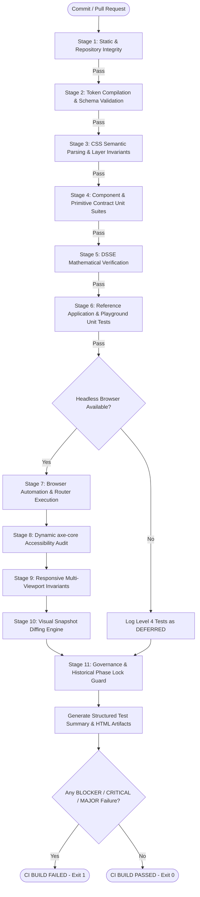

# Master Design System (MDS) — Phase 9.7: Validation & CI Automation Architecture
**Document Reference:** `MDS-ARCH-9701`  
**Layer:** 13-Implementation  
**Lead Architect & Owner:** Mohamed Khalid (Senior Full Stack & Flutter Developer)  
**Status:** ARCHITECTURE READY FOR REVIEW  
**Ratification Target:** Phase 9.7 Pre-Implementation Gate  
**Date:** 2026-09-22  

---

## 1. Executive Summary & Continuous Verification Vision

The Master Design System (MDS) represents an interconnected architectural hierarchy spanning Design Tokens, Primitives, Components, Patterns, Workflows, Templates, and Applications. Without a continuous, automated validation architecture, such complex systems inevitably suffer from **architectural drift**, **token decay**, **accessibility regressions**, and **cross-layer contract violations**.

Phase 9.7 establishes the **MDS Continuous Validation Architecture**, transforming localized manual verifications into a deterministic, reproducible, multi-tiered testing pipeline. The fundamental question this architecture answers on every commit and build is:

> ### *"Is this MDS repository still compliant with the approved MDS architecture?"*

### Core Architectural Invariants:
1. **Shared-Core Law:** The Core Runtime (`MDS/Runtime/`) remains 100% dependency-free. Testing and CI dependencies are strictly quarantined to the validation tier (`MDS/10-Testing/`).
2. **Zero False-Green Mandate:** Tests never pass when an execution environment is missing. Unexecuted tests are explicitly declared `DEFERRED` or `QUARANTINED`.
3. **Zero Fabrication:** Simulated passes for unexecuted environments are strictly forbidden.
4. **Anti-Double-Counting Equation:**
   $$\mathbf{\text{Unique Capability IDs}} = \mathbf{\text{Executable Assertions Passed}} + \mathbf{\text{Executable Assertions Failed}} + \mathbf{\text{Deferred Capabilities}}$$
   Wrapped sub-assertions are tracked separately and never inflate top-level capability metrics.

---

## 2. Validation Architecture Overview & Layer Diagram

Testing in MDS is organized into **14 Distinct Validation Layers (Layers A through N)** structured across static analysis, contract unit tests, integration verification, headless browser automation, and governance audits.

```text
┌───────────────────────────────────────────────────────────────────────────────────┐
│                           MDS CONTINUOUS VALIDATION SYSTEM                        │
├───────────────────────────────────────────────────────────────────────────────────┤
│  [Layer A] Repository Integrity  │ Directory layout, required files, markdown links│
│  [Layer B] Token Validation      │ DTCG schemas, DAG cycle check, compilation     │
│  [Layer C] CSS Architecture      │ Zero raw hex, 100% logical props, @layer order  │
│  [Layer D] Component Contracts   │ 19 components, 16-point anatomy, Light DOM      │
│  [Layer E] Primitive Contracts   │ Layout primitives, 44px touch, unidirectional   │
│  [Layer F] Patterns & Templates  │ 8 patterns, 6 workflows, 6 templates, anti-leak │
│  [Layer G] DSSE Validation       │ 5 pillars, epistemic confidence, 8 calibrations │
│  [Layer H] Reference App Tests   │ 11 screens, 4 roles, 5 FSM stages, 5 states    │
├───────────────────────────────────────────────────────────────────────────────────┤
│                      HEADLESS BROWSER AUTOMATION TIER (CI)                        │
├───────────────────────────────────────────────────────────────────────────────────┤
│  [Layer I] Browser Automation    │ Live DOM mounting, custom elements, router      │
│  [Layer J] Accessibility (A11y)  │ Dynamic axe-core injection (MDS-A11Y-004)       │
│  [Layer K] Responsive Viewports  │ 320/768/1024/1440px overflow guard (MDS-RWD-003)│
│  [Layer L] Visual Regression     │ 12-snapshot matrix across themes (MDS-VIS-001)  │
├───────────────────────────────────────────────────────────────────────────────────┤
│                         GOVERNANCE & PHASE LOCK TIER                              │
├───────────────────────────────────────────────────────────────────────────────────┤
│  [Layer M] Governance Validation │ Inventory counts, doc drift, metadata sync      │
│  [Layer N] Historical Phase Guard│ Invariant protection for locked phases 9.2–9.6  │
└───────────────────────────────────────────────────────────────────────────────────┘
```

---

## 3. The 14 Validation Layers (Detailed Specifications)

### 3.1 Layer A — Repository Integrity
- **Objective:** Detect structural drift, missing files, broken paths, and unauthorized files in the repository.
- **Validation Rules:**
  - `A-01`: Verify existence of mandatory directories: `01-Foundations/`, `02-Tokens/`, `03-Primitives/`, `04-Components/`, `05-Patterns/`, `06-Workflows/`, `07-Templates/`, `08-DSSE/`, `09-Accessibility/`, `10-Testing/`, `11-Tools/`, `12-Documentation/`, `13-Implementation/`, `Runtime/`, `Playground/`, `Reference-Application/`.
  - `A-02`: Verify that no root-level ad-hoc files or temporary test scratch files exist.
  - `A-03`: Scan all Markdown files in `docs/` and `MDS/` to ensure all intra-repository links resolve to existing files (zero broken 404 links).
  - `A-04`: Verify that no `node_modules/` or npm artifacts exist in the repository root or in `MDS/Runtime/`.

### 3.2 Layer B — Design Token Validation
- **Objective:** Validate the DTCG token graph, schema conformity, and deterministic compilation.
- **Validation Rules:**
  - `B-01`: Validate all 18 `.tokens.json` files against W3C DTCG specification (`$value`, `$type`, `$description`).
  - `B-02`: Execute graph traversal across Primitive $\to$ Semantic $\to$ Component $\to$ Theme tiers.
  - `B-03`: DAG cycle detector: Fail build on circular dependencies; enforce maximum alias depth $\le 2$ hops.
  - `B-04`: Validate canonical token count invariant: exactly 188 registered tokens.
  - `B-05`: Execute `compile_tokens.py` and verify deterministic output: `tokens.css`, `tokens.json`, `tokens.d.ts`.

### 3.3 Layer C — CSS / Runtime Architecture Validation
- **Objective:** Prevent style contamination, specificity wars, and accessibility regressions in stylesheets with explicit scanning scopes and exemptions.
- **Validation Scopes & Exemption Rules:**
  - **Scope A (Token Source — `MDS/02-Tokens/`):** Primitive hex colors and physical units (`px`, `rem`) are legitimate canonical definitions. *Status: EXEMPT from zero-hex rule.*
  - **Scope B (Runtime & Application Author Stylesheets — `MDS/Runtime/`, `MDS/Playground/`, `MDS/Reference-Application/`):** Strict enforcement.
    - Zero raw hex colors (`#[0-9a-fA-F]{3,8}`) in property values.
    - 100% CSS Logical Properties: `margin-left/right`, `padding-left/right`, `border-left/right`, `left`, `right` are strictly forbidden. Enforce `*-inline-start/end` and `*-block-start/end`.
    - Zero `flex-direction: row-reverse` (protects WCAG 2.4.3 focus order).
    - Parent-Owned Spacing: Zero outer margins on component host selectors.
  - **Scope C (Compiled Token Distribution — `dist/tokens/` or `MDS/Runtime/tokens/tokens.css`):** Resolved primitive values in `@layer mds.tokens` custom property assignments are compiled artifacts. *Status: ALLOWED.*
  - **Scope D (Structural CSS Values):** Explicitly whitelisted semantic layout values (`0`, `1px solid ...` divider thickness, `100%`, `100vw`, `100vh`, `auto`, `transparent`, `currentColor`, `none`, `block`, `flex`, `grid`, `inline-flex`, `z-index: 1|10|100`).
- **Semantic AST Scanner Mandate:** Replaces brittle regular expressions with a dedicated CSS AST parser (`css_validator.py`) that strips comments, isolates declarations, distinguishes ID selectors (`#overview`) from color literals, and scans property values only.

### 3.4 Layer D — Component Contract Validation
- **Objective:** Enforce 16-point anatomy and behavioral contracts for all 19 canonical components.
- **Validation Rules:**
  - `D-01` (Inventory Guard): Verify presence and registration of exactly 19 core components: `Button`, `Badge`, `Input`, `Select`, `Switch`, `Checkbox`, `Radio`, `Textarea`, `Dialog`, `Alert`, `Card`, `Table`, `Tabs`, `Tooltip`, `Spinner`, `Avatar`, `Progress`, `Skeleton`, `Icon`.
  - `D-02` (Registration Guard): Verify Custom Element registration (`customElements.define('mds-*', ...)`) in `MDS/Runtime/components/components.js`.
  - `D-03` (Light DOM Invariant): Verifies components render into Light DOM preserving semantic elements (`<dialog>`, `<button>`, `<input>`).
  - `D-04` (Experience State Coverage): Verifies component support for `default`, `hover`, `active`, `focus`, `disabled`, and `loading` states.
  - `D-05` (Touch Target Contract): Verifies 44×44px `PressTarget` contract on interactive controls (`Button`, `Switch`, `Checkbox`, `Radio`, `Select`).

### 3.5 Layer E — Primitive Validation & Dependency Direction
- **Objective:** Guarantee layout integrity and enforce strict unidirectional architectural dependencies.
- **Validation Rules:**
  - `E-01`: Verify the 5 layout primitives (`Container`, `Stack`, `Inline`, `Grid`, `Cluster`).
  - `E-02`: Verify Surface Depth Triad (`Flat`, `Raised`, `Overlay`).
  - `E-03`: Verify Accessibility controllers (`FocusTrap`, `LiveRegion`).
  - `E-04` (Architectural Dependency Hierarchy): Validate strict one-way dependency flow:
    $$\text{Tokens} \longrightarrow \text{Foundations} \longrightarrow \text{Primitives} \longrightarrow \text{Components} \longrightarrow \text{Patterns} \longrightarrow \text{Workflows} \longrightarrow \text{Applications}$$
    *Forbidden:* No primitive may import or reference a component. No component may reference a pattern or application.

### 3.6 Layer F — Pattern, Workflow, and Template Validation
- **Objective:** Prevent scope creep, enforce Universal FSM contracts, and prevent unapproved architectural sprawl.
- **Validation Rules:**
  - `F-01`: Exactly **8 Canonical Patterns** verified in `05-Patterns/`: Search-Filter, Pagination, Form-Layout, Master-Detail, Status-Summary, Context-Action, Multi-Step-Wizard, AI-Input-Prompt.
  - `F-02`: Exactly **6 Canonical Workflows** verified in `06-Workflows/`: Entity-Creation, Approval-Chain, Data-Import-Export, Bulk-Batch-Action, User-Onboarding, AI-Synthesis-Review.
  - `F-03` (Universal MDS FSM Contract): Asserts that all 6 canonical workflows implement the **Universal 11-State MDS FSM Topology**:
    $$\{ \text{IDLE}, \text{ACTIVE\_INPUT}, \text{VALIDATING}, \text{CONFIRMING}, \text{PROCESSING}, \text{STREAMING}, \text{REVIEWING}, \text{SUCCESS\_RESOLVED}, \text{ERROR\_INTERCEPTED}, \text{FATAL\_FAILURE}, \text{ABORTED\_CANCEL} \}$$
  - `F-04`: Exactly **6 Canonical Templates** verified in `07-Templates/`: Dashboard-Overview, Entity-Master, Activity-Timeline, Detail-Inspector, Settings-Administration, AI-Workspace.
  - `F-05` (Anti-Leak Guard): Verifies zero unapproved implementations of the **9 Deferred Enterprise Systems** (`DataGrid`, `RichTextEditor`, `Calendar`, `DateRangePicker`, `CommandSystem`, `Tree`, `Combobox`, `VirtualizedList`, `FileUploadManager`).

### 3.7 Layer G — DSSE Mathematical Validation
- **Objective:** Preserve mathematical integrity of the Design System Selection Engine.
- **Validation Rules:**
  - `G-01`: Validate 5-Pillar Decoupled Model (Requirements, Evaluation, Evidence, Hard Constraints, Epistemic Confidence).
  - `G-02`: Validate Conjunctive Epistemic Confidence formula: $C_{\text{epistemic}} = C_{\text{req}} \times C_{\text{eval}} \times C_{\text{evid}}$.
  - `G-03`: Validate all 8 Ratified Calibration Scenarios (Cases A through H in `test_dsse.py`) pass with 100% assertions.

### 3.8 Layer H — Reference Application Integration Validation
- **Objective:** Verify operational integrity of the Phase 9.6 Reference Application (`MDS/Reference-Application/`).
- **Validation Rules:**
  - `H-01`: Verify all 11 canonical screens render and route correctly.
  - `H-02`: Verify 4 Mock Roles (`Administrator`, `Manager`, `Reviewer`, `User`) and their RBAC permissions.
  - `H-03` (AI Operational FSM Projection): Asserts that the Reference Application implements the **5-state operational projection/subset** of the Universal FSM:
    $$\text{IDLE} \xrightarrow{\text{Synthesize}} \text{PROCESSING} \to \text{STREAMING} \to \text{REVIEWING} \xrightarrow{\text{Approve}} \text{SUCCESS\_RESOLVED}$$
    (with Reject/Retry transitions routing back to `IDLE`). Strictly assert zero independent `APPROVED` state.
  - `H-04`: Verify 5 System Simulation States (`Normal`, `Loading`, `Error`, `Empty`, `Permission Denied`).
  - `H-05`: Verify 8 Composed Gaps (Header, Pagination, Breadcrumbs, KPI Card, Toast Shelf, Mobile Drawer, Context Menu, Stepper).

### 3.9 Layer I — Browser Automation Engine
- **Objective:** Host a standardized headless browser instance via an isolated subprocess bridge to execute live DOM, layout, and JavaScript assertions without adding root npm dependencies.
- **Concrete Technical Contract:**
  - **Process Supervisor:** Orchestrated by Python runner (`run_all.py`), which starts a local ephemeral HTTP daemon (`socket.bind(('', 0))`) and launches the browser bridge (`MDS/10-Testing/browser/`).
  - **Executable Discovery:** Scans host environment for system Chrome (`C:\Program Files\Google\Chrome\Application\chrome.exe`), Edge (`C:\Program Files (x86)\Microsoft\Edge\Application\msedge.exe`), or Linux Chromium (`/usr/bin/google-chrome`), launching with `--headless=new --disable-gpu --no-sandbox --remote-debugging-port=0`.
  - **Standard Driver API:** Implements `launch()`, `navigate(url)`, `set_viewport(w, h)`, `click(sel)`, `type_text(sel, text)`, `wait_for(sel, timeout)`, `screenshot(path)`, `evaluate(script)`, `get_console_logs()`, and `close()`.
  - **Graceful Fallback:** If no browser is installed, Layers I, J, K, L are marked `DEFERRED` in `test-summary.json` with zero false passes and zero fatal exceptions.
- **Validation Rules:**
  - `I-01`: Start local HTTP daemon and establish clean browser session.
  - `I-02`: Verify Custom Element lifecycle: live DOM attachment, attribute reflection, and custom events dispatching.
  - `I-03`: Verify clean browser console output (0 uncaught JavaScript exceptions or runtime errors).

### 3.10 Layer J — Accessibility Automation (Promoting `MDS-A11Y-004`)
- **Objective:** Execute dynamic WCAG 2.1/2.2 AA accessibility audits in rendered DOM.
- **Validation Rules:**
  - `J-01`: Inject `axe-core` runtime script (`axe.min.js`) into rendered specimens and reference application views.
  - `J-02`: Execute full axe scan across tags: `wcag2a`, `wcag2aa`, `wcag21a`, `wcag21aa`, `wcag22aa`, `best-practice`.
  - `J-03`: Automated Gate: **Zero `critical` and zero `serious` violations permitted**. Any critical violation fails CI immediately.
  - `J-04`: Dynamic Focus Trap Verification: Assert Tab / Shift+Tab cycles within `<mds-dialog>` and Escape dismisses dialog.
  - `J-05`: Throttled LiveRegion Verification: Assert `#ai-live-announcer` has `aria-live="polite"` and receives final completion announcement.

### 3.11 Layer K — Responsive Viewport Automation (Promoting `MDS-RWD-003`)
- **Objective:** Automate physical viewport resizing and verify layout reflow invariants.
- **Validation Rules:**
  - `K-01`: Test across 4 Canonical Viewports:
    - Mobile Compact: `320px × 640px`
    - Tablet Portrait: `768px × 1024px`
    - Desktop Standard: `1024px × 768px`
    - Desktop Wide: `1440px × 900px`
  - `K-02` (Horizontal Overflow Invariant): Assert `document.documentElement.scrollWidth <= window.innerWidth` across all views.
  - `K-03` (Mobile Drawer Recomposition): At 320px and 768px, assert desktop sidebar is hidden and `#btn-mobile-nav` is visible and functional.
  - `K-04` (Touch Target Size Verification): Verify interactive touch targets have physical bounding rect $\ge 44 \times 44\text{px}$ on mobile.

### 3.12 Layer L — Visual Regression Engine (Promoting `MDS-VIS-001`)
- **Objective:** Detect unintended visual drift via targeted Orthogonal Array Testing Strategy (OATS) avoiding Cartesian combinatorial explosion ($3 \times 3 \times 2 \times 4 = 72$ combinations).
- **The Canonical 12-Baseline Targeted Registry:**
  | Baseline ID | Screen Route | Theme Mode | Visual Preset | Spatial Density | Direction | Viewport | Target Verification Focus |
  | :--- | :--- | :--- | :--- | :--- | :---: | :---: | :--- |
  | `BL-01` | `#/overview` | Light | Soft Modern | Comfortable | RTL | `1440×900` | Default enterprise reference (KPI cards, grid layout, fonts) |
  | `BL-02` | `#/overview` | Dark | Refined Minimal | Comfortable | RTL | `1440×900` | Dark surface contrast, crisp borders, refined radius scale |
  | `BL-03` | `#/overview` | High-Contrast | Expressive | Compact | RTL | `1440×900` | WCAG AAA high-contrast borders, dense spacing, expressive tokens |
  | `BL-04` | `#/overview` | Light | Soft Modern | Comfortable | LTR | `1440×900` | Full LTR bidirectional inversion (start/end logical layout) |
  | `BL-05` | `#/overview` | Light | Soft Modern | Comfortable | RTL | `320×640` | Mobile reflow boundary, hidden desktop sidebar, hamburger button |
  | `BL-06` | `#/items` | Light | Refined Minimal | Comfortable | RTL | `1024×768` | Data grid table layout, regional horizontal scroll, search filter |
  | `BL-07` | `#/items/edit` | Light | Soft Modern | Comfortable | RTL | `768×1024` | Stepper Step 1 active, Step 2 locked (`aria-disabled="true"`), form inputs |
  | `BL-08` | `#/items/edit` | Light | Soft Modern | Comfortable | RTL | `768×1024` | Stepper Step 2 unlocked, Step 1 validated, badge update |
  | `BL-09` | `#/ai-workspace` | Dark | Expressive | Comfortable | RTL | `1440×900` | AI human-in-the-loop canvas in `REVIEWING` state with sign-off card |
  | `BL-10` | `#/settings/access` | Light | Refined Minimal | Compact | RTL | `1440×900` | User permissions data grid, compact row density, Danger Zone card |
  | `BL-11` | `Playground Lab` | Light | Soft Modern | Comfortable | RTL | `768×1024` | Component isolated specimens: Button variants, sizes, and states |
  | `BL-12` | `Playground Lab` | Dark | Soft Modern | Comfortable | RTL | `768×1024` | Component isolated specimens: Dialog Modal overlay surface depth |
- **Validation Rules:**
  - `L-01`: Capture the 12 targeted golden snapshots into `MDS/10-Testing/baselines/`.
  - `L-02`: Font & Animation Stabilization: Wait for `document.fonts.ready` (Cairo font), disable CSS transitions/animations (`* { transition: none !important; animation: none !important; }`).
  - `L-03`: Pixel Comparison: Calculate pixel mismatch ratio $\Delta = \frac{\text{diff\_pixels}}{\text{total\_pixels}}$ using Pillow/pixelmatch.
  - `L-04`: Tolerance Gate: Fail build if $\Delta > 0.001$ ($0.1\%$). Output visual diff image highlighting discrepancies in red.
  - `L-05`: Intentional Update Workflow: Baselines may only be modified via explicit flag: `python MDS/10-Testing/run_all.py --update-baselines`.

### 3.13 Layer M — Governance & Documentation Validation
- **Objective:** Prevent documentation drift and maintain perfect consistency across architectural records.
- **Validation Rules:**
  - `M-01`: Parse Markdown tables in `ROADMAP.md`, `PROJECT_HISTORY.md`, and `MDS_MASTER_SPECIFICATION.md`.
  - `M-02`: Cross-verify that documented token counts (188), component counts (19), pattern counts (8), workflow counts (6), and template counts (6) match actual filesystem assets.
  - `M-03`: Verify that all Phase Gate statuses match reality across all governance documents.

### 3.14 Layer N — Historical Phase Regression Guard
- **Objective:** Provide tamper-proof verification that previously locked phases remain uncorrupted.
- **Validation Rules:**
  - `N-01` (Runtime Non-Mutation Guard): Assert zero modified files in `MDS/Runtime/` (checksum/timestamp boundary).
  - `N-02` (Phase 9.2 Token Guard): Assert DTCG compiler passes and outputs match baseline.
  - `N-03` (Phase 9.3 Primitive Guard): Assert 18 primitives pass 30/30 unit tests.
  - `N-04` (Phase 9.4 Component Guard): Assert 19 components pass 18/18 unit tests.
  - `N-05` (Phase 9.5 Playground Guard): Assert Playground remains cleanly decoupled and passes 13/13 tests.
  - `N-06` (Phase 9.6 Reference App Guard): Assert Reference Application passes 15/15 unit tests.

---

## 4. Test Classification Taxonomy & Schema

Every test capability in the MDS validation suite adheres to a strict canonical schema:

```json
{
  "$schema": "http://json-schema.org/draft-07/schema#",
  "title": "MdsValidationCapability",
  "type": "object",
  "required": ["id", "name", "layer", "owner", "executionMethod", "failureSeverity", "status"],
  "properties": {
    "id": { "type": "string", "pattern": "^MDS-[A-Z0-9]+-[0-9]{3}$" },
    "name": { "type": "string" },
    "layer": { 
      "type": "string", 
      "enum": ["STATIC", "UNIT", "INTEGRATION", "BROWSER", "ACCESSIBILITY", "RESPONSIVE", "VISUAL", "GOVERNANCE"] 
    },
    "owner": { "type": "string" },
    "executionMethod": { 
      "type": "string", 
      "enum": ["PYTHON_STATIC", "PYTHON_UNIT", "BROWSER_AUTOMATION", "AST_PARSER", "DOC_SCANNER"] 
    },
    "failureSeverity": { 
      "type": "string", 
      "enum": ["BLOCKER", "CRITICAL", "MAJOR", "MINOR", "WARNING", "INFO"] 
    },
    "status": { 
      "type": "string", 
      "enum": ["ACTIVE", "QUARANTINED", "DEFERRED", "DISABLED"] 
    },
    "artifact": { "type": "string" }
  }
}
```

---

## 5. Failure Severity & CI Exit Code Matrix

| Severity Tier | Definition & Scope | Example Violations | CI Action | Exit Code |
| :--- | :--- | :--- | :---: | :---: |
| **`BLOCKER`** | Catastrophic failure preventing basic execution; runtime corruption | File syntax error, token DAG cycle, `MDS/Runtime/` mutation | **ABORT IMMEDIATELY** | `1` |
| **`CRITICAL`** | Severe architectural violation or accessibility barrier | Critical axe-core violation, broken FSM transition, missing component | **FAIL BUILD** | `1` |
| **`MAJOR`** | Visual regression, responsive overflow, or logical property violation | Visual diff $\Delta > 0.1\%$, 320px horizontal overflow, physical CSS property | **FAIL BUILD** | `1` |
| **`MINOR`** | Non-blocking discrepancy or moderate accessibility advisory | Moderate axe-core advisory, documentation table count mismatch | **WARN & PASS** | `0` |
| **`WARNING`** | Style or performance hint | Sub-optimal selector, density observation | **LOG & PASS** | `0` |
| **`INFO`** | Diagnostic telemetry | Execution timing, baseline count summary | **LOG & PASS** | `0` |

---

## 6. Local Developer Workflow (`run_all.py`)

A single, canonical Python orchestrator provides a seamless, zero-friction developer experience:

```bash
# Fast mode: Static, Token, CSS, Primitives, Components, DSSE, and Unit tests (< 1 second)
python MDS/10-Testing/run_all.py --fast

# Browser mode: Headless browser execution (A11y, Responsive, Visual)
python MDS/10-Testing/run_all.py --browser

# Full mode: Complete 14-layer regression validation
python MDS/10-Testing/run_all.py --full

# Baseline Update mode: Intentionally re-capture golden visual snapshots
python MDS/10-Testing/run_all.py --update-baselines

# JSON Output mode: Output structured machine-readable report for CI
python MDS/10-Testing/run_all.py --full --json
```

---

## 7. Continuous Integration (CI) Pipeline Architecture

The CI pipeline runs deterministically in GitHub Actions or any standard Linux/Windows container:



---

## 8. Artifacts & Diagnostic Storage Strategy

All test results, snapshots, diffs, and accessibility audit logs are organized under `MDS/10-Testing/artifacts/`:

```text
MDS/10-Testing/artifacts/
├── reports/
│   ├── test-summary.json         <-- Machine-readable test accounting & metrics
│   ├── test-summary.html         <-- Human-readable visual dashboard
│   └── layer-breakdown.json      <-- Granular results for Layers A through N
├── accessibility/
│   ├── axe-audit-results.json    <-- Full axe-core execution payload
│   └── violations-summary.md     <-- Actionable remediation report for any findings
├── screenshots/
│   ├── current/                  <-- Raster captures from current run
│   ├── baselines/                <-- Ratified golden reference images
│   └── diffs/                    <-- Side-by-side visual diff images highlighting deltas
└── logs/
    └── browser-console.log       <-- Headless browser stdout/stderr capture
```

---

## 9. Quarantine & Flakiness Policy

1. **Quarantine Eligibility:** Only network-dependent or browser-timing-sensitive tests may be quarantined. Static, Token, CSS, and DSSE tests may **never** be quarantined.
2. **Lifecycle Controls:**
   - Must specify: Test ID, Date Quarantined, Expiration Date ($\le 14$ days), Owner, and Issue Reference.
   - Quarantined tests execute in CI; failures produce `WARNING` logs and do not block the build.
   - Upon expiration, the test automatically transitions back to `ACTIVE`. If still failing, it triggers a `MAJOR` CI failure.
3. **Anti-Skipping Mandate:** Bypassing a test without an explicit decorator or quarantine registry entry fails the CI suite immediately.

---

## 10. Implementation Phasing & Pre-Implementation Gate

Phase 9.7 is structured into 12 sequential implementation stages:

```text
9.7.1  Validation Architecture (Decision Log, Architecture Spec, Gaps Analysis)  <-- CURRENT STAGE
9.7.2  Unified Capability Registry & Schemas
9.7.3  Static Validation Suite (Layers A, C, M)
9.7.4  Browser Automation Runner Bridge (Layer I)
9.7.5  Accessibility Automation Suite with axe-core (Layer J: MDS-A11Y-004)
9.7.6  Responsive Multi-Viewport Suite (Layer K: MDS-RWD-003)
9.7.7  Visual Regression Engine & Baselines (Layer L: MDS-VIS-001)
9.7.8  Governance & Cross-Document Consistency Engine (Layer M)
9.7.9  Historical Phase Regression Guard (Layer N)
9.7.10 Unified Local Orchestrator CLI (`run_all.py`)
9.7.11 CI Pipeline Configuration & Artifact Generator
9.7.12 Final Independent Audit & Phase Gate Lock
```

### Exit Criteria for Phase 9.7 Lock:
- All 14 validation layers implemented and operational.
- Unified runner `python MDS/10-Testing/run_all.py` passes with zero Blocker, Critical, or Major failures.
- `MDS-A11Y-004`, `MDS-RWD-003`, and `MDS-VIS-001` promoted to active automated execution or explicitly documented.
- Exactly 0 files and 0 bytes modified in `MDS/Runtime/`, `MDS/Playground/`, and `MDS/Reference-Application/`.
- Final audit completed and certified by Lead Architect Mohamed Khalid.

---

## 11. Phase 9.7.1 Architecture Hardening Summary

During the Stage 9.7.1 Architecture Gate, four critical dimensions were hardened to eliminate ambiguity:

1. **Visual Regression Matrix Hardened:** Adopted a targeted 12-baseline Orthogonal Array Testing Strategy (OATS) avoiding brute-force Cartesian explosion ($3 \times 3 \times 2 \times 4 = 72$ combinations). All 12 baseline candidates are explicitly cataloged in Section 3.12 with defined routes, themes, viewports, and verification focus. Non-visual combinations are covered via structural DOM checks (Layer H) and programmatic overflow assertions (Layer K).
2. **Universal FSM vs AI Projection Disambiguated:** Codified that the canonical MDS Universal FSM retains its **11 standardized operational states** (`IDLE`, `ACTIVE_INPUT`, `VALIDATING`, `CONFIRMING`, `PROCESSING`, `STREAMING`, `REVIEWING`, `SUCCESS_RESOLVED`, `ERROR_INTERCEPTED`, `FATAL_FAILURE`, `ABORTED_CANCEL`). The Reference Application AI Workspace implements an authorized **5-state operational projection/subset** (`IDLE`, `PROCESSING`, `STREAMING`, `REVIEWING`, `SUCCESS_RESOLVED`).
3. **CSS Validation Scopes & AST Scanner Formalized:** Delineated Scopes A, B, C, and D:
   - Scope A (Tokens): Primitive raw values allowed.
   - Scope B (Author CSS): Strict zero raw hex, 100% logical properties, zero row-reverse.
   - Scope C (Compiled CSS): Resolved values in `@layer mds.tokens` allowed.
   - Scope D (Structural CSS): Explicit whitelist of structural layout values allowed.
   - Scanner uses semantic AST parsing to distinguish selectors from property declarations.
4. **Browser Automation Subprocess Contract Defined:** Documented the headless browser bridge architecture (`MDS/10-Testing/browser/`), utilizing host system Chrome/Edge or Linux Chromium via CDP without adding root npm dependencies. Defined process supervision, standard driver APIs (`launch`, `navigate`, `click`, `type`, `wait_for`, `screenshot`, `evaluate`), axe-core injection, and graceful fallback to `DEFERRED` when browser binaries are missing.

---

*Phase 9.7 Validation Architecture hardened and submitted for Pre-Implementation Gate Review.*
