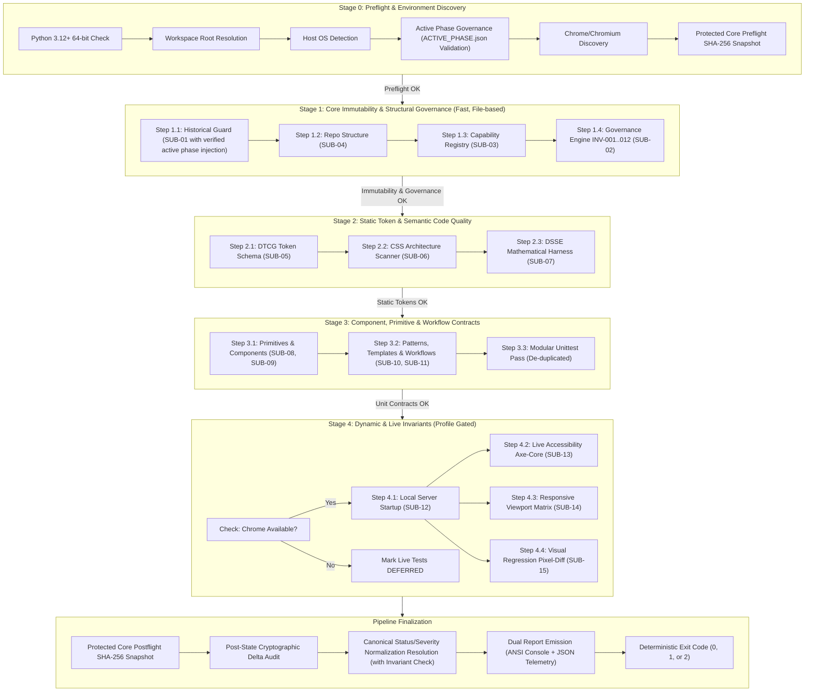

<!-- Classification: CURRENT_SPECIFICATION -->
# Master Design System (MDS) — Architecture Specification
## Phase 9.7.10: Unified Local Orchestrator CLI (`run_all.py`) — Final Micro-Remediation Pass #3

**Document Reference:** `MDS-ARCH-9710-REV3`  
**Phase:** 9.7.10 (Unified Local Orchestrator CLI & Master Validation Pipeline)  
**Layer:** Layer M (Testing, Governance & Architectural Immutability)  
**Date:** 2026-09-27  
**Lead Architect:** Mohamed Khalid (Senior Full Stack & Flutter Developer)  
**Status:** **ARCHITECTURE STAGE 1 — FINAL MICRO-REMEDIATION COMPLETE (Awaiting Final Implementation Authorization)**  
**Execution Context:** Microsoft Windows, Google Chrome v153, Python 3.12.8 (Pure Standard Library)  
**Implementation Guard:** Phase 9.7.10 Implementation STRICTLY BLOCKED until authorized  

---

## 1. Executive Summary & Design Vision

Following the formal **Independent Architecture Audit #2 Final Review** conducted by Lead Architect Mohamed Khalid, this document specifies the final, mathematically complete architecture for the **Unified Local Orchestrator CLI (`run_all.py`)**.

The orchestrator integrates the entire validation estate of the Master Design System into a single, deterministic pipeline:
```bash
python MDS/10-Testing/run_all.py --full
```

### Four Final Micro-Remediations Incorporated:
1. **Status/Severity 20-Combination Cardinality (ADR-125 & ADR-126):** Corrected cardinality to $5 \times 4 = 20$ theoretical combinations. Statically classified every permutation into `VALID`, `INVALID`, or `UNREACHABLE` with discrete handling and exit codes.
2. **Deterministic Enforcement of Illegal CACHED States (ADR-125 & ADR-126):** Updated `resolve_final_exit_code()` with an unbypassable Step 0 invariant check: any occurrence of `CACHED + CRITICAL` or `CACHED + BLOCKER` is treated as a fatal architectural violation, yielding `BLOCKER` and `Exit 2`.
3. **Formal Governance Contract for `ACTIVE_PHASE.json` (ADR-135):** Codified a tamper-proof governance contract including strict schema validation, deterministic transition graph ($\text{Phase 9.7.9 LOCKED} \to \text{Phase 9.7.10 ACTIVE} \to \text{Phase 9.7.10 SEALED} \to \text{Phase 9.7.11 ACTIVE}$), previous-phase prerequisite verification against `master_historical_registry.json`, authorization metadata, and immediate rejection of arbitrary prefix injection with `BLOCKER` (`Exit 2`), strictly preserving locked Phase 9.7.9 files.
4. **Deterministic `--ci` Preset Override & Conflict Semantics (ADR-127 & ADR-132):** Defined `--ci` as a syntactic preset expander with deterministic augmentation rules (`--strict-environment` and `--subsystem` augment; `--fast` and `--core` conflict and abort with `Exit 2`; relaxation flags do not exist).
5. **Expanded 44-Scenario Test Matrix (ADR-134):** Expanded the pre-implementation test matrix from 35 to 44 scenarios (`TEST-ORC-01` through `TEST-ORC-44`) covering all 20 normalization permutations, illegal cached state rejections, governance violations, and `--ci` override semantics.

---

## 2. Canonical Subsystem Registry & Dependency Closure Contract

### 2.1 Compile-Time Immutable Registry (`ORCHESTRATOR_SUBSYSTEM_REGISTRY`)
Subsystems are statically registered at compile time; runtime heuristic discovery is strictly prohibited:

```python
ORCHESTRATOR_SUBSYSTEM_REGISTRY: Dict[str, SubsystemDefinition] = { ... }
```

#### Comprehensive 15-Subsystem Roster:

| Subsystem ID | Canonical Name | Owning Phase | Pipeline Stage | Direct Dependencies | Assertion Namespace | Result Contract Model | Supported Profiles | Execution Category |
| :--- | :--- | :---: | :---: | :--- | :--- | :--- | :--- | :--- |
| **`SUB-01`** | Historical Phase Guard | Phase 9.7.9 | Stage 1 | None | `TEST-HST-*`, `MDS-HST-*` | `HistoricalVerificationResult` | fast, core, full, ci | `MANDATORY_SAFETY_GATE` |
| **`SUB-02`** | Governance Invariants Engine | Phase 9.7.8 | Stage 1 | `SUB-01` | `INV-001` .. `INV-012` | `GovernanceResult` | fast, core, full, ci | `MANDATORY_SAFETY_GATE` |
| **`SUB-03`** | Capability Registry Validator | Phase 9.7.8 | Stage 1 | None | `MDS-REG-*` (18 rules) | `ValidationResult` | fast, core, full, ci | `MANDATORY_SAFETY_GATE` |
| **`SUB-04`** | Repository Structure Validator | Phase 8.1 | Stage 1 | None | `MDS-REP-*` | `RepoValidationResult` | fast, core, full, ci | `MANDATORY_SAFETY_GATE` |
| **`SUB-05`** | Token DTCG Parser & Schema | Phase 9.2 | Stage 2 | `SUB-04` | `MDS-TKN-*` (18 files) | `TokenValidationResult` | fast, core, full, ci | `CORE_SPECIFICATION` |
| **`SUB-06`** | Semantic CSS Scanner | Phase 9.1 | Stage 2 | `SUB-05` | `MDS-CSS-*`, `MDS-RTL-*` | `CSSScanResult` | fast, core, full, ci | `CORE_SPECIFICATION` |
| **`SUB-07`** | DSSE Mathematical Harness | Phase 8.5 | Stage 2 | None | `MDS-DSS-*` (37 assertions) | `DSSEResult` | fast, core, full, ci | `CORE_SPECIFICATION` |
| **`SUB-08`** | Core Primitives Contract Suite | Phase 9.3 | Stage 3 | `SUB-05` | `MDS-PRI-001..004` | `ContractResult` | core, full, ci | `CONTRACT_INVARIANT` |
| **`SUB-09`** | Core Components Contract Suite | Phase 9.4 | Stage 3 | `SUB-08` | `MDS-CMP-001..004` (19 comps)| `ContractResult` | core, full, ci | `CONTRACT_INVARIANT` |
| **`SUB-10`** | Patterns & Templates Laws | Phase 9.5, 8.1.3 | Stage 3 | `SUB-09` | `MDS-PAT-*`, `MDS-TMP-*` | `CompositionResult` | core, full, ci | `CONTRACT_INVARIANT` |
| **`SUB-11`** | Workflow FSM Determinism | Phase 9.6 | Stage 3 | `SUB-09` | `MDS-WKF-001..004` (6 wkfs) | `WorkflowResult` | core, full, ci | `CONTRACT_INVARIANT` |
| **`SUB-12`** | Browser & Server Infrastructure| Phase 9.7.3 | Stage 4 | `SUB-04` | `MDS-SRV-*`, `MDS-BRW-*` | `ServerSessionResult` | full, ci | `DYNAMIC_INFRASTRUCTURE`|
| **`SUB-13`** | Live Accessibility & Axe-Core | Phase 9.7.5 | Stage 4 | `SUB-12` | `MDS-A11Y-001..004` | `AccessibilityResult` | full, ci | `DYNAMIC_LIVE` |
| **`SUB-14`** | Responsive Viewport Matrix | Phase 9.7.6 | Stage 4 | `SUB-12` | `MDS-RWD-001..003` (17 runs)| `ResponsiveResult` | full, ci | `DYNAMIC_LIVE` |
| **`SUB-15`** | Visual Regression Pixel-Diff | Phase 9.7.7 | Stage 4 | `SUB-12` | `MDS-VIS-001` (12 baselines)| `VisualResult` | full, ci | `DYNAMIC_LIVE` |

---

### 2.2 Dependency Closure & DAG Compilation Specification (ADR-122)

Targeted execution via `--subsystem <NAME>` resolves the complete **Target Execution Closure**:

$$\mathcal{C}(\text{target}) = \text{MandatorySafetyGates} \cup \text{TransitiveClosure}(\text{target}) \cup \{\text{target}\}$$

Where:
- $\text{MandatorySafetyGates} = \{\mathtt{SUB-01}, \mathtt{SUB-04}, \mathtt{SUB-03}, \mathtt{SUB-02}\}$
- $\text{TransitiveClosure}(S) = \bigcup_{d \in S.\text{dependencies}} (\{d\} \cup \text{TransitiveClosure}(d))$

#### Closure Rules & Verification Guarantees:
1. **Direct vs Transitive Dependencies:** Direct dependencies are statically declared in `SubsystemDefinition.dependencies`. Transitive dependencies are recursively accumulated until the fixed point is reached.
2. **Deterministic Topological Ordering (Kahn's Algorithm):**
   - The compiled DAG of $\mathcal{C}(\text{target})$ is sorted topologically.
   - Sibling nodes with equal dependency depth or in-degree 0 are ordered **strictly alphabetically** by `subsystem_id` (e.g. `SUB-03` precedes `SUB-04`).
3. **Duplicate Dependency Collapsing:** Every subsystem node in $\mathcal{C}(\text{target})$ is executed **exactly once** in its earliest valid topological slot. No duplicate execution occurs.
4. **Cycle Detection (`ORCHESTRATOR_DEPENDENCY_CYCLE`):** During DAG compilation, a cycle detection check (Tarjan's or DFS cycle check) inspects the graph. Any cyclic dependency causes immediate fatal pipeline abortion before any stage executes (`Exit 2`).
5. **Invalid / Missing Dependency Detection:** If any subsystem declares a dependency on an unknown ID not present in `ORCHESTRATOR_SUBSYSTEM_REGISTRY`, compilation raises a fatal configuration exception (`Exit 2`).

---

## 3. Four-Tier Execution Pipeline Topology



---

## 4. 5-Tuple Composite Assertion De-Duplication Identity (ADR-123)

### 4.1 Mathematical Definition
Naked `assertion_id` strings are ambiguous across different execution depths. De-duplication requires the **5-Tuple Composite Identity**:

$$\mathcal{K}_{\text{assertion}} = (\text{assertion\_id}, \text{subsystem\_id}, \text{execution\_context}, \text{input\_fingerprint}, \text{validator\_version})$$

Where:
- **`assertion_id`:** Formal rule string (e.g. `MDS-TKN-001`, `INV-008`, `TEST-HST-01`).
- **`subsystem_id`:** Canonical subsystem (`SUB-01` through `SUB-15`).
- **`execution_context`:** `STATIC_FILE_SYNTAX` | `AST_GRAPH_ANALYSIS` | `RUNTIME_DOM_EVALUATION` | `HEADLESS_CDP_VIEWPORT`.
- **`input_fingerprint`:** NIST SHA-256 digest of target input file/data stream.
- **`validator_version`:** Semantic version string of the validator class.

### 4.2 Strict Legal Invariants for `CACHED` Status
Downstream assertion $A_2$ is permitted to yield `ExecutionStatus.CACHED` **if and only if all five conditions hold**:
1. An upstream assertion $A_1$ with exact byte-level identity $\mathcal{K}(A_1) == \mathcal{K}(A_2)$ executed in the current pipeline run.
2. Upstream execution yielded $A_1.\text{status} == \mathtt{ExecutionStatus.PASS}$.
3. Target file's `input_fingerprint` has not mutated between $A_1$ and $A_2$ (verified against preflight snapshot).
4. $A_1.\text{execution\_context} == A_2.\text{execution\_context}$ (a static file assertion can NEVER cache a live DOM assertion).
5. The subsystem owning $A_1$ recorded zero findings with `FindingSeverity.CRITICAL` or `FindingSeverity.BLOCKER`.

---

## 5. Safe Targeted Subsystem Execution & Unbypassable Gates (ADR-124)

When invoking the orchestrator with targeted execution (`python run_all.py --subsystem <NAME>`):
1. **Compilation of Execution Closure:** The orchestrator computes $\mathcal{C}(\text{target})$ including mandatory safety gates and all transitive dependencies.
2. **Unbypassable Mandatory Safety Gates:**
   - `Stage 0 Preflight`: Environment validation, `ACTIVE_PHASE.json` governance verification, and preflight protected core snapshot.
   - `SUB-01 Historical Guard`: Verifies Trust Anchor, cumulative hash chain, and sealed historical manifests.
   - `SUB-04 Repository Structure`: Verifies canonical workspace paths.
   - `SUB-03 Capability Registry`: Verifies capability registry schema.
   - `SUB-02 Governance Engine`: Verifies governance invariants.
3. **Postflight Core Snapshot:** Always executes to guarantee the targeted run did not mutate the core.
4. **Forbidden Bypasses:** Bypassing Stage 0, Stage 1 Core Gates, or Core Snapshots is impossible; requests to bypass them are rejected with `Exit 2`.

---

## 6. Complete Status & Severity Normalization Contract (ADR-125 & ADR-126)

### 6.1 Decoupled Models

```python
class ExecutionStatus(enum.Enum):
    PASS     = "PASS"      # Assertion logic succeeded
    FAIL     = "FAIL"      # Assertion logic failed
    DEFERRED = "DEFERRED"  # Intentionally deferred (environmental missing prerequisite)
    SKIPPED  = "SKIPPED"   # Intentionally excluded by profile scope
    CACHED   = "CACHED"    # Re-certified via composite assertion cache

class FindingSeverity(enum.Enum):
    INFO     = "INFO"      # Neutral informational note / timing telemetry
    WARN     = "WARN"      # Advisory deviation (BOM detected, benchmark target exceeded)
    CRITICAL = "CRITICAL"  # Contract violation / unauthorized historical drift / test failure
    BLOCKER  = "BLOCKER"   # Fatal infrastructure crash / trust anchor mismatch / core mutation
```

### 6.2 Canonical Resolution Algorithm with Invariant Enforcement

$$\text{ResultSet} \xrightarrow{\text{Step 0: Invariant Validation}} \xrightarrow{\text{Step 1: Aggregate}} \text{HighestEffectiveSeverity} \xrightarrow{\text{Step 2: Policy/Profile}} \text{FinalExitCode}$$

```python
def resolve_final_exit_code(
    results: List[SubsystemResult],
    strict: bool = False,
    strict_env: bool = False,
) -> int:
    # Step 0: Invariant Validation (Illegal CACHED States)
    # ADR-123 Condition 5 strictly forbids CACHED when CRITICAL or BLOCKER findings exist on the target
    for r in results:
        if r.status == ExecutionStatus.CACHED:
            for f in r.findings:
                if f.severity in (FindingSeverity.CRITICAL, FindingSeverity.BLOCKER):
                    # Architectural invariant violated: illegal cached state -> BLOCKER / Exit 2
                    return 2

    all_findings: List[Finding] = [f for r in results for f in r.findings]
    all_statuses: Set[ExecutionStatus] = {r.status for r in results}

    # Step 1: Base Severity from explicit diagnostic findings
    max_severity = FindingSeverity.INFO
    if all_findings:
        max_severity = max(f.severity for f in all_findings)

    # Step 2: Status promotion (ExecutionStatus.FAIL implies at least CRITICAL)
    if ExecutionStatus.FAIL in all_statuses:
        if max_severity in (FindingSeverity.INFO, FindingSeverity.WARN):
            max_severity = FindingSeverity.CRITICAL

    # Step 3: Fatal Blocker evaluation
    if max_severity == FindingSeverity.BLOCKER:
        return 2

    # Step 4: Critical Failure evaluation
    if max_severity == FindingSeverity.CRITICAL:
        return 1

    # Step 5: Warning / Advisory evaluation
    if max_severity == FindingSeverity.WARN:
        if strict:
            return 1
        if ExecutionStatus.DEFERRED in all_statuses and strict_env:
            return 1
        return 0

    # Step 6: Clean passes, cached, skipped, or deferred
    if ExecutionStatus.DEFERRED in all_statuses and strict_env:
        return 1

    return 0
```

### 6.3 Exhaustive 20-Combination Normalization Matrix ($5 \times 4 = 20$)

Every theoretical combination of `ExecutionStatus` (5) and `FindingSeverity` (4) is explicitly cataloged:

| # | ExecutionStatus | FindingSeverity | Classification | Standard Mode | `--strict` Mode | `--strict-environment` Mode | Architectural Semantics & Enforcement |
| :-: | :--- | :--- | :---: | :---: | :---: | :---: | :--- |
| **1** | `PASS` | `INFO` | `VALID` | **Exit 0** | **Exit 0** | **Exit 0** | Clean pass with neutral informational telemetry. |
| **2** | `PASS` | `WARN` | `VALID` | **Exit 0** | **Exit 1** | **Exit 0** | Nominal pass with advisory warning (e.g. BOM stripped). Promotes to Exit 1 under `--strict`. |
| **3** | `PASS` | `CRITICAL` | `VALID` | **Exit 1** | **Exit 1** | **Exit 1** | Orthogonal diagnostic failure (test logic passed, but validator recorded a critical spec anomaly). |
| **4** | `PASS` | `BLOCKER` | `VALID` | **Exit 2** | **Exit 2** | **Exit 2** | Fatal system error detected during clean test run (e.g. Root Trust Anchor corruption). |
| **5** | `FAIL` | `INFO` | `VALID` | **Exit 1** | **Exit 1** | **Exit 1** | Assertion logic failed without explicit finding; implicit severity promoted to `CRITICAL`. |
| **6** | `FAIL` | `WARN` | `VALID` | **Exit 1** | **Exit 1** | **Exit 1** | Assertion logic failed while logging advisory warning; test failure dictates Exit 1. |
| **7** | `FAIL` | `CRITICAL` | `VALID` | **Exit 1** | **Exit 1** | **Exit 1** | Standard contract failure with critical finding. |
| **8** | `FAIL` | `BLOCKER` | `VALID` | **Exit 2** | **Exit 2** | **Exit 2** | Fatal infrastructure failure causing test failure. |
| **9** | `DEFERRED` | `INFO` | `VALID` | **Exit 0** | **Exit 0** | **Exit 1** | Chrome unavailable. Exit 0 on developer laptop; Exit 1 on strict browser CI runner. |
| **10** | `DEFERRED` | `WARN` | `VALID` | **Exit 0** | **Exit 1** | **Exit 1** | Deferred test logged an advisory warning during discovery. |
| **11** | `DEFERRED` | `CRITICAL` | `VALID` | **Exit 1** | **Exit 1** | **Exit 1** | Discovery/deferral inspection flagged critical configuration flaw before deferring. |
| **12** | `DEFERRED` | `BLOCKER` | `VALID` | **Exit 2** | **Exit 2** | **Exit 2** | Subsystem discovery suffered fatal crash before deferral. |
| **13** | `SKIPPED` | `INFO` | `VALID` | **Exit 0** | **Exit 0** | **Exit 0** | Stage intentionally excluded by profile scope (e.g. Stage 4 in `--fast`). |
| **14** | `SKIPPED` | `WARN` | `VALID` | **Exit 0** | **Exit 1** | **Exit 0** | Skipped stage with pre-eval advisory. |
| **15** | `SKIPPED` | `CRITICAL` | `VALID` | **Exit 1** | **Exit 1** | **Exit 1** | Pre-evaluation inspection flagged critical misconfiguration on skipped stage. |
| **16** | `SKIPPED` | `BLOCKER` | `VALID` | **Exit 2** | **Exit 2** | **Exit 2** | Pre-evaluation inspection detected fatal corruption. |
| **17** | `CACHED` | `INFO` | `VALID` | **Exit 0** | **Exit 0** | **Exit 0** | Re-certified pass via 5-tuple cache hit. |
| **18** | `CACHED` | `WARN` | `VALID` | **Exit 0** | **Exit 1** | **Exit 0** | Cached pass carrying upstream advisory. |
| **19** | `CACHED` | `CRITICAL` | `INVALID` | **Exit 2** | **Exit 2** | **Exit 2** | **Architectural Invariant Violation:** ADR-123 Condition 5 strictly forbids caching when target has CRITICAL findings. Promoted to `BLOCKER` $\to$ Exit 2. |
| **20** | `CACHED` | `BLOCKER` | `INVALID` | **Exit 2** | **Exit 2** | **Exit 2** | **Architectural Invariant Violation:** ADR-123 Condition 5 strictly forbids caching when target has BLOCKER findings. Promoted to `BLOCKER` $\to$ Exit 2. |

---

## 7. Five-Tier Policy Precedence Model & `--ci` Preset Semantics (ADR-127 & ADR-132)

### 7.1 Precedence Hierarchy
CLI arguments and execution settings resolve across 5 distinct precedence layers:

```text
Layer 1: Execution Profile (Scope Selector: --fast | --core | --full | --ci)
  ↓
Layer 2: Target Selection (Subsystem Narrowing: --subsystem <NAME>)
  ↓
Layer 3: Strictness & Environment Policy (--strict, --strict-environment)
  ↓
Layer 4: Failure Policy (--fail-fast)
  ↓
Layer 5: Process Isolation Policy (--isolate)
```

### 7.2 `--ci` Preset Expansion & Override Model
`--ci` is a **syntactic preset expander** that expands into the following defaults:
```text
--ci  ──▶  [ Base Profile: --full ]
      ──▶  [ Isolation Policy: --isolate ]
      ──▶  [ Failure Policy: --fail-fast ]
      ──▶  [ Strictness Policy: --strict ]
```

#### Deterministic Override & Conflict Matrix:
1. **Compatible Augmentations (Allowed):**
   - `--ci --strict-environment`: Compatible! Augments policy so that both warnings AND missing headless Chrome escalate to fatal failure (`Exit 1`).
   - `--ci --subsystem <NAME>`: Compatible! Narrows execution scope from `--full` to the Target Execution Closure $\mathcal{C}(\text{target})$ while strictly preserving `--isolate`, `--fail-fast`, and `--strict`.
2. **Redundant Flags (Accepted as No-ops):**
   - `--ci --full`: Redundant; accepted cleanly.
   - `--ci --strict`: Redundant; accepted cleanly.
   - `--ci --fail-fast`: Redundant; accepted cleanly.
   - `--ci --isolate`: Redundant; accepted cleanly.
3. **Conflicting Base Profiles (REJECTED with Exit 2):**
   - `--ci --fast`: Mutually exclusive profile conflict! `--ci` defaults to `--full`, which directly contradicts `--fast`. CLI parser rejects with `Exit 2` (`ORCHESTRATOR_CLI_CONFLICT`).
   - `--ci --core`: Mutually exclusive profile conflict! `--ci` defaults to `--full`, which directly contradicts `--core`. Rejected with `Exit 2`.
4. **Relaxation / Negation Policy:**
   - MDS CLI provides **NO relaxation flags** (e.g. `--no-isolate` or `--no-strict` do not exist). Once `--ci` is invoked, its isolation and strictness are non-negotiable invariants for CI pipelines.

---

## 8. Process Isolation Architecture (`--isolate` — ADR-128)

Dynamic or CPU-heavy stages execute in isolated child processes:
1. **Spawn Interface:** `sys.executable -m MDS.10-Testing.orchestrator.worker --subsystem <ID>`.
2. **Input Protocol (stdin):** Single-line UTF-8 JSON: `{"subsystem_id": "SUB-15", "workspace_root": "...", "profile": "full", "config": {...}}`.
3. **Output Protocol (stdout):** Strictly single JSON telemetry stream. Raw print statements are intercepted and redirected to `artifacts/traces/<SUB_ID>.log`.
4. **Timeouts:** Stage 1: 15s; Stages 2 & 3: 30s; Stage 4: 90s. Timeout expiration triggers `SIGTERM` $\to$ 2s $\to$ `SIGKILL`, records `BLOCKER` finding (`SUBPROCESS_TIMEOUT`), and emits `Exit 2`.
5. **Crash Handling:** Non-zero worker exit or unhandled exception is converted to `BLOCKER` finding and `Exit 2`.
6. **Signal Handling:** Orchestrator intercepts `SIGINT` (Ctrl+C) and terminates all child workers cleanly.

---

## 9. Protected Core Post-State Cryptographic Snapshot Contract (ADR-129)

### 9.1 Protected Core Scope
- `MDS/02-Tokens/`
- `MDS/Runtime/`
- `MDS/Playground/`
- `MDS/Reference-Application/`

### 9.2 Cryptographic Snapshot Model
$$\mathcal{S}_{\text{core}} = \{ p_{\text{rel}} \mapsto (\text{byte\_size}, \text{sha256\_digest}) \}$$
Every file is mapped to its exact relative POSIX path, disk byte size, and NIST SHA-256 canonical digest.

### 9.3 Post-State Integrity Guarantee & Non-Claims
1. **Preflight Snapshot ($\mathcal{S}_{\text{pre}}$):** Computed in Stage 0 before any test module is imported.
2. **Postflight Snapshot ($\mathcal{S}_{\text{post}}$):** Computed after all stages complete, before report emission.
3. **Deterministic Delta Evaluation:**
   - Missing in $\mathcal{S}_{\text{post}}$ $\to$ `PROTECTED_CORE_DELETED` (`BLOCKER`, Exit 2).
   - Added in $\mathcal{S}_{\text{post}}$ $\to$ `PROTECTED_CORE_ADDED` (`BLOCKER`, Exit 2).
   - Hash or size mismatch $\to$ `PROTECTED_CORE_MODIFIED` (`BLOCKER`, Exit 2).
4. **Honest Scope Boundary & Out-of-Scope Non-Claims:**
   - The snapshot contract guarantees **Post-State Final Integrity**. It reliably detects any persistent mutation of the core.
   - **Transient Mutation Non-Claim:** The orchestrator does NOT claim that a transient in-memory modification followed by exact bit-for-bit restoration during execution is cryptographically detectable by pre/post snapshots.
   - Runtime write-monitoring hooks or OS filesystem driver auditing are explicitly **OUT OF SCOPE**.

---

## 10. Workspace Phase Transition & Governance Contract (ADR-135)

### 10.1 The Governance Contract for `ACTIVE_PHASE.json`
To prevent unauthorized phase prefix injection while preserving locked Phase 9.7.9 files on disk, the active phase is governed by a formal contract anchored in:
[`MDS/13-Implementation/ACTIVE_PHASE.json`](file:///d:/Work/Dev/Master%20Design%20System/MDS/13-Implementation/ACTIVE_PHASE.json)

#### Formal JSON Schema:
```json
{
  "$schema": "https://json-schema.org/draft/2020-12/schema",
  "title": "MDSActivePhaseDescriptor",
  "type": "object",
  "required": [
    "schema_version",
    "active_phase_id",
    "active_phase_name",
    "status",
    "active_prefixes",
    "previous_phase_id",
    "authorized_by",
    "authorization_timestamp"
  ],
  "properties": {
    "schema_version": { "type": "string", "const": "1.0.0" },
    "active_phase_id": { "type": "string", "pattern": "^Phase-9\\.[0-9]+(\\.[0-9]+)?$" },
    "active_phase_name": { "type": "string" },
    "status": { "type": "string", "enum": ["IN_PROGRESS", "SEALED"] },
    "active_prefixes": {
      "type": "array",
      "items": { "type": "string" },
      "minItems": 1,
      "maxItems": 1
    },
    "previous_phase_id": { "type": "string", "pattern": "^Phase-9\\.[0-9]+(\\.[0-9]+)?$" },
    "authorized_by": { "type": "string", "const": "Lead Architect Mohamed Khalid" },
    "authorization_timestamp": { "type": "string", "format": "date-time" }
  },
  "additionalProperties": false
}
```

### 10.2 Valid Phase Transition Graph & Prerequisite Verification
Progression through phases is strictly monotonic and sequential:

$$\text{Phase 9.7.9 LOCKED} \longrightarrow \text{Phase 9.7.10 ACTIVE} \longrightarrow \text{Phase 9.7.10 SEALED} \longrightarrow \text{Phase 9.7.11 ACTIVE}$$

#### Governance Invariants:
1. **Previous-Phase Prerequisite Verification:** During Stage 0 Preflight, the orchestrator inspects `baselines/historical/master_historical_registry.json`. `ACTIVE_PHASE.json`'s `previous_phase_id` MUST match the latest sealed phase in the registry (e.g. `Phase-9.7.9`).
2. **Invalid Jump Rejection:** Any non-sequential jump (e.g. attempting to activate `Phase-9.7.11` while `Phase-9.7.9` is the latest locked phase, skipping `Phase-9.7.10`) is rejected as a fatal `BLOCKER` (`ORCHESTRATOR_PHASE_GOVERNANCE_VIOLATION`, `Exit 2`).
3. **No Arbitrary Prefix Injection:** `active_prefixes` must contain strictly `[active_phase_id]`. Attempting to inject extra prefixes or foreign phase names triggers immediate pipeline abort (`Exit 2`).
4. **Tamper & Malformation Handling:** Missing file, invalid JSON, or schema mismatch raises fatal `BLOCKER` (`Exit 2`).
5. **Runtime Engine Prefix Injection (Zero Edits to 9.7.9):**
   ```python
   engine = HistoricalGuardEngine(workspace_root=root)
   engine.ACTIVE_PHASE_PREFIXES = tuple(active_phase_config["active_prefixes"])
   ```
   Historical Guard treats `Phase-9.7.10-*.md` as active in-progress documents without modifying a single line of locked Phase 9.7.9 files on disk.

---

## 11. Pre-Implementation 44-Scenario Test Matrix (TEST-ORC-01 to TEST-ORC-44)

The test suite [`MDS/10-Testing/tests/test_orchestrator.py`](file:///d:/Work/Dev/Master%20Design%20System/MDS/10-Testing/tests/test_orchestrator.py) will validate these 44 formal scenarios:

| Test ID | Scenario Description | Expected Subsystem Behavior | Exit Code |
| :--- | :--- | :--- | :---: |
| **TEST-ORC-01** | Clean repository default execution (`--core`) | Stages 0-3 pass; 0 findings; summary dashboard rendered | `Exit 0` |
| **TEST-ORC-02** | Fast profile execution (`--fast`) | Only Stages 0, 1, 2 executed in $< 2\text{ s}$; Stage 3/4 skipped | `Exit 0` |
| **TEST-ORC-03** | Full profile execution (`--full`) | All Stages 0-4 executed; browser live tests run if Chrome present | `Exit 0` |
| **TEST-ORC-04** | Safe targeted subsystem execution (`--subsystem historical`) | Runs Stage 0 preflight, Stage 1 core gates, then Historical Guard | `Exit 0` |
| **TEST-ORC-05** | Forbidden targeted bypass attempt (`--subsystem visual`) | Confirms Stage 0 preflight and Stage 1 immutability cannot be bypassed | `Exit 0` |
| **TEST-ORC-06** | Headless Chrome missing in `--full` mode | Live tests marked `DEFERRED`; advisory logged; no crash | `Exit 0` |
| **TEST-ORC-07** | Headless Chrome missing under `--strict-environment` | `DEFERRED` dynamic tests escalated to fatal failure | `Exit 1` |
| **TEST-ORC-08** | Historical drift detection in Stage 1 | Historical Guard fails; pipeline halts with CRITICAL finding | `Exit 1` |
| **TEST-ORC-09** | Trust Anchor corruption in Stage 1 | Stage 1 raises BLOCKER; immediate pipeline termination | `Exit 2` |
| **TEST-ORC-10** | Governance invariant violation (INV-001) | Governance fails; finding logged; Exit 1 emitted | `Exit 1` |
| **TEST-ORC-11** | Capability Registry integrity violation | Registry validator fails; flags BLOCKER; Exit 2 emitted | `Exit 2` |
| **TEST-ORC-12** | CSS Scanner rule violation (raw hex injected) | Stage 2 flags CSS rule failure; logs exact file & line | `Exit 1` |
| **TEST-ORC-13** | Token schema corruption (invalid JSON) | Stage 2 flags DTCG schema failure; halts Stage 3 | `Exit 1` |
| **TEST-ORC-14** | Fail-fast mode (`--fail-fast`) | Aborts immediately on first CRITICAL without running rest | `Exit 1` |
| **TEST-ORC-15** | Strict mode with advisory warnings (`--strict`) | Advisory findings promote exit status from 0 to 1 | `Exit 1` |
| **TEST-ORC-16** | Composite assertion de-duplication cache hit | Identical 5-tuple resolves to CACHED without re-execution | `Exit 0` |
| **TEST-ORC-17** | Composite assertion de-duplication context mismatch | Same assertion ID with different context executes both | `Exit 0` |
| **TEST-ORC-18** | Canonical Subsystem Registry completeness | All 15 subsystems statically verified against schema | `Exit 0` |
| **TEST-ORC-19** | Execution Status vs Finding Severity decoupling | Verifies orthogonal handling and exit code mapping | `Exit 0` |
| **TEST-ORC-20** | Unified JSON telemetry schema validation | Emits valid JSON telemetry matching Layer-M schema | `Exit 0` |
| **TEST-ORC-21** | Performance contract cross-phase consistency | Preserves Global Layer-M 500/1200 and Local 100/300 targets | `Exit 0` |
| **TEST-ORC-22** | Protected Core SHA-256 pre/post snapshot validation | Mutation in `02-Tokens` detected; raises BLOCKER | `Exit 2` |
| **TEST-ORC-23** | Subprocess isolation mode (`--isolate`) execution | Child worker executes via stdin/stdout JSON protocol | `Exit 0` |
| **TEST-ORC-24** | Subprocess isolation crash & timeout handling | Simulated worker crash translated to BLOCKER / Exit 2 | `Exit 2` |
| **TEST-ORC-25** | Non-zero exit code propagation | Any failed stage reliably bubbles up to main CLI exit code | `Exit 1` |
| **TEST-ORC-26** | Transitive dependency closure computation | Verifies $\mathcal{C}(\text{target})$ includes all upstream nodes | `Exit 0` |
| **TEST-ORC-27** | Dependency cycle detection & rejection | Simulated cycle in registry aborts DAG compilation | `Exit 2` |
| **TEST-ORC-28** | Deterministic dependency ordering & tie-breaking | Independent sibling nodes execute in alphabetical order | `Exit 0` |
| **TEST-ORC-29** | Complete 20-Combination Status/Severity Normalization | Exhaustive test of all 20 permutations matching Section 6.3 | `Exit 0` |
| **TEST-ORC-30** | Compound policy precedence resolution | Verifies `--full --strict --strict-environment` exact exit codes | `Exit 1` |
| **TEST-ORC-31** | Invalid profile combination rejection | Passing `--fast --full` simultaneously rejected during CLI parse | `Exit 2` |
| **TEST-ORC-32** | Active phase transition recognition | `ACTIVE_PHASE.json` recognized; prefix injected dynamically | `Exit 0` |
| **TEST-ORC-33** | Active phase unsealed document acceptance | In-progress phase documents accepted without drift error | `Exit 0` |
| **TEST-ORC-34** | Sealing transition & cumulative chain integrity | Simulates sealing of active phase and chaining to next | `Exit 0` |
| **TEST-ORC-35** | Protected Core post-state integrity guarantee boundary | Confirms pre/post hash match passes while un-monitored writes out-of-scope | `Exit 0` |
| **TEST-ORC-36** | Illegal cached state rejection: CACHED + CRITICAL | Invariant check detects illegal state; promotes to BLOCKER | `Exit 2` |
| **TEST-ORC-37** | Illegal cached state rejection: CACHED + BLOCKER | Invariant check detects illegal state; promotes to BLOCKER | `Exit 2` |
| **TEST-ORC-38** | `ACTIVE_PHASE.json` schema validation failure | Malformed schema rejected with BLOCKER | `Exit 2` |
| **TEST-ORC-39** | Unauthorized phase prefix injection rejection | Attempting to inject unratified prefix raises BLOCKER | `Exit 2` |
| **TEST-ORC-40** | Invalid phase jump rejection (9.7.9 to 9.7.11) | Non-sequential phase transition raises BLOCKER | `Exit 2` |
| **TEST-ORC-41** | Valid phase activation protocol execution | Authorized `ACTIVE_PHASE.json` accepted; Stage 1 passes | `Exit 0` |
| **TEST-ORC-42** | Valid sealing transition to next phase in descriptor | Verifies transition from 9.7.10 to 9.7.11 descriptor | `Exit 0` |
| **TEST-ORC-43** | `--ci` preset expansion with `--strict-environment` | Missing Chrome causes `--ci --strict-environment` to fail | `Exit 1` |
| **TEST-ORC-44** | `--ci` mutually exclusive profile conflict (`--ci --fast`) | CLI parser rejects conflicting base profile | `Exit 2` |

---

## 12. Architecture Quality Gates Checklist

- [x] **Gate 1:** Canonical Subsystem Registry covering all 15 validation subsystems statically defined (Section 2.1).
- [x] **Gate 2:** Dependency Closure Contract with deterministic Kahn's topological sort and cycle detection codified (Section 2.2).
- [x] **Gate 3:** 5-tuple composite assertion de-duplication identity and legal cache conditions codified (Section 4).
- [x] **Gate 4:** Safe targeted subsystem execution with unbypassable safety gates codified (Section 5).
- [x] **Gate 5:** Complete status and severity normalization algorithm with 20 permutations and illegal cached state enforcement codified (Section 6).
- [x] **Gate 6:** Five-tier policy precedence hierarchy and `--ci` preset override semantics codified (Section 7).
- [x] **Gate 7:** Subprocess isolation IPC protocol, timeout, and crash handling codified (Section 8).
- [x] **Gate 8:** Protected Core Post-State Integrity Guarantee defined; transient write monitoring explicitly out-of-scope (Section 9).
- [x] **Gate 9:** Formal Workspace Phase Transition Governance Contract codified without modifying locked Phase 9.7.9 files (Section 10).
- [x] **Gate 10:** Cross-phase performance contracts preserved (ADR-131).
- [x] **Gate 11:** Expanded 44-scenario pre-implementation test matrix defined (Section 11).
- [x] **Gate 12:** Implementation strictly unstarted (`run_all.py` does not exist; zero CI workflows created).

---

PHASE 9.7.10 ARCHITECTURE FINAL MICRO-REMEDIATION COMPLETE — READY FOR FINAL GATE AUDIT & IMPLEMENTATION AUTHORIZATION
