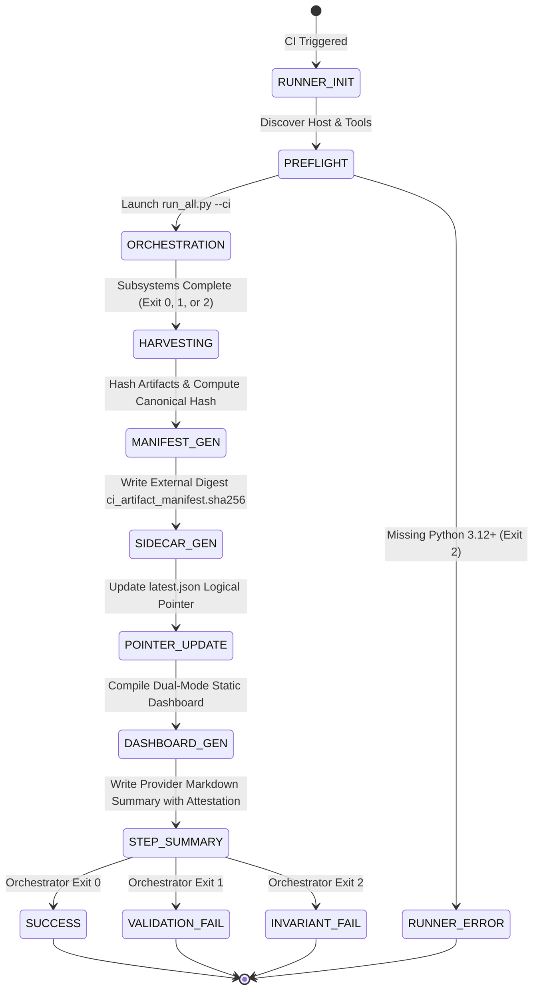

<!-- Classification: CURRENT_SPECIFICATION -->
# Master Design System (MDS) — Architecture Specification
## Phase 9.7.11: CI Pipeline & Artifact Dashboard — Final Architecture Micro-Remediation Pass #4

**Document Reference:** `MDS-SPEC-9711-REV5`  
**Phase:** 9.7.11 (CI Pipeline & Artifact Dashboard)  
**Layer:** Layer M (Testing, Governance & Architectural Immutability)  
**Date:** 2026-10-01  
**Lead Architect:** Mohamed Khalid (Senior Full Stack & Flutter Developer)  
**Status:** **ARCHITECTURE STAGE 1 — FINAL MICRO-REMEDIATION PASS #4 COMPLETE (Awaiting Final Independent Audit Gate)**  
**Execution Context:** Microsoft Windows, Google Chrome v153, Python 3.12.8 (Pure Standard Library)  
**Implementation Guard:** Phase 9.7.11 Implementation STRICTLY BLOCKED until authorized  

---

## 1. Executive Summary

Phase 9.7.11 establishes the architectural blueprint for the **Continuous Integration (CI) Pipeline & Artifact Dashboard** of the Master Design System. Building directly upon the locked foundation of Phase 9.7.10 (*Unified Local Orchestrator CLI*), Phase 9.7.9 (*Historical Phase Guard*), Phase 9.7.8 (*Governance & Consistency Engine*), and earlier realization layers, this architecture formalizes how local validation guarantees are reproduced inside automated environments, collected into an immutable manifest, and presented in a static dashboard.

Following the formal REV4 Independent Architecture Audit, this revision incorporates two definitive architectural micro-remediations:
1. **Trust Model & Provider-Controlled Trust Record Realignment (ADR-151):** Strictly separates runner-local transport mechanisms (`$GITHUB_OUTPUT`, step summaries) from the external Root of Trust. Defines an abstract, provider-agnostic `TrustedExecutionRecord` contract. Explicitly terms provider-managed verification "Provider-Controlled Trust Record" (avoiding ungrounded claims of cryptographic attestation where standard provider run records are used), while preserving the deterministic 7-scenario failure matrix (Cases A through G).
2. **Multi-Dimensional Authority Matrix (ADR-153):** Replaces the linear authority hierarchy with an orthogonal, 6-domain **Authority Matrix**. Formally decouples *Specification Authority*, *Historical Authority*, *Governance Authority*, *Execution Authority*, *Reporting Metadata Authority*, and *Presentation Authority*, eliminating cross-layer semantic contradictions and guaranteeing that neither the Historical Guard nor the Provenance Registry can mutate the Orchestrator's authoritative Exit Code.
3. **Verification Matrix Expansion:** Expands the architecture-level test matrix to 78 discrete test scenarios (`TEST-CI-01` to `TEST-CI-78`).

---

## 2. Scope

The scope of Phase 9.7.11 encompasses:
- Architectural definition of the **CI Execution Lifecycle** and provider adapter interface (`CIProviderAdapter`).
- Canonical specification of the **Artifact Architecture** and **Artifact Manifest Schema** (`ci_artifact_manifest.json`).
- Non-circular cryptographic hashing protocol for manifest self-integrity verification (ADR-146).
- Provider-Controlled Trust Record architecture, abstract `TrustedExecutionRecord` contract, and multi-tier failure semantics (ADR-149, ADR-151).
- Declarative Baseline Provenance Registry, deterministic 5-step precedence algorithm, and conflict resolution (ADR-147, ADR-150, ADR-152).
- Formal multi-dimensional **Authority Matrix** and domain boundaries (ADR-153).
- Architecture, dual ingestion protocol, and security model of the **Static Artifact Dashboard** (`dashboard.html`).
- Definition of the **Exit Code and Failure Propagation Contract** across CI environments.
- Threat modeling, sanitization, secret scrubbing, and CSP enforcement for untrusted PRs and artifact consumption.
- Historical comparison specifications for cross-run regression tracking.
- Test strategy and verification matrix comprising 78 discrete test scenarios (`TEST-CI-01` to `TEST-CI-78`).

---

## 3. Non-Goals

The following activities are strictly out of scope for Phase 9.7.11:
- **Writing CI workflow files:** Creating `.github/workflows/*.yml`, `.gitlab-ci.yml`, or Azure pipelines during this stage is forbidden.
- **Implementing Dashboard code:** Writing HTML, CSS, JavaScript, or Python dashboard generators during this stage is forbidden.
- **Modifying the Orchestrator:** Re-engineering `run_all.py` or `MDS/10-Testing/orchestrator/` is forbidden; Phase 9.7.10 is locked.
- **Modifying Locked Historical Records:** Touching `MDS/10-Testing/historical_guard/` or historical baselines is forbidden; Phase 9.7.9 is locked.
- **Modifying Protected Core:** Altering `02-Tokens/`, `Runtime/`, `Playground/`, or `Reference-Application/` is strictly forbidden.
- **Remediating Reference Application Defects:** Fixing the pre-existing WCAG AA violations in `Reference-Application/index.html` is reserved for future surface-specific remediation.
- **Introducing Server-side Backends:** The dashboard must not require Node.js, databases, Docker containers, or microservices.

---

## 4. Current Locked Inputs & Dependencies

Phase 9.7.11 consumes immutable inputs from previously locked phases:

```
[Phase 9.7.7: Visual Regression Engine (LOCKED)]
      ├── 12 Canonical Raster Baselines
      └── VisualComparator & VisualEvidenceGenerator
            │
[Phase 9.7.8: Governance Engine (LOCKED)]
      ├── Invariants INV-001 through INV-012
      └── Global Layer-M Performance Contract (ADR-100: Cold <=1200ms, Warm <=500ms)
            │
[Phase 9.7.9: Historical Phase Guard (LOCKED)]
      ├── Root Trust Anchor (MDS-ROOT-ANCHOR-v1)
      ├── 8 Locked Historical Phase Baselines & Ledger
      └── Local Immutability Contract (ADR-113: Cold <=300ms, Warm <=100ms)
            │
[Phase 9.7.10: Unified Local Orchestrator CLI (LOCKED)]
      ├── Master Entrypoint (MDS/10-Testing/run_all.py)
      ├── 15 Canonical Validation Subsystems (SUB-01 to SUB-15)
      ├── Transitive Dependency DAG & Composite 5-Tuple Cache
      ├── Protected Core Pre/Post SHA-256 Snapshot Manager (94 files)
      ├── Governed Active Phase Transition Manager (ACTIVE_PHASE.json)
      ├── Decoupled 20-Combination Status/Severity Normalizer
      └── Authoritative Exit Codes (Exit 0, Exit 1, Exit 2)
            │
            ▼
[Phase 9.7.11: CI Pipeline & Artifact Dashboard (ARCHITECTURE STAGE)]
```

---

## 5. CI Architecture & Operational Flow

The CI validation lifecycle operates in four strictly sequential stages: Environment Preparation, Autonomous Validation Execution, Artifact Harvesting & Manifest Assembly, and Static Dashboard Generation.

```mermaid
flowchart TD
    subgraph S1["Stage 1: Runner Initialization"]
        A["CI Trigger (PR / Push / Scheduled)"] --> B["CIProviderAdapter Detection"]
        B --> C["Environment Sanitization & Secret Scrubbing"]
        C --> D["Host Capability Discovery (Python 3.12+, Chrome Headless)"]
    end

    subgraph S2["Stage 2: Authoritative Validation Execution"]
        D --> E["Invoke: python MDS/10-Testing/run_all.py --ci"]
        E --> F["Orchestrator Stage 0: Preflight & Safety Gates"]
        F --> G["Orchestrator Stages 1-4: Subsystems SUB-01 to SUB-15"]
        G --> H["Protected Core Post-Snapshot SHA-256 Verification"]
        H --> I["Telemetry Export: run_all_telemetry.json"]
        I --> J["Emit Authoritative Exit Code (0, 1, or 2)"]
    end

    subgraph S3["Stage 3: Artifact Harvesting & Manifest Assembly"]
        J --> K["MDS Artifact Collector (Pure Harvester)"]
        K --> L["Harvest Raw Telemetry, Evidence, Diffs, and Logs"]
        L --> M["Compute NIST SHA-256 for Every Harvested File"]
        M --> N["Initialize manifest_sha256 = null"]
        N --> O["Execute Deterministic Canonical JSON Hashing (ADR-146)"]
        O --> P["Emit Canonical ci_artifact_manifest.json"]
        P --> Q["Generate External Sidecar ci_artifact_manifest.sha256 (ADR-149)"]
        Q --> R["Commit Digest to CI Provider Control Plane Attestation (ADR-151)"]
        R --> S["Update Logical Pointer: latest.json (ADR-148)"]
    end

    subgraph S4["Stage 4: Static Dashboard & Summary Generation"]
        S --> T["Historical Comparison Engine (Precedence & Baseline Superiority - ADR-150, 152, 153)"]
        T --> U["Static Dashboard Bundler (Dual Mode: file:// & http:// - ADR-140)"]
        U --> V["Generate Standalone dashboard.html + manifest_data.js"]
        V --> W["Generate Provider Step Summary (Markdown with Trusted Digest Attestation)"]
        W --> X["Propagate Exact Orchestrator Exit Code to CI Runner"]
    end
```



---

## 6. Provider Adapter Boundary

To maintain complete CI provider independence (ADR-136), the architecture establishes a formal abstraction barrier:

```
[CI Runner Environment]
       │ (Environment Variables, Runner OS, Workspace Path)
       ▼
┌────────────────────────────────────────────────────────┐
│               CIProviderAdapter (Interface)             │
├────────────────────────────────────────────────────────┤
│ + detect_environment() -> CIEnvironmentContext        │
│ + get_execution_flags() -> List[str]                   │
│ + export_step_summary(manifest: CIArtifactManifest)    │
│ + record_trusted_execution(manifest) -> TrustedRecord │
│ + fetch_trusted_execution(run_id) -> Optional[Record]  │
│ + format_pr_annotation(finding: Finding) -> str        │
└────────────────────────────────────────────────────────┘
       ▲                     ▲                    ▲
       │                     │                    │
┌──────────────┐      ┌──────────────┐     ┌──────────────┐
│ GitHubActions│      │   GitLabCI   │     │  LocalMockCI │
│   Adapter    │      │   Adapter    │     │   Adapter    │
└──────────────┘      └──────────────┘     └──────────────┘
```

### 6.1. Canonical Interface & Abstract Record Specification
```python
@dataclass
class CIEnvironmentContext:
    provider_name: str         # "github_actions", "gitlab_ci", "azure_pipelines", "local_mock"
    is_ci: bool                # True in automated runners
    run_id: str                # Deterministic run identifier
    run_attempt: int           # Execution attempt counter
    commit_sha: str            # Current commit SHA (40 hex chars)
    branch_ref: str            # Target branch or tag
    pr_number: Optional[int]   # Pull request number (if applicable)
    actor: str                 # Triggering actor / bot
    runner_os: str             # "windows", "linux", "macos"
    runner_arch: str           # "x64", "arm64"
    workspace_root: Path       # Root path of repository checkout
    trust_anchor_type: str     # "provider_controlled_record", "none_integrity_only"

@dataclass
class TrustedExecutionRecord:
    """Abstract provider-agnostic contract for external authenticity verification (ADR-151)."""
    run_id: str                # Unique CI provider execution identifier
    commit_identity: str       # Immutable Git commit SHA (40 hex chars)
    manifest_digest: str       # Canonical NIST SHA-256 digest of ci_artifact_manifest.json
    provider_identity: str     # Authenticated provider name ("github_actions", "gitlab_ci")
    execution_identity: str    # Job / workflow / pipeline execution reference in control plane
    authenticity_status: str   # "PROVIDER_VERIFIED", "INTEGRITY_ONLY", "UNAUTHENTICATED"
```

### 6.2. Concrete Adapter Responsibilities & Layer Separation

| Responsibility | GitHub Actions Adapter | GitLab CI Adapter | Local Mock Adapter |
| :--- | :--- | :--- | :--- |
| **Detection** | `GITHUB_ACTIONS == 'true'` | `GITLAB_CI == 'true'` | Fallback / Local CLI flag |
| **Run ID** | `GITHUB_RUN_ID` + `RUN_ATTEMPT` | `CI_PIPELINE_ID` + `CI_JOB_ID` | Timestamp + Local UUID |
| **Commit SHA** | `GITHUB_SHA` | `CI_COMMIT_SHA` | Head Git SHA / "local-dev" |
| **PR Number** | Parsed from `GITHUB_REF` | `CI_MERGE_REQUEST_IID` | `None` |
| **Root of Trust** | GitHub Actions Workflow Control Plane | GitLab CI Pipeline Control Plane | None (Local Process Memory) |
| **Trust Anchor** | Provider-Controlled Check Run / Job Record | Provider-Controlled Job Artifact Metadata | None (`none_integrity_only`) |
| **Runner-Local Transport** | `$GITHUB_OUTPUT` *(Step pipe only; NOT trust anchor)*| Job shell output stream | In-memory return values |
| **Presentation / Summary**| `$GITHUB_STEP_SUMMARY` *(Markdown presentation)*| GitLab Job Artifact Report | Local Markdown / Console |
| **Authenticity Verification**| Fetches `TrustedExecutionRecord` from Control Plane | Fetches `TrustedExecutionRecord` from Job API | Bypassed (Integrity-Only Mode) |
| **Annotations** | Emits `::error file={file},line={line}::{msg}` | Emits Code Quality JSON | Console formatted output |

---

## 7. Orchestrator Integration Contract

The integration between the CI Adapter and the Phase 9.7.10 Orchestrator is governed by ADR-136:
1. **Invocation Form:**
   ```powershell
   python MDS/10-Testing/run_all.py --ci
   ```
2. **Preset Expansion:**
   Per ADR-127 and ADR-132, the `--ci` preset automatically expands inside the Orchestrator to:
   - `profile = "full"` (Executes all Stages 0–4, covering `SUB-01` through `SUB-15`).
   - `isolate = True` (Runs dynamic stages in isolated worker subprocesses).
   - `fail_fast = True` (Halts execution immediately upon encountering fatal `BLOCKER` or `CRITICAL` findings).
   - `strict = True` (Treats any unresolved `WARN` findings as fatal `Exit 1`).
   - `strict_env = True` (Escalates missing headless Chrome from `DEFERRED` to fatal `Exit 1`).
3. **Immutability of Results:**
   The CI adapter MUST NOT intercept, modify, or override the in-memory results or the exit code emitted by `run_all.py`.

---

## 8. Artifact Architecture & Directory Hierarchy (Run-Addressed Storage)

Per ADR-138, all outputs are organized into a **Run-Addressed Storage Structure** with internal cryptographic content-integrity protection:

```text
MDS/10-Testing/artifacts/ci/
├── latest.json                                     <-- Logical JSON pointer (ADR-148)
└── runs/
    └── {run_id}/                                   <-- Immutable run-addressed directory
        ├── ci_artifact_manifest.json               <-- Authoritative master manifest (Schema v1.0.0)
        ├── ci_artifact_manifest.sha256             <-- External trusted digest sidecar (ADR-149)
        ├── step_summary.md                         <-- Markdown report with attestation
        ├── telemetry/
        │   ├── run_all_telemetry.json              <-- Raw Orchestrator telemetry
        │   └── performance_profile.json            <-- Layer-M duration & overhead metrics
        ├── evidence/
        │   ├── accessibility/
        │   │   ├── axe_results.json                <-- Raw axe-core audit data
        │   │   └── accessibility_report.txt        <-- Human-readable A11Y report
        │   ├── visual/
        │   │   ├── sweep_summary.json              <-- 12-baseline visual sweep results
        │   │   └── diffs/
        │   │       ├── VIS-BASE-001_diff.png       <-- Pixel difference map (if any)
        │   │       └── ...
        │   ├── responsive/
        │   │   └── matrix_results.json             <-- Viewport audit breakdown
        │   └── governance/
        │       ├── protected_core_snapshot.json    <-- Pre/post NIST SHA-256 core hash table
        │       └── historical_guard_report.json    <-- Sealed ledger verification proofs
        ├── logs/
        │   ├── orchestrator_stdout.log             <-- Verbatim console standard output
        │   └── orchestrator_stderr.log             <-- Verbatim console standard error
        └── dashboard/
            ├── index.html                          <-- Standalone static dashboard
            ├── dashboard.css                       <-- Offline MDS token stylesheet
            ├── dashboard.js                        <-- Client-side rendering engine (XSS-safe)
            └── manifest_data.js                    <-- Static JSON wrapper for local file:// mode
```

---

## 9. Artifact Manifest Schema (`ci_artifact_manifest.json`)

The artifact manifest serves as the authoritative record of the CI execution (ADR-137).

### 9.1. JSON Schema Definition (Layer-M Schema v1.0.0)
```json
{
  "$schema": "https://json-schema.org/draft/2020-12/schema",
  "$id": "https://mds.local/schemas/ci_artifact_manifest.schema.json",
  "title": "MDS CI Artifact Manifest",
  "type": "object",
  "required": [
    "schema_version",
    "manifest_id",
    "timestamp_utc",
    "run_context",
    "phase_context",
    "orchestrator_summary",
    "subsystems",
    "findings_summary",
    "findings",
    "protected_core",
    "historical_guard",
    "artifacts",
    "manifest_sha256"
  ],
  "properties": {
    "schema_version": { "type": "string", "const": "1.0.0" },
    "manifest_id": { "type": "string", "format": "uuid" },
    "timestamp_utc": { "type": "string", "format": "date-time" },
    "run_context": {
      "type": "object",
      "required": ["provider", "run_id", "commit_sha", "branch_ref", "runner_os", "runner_arch", "python_version"],
      "properties": {
        "provider": { "type": "string" },
        "run_id": { "type": "string" },
        "run_attempt": { "type": "integer", "minimum": 1 },
        "commit_sha": { "type": "string", "pattern": "^[0-9a-f]{40}$" },
        "branch_ref": { "type": "string" },
        "pr_number": { "type": ["integer", "null"] },
        "actor": { "type": "string" },
        "runner_os": { "type": "string" },
        "runner_arch": { "type": "string" },
        "python_version": { "type": "string" }
      }
    },
    "phase_context": {
      "type": "object",
      "required": ["active_phase_id", "active_prefixes", "previous_phase_id"],
      "properties": {
        "active_phase_id": { "type": "string" },
        "active_prefixes": { "type": "array", "items": { "type": "string" } },
        "previous_phase_id": { "type": "string" }
      }
    },
    "orchestrator_summary": {
      "type": "object",
      "required": ["version", "profile", "overall_status", "exit_code", "duration_ms"],
      "properties": {
        "version": { "type": "string" },
        "profile": { "type": "string", "enum": ["fast", "core", "full", "ci"] },
        "overall_status": { "type": "string", "enum": ["PASS", "FAIL", "DEFERRED", "SKIPPED"] },
        "exit_code": { "type": "integer", "enum": [0, 1, 2] },
        "duration_ms": { "type": "number", "minimum": 0.0 },
        "ci_overhead_ms": { "type": "number", "minimum": 0.0 }
      }
    },
    "subsystems": {
      "type": "array",
      "items": {
        "type": "object",
        "required": ["subsystem_id", "subsystem_name", "stage", "status", "duration_ms", "assertions_run", "findings_count"],
        "properties": {
          "subsystem_id": { "type": "string", "pattern": "^SUB-(0[1-9]|1[0-5])$" },
          "subsystem_name": { "type": "string" },
          "stage": { "type": "integer", "minimum": 0, "maximum": 4 },
          "status": { "type": "string", "enum": ["PASS", "FAIL", "DEFERRED", "CACHED", "SKIPPED"] },
          "duration_ms": { "type": "number" },
          "assertions_run": { "type": "integer" },
          "assertions_cached": { "type": "integer" },
          "findings_count": { "type": "integer" }
        }
      }
    },
    "findings_summary": {
      "type": "object",
      "required": ["total", "blocker", "critical", "warn", "info"],
      "properties": {
        "total": { "type": "integer" },
        "blocker": { "type": "integer" },
        "critical": { "type": "integer" },
        "warn": { "type": "integer" },
        "info": { "type": "integer" }
      }
    },
    "findings": {
      "type": "array",
      "items": {
        "type": "object",
        "required": ["severity", "code", "target", "message"],
        "properties": {
          "severity": { "type": "string", "enum": ["BLOCKER", "CRITICAL", "WARN", "INFO"] },
          "code": { "type": "string" },
          "target": { "type": "string" },
          "line": { "type": ["integer", "null"] },
          "message": { "type": "string" }
        }
      }
    },
    "protected_core": {
      "type": "object",
      "required": ["clean", "files_audited", "mutations_detected"],
      "properties": {
        "clean": { "type": "boolean" },
        "files_audited": { "type": "integer" },
        "mutations_detected": { "type": "integer" }
      }
    },
    "historical_guard": {
      "type": "object",
      "required": ["status", "locked_phases_audited", "records_audited", "drift_detected", "root_anchor_verified"],
      "properties": {
        "status": { "type": "string" },
        "locked_phases_audited": { "type": "integer" },
        "records_audited": { "type": "integer" },
        "drift_detected": { "type": "integer" },
        "root_anchor_verified": { "type": "boolean" }
      }
    },
    "artifacts": {
      "type": "array",
      "items": {
        "type": "object",
        "required": ["artifact_id", "artifact_class", "relative_path", "byte_size", "sha256", "mime_type"],
        "properties": {
          "artifact_id": { "type": "string" },
          "artifact_class": { "type": "string", "enum": ["TELEMETRY", "EVIDENCE", "LOG", "DASHBOARD"] },
          "subsystem_id": { "type": ["string", "null"] },
          "relative_path": { "type": "string" },
          "byte_size": { "type": "integer" },
          "sha256": { "type": "string", "pattern": "^[0-9a-f]{64}$" },
          "mime_type": { "type": "string" }
        }
      }
    },
    "manifest_sha256": { "type": "string", "pattern": "^[0-9a-f]{64}$" }
  }
}
```

---

## 10. Formal Trust Chain, Root of Trust & Provider-Controlled Records (ADR-146, ADR-149 & ADR-151)

To eliminate self-reference circularity while guaranteeing true authenticity across automated and local environments, the architecture establishes an explicit **4-Tier Trust Separation** distinguishing runner-local transport from external provider authority:

### 10.1. Layered Trust Model: Transport vs Authority
The architecture partitions the validation data lifecycle across four strictly defined architectural tiers:

```text
┌────────────────────────────────────────────────────────────────────────┐
│ Tier 4: Root of Trust (Authority: CI Provider Protected Control Plane)  │
│ - External service boundary (GitHub Actions / GitLab CI Control Plane) │
│ - Inaccessible to runner-level container or filesystem manipulation    │
└───────────────────────────────────┬────────────────────────────────────┘
                                    │
                                    ▼
┌────────────────────────────────────────────────────────────────────────┐
│ Tier 3: Trust Anchor (Provider-Controlled Trust Record)                │
│ - Abstract Contract: TrustedExecutionRecord                            │
│ - Authoritative run/job record committed in provider control plane     │
│ - Records canonical manifest digest (H_canon) at Stage 3 completion    │
└───────────────────────────────────┬────────────────────────────────────┘
                                    │
                                    ▼
┌────────────────────────────────────────────────────────────────────────┐
│ Tier 2: Runner-Local Transport & Reporting (NOT Root of Trust)          │
│ - Step summary ($GITHUB_STEP_SUMMARY): Presentation markdown only      │
│ - Step output ($GITHUB_OUTPUT): Local workflow step-pipe only          │
│ - Sidecar (ci_artifact_manifest.sha256): Local convenience file only   │
│ - INVARIANT: Mutable runner-local files NEVER serve as trust anchor    │
└───────────────────────────────────┬────────────────────────────────────┘
                                    │
                                    ▼
┌────────────────────────────────────────────────────────────────────────┐
│ Tier 1: Canonical Artifact Integrity (Internal manifest_sha256)        │
│ - Non-circular deterministic JSON canonical serialization (ADR-146)    │
│ - Protects against file corruption, truncation, serialization drift    │
└────────────────────────────────────────────────────────────────────────┘
```

### 10.2. Formal Definition of Root of Trust, Anchors & Terminology
1. **Root of Trust (Authority):** The immutable execution control plane of the CI provider (e.g. GitHub Actions Workflow Service, GitLab CI Pipeline Controller). The control plane exists outside the runner OS, container, or filesystem boundary.
2. **Trust Anchor ("Provider-Controlled Trust Record"):** The authoritative execution record emitted directly into the CI provider's control plane. To maintain absolute engineering precision:
   - Unless cryptographic signatures (e.g. Sigstore cosign, OIDC KMS signing) are explicitly configured, this mechanism is formally termed a **Provider-Controlled Trust Record**, NOT a "Cryptographic Attestation".
   - The record implements the abstract contract:
     ```python
     TrustedExecutionRecord(
         run_id="run-10928",
         commit_identity="3f8a912...",
         manifest_digest="4a5b6c...",
         provider_identity="github_actions",
         execution_identity="check_run_id_991827",
         authenticity_status="PROVIDER_VERIFIED"
     )
     ```
3. **Runner-Local Mechanisms Are Transport Only:**
   - `$GITHUB_OUTPUT` is a runner-local file mechanism for passing parameters between workflow steps; **it is NOT a Root of Trust**.
   - `$GITHUB_STEP_SUMMARY` is a markdown presentation file; **it is NOT a Root of Trust**.
   - `ci_artifact_manifest.sha256` is a convenience sidecar stored in the workspace; **it is NOT a Root of Trust**.
4. **Why an Attacker Cannot Silently Replace Both Manifest and Digest:**
   - An attacker or rogue script executing in the workspace may alter `ci_artifact_manifest.json` and compute a matching hash in `ci_artifact_manifest.sha256`.
   - However, the attacker **CANNOT modify the immutable Provider-Controlled Trust Record committed to the provider's external control plane**.
   - Downstream verification queries the provider control plane for the `TrustedExecutionRecord`. Any discrepancy between the filesystem payload and the provider record immediately trips `Exit 2`.
5. **Local vs CI Semantics:**
   - **CI Authenticity Mode:** Authenticity verification against the `TrustedExecutionRecord` in the provider control plane is mandatory.
   - **Local Integrity-Only Mode:** No external CI control plane exists (`trust_anchor_type = "none_integrity_only"`). Local executions operate in **Integrity-Only Mode** where internal `manifest_sha256` verifies consistency against accidental corruption. Authenticity cannot be certified without an external authority; local verification logs an advisory notice and preserves the original Orchestrator exit code.

### 10.3. Deterministic Failure Semantics Matrix (Cases A through G)

| Case | Scenario Condition | Diagnostic Classification | Pipeline Verdict | Exit Code | Automatic Retry? |
| :---: | :--- | :--- | :--- | :---: | :---: |
| **Case A** | Manifest internal hash mismatch ($\mathcal{H}_{\text{canon}} \ne \mathcal{H}_{\text{internal}}$) | `ManifestIntegrityError` (File corruption or internal drift) | Architectural Breach | **`Exit 2`** | **FORBIDDEN** |
| **Case B** | Sidecar digest mismatch against manifest ($\mathcal{H}_{\text{canon}} \ne \mathcal{H}_{\text{sidecar}}$) | `ManifestAuthenticityError` (Local sidecar inconsistency) | Architectural Breach | **`Exit 2`** | **FORBIDDEN** |
| **Case C** | Trusted Provider Record mismatch ($\mathcal{H}_{\text{canon}} \ne \text{record.manifest\_digest}$) | `ManifestAuthenticityError` (Control-plane trust anchor mismatch) | Architectural Breach | **`Exit 2`** | **FORBIDDEN** |
| **Case D** | Sidecar missing in CI environment | `ManifestAuthenticityError` (Missing mandatory CI artifact) | Architectural Breach | **`Exit 2`** | **FORBIDDEN** |
| **Case D (Local)**| Sidecar missing during local developer execution | Advisory Log (Fallback to Integrity-Only Mode) | Integrity-Only Verified | Preserved (`0` or `1`) | N/A |
| **Case E** | Missing/unreachable Provider-Controlled Trust Record in CI | `InfrastructureAttestationError` (Lost provider control-plane channel) | Infrastructure Failure | CI Job Error / **`Exit 2`** | **ALLOWED** (Max 1 retry) |
| **Case F** | Sidecar file malformed (Not `<64-hex>  <filename>` format) | `ManifestAuthenticityError` (Corrupt external digest syntax) | Architectural Breach | **`Exit 2`** | **FORBIDDEN** |
| **Case G** | Local execution without external trust anchor | Advisory Log (Integrity-Only verification passed) | Integrity-Only Mode | Preserved (`0` or `1`) | N/A |

### 10.4. Ordered Verification Algorithm
```text
Algorithm: VerifyManifestComplete(manifest_path, sidecar_path, trusted_record=None, is_ci=False)
Input:
  manifest_path: Path to ci_artifact_manifest.json
  sidecar_path: Path to ci_artifact_manifest.sha256
  trusted_record: Optional[TrustedExecutionRecord] (from CI Provider Control Plane)
  is_ci: bool (flag indicating automated CI runner execution)
Output:
  True (or raises Fatal Exception)

STEP 1: CANONICAL SERIALIZATION & INTERNAL INTEGRITY VERIFICATION (Detects File Corruption)
1. Load JSON from manifest_path -> M_data
2. Extract internal digest: H_internal = M_data.GET("manifest_sha256")
3. If H_internal is None or not valid 64-character lowercase hex:
     RAISE ManifestIntegrityError("Malformed internal manifest_sha256 digest")
4. Set M_data["manifest_sha256"] = None
5. Serialize M_data to canonical JSON bytes B_canon using (sort_keys=True, separators=(",", ":"), UTF-8)
6. Compute H_recomputed = SHA256_HEX(B_canon)
7. If H_recomputed != H_internal:
     RAISE ManifestIntegrityError(f"Internal integrity breach: expected {H_internal} != recomputed {H_recomputed}")

STEP 2: EXTERNAL SIDECAR VERIFICATION (Detects Local Workspace Tampering)
8. If not sidecar_path.EXISTS():
     If is_ci:
       RAISE ManifestAuthenticityError(f"Sidecar missing in CI environment: {sidecar_path}")
     Else:
       LOG_ADVISORY("Sidecar absent in local execution; operating in integrity-only mode.")
       RETURN True
9. Read sidecar_path -> sidecar_content
10. Parse sidecar_content for 64-hex token and filename -> H_sidecar, filename
11. If H_sidecar is invalid or filename != "ci_artifact_manifest.json":
      RAISE ManifestAuthenticityError(f"Malformed sidecar content in {sidecar_path}")
12. If H_recomputed != H_sidecar:
      RAISE ManifestAuthenticityError(f"Sidecar mismatch: sidecar {H_sidecar} != recomputed {H_recomputed}")

STEP 3: PROVIDER-CONTROLLED TRUST RECORD VERIFICATION (Root of Trust Check)
13. If is_ci:
      If trusted_record is None:
        RAISE InfrastructureAttestationError("Provider-Controlled Trust Record is missing or unreachable from control plane")
      If H_recomputed != trusted_record.manifest_digest:
        RAISE ManifestAuthenticityError(
          f"Root of Trust breach: provider record {trusted_record.manifest_digest} != recomputed {H_recomputed}"
        )
14. RETURN True
```

---

## 11. Finding Provenance Authority, Precedence Algorithm & Registry Architecture (ADR-147, ADR-150, ADR-152 & ADR-153)

Per ADR-147, ADR-150, ADR-152, and ADR-153, the architectural boundaries governing finding semantics and provenance are formally partitioned, completely eliminating hardcoded domain rules while establishing an explicit, deterministic conflict-resolution precedence:

```
┌────────────────────────────────────────────────────────┐
│           1. Validation Authority (Producer)           │
│       Orchestrator Engine & Subsystems (SUB-01..15)     │
├────────────────────────────────────────────────────────┤
│ • Evaluates code, tokens, DOM, and visual raster.      │
│ • Emits Authoritative Raw Finding:                     │
│   (severity, code, target, line, message).             │
│ • Zero comparative tagging (No PREEXISTING logic).     │
└───────────────────────────┬────────────────────────────┘
                            │ (run_all_telemetry.json)
                            ▼
┌────────────────────────────────────────────────────────┐
│           2. Pure Harvester (Artifact Collector)       │
├────────────────────────────────────────────────────────┤
│ • Ingests raw findings verbatim.                       │
│ • Serializes findings into ci_artifact_manifest.json.  │
│ • Zero validation logic; Zero semantic re-evaluation.  │
└───────────────────────────┬────────────────────────────┘
                            │
                            ▼
┌────────────────────────────────────────────────────────┐
│      3. Declarative Sources for Downstream Triage      │
├────────────────────────────────────────────────────────┤
│ Source A: Declarative Surface Provenance Registry      │
│   (baselines/provenance/surface_provenance_registry.json)│
│ Source B: Locked Historical Phase Guard Baselines     │
│   (Phase 9.7.9 Historical Guard - Superior Authority) │
└───────────────────────────┬────────────────────────────┘
                            │
                            ▼
┌────────────────────────────────────────────────────────┐
│      4. Deterministic Precedence & Comparison Engine   │
├────────────────────────────────────────────────────────┤
│ • Executes 5-Step Ordered Decision Algorithm (ADR-152):│
│   - Registry Integrity & Schema Check                  │
│   - Exact Identity Match (target_path + violation_code)│
│   - Historical Baseline Superiority Reconciliation     │
│   - Conflict Resolution (Cases A through I)            │
│ • Assigns Downstream Provenance Tag:                   │
│   PREEXISTING_SURFACE | REGRESSION | UNKNOWN           │
│ • NEVER overrides exit code (Pipeline remains Exit 1). │
└────────────────────────────────────────────────────────┘
```

### 11.1. Deterministic Ordered Decision Algorithm
When classifying findings in downstream reports and dashboards, the Historical Comparison Engine executes a strict 5-step decision algorithm:

```text
Step 1: Registry Integrity & Schema Validation
  Verify existence and JSON schema validity of surface_provenance_registry.json.
  If corrupted or missing -> handle per Case G or Case H.

Step 2: Identity Field Matching
  For each finding F, match strictly on the composite key:
    Key(F) = (F.target_path, F.violation_code)
  Fuzzy, prefix, or partial matches are strictly prohibited.

Step 3: Historical Baseline Cross-Check
  Query locked Phase 9.7.9 historical baselines to ascertain whether F was
  empirically observed and codified in the declared origin phase.

Step 4: Conflict Resolution & Provenance Assignment
  Apply the Precedence Matrix (Cases A through I) to resolve conflicts deterministically.

Step 5: Orchestrator Invariant Enforcement
  Assert that the assigned provenance tag DOES NOT modify Orchestrator severity or exit code.
```

### 11.2. Conflict Resolution & Precedence Cases (Cases A through I)

| Case | Condition Description | Provenance Result | Triage State | Diagnostic Action | Effect on Exit Code |
| :---: | :--- | :---: | :---: | :--- | :---: |
| **Case A** | Registry exact match AND locked historical baseline agrees | `PREEXISTING_SURFACE` | `CONFIRMED` | Classified as known pre-existing surface defect | **None** (Maintains `Exit 1`) |
| **Case B** | Registry exact match BUT locked historical baseline conflicts (finding absent in historical baseline) | **`REGRESSION`** | **`PROVENANCE_CONFLICT`** | **Historical Baseline Superiority Wins.** Registry claim rejected. Log conflict warning. | **None** (Maintains `Exit 1`) |
| **Case C** | Registry exists but matching rule is malformed (missing fields / bad types) | `UNKNOWN` | `MALFORMED_RULE` | Rule discarded; fallback to `UNKNOWN`. Log registry lint warning. | **None** (Maintains `Exit 1`) |
| **Case D** | Registry exists but contains no matching rule for finding | Evaluated via Baseline: `PREEXISTING_SURFACE` (if in baseline) or `REGRESSION` (if absent) | `UNINDEXED` | Reconciled against historical baseline evidence | **None** (Maintains `Exit 1`) |
| **Case E** | Historical baseline contains finding but registry does not index it | `PREEXISTING_SURFACE` | `BASELINE_GROUNDED` | Historical evidence directly confirms pre-existence | **None** (Maintains `Exit 1`) |
| **Case F** | Neither registry nor historical baseline contains finding | `REGRESSION` | `NEW_FINDING` | Classified as newly introduced regression | **None** (Maintains `Exit 1`) |
| **Case G** | Registry file is entirely missing | Evaluated via Baseline: `PREEXISTING_SURFACE` (if in baseline) or `UNKNOWN` (if absent) | `REGISTRY_ABSENT` | Fallback 100% to historical baseline comparison. Log advisory. | **None** (Maintains `Exit 1`) |
| **Case H** | Registry file is corrupted or fails JSON schema validation | `UNKNOWN` | `REGISTRY_INVALID` | Entire registry rejected as untrusted. Log schema breach warning. | **None** (Maintains `Exit 1`) |
| **Case I** | Finding matches rule partially (differs in `target_path`, `violation_code`, or severity) | Evaluated as Non-Match $\to$ Cases D/E/F | `STRICT_NON_MATCH` | Identity mismatch. Strict key equality required. No partial match allowed. | **None** (Maintains `Exit 1`) |

### 11.3. Provenance Invariant Contract
Provenance is strictly downstream reporting and triage metadata. Under no circumstances may provenance logic:
1. **Suppress a finding:** All findings remain fully visible in the manifest, logs, and dashboard.
2. **Whitelist a finding:** No finding is exempted from policy evaluations.
3. **Downgrade severity:** A `BLOCKER` or `CRITICAL` finding retains its exact severity regardless of provenance.
4. **Mutate exit codes:** `PREEXISTING_SURFACE` findings **never convert Exit 1 into Exit 0**, nor `Exit 2` into `Exit 0`.
5. **Bypass an orchestrator assertion:** The orchestrator verdict is sovereign and immutable.

### 11.4. Baseline vs Registry Authority (ADR-153)
The authority relationship between the Phase 9.7.9 Historical Guard and the Phase 9.7.11 Provenance Registry is strictly hierarchical:
- **Phase 9.7.9 Historical Guard:** Holds unconditional, cryptographic authority over historical reality (`MDS-ROOT-ANCHOR-v1`). Its 42 locked records across 8 historical phases represent sealed ground truth.
- **Phase 9.7.11 Provenance Registry:** Represents a human-readable, declarative categorization index designed to aid triage in PR summaries and dashboard views.
- **Non-Override Invariant:** The registry has **ZERO authority to contradict or rewrite historical baselines**. If a rule in `surface_provenance_registry.json` claims a finding existed in `Phase-9.7.5`, but the sealed Phase 9.7.5 baseline contains no such finding, the registry claim is invalidated, the finding is classified as `REGRESSION`, and an architectural alert is logged (`Case B`).
- **Amendment Governance:** Any correction to historical baselines must follow the formal Phase 9.7.9 Governance Amendment Protocol (ADR-113); it cannot be accomplished by creating or editing registry entries.

## 12. Dashboard Architecture & Dual Ingestion Protocol

Per ADR-140 and ADR-141, the CI Artifact Dashboard is a pure static, zero-dependency realization of the Master Design System:

```
┌────────────────────────────────────────────────────────────────────────┐
│                        Master Design System                            │
│                 CI Validation & Artifact Dashboard                     │
├────────────────────────────────────────────────────────────────────────┤
│ [Header] Run ID: #10928 | Commit: 3f8a912 | Branch: main | Status: FAIL│
├────────────────────────────────────────────────────────────────────────┤
│ ┌───────────────────────┐ ┌───────────────────┐ ┌────────────────────┐ │
│ │  Overall Verdict      │ │ Execution Time    │ │ Protected Core     │ │
│ │  FAIL (Exit Code: 1)  │ │ 58,964 ms         │ │ 100% CLEAN (94/94) │ │
│ └───────────────────────┘ └───────────────────┘ └────────────────────┘ │
├────────────────────────────────────────────────────────────────────────┤
│ [Tab Navigation]                                                       │
│ [Overview]  [Subsystems (15)]  [Findings (11)]  [Artifacts]  [History] │
├────────────────────────────────────────────────────────────────────────┤
│ [Active Tab View: Subsystem Matrix]                                    │
│   SUB-01  Historical Phase Guard              [PASS]          49.9 ms  │
│   SUB-02  Governance Invariants Engine        [PASS] (9 warn) 236.8 ms │
│   ...                                                                  │
│   SUB-13  Live Accessibility & Axe-Core       [FAIL] (1 crit) 1836.7 ms│
│           └── Policy Breached: 2 blocking violations (WCAG AA)         │
│   SUB-14  Responsive Viewport Matrix          [PASS]          2620.7 ms│
│   SUB-15  Visual Regression Pixel-Diff        [PASS] (12/12) 53850.4 ms│
├────────────────────────────────────────────────────────────────────────┤
│ [Notice Panel: Pre-Existing Surface Findings]                          │
│   Found 2 pre-existing WCAG findings in locked Reference Application.  │
│   - color-contrast (Critical) [Origin: PREEXISTING_SURFACE]            │
│   - select-name    (Serious)  [Origin: PREEXISTING_SURFACE]            │
│   Note: These findings truthfully fail the build per ADR-139.          │
└────────────────────────────────────────────────────────────────────────┘
```

### 12.1. Dual Ingestion Protocol
To eliminate browser CORS failures when opening `file:///dashboard.html` directly from disk, the dashboard implements a deterministic dual-mode loader:

```javascript
// dashboard.js: Deterministic Dual Ingestion Engine
(function initializeDashboard() {
    const isLocalFileMode = window.location.protocol === 'file:';

    if (isLocalFileMode) {
        // Mode 1: Offline Local File Mode (Zero fetch dependency)
        if (window.__MDS_MANIFEST__ && typeof window.__MDS_MANIFEST__ === 'object') {
            renderDashboard(window.__MDS_MANIFEST__);
        } else {
            renderFatalError("Offline manifest bundle (manifest_data.js) is missing or corrupted.");
        }
    } else {
        // Mode 2: Hosted HTTP / HTTPS Mode (Standard asynchronous fetch)
        fetch('./ci_artifact_manifest.json')
            .then(response => {
                if (!response.ok) throw new Error(`HTTP ${response.status}: Failed to fetch manifest`);
                return response.json();
            })
            .then(data => renderDashboard(data))
            .catch(err => {
                // Fallback to embedded script data if fetch fails
                if (window.__MDS_MANIFEST__) {
                    renderDashboard(window.__MDS_MANIFEST__);
                } else {
                    renderFatalError("Failed to load manifest via fetch: " + err.message);
                }
            });
    }
})();
```

### 12.2. 15 Canonical Dashboard Views
- **V-01: Run Overview:** Metadata, execution environment, git context, timestamps.
- **V-02: Overall Verdict:** Visual badge, exit code, policy summary.
- **V-03: Exit Code Decoder:** Direct explanation of exit code meaning (0, 1, 2).
- **V-04: Active Phase Governance:** Active phase ID, prefix compliance, ledger health.
- **V-05: Subsystem Matrix:** Full table of all 15 validation subsystems with durations.
- **V-06: Finding Taxonomy:** Grouped by severity (`BLOCKER`, `CRITICAL`, `WARN`, `INFO`).
- **V-07: Finding Provenance:** Declarative visual partition between `PREEXISTING_SURFACE` and `REGRESSION`.
- **V-08: Performance Contracts:** Layer-M benchmarks vs actual execution time.
- **V-09: Protected Core Status:** Proof of zero mutations across 94 files.
- **V-10: Historical Guard:** Immutability breakdown (42 unchanged records).
- **V-11: Visual Regression Gallery:** Side-by-side inspection of baseline vs live captures.
- **V-12: Accessibility Audit Detail:** axe-core rule inspection and affected DOM nodes.
- **V-13: Responsive Matrix Breakdown:** Multi-viewport validation tables.
- **V-14: Artifact Inventory:** Download links, MIME types, file sizes, SHA-256 hashes, sidecar link.
- **V-15: Historical Comparison:** Cross-run delta viewer.

---

## 13. Security Model & Threat Mitigation

The security model is formally partitioned between hosted and local contexts (ADR-141):

### 13.1. Hosted HTTP Mode: Strict Content Security Policy (Zero Unsafe-Inline)
When served over HTTP/HTTPS (GitHub Pages, GitLab Pages, S3), `unsafe-inline` is strictly prohibited:
```http
Content-Security-Policy: default-src 'none'; script-src 'self'; style-src 'self'; img-src 'self' data:; font-src 'self' data:; connect-src 'self'; frame-ancestors 'none'; base-uri 'none'; form-action 'none';
```

### 13.2. Universal Application-Layer DOM Sanitization
In offline `file:///` contexts where browser meta-tag CSP support varies, XSS defense is universally enforced by JavaScript runtime invariants:
1. **Zero `innerHTML` Rule:** The use of `innerHTML`, `outerHTML`, `document.write()`, and `eval()` is strictly prohibited across the entire codebase.
2. **Mandatory Safe Node Insertion:** All variable data (finding messages, commit notes, file targets) is injected exclusively via:
   ```javascript
   element.textContent = sanitizeString(untrustedValue);
   ```
3. **No External Resource Requests:** Zero CDN, third-party analytics, or external font fetches. Cairo font is bundled locally via base64 data URIs.

### 13.3. Secret Redaction Pattern
Before writing the manifest or logs, the collector matches and sanitizes all values corresponding to keys matching:
```regex
(?i)(key|token|secret|password|credential|auth|bearer|private)
```
Any matching variable is scrubbed to `"[REDACTED_MDS_SECRET]"`.

---

## 14. `latest.json` Logical Pointer Governance

Per ADR-148, `latest.json` is a mutable, cross-platform **Logical JSON Pointer** rather than an operating system filesystem symlink:

### 14.1. Pointer Schema
```json
{
  "$schema": "https://json-schema.org/draft/2020-12/schema",
  "title": "MDS CI Latest Run Pointer",
  "type": "object",
  "required": ["schema_version", "pointer_updated_utc", "run_id", "manifest_relative_path", "manifest_sha256"],
  "properties": {
    "schema_version": { "type": "string", "const": "1.0.0" },
    "pointer_updated_utc": { "type": "string", "format": "date-time" },
    "run_id": { "type": "string" },
    "manifest_relative_path": { "type": "string" },
    "manifest_sha256": { "type": "string", "pattern": "^[0-9a-f]{64}$" }
  }
}
```

### 14.2. Governance & Lifecycle Invariants
1. **Writer Authority:** Written exclusively by the Artifact Collector upon successful generation and verification of `ci_artifact_manifest.json` and `ci_artifact_manifest.sha256`.
2. **Run Immutability:** Individual run directories (`runs/{run_id}/`) are sealed and immutable. `latest.json` is a mutable branch pointer.
3. **Non-Circular Hash Scope:** `latest.json` is located outside the run directory and is NOT included inside the run manifest hash.
4. **Cross-Platform Determinism:** Standard JSON file eliminates Windows privilege requirements (`SeCreateSymbolicLinkPrivilege`) and git symlink checkout issues on NTFS filesystems.
5. **Non-Gating Failure Semantics:** If writing `latest.json` encounters an I/O failure, an infrastructure warning is logged; it never alters the validation exit code.

---

## 15. Exit Code Model & Propagation Contract

Per ADR-142, the CI Provider Adapter propagates the authoritative Orchestrator exit codes without re-interpretation:

| Exit Code | Orchestrator Meaning | CI Runner Interpretation | PR Status | Automatic Retry? |
| :---: | :--- | :--- | :---: | :---: |
| **`0`** | **SUCCESS:** All invariants and surface policies pass. | CI Job **PASSED**. Step succeeds cleanly. | 🟢 Green Check | N/A |
| **`1`** | **VALIDATION / SURFACE FAILURE:** One or more subsystems failed contract or policy checks (e.g. Reference App WCAG AA failure). | CI Job **FAILED**. Validation gate tripped. | 🔴 Red Cross | **FORBIDDEN** (Deterministic defect) |
| **`2`** | **ARCHITECTURAL / INVARIANT BREACH:** Invariant violated (Protected Core mutated, cyclic DAG, corrupted active phase, illegal cached state). | CI Job **FAILED**. Critical architectural alert. | 🔴 Red Cross | **FORBIDDEN** (Fatal defect) |
| **`124`+** | **INFRASTRUCTURE FAILURE:** Runner timeout, OS process crash, lost container agent. | CI Job **ERRORED**. Infrastructure failure. | ⚪ Gray / Cancelled | **ALLOWED** (Max 1 retry) |

---

## 16. Retry & Failure Semantics

To prevent non-deterministic masking of defects (ADR-142):
1. **Validation Failures (`Exit 1`):** Retries are strictly forbidden. If axe-core finds `color-contrast` failure or a CSS rule is breached, running the test again will waste compute and risk hiding intermittent bugs.
2. **Architectural Breaches (`Exit 2`):** Retries are strictly forbidden. Core mutations or DAG cycles require engineer intervention.
3. **Transient Infrastructure Failures:** Only runner-level timeouts, Docker daemon crashes, or package checkout network errors occurring **prior** to `run_all.py` execution may be retried (maximum 1 automatic retry).

---

## 17. Environment Model & Execution Modes

The architecture formalizes four distinct execution modes:

```
┌─────────────────┬──────────┬───────────┬─────────────┬──────────────┬────────────┐
│ Mode            │ Profile  │ Isolation │ Chrome Req. │ Strict Mode  │ Target     │
├─────────────────┼──────────┼───────────┼─────────────┼──────────────┼────────────┤
│ 1. LOCAL FAST   │ --fast   │ In-process│ No          │ Non-fatal    │ Developer  │
│ 2. LOCAL CORE   │ --core   │ In-process│ No          │ Non-fatal    │ Pre-commit │
│ 3. LOCAL FULL   │ --full   │ In-process│ Advisory    │ Non-fatal    │ Pre-push   │
│ 4. CI FULL      │ --ci     │ Subprocess│ Mandatory   │ Fatal (Exit1)│ PR / Trunk │
└─────────────────┴──────────┴───────────┴─────────────┴──────────────┴────────────┘
```

The underlying validation algorithms remain 100% identical; only the execution flags and strictness thresholds adjust.

---

## 18. Performance Model & Overhead Decoupling

Per ADR-144, the architecture decouples validation runtime from CI overhead:

$$\text{Total CI Step Time} = \text{Orchestrator Duration} (\mathcal{D}_{\text{orc}}) + \text{CI Overhead} (\mathcal{D}_{\text{ci}})$$

### Performance Accounting:
- $\mathcal{D}_{\text{orc}}$: Execution time of `run_all.py`. Benchmarked against Global Layer-M contracts (ADR-100: Cold $\le 1200\text{ms}$ / Warm $\le 500\text{ms}$ for `--core`).
- $\mathcal{D}_{\text{ci}}$: Time spent in runner environment discovery, manifest serialization, SHA-256 calculation, and static dashboard bundling.
- **CI Overhead Target:** $\mathcal{D}_{\text{ci}} \le 2000\text{ms}$ (Pure standard library file I/O).

---

## 19. Retention Model & Traceability

1. **Artifact Retention Policy:**
   - **Pull Request Runs:** Retained for 14 days (for audit and review).
   - **Trunk / Release Runs:** Retained for 90 days.
   - **Historical Manifest Baselines:** Immutable, permanently stored in repository under `MDS/10-Testing/baselines/ci/` upon phase completion.
2. **Traceability Triad:**
   Every generated manifest binds:
   $$\text{Run ID} \longleftrightarrow \text{Git Commit SHA} \longleftrightarrow \text{Active Phase ID}$$

---

## 20. Historical Comparison Model

The client-side dashboard includes a lightweight comparison engine (ADR-145) that evaluates:
$$\Delta\text{Status} = \text{Status}_{\text{current}} - \text{Status}_{\text{baseline}}$$
$$\Delta\text{Duration}_s = \text{Duration}_{s,\text{current}} - \text{Duration}_{s,\text{baseline}} \quad \forall s \in [SUB\text{-}01 \dots SUB\text{-}15]$$
$$\text{New Findings} = \mathcal{F}_{\text{current}} \setminus \mathcal{F}_{\text{baseline}}$$
$$\text{Resolved Findings} = \mathcal{F}_{\text{baseline}} \setminus \mathcal{F}_{\text{current}}$$

---

## 21. Governance & Multi-Dimensional Authority Matrix (ADR-153)

Rather than forcing disparate architectural responsibilities into an artificial single linear hierarchy, the architecture establishes an orthogonal **Multi-Dimensional Authority Matrix**. Each subsystem holds definitive, unchallengeable authority within its bounded domain while possessing zero authority to override adjacent domains:

### 21.1. Authority Matrix

| Authority Domain | Authoritative Component | Domain Responsibility & Authority Scope | Hard Boundary (Zero Override Permitted) |
| :--- | :--- | :--- | :--- |
| **1. Specification Authority** | Master Design System Specification | Defines the canonical design system truth, token schemas, component contracts, and baseline standards. | Cannot alter empirical historical records or runtime exit codes. |
| **2. Historical Authority** | Phase 9.7.9 Historical Phase Guard | Cryptographic custodian of immutable past truth (`MDS-ROOT-ANCHOR-v1`) and sealed baselines across phases. | **Cannot change current Orchestrator Exit Code.** |
| **3. Governance Authority** | Phase 9.7.8 Governance & Consistency Engine | Establishes cross-document consistency rules, invariant definitions (`INV-001`..`INV-012`), and change authorization gates. | Cannot alter sealed historical baselines without formal ADR-113 amendment. |
| **4. Execution Authority** | Phase 9.7.10 Unified Local Orchestrator | Evaluates live system health, executes subsystems `SUB-01`..`SUB-15`, and emits the **authoritative Exit Code (0, 1, or 2)**. | **Cannot rewrite Historical Guard truth or alter baseline records.** |
| **5. Reporting Metadata Authority**| Phase 9.7.11 Declarative Provenance Registry | Categorizes known pre-existing surface defects to enrich downstream triage reports and dashboards. | **Cannot modify Orchestrator findings, severities, or Exit Codes.** |
| **6. Presentation Authority** | Phase 9.7.11 CI Artifact Dashboard | Visual rendering and presentation of execution telemetry, diffs, and summaries. | **Zero decision authority.** Cannot alter any validation or governance verdict. |

### 21.2. Mandatory Cross-Domain Invariants
1. **Execution Sovereignty:** The Orchestrator's emitted exit code (`Exit 0`, `Exit 1`, or `Exit 2`) is sovereign and final for the current execution. No downstream reporting, provenance, or presentation component can modify it.
2. **Historical Immutability:** Historical Phase Guard records are cryptographically sealed. Neither the Orchestrator nor the Provenance Registry can alter historical evidence.
3. **No Retroactive Rewriting:** Provenance classification rules in `surface_provenance_registry.json` are purely advisory metadata. If a rule contradicts locked historical evidence, Historical Guard truth takes precedence unconditionally (`Case B`).
4. **Governed Historical Amendments:** Any rectification to historical baselines must execute through the formal Phase 9.7.9 Governance Amendment Protocol (ADR-113); modifying the provenance registry cannot amend historical records.
5. **Zero Finding Mutation:** No downstream reporting layer may suppress, whitelist, downgrade severity, or reinterpret an authoritative Orchestrator finding.

---

## 22. Protected Core & Historical Phase Boundaries

To ensure complete architectural safety during future implementation:
1. **Protected Core Directories (Read-Only):**
   - `MDS/02-Tokens/`
   - `MDS/Runtime/`
   - `MDS/Playground/`
   - `MDS/Reference-Application/`
2. **Historical Phase Guard Directories (Read-Only):**
   - `MDS/10-Testing/historical_guard/`
   - `MDS/10-Testing/baselines/historical/`
3. **Orchestrator Core (Read-Only):**
   - `MDS/10-Testing/run_all.py`
   - `MDS/10-Testing/orchestrator/`

---

## 23. Test Architecture: 78 Verification Scenarios

Phase 9.7.11 establishes an expanded test matrix comprising 78 discrete test scenarios (`TEST-CI-01` to `TEST-CI-78`) to validate the CI engine upon implementation:

| Test ID | Category | Scenario Description | Expected Outcome |
| :--- | :--- | :--- | :--- |
| `TEST-CI-01` | Adapter | GitHub Actions environment variable parsing | Valid `CIEnvironmentContext` constructed |
| `TEST-CI-02` | Adapter | GitLab CI environment variable parsing | Valid `CIEnvironmentContext` constructed |
| `TEST-CI-03` | Adapter | Local mock runner environment fallback | Valid default local context returned |
| `TEST-CI-04` | Orchestrator | Delegation to `run_all.py --ci` without duplication | Subprocesses executed via Orchestrator |
| `TEST-CI-05` | Exit Codes | Exact propagation of Exit Code 0 | CI Step succeeds with Exit 0 |
| `TEST-CI-06` | Exit Codes | Exact propagation of Exit Code 1 (Validation Failure) | CI Step fails with Exit 1 (No retry) |
| `TEST-CI-07` | Exit Codes | Exact propagation of Exit Code 2 (Fatal Invariant) | CI Step fails with Exit 2 (No retry) |
| `TEST-CI-08` | Provenance | Reference App `color-contrast` derived PREEXISTING via registry | Flagged as `PREEXISTING_SURFACE` in triage |
| `TEST-CI-09` | Provenance | Reference App `select-name` derived PREEXISTING via registry | Flagged as `PREEXISTING_SURFACE` in triage |
| `TEST-CI-10` | Provenance | New token failure derived REGRESSION | Flagged as `REGRESSION` in triage |
| `TEST-CI-11` | Manifest | JSON Schema v1.0.0 compliance validation | Manifest validates with zero schema errors |
| `TEST-CI-12` | Manifest | Subsystem matrix completeness (15 entries) | Exactly 15 subsystem records captured |
| `TEST-CI-13` | Manifest | NIST SHA-256 calculation for all artifacts | All artifact digests match file contents |
| `TEST-CI-14` | Manifest | Canonical manifest hashing non-circularity | Manifest generated with valid `manifest_sha256` |
| `TEST-CI-15` | Directory | Deterministic hierarchy under `artifacts/ci/runs/` | Structure matches specification exactly |
| `TEST-CI-16` | Directory | `latest.json` logical pointer resolution | Points accurately to latest run ID |
| `TEST-CI-17` | Security | Path traversal attempt in artifact path (`../`) | Rejected with `SecurityViolationError` |
| `TEST-CI-18` | Security | Secret redaction in environment metadata | Key matching `*_TOKEN` scrubbed to `[REDACTED]` |
| `TEST-CI-19` | Security | Strict CSP meta header present in hosted dashboard | CSP contains `default-src 'none'` (no unsafe-inline)|
| `TEST-CI-20` | Security | XSS injection in finding message sanitized | Rendered via `textContent`, no script executed |
| `TEST-CI-21` | Security | Untrusted PR permission restrictions | Read-only permissions enforced |
| `TEST-CI-22` | Dashboard | Zero-dependency verification | 0 external script/style/font network requests |
| `TEST-CI-23` | Dashboard | Offline `file:///` loading mode | Renders accurately from `manifest_data.js` |
| `TEST-CI-24` | Dashboard | Hosted `http://` fetch loading mode | Renders accurately from `ci_artifact_manifest.json` |
| `TEST-CI-25` | Dashboard | MDS Design Token styling verification | Cairo typography & canonical theme variables used |
| `TEST-CI-26` | Dashboard | Responsive viewport rendering (320px, 768px, 1440px) | Layout adapts without horizontal overflow |
| `TEST-CI-27` | Dashboard | Visual regression diff viewer rendering | Baseline vs actual images display side-by-side |
| `TEST-CI-28` | Dashboard | Accessibility audit violation node inspection | Target CSS selectors clamped and displayed |
| `TEST-CI-29` | Summary | GitHub Step Summary markdown generation | Formatted markdown table exported |
| `TEST-CI-30` | Summary | PR annotation formatting | Single-line GitHub workflow command formatted |
| `TEST-CI-31` | Performance | Decoupled validation runtime vs CI overhead | Both metrics exported in telemetry |
| `TEST-CI-32` | Performance | CI overhead constraint ($\le 2000\text{ms}$) | Manifest & dashboard bundling meets target |
| `TEST-CI-33` | History | Historical comparison with identical baseline | $\Delta\text{Findings} = 0$, status unchanged |
| `TEST-CI-34` | History | Historical comparison with degraded run | New finding identified and highlighted |
| `TEST-CI-35` | History | Historical comparison with resolved run | Resolved finding identified and highlighted |
| `TEST-CI-36` | Invariants | Core Snapshot integrity verified in CI | 94 files checked, 0 mutations |
| `TEST-CI-37` | Invariants | Historical Guard integrity verified in CI | 42 records unchanged, anchor verified |
| `TEST-CI-38` | Robustness | Graceful handling of corrupted telemetry file | Emits structured error, exits with Exit 2 |
| `TEST-CI-39` | Robustness | Missing headless Chrome under CI strictness | Escalates to fatal Exit 1 |
| `TEST-CI-40` | Robustness | Subprocess worker crash handling in CI | Captured in manifest as fatal BLOCKER |
| `TEST-CI-41` | Parity | Local `--ci` vs Simulated Runner execution | Identical manifest and exit code |
| `TEST-CI-42` | Governance | `ACTIVE_PHASE.json` validated prior to CI run | Correct active phase and prefixes asserted |
| `TEST-CI-43` | Hashing | Canonical JSON serialization byte-determinism | Identical hash across varying key insertions |
| `TEST-CI-44` | Hashing | Manifest hash verification algorithm | Validated digest matches recomputed value |
| `TEST-CI-45` | Hashing | Tamper detection on modified manifest attribute | Any alteration in manifest payload trips Exit 2 |
| `TEST-CI-46` | Provenance | Historical comparison derived provenance logic | Correctly tags PREEXISTING vs REGRESSION |
| `TEST-CI-47` | Provenance | Fallback for unindexed findings to UNKNOWN | UNKNOWN provenance assigned, treated as defect |
| `TEST-CI-48` | Security | DOM insertion safety audit | Proves 0 occurrences of innerHTML across app |
| `TEST-CI-49` | Ingestion | Offline `file:///` mode with zero network access | Successfully initializes with network blocked |
| `TEST-CI-50` | Pointer | `latest.json` logical pointer creation and schema | Valid JSON pointer with SHA-256 reference |
| `TEST-CI-51` | Storage | Run-addressed storage directory invariants | Conforms strictly to `artifacts/ci/runs/{run_id}` |
| **`TEST-CI-52`** | **Trust Anchor**| **External sidecar `ci_artifact_manifest.sha256` generation** | **Sidecar emitted matching canonical digest** |
| **`TEST-CI-53`** | **Trust Anchor**| **Verification of manifest against external sidecar** | **Authenticity verified cleanly** |
| **`TEST-CI-54`** | **Trust Anchor**| **Payload modified with unchanged external sidecar** | **Trips `ManifestAuthenticityError` (Exit 2)** |
| **`TEST-CI-55`** | **Trust Anchor**| **Payload + internal hash modified with unchanged sidecar** | **Trips `ManifestAuthenticityError` (Exit 2)** |
| **`TEST-CI-56`** | **Provenance** | **Baseline provenance registry schema validation** | **Validates `surface_provenance_registry.json`** |
| **`TEST-CI-57`** | **Provenance** | **Declarative rule lookup without hardcoded rules** | **Rules matched dynamically from registry** |
| **`TEST-CI-58`** | **Provenance** | **Missing registry fallback to `UNKNOWN`** | **`UNKNOWN` assigned conservatively** |
| **`TEST-CI-59`** | **Provenance** | **Provenance classification never changes exit code** | **Exit 1 preserved regardless of provenance tag** |
| **`TEST-CI-60`** | **Trust Anchor**| **Trusted provider record validates external digest** | **Full authenticity verified against provider control plane** |
| **`TEST-CI-61`** | **Trust Anchor**| **Modified manifest + modified internal hash + unchanged trusted record** | **Attestation mismatch detected, trips `ManifestAuthenticityError` (Exit 2)** |
| **`TEST-CI-62`** | **Trust Anchor**| **Modified sidecar + unchanged trusted provider record** | **Sidecar tampering detected, trips `ManifestAuthenticityError` (Exit 2)** |
| **`TEST-CI-63`** | **Trust Anchor**| **Missing trusted provider record in CI environment** | **Trips `InfrastructureAttestationError` (Infrastructure Failure / Exit 2)** |
| **`TEST-CI-64`** | **Trust Anchor**| **Local execution with no external trust anchor** | **Operates in Integrity-Only Mode cleanly; exit code preserved** |
| **`TEST-CI-65`** | **Provenance** | **Registry exact match + historical baseline agreement (Case A)** | **Flagged as `PREEXISTING_SURFACE` (State: Confirmed)** |
| **`TEST-CI-66`** | **Provenance** | **Registry conflict with locked historical evidence (Case B)** | **Historical evidence superiority enforced; classified as `REGRESSION`** |
| **`TEST-CI-67`** | **Provenance** | **Malformed registry rule handling (Case C)** | **Malformed rule discarded; falls back to `UNKNOWN`; warning logged** |
| **`TEST-CI-68`** | **Provenance** | **Missing registry file fallback handling (Case G)** | **Falls back to historical baseline comparison or `UNKNOWN`** |
| **`TEST-CI-69`** | **Provenance** | **Unknown provenance never changes authoritative orchestrator verdict** | **Exit code and findings preserved 100% identically** |
| **`TEST-CI-70`** | **Provenance** | **Provenance cannot downgrade severity or convert Exit 1/2 into Exit 0** | **Severity and Exit 1/2 preserved unconditionally** |
| **`TEST-CI-71`** | **Trust Anchor**| **`$GITHUB_OUTPUT` rejected as Root of Trust** | **Recognized as runner-local transport only; rejected as authority anchor** |
| **`TEST-CI-72`** | **Trust Anchor**| **Runner-local artifact cannot establish authenticity by itself** | **Sidecar alone falls back to Integrity-Only; authenticity uncertified** |
| **`TEST-CI-73`** | **Trust Anchor**| **Provider-Controlled Trust Record successfully validates digest** | **`TrustedExecutionRecord` matched cleanly against canonical digest** |
| **`TEST-CI-74`** | **Trust Anchor**| **Missing/invalid trusted provider record in CI produces defined failure**| **Trips `InfrastructureAttestationError` or `ManifestAuthenticityError`** |
| **`TEST-CI-75`** | **Authority** | **Authority Matrix prevents Provenance Registry from modifying Exit Code**| **Exit Code strictly preserved from Orchestrator** |
| **`TEST-CI-76`** | **Authority** | **Authority Matrix prevents Dashboard from modifying validation results** | **Dashboard acts as pure presentation; zero mutation of results** |
| **`TEST-CI-77`** | **Authority** | **Historical Guard remains authoritative for historical truth** | **Historical baselines supersede any contrary registry claims** |
| **`TEST-CI-78`** | **Authority** | **Orchestrator remains authoritative for current-run Exit Code** | **Live execution verdict and exit code governed exclusively by SUB-01..15** |

---

## 24. Failure Taxonomy

```
                     ┌────────────────────────────────────────┐
                     │          Pipeline Failure              │
                     └───────────────────┬────────────────────┘
                                         │
             ┌───────────────────────────┴───────────────────────────┐
             ▼                                                       ▼
┌──────────────────────────┐                           ┌──────────────────────────┐
│   Validation Failure     │                           │  Architectural Failure   │
│       (Exit 1)           │                           │       (Exit 2)           │
├──────────────────────────┤                           ├──────────────────────────┤
│ - WCAG AA rule breach    │                           │ - Protected Core mutated │
│ - CSS token violation    │                           │ - Historical drift       │
│ - DTCG schema violation  │                           │ - Corrupted ACTIVE_PHASE │
│ - Broken markdown links  │                           │ - DAG dependency cycle   │
│ - Visual pixel mismatch  │                           │ - Illegal cached state   │
│ Non-Retriable (Defect)   │                           │ - Authenticity mismatch  │
│                          │                           │ Non-Retriable (Fatal)    │
└──────────────────────────┘                           └──────────────────────────┘
```

---

## 25. CI State Machine



---

## 26. Capability Inventory

Phase 9.7.11 introduces three core Layer-M capabilities:
- **`MDS-CI-001` (CI Runner Orchestration Bridge):** Execution bridge driving `run_all.py --ci` inside automated environments.
- **`MDS-CI-002` (Artifact Manifest & Integrity Engine):** Cryptographic collector assembling `ci_artifact_manifest.json` and `ci_artifact_manifest.sha256`.
- **`MDS-CI-003` (Static Artifact Dashboard):** Zero-dependency static visualization engine rendering execution telemetry and visual diffs.

---

## 27. Implementation Boundary

When implementation is authorized, additions will be strictly confined to:
```text
MDS/10-Testing/ci/
├── __init__.py
├── models.py                   <-- CI data models & manifest types
├── adapters/
│   ├── base.py                 <-- CIProviderAdapter interface
│   ├── github.py               <-- GitHub Actions adapter
│   ├── gitlab.py               <-- GitLab CI adapter
│   └── local.py                <-- Local runner adapter
├── collector.py                <-- Pure artifact harvester & SHA-256 hasher
├── manifest.py                 <-- Canonical manifest serializer & validator
├── sidecar.py                  <-- External SHA-256 sidecar manager (ADR-149)
├── pointer.py                  <-- latest.json logical pointer manager
├── comparison.py               <-- Historical comparison & provenance engine (ADR-150)
└── dashboard/
    ├── generator.py            <-- Static HTML bundler
    ├── template.html           <-- Pure static dashboard shell
    ├── styles.css              <-- MDS token stylesheet (offline)
    └── app.js                  <-- Anti-XSS rendering logic (zero innerHTML)
MDS/10-Testing/baselines/provenance/
└── surface_provenance_registry.json <-- Declarative provenance metadata (ADR-150)
MDS/10-Testing/tests/
└── test_ci_pipeline.py         <-- All 59 TEST-CI scenarios
```
**Zero existing files in `orchestrator/`, `historical_guard/`, or Protected Core will be modified.**

---

## 28. Decision Log References

This architecture is formally bound to:
- **ADR-136:** CI/Local Parity & Thin Provider Adapter Stance
- **ADR-137:** Authoritative Manifest-First Artifact Model
- **ADR-138:** Run-Addressed Artifact Storage Architecture
- **ADR-139:** Honest Failure Preservation & Exit Code Integrity
- **ADR-140:** Pure Static Dashboard Architecture & Dual Ingestion Protocol
- **ADR-141:** Dashboard Security Boundary & CSP Specification
- **ADR-142:** CI Exit Code Propagation & Non-Retriable Validation Failures
- **ADR-143:** Secret Scrubbing & Untrusted PR Threat Model
- **ADR-144:** CI Performance Overhead Decoupling Contract
- **ADR-145:** Deterministic Historical Run Comparison Protocol
- **ADR-146:** Canonical Manifest Hashing Algorithm (Non-Circular)
- **ADR-147:** Finding Provenance Authority & Comparison Architecture
- **ADR-148:** `latest.json` Logical Pointer Governance
- **ADR-149:** External Trusted Manifest Digest Sidecar & Authenticity Verification
- **ADR-150:** Declarative Surface Provenance Registry & Metadata-Driven Comparison
- **ADR-151:** Formal Trust Chain, Root of Trust & Multi-Tier Verification Semantics
- **ADR-152:** Deterministic Finding Provenance Precedence & Conflict Resolution Protocol
- **ADR-153:** Historical Baseline Superiority & Provenance Registry Governance

*(Documented in full in [`MDS/13-Implementation/Phase-9.7.11-Decision-Log.md`](file:///d:/Work/Dev/Master%20Design%20System/MDS/13-Implementation/Phase-9.7.11-Decision-Log.md)).*

---

## 29. Internal Architecture Audit

An internal architecture audit was conducted across 19 critical checkpoints, validating all remediations:

| Audit Checkpoint | Evaluation Standard | Finding & Resolution | Status |
| :--- | :--- | :--- | :---: |
| **1. Zero Duplicate Logic** | Does CI duplicate any validation subsystem? | CI delegates 100% to `run_all.py --ci`. Zero duplication. | 🟢 PASS |
| **2. Provider Coupling** | Is there vendor lock-in to GitHub/GitLab? | Decoupled via `CIProviderAdapter`. Zero provider coupling. | 🟢 PASS |
| **3. Artifact Authority** | Is the source of truth ambiguous? | `ci_artifact_manifest.json` is the sole authoritative index. | 🟢 PASS |
| **4. Manifest Authenticity**| Can an attacker tamper with manifest & hash? | Resolved in ADR-149 & ADR-151: CI Provider Control Plane Root of Trust anchors authenticity. Mismatches trip Exit 2. | 🟢 PASS |
| **5. Provenance Authority** | Does the engine contain hardcoded domain rules?| Resolved in ADR-150 & ADR-152: Comparison engine dynamically consumes registry via 5-step precedence algorithm. | 🟢 PASS |
| **6. CSP & XSS Safety** | Is `unsafe-inline` claimed as strict? | Resolved in ADR-141: Strict CSP without unsafe-inline in HTTP; mandatory `textContent` DOM insertion. | 🟢 PASS |
| **7. Storage Model** | Is addressing terminology accurate? | Resolved in ADR-138: Run-addressed storage with SHA-256 integrity protection. | 🟢 PASS |
| **8. Pointer Governance** | Is `latest.json` an OS symlink? | Resolved in ADR-148: Logical JSON pointer with cross-platform schema and non-gating failure semantics. | 🟢 PASS |
| **9. Dual Mode Ingestion** | Does `file:///` rely on browser `fetch()`? | Resolved in ADR-140: `file:///` mode uses `manifest_data.js` with zero `fetch()`. | 🟢 PASS |
| **10. Exit-Code Fidelity**| Does CI reinterpret exit codes? | Exact propagation: Exit 0 $\to$ 0, Exit 1 $\to$ 1, Exit 2 $\to$ 2. | 🟢 PASS |
| **11. Retry Policy** | Are validation failures retried? | Retries strictly prohibited for Exit 1 and Exit 2. | 🟢 PASS |
| **12. Secret Exposure** | Can CI logs leak tokens? | Mandatory regex-based secret scrubbing pass implemented. | 🟢 PASS |
| **13. Phase 9.7.10 Parity**| Does CI conflict with locked Orchestrator? | Consumes existing `--ci` preset cleanly. Zero conflict. | 🟢 PASS |
| **14. Phase 9.7.9 Integrity**| Are locked historical records touched? | Read-only boundary strictly preserved; zero files modified. | 🟢 PASS |
| **15. Protected Core** | Are Protected Core files touched? | Read-only boundary over 94 files strictly enforced. | 🟢 PASS |
| **16. Performance Contract**| Does CI conflict with Layer-M benchmarks?| Separates validation runtime from CI overhead. | 🟢 PASS |
| **17. Root of Trust & Chain**| Is the sidecar alone assumed to be immutable? | Resolved in ADR-151: Defined CI Provider Control Plane Root of Trust and deterministic failure matrix (A-G). | 🟢 PASS |
| **18. Historical Superiority**| Can declarative registry contradict locked baselines? | Resolved in ADR-153: Phase 9.7.9 Historical Guard strictly supersedes registry; registry cannot rewrite history. | 🟢 PASS |
| **19. Multi-Dimensional Authority**| Is authority structured as a single linear hierarchy causing semantic collisions? | Resolved in ADR-153: Decoupled into 6 orthogonal authority domains (Specification, Historical, Governance, Execution, Reporting Metadata, Presentation). | 🟢 PASS |

---

## 30. Architectural Declaration

PHASE 9.7.11 FINAL ARCHITECTURE MICRO-REMEDIATION PASS #4 COMPLETE — READY FOR FINAL INDEPENDENT ARCHITECTURE GATE
