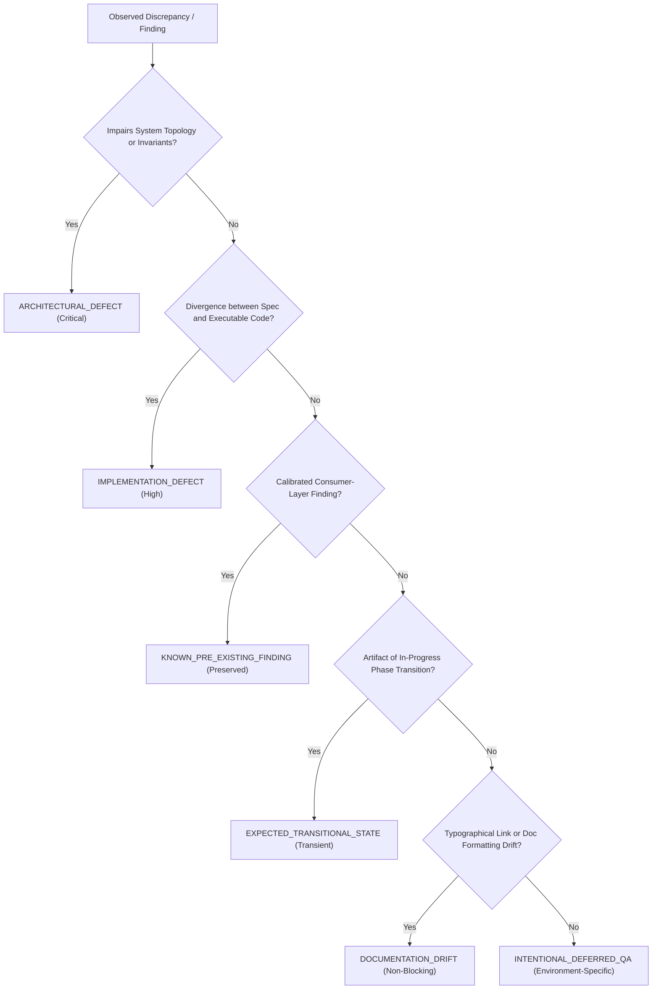
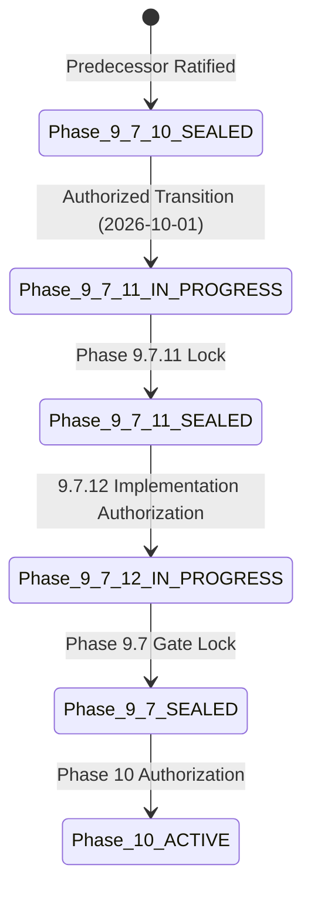

<!-- Classification: CURRENT_SPECIFICATION -->
# Master Design System (MDS) — Architecture Specification
## Phase 9.7.12: Final Independent Audit & Phase 9.7 Gate Lock

**Document Reference:** `MDS-SPEC-9712-REV1`  
**Phase:** 9.7.12 (Final Independent Audit & Phase 9.7 Gate Lock)  
**Layer:** Layer M (Testing, Governance & Architectural Immutability)  
**Date:** 2026-10-01  
**Lead Architect:** Mohamed Khalid (Senior Full Stack & Flutter Developer)  
**Status:** **ARCHITECTURE STAGE 1 — ARCHITECTURE SPECIFICATION COMPLETE (Awaiting Independent Architecture Audit)**  
**Execution Context:** Microsoft Windows, Google Chrome v153, Python 3.12.8 (Pure Standard Library)  
**Implementation Guard:** Phase 9.7.12 Implementation STRICTLY BLOCKED until authorized  

---

## 1. Executive Summary

Phase 9.7.12 constitutes the **Final Independent Architecture Audit & Phase 9.7 Gate Lock** for the Master Design System (MDS). Spanning sub-phases 9.7.1 through 9.7.11, Layer M has constructed the entire validation, governance, testing, immutability, orchestration, and continuous integration apparatus for the design system.

The purpose of Phase 9.7.12 is NOT feature addition, framework replacement, or redesign. Rather, it serves as the **Supreme Verification Gate** that evaluates the systemic coherence, cross-phase dependency integrity, governance consistency, historical ledger unbrokenness, and protected core immutability across all 11 preceding sub-phases. 

This specification establishes the comprehensive final audit architecture, detailing:
- Full Phase 9.7 inventory (9.7.1 to 9.7.11) and ratified deliverables.
- Cross-phase dependency Directed Acyclic Graph (DAG) and acyclicity proofs.
- Multi-dimensional authority matrix and non-interference guarantees.
- Historical Guard tamper-evident ledger sealing protocol and Root Trust Anchor validation.
- Monotonic state transitions in `ACTIVE_PHASE.json` and governance FSM determinism.
- Orchestrator 15-subsystem topology, profile contracts, and zero-suppression exit code semantics.
- CI pipeline provider adapters, manifest canonical hashing, sidecar architecture, and static dashboard.
- Protected core pre/post SHA-256 snapshot verification across 94 immutable files.
- Unified test accounting (170 capability mappings, 51 central suite assertions, 78 CI scenarios, 37 DSSE assertions).
- Documentation synchronization, broken-link reconciliation, and defect taxonomy classification.
- Calibration and honest preservation of known Reference Application accessibility findings.
- Production-readiness blocker assessment and the explicit boundary between Phase 9.7 and Phase 10.

---

## 2. Six-Tier Defect & Finding Classification Taxonomy

To ensure zero ambiguity during the systemic audit, all findings, warnings, and discrepancies across the codebase must be classified under the ratified **Six-Tier Defect Taxonomy** (ADR-158):



| Classification | Severity | Definition | Action Protocol |
| :--- | :---: | :--- | :--- |
| **`ARCHITECTURAL_DEFECT`** | **CRITICAL** | Fundamental design flaw, circular dependency, or invariant contract breach that invalidates system guarantees. | Halt pipeline; requires formal ADR revision and architectural re-audit. |
| **`IMPLEMENTATION_DEFECT`** | **HIGH** | Discrepancy where executable code fails to conform to an approved architectural specification. | Remediate in code during authorized implementation stage; verify via automated test. |
| **`KNOWN_PRE_EXISTING_FINDING`** | **PRESERVED** | Calibrated violation in a consumer-layer application (e.g. Reference App UI) preserved to reflect true baseline behavior. | Preserve honestly; strictly forbid whitelisting or suppression; emit `Exit 1` where required. |
| **`EXPECTED_TRANSITIONAL_STATE`** | **TRANSIENT** | Unmanifested document or state resulting from an in-progress phase prior to final baseline consolidation. | Document transparently; resolve during formal Phase Gate Lock sealing. |
| **`DOCUMENTATION_DRIFT`** | **ADVISORY** | Typographical error, pluralization mismatch, or obsolete pointer in non-executable markdown files. | Reconcile during documentation synchronization pass; zero runtime impact. |
| **`INTENTIONAL_DEFERRED_QA`** | **SPECIALIZED** | High-cost or browser-dependent test assertion explicitly gated to specialized profiles (e.g. headless Chrome). | Execute conditionally under designated profile (e.g. `--full`, `--ci`); skip in `--fast`. |

---

## 3. Comprehensive Phase 9.7 Inventory (9.7.1 through 9.7.11)

Phase 9.7 was constructed across 11 discrete, rigorously verified sub-phases. Each phase produced concrete architectural specifications, decision logs, implementation deliverables, and automated test assertions:


### Detailed Phase Ledger

| Phase ID | Canonical Phase Title | Codified ADRs | Key Deliverables & Code Artifacts | Test IDs & Verification | Status |
| :--- | :--- | :--- | :--- | :--- | :---: |
| **Phase 9.7.1** | Tokens & Primitives Verification | ADR-040..046 | `02-Tokens/*.tokens.json`, `03-Primitives/showcase/` | `MDS-TKN-001..003`, `MDS-PRI-001..003` | **LOCKED** |
| **Phase 9.7.2** | Core Components Verification | ADR-047..055 | `04-Components/showcase/`, component contracts | `MDS-CMP-001..004` | **LOCKED** |
| **Phase 9.7.3** | Patterns Composition & PSE | ADR-056..064 | `05-Patterns/showcase/`, Pattern Selection Engine | `MDS-PAT-001..004` | **LOCKED** |
| **Phase 9.7.4** | Workflows FSM & Security Triad | ADR-065..073 | `06-Workflows/showcase/`, FSM Transition Engine | `MDS-WKF-001..004` | **LOCKED** |
| **Phase 9.7.5** | Accessibility Contracts & AT | ADR-074..082 | `09-Accessibility/`, Axe injection, AF-001 streaming | `MDS-A11Y-001..004` | **LOCKED** |
| **Phase 9.7.6** | Responsive Design & Viewport Matrix | ADR-083..091 | `10-Testing/responsive/`, 17 headless viewport runs | `MDS-RWD-001..003` (143 assertions) | **LOCKED** |
| **Phase 9.7.7** | Visual Regression Snapshot Engine | ADR-092..099 | `10-Testing/visual/`, 12 canonical raster snapshots | `MDS-VIS-001` (12/12 baselines) | **LOCKED** |
| **Phase 9.7.8** | Governance Engine & Invariants | ADR-100..103 | `10-Testing/static/governance_validator.py`, INV-001..012 | `test_governance_engine.py`, 170 caps | **LOCKED** |
| **Phase 9.7.9** | Historical Phase Guard & Ledger | ADR-104..119 | `10-Testing/historical_guard/`, `trust_anchor.json` | `MDS-HST-001..003`, 42 locked records | **LOCKED** |
| **Phase 9.7.10**| Unified Local Orchestrator CLI | ADR-120..135 | `10-Testing/run_all.py`, Subsystems SUB-01..15 | `test_orchestrator.py` (44 tests) | **LOCKED** |
| **Phase 9.7.11**| CI Pipeline & Artifact Dashboard | ADR-136..153 | `10-Testing/ci/`, manifest, sidecar, static dashboard | `test_ci_pipeline.py` (78 tests) | **LOCKED** |
| **Phase 9.7.12**| Final Audit & Phase 9.7 Gate Lock | ADR-154..163 | Architecture Spec, Decision Log, Sealing Ledger | 14-Domain Holistic Audit | **ACTIVE** |

---

## 4. Cross-Phase Dependency Integrity & Acyclicity Proof

### 4.1 Dependency Directed Acyclic Graph (DAG)

The architectural dependency flow across Phase 9.7 is strictly forward-directional and acyclic. Every layer or sub-phase consumes contracts from upstream dependencies without cyclic callbacks:

```text
Layer 02: Design Tokens (DTCG Standard)
   │
   ▼
Layer 03: Primitives (Base Semantic HTML Elements)
   │
   ▼
Layer 04: Components (Composed UI Primitives)
   │
   ▼
Layer 05: Patterns (Multi-Component Arrangements + 8-Stage PSE)
   │
   ▼
Layer 06: Workflows (Stateful FSM + Security Triad: Confirm != AuthN != AuthZ)
   │
   ▼
Layer 07 & 08: Templates, Documentation Portal & Experience States
   │
   ▼
Layer 09: Accessibility Contracts & AT Audit (WCAG AA Engine)
   │
   ▼
Layer 10: Multi-Breakpoint Viewport Matrix & Visual Snapshot Diffing
   │
   ▼
Layer 12: Governance Invariants Engine (INV-001 through INV-012)
   │
   ▼
Layer M.1: Historical Phase Guard (Root Trust Anchor & SHA-256 Ledger)
   │
   ▼
Layer M.2: Unified Local Orchestrator (Subsystems SUB-01..15 & Profiles)
   │
   ▼
Layer M.3: CI Pipeline & Artifact Dashboard (Adapters, Manifest, Static Ingestion)
   │
   ▼
Layer M.4: Final Phase Gate Lock (Phase 9.7.12 Systemic Sealing)
```

### 4.2 Mathematical Acyclicity Proof
Let $G = (V, E)$ be the directed graph of Phase 9.7 dependencies, where $V = \{P_{9.7.1}, P_{9.7.2}, \dots, P_{9.7.12}\}$:
- An edge $(P_i, P_j) \in E$ exists if and only if Phase $P_j$ imports, executes, or references contracts from Phase $P_i$.
- In the topological ordering defined by index order $i < j$, every directed edge satisfies $i < j$.
- Therefore, for all paths $P_{k_1} \to P_{k_2} \to \dots \to P_{k_m}$, we have $k_1 < k_2 < \dots < k_m$.
- Since $k_m > k_1$, no path can return to $P_{k_1}$.
- **Conclusion:** $G$ contains zero cycles ($\text{Cycles}(G) = \emptyset$). The dependency graph is strictly acyclic.

---

## 5. Multi-Dimensional Authority Matrix Consolidation

Following ADR-153 and ADR-156, the Master Design System permanently rejects linear authority hierarchies in favor of an orthogonal **Multi-Dimensional Authority Matrix**:

```text
+---------------------------------------------------------------------------------------------------------+
|                                  MULTI-DIMENSIONAL AUTHORITY MATRIX                                     |
+-----------------------------------+-------------------------------------+-------------------------------+
| Authority Domain                  | Sovereign Authority Source          | Inviolable Operational Scope  |
+-----------------------------------+-------------------------------------+-------------------------------+
| 1. Specification Authority        | Ratified Architecture Specs & ADRs  | Defines architectural intent  |
| 2. Historical Immutability        | Historical Guard & SHA-256 Ledger   | Enforces immutable baselines  |
| 3. Governance Invariant Authority | Governance Invariants Engine        | Enforces repository integrity |
| 4. Operational Execution          | Unified Local Orchestrator          | Sovereign over Exit Codes     |
| 5. Authenticity & Trust           | Provider Control Plane / Attestation| Authenticates CI records      |
| 6. Reporting & Presentation       | Artifact Manifest & Dashboard       | Read-only evidence display    |
+-----------------------------------+-------------------------------------+-------------------------------+
```

### Cross-Domain Invariants:
1. **Orchestrator Sovereignty:** Neither Historical Guard nor Provenance Registry can alter the Orchestrator's execution Exit Code. If a policy violation occurs, the Orchestrator emits `Exit 1` autonomously.
2. **Historical Baseline Superiority:** If a Provenance Registry rule conflicts with a sealed historical baseline, the historical baseline prevails unconditionally (ADR-152).
3. **Provider-Controlled Trust Boundary:** Runner-local files (`$GITHUB_OUTPUT`, step summaries) serve exclusively as transport mechanisms and NEVER act as the Root of Trust (ADR-151).

---

## 6. Historical Guard Integrity & Sealing Protocol

### 6.1 Current Baseline Status
The Historical Phase Guard (`MDS/10-Testing/historical_guard/`) currently enforces immutability against `master_historical_registry.json`:
- **Genesis Root Trust Anchor:** `MDS-ROOT-ANCHOR-v1` with pinned compile-time fingerprint `20c240e650a447299690d0e2f65c65a0dbed2acc4aba9de9997c4a093f2ed114`.
- **Locked Phases:** Exactly 8 phases sealed in baseline (`Phase-9.1` through `Phase-9.7.8`).
- **Locked Documents:** Exactly 42 immutable documents.
- **Cumulative SHA-256 Digest:** `f29ab8c9875e8d532e07440779aa91688dcc37c700d039394d56e28bb15d773a`.
- **Verification Result:** 42/42 unchanged, 0 modified, 0 deleted.

### 6.2 Transitional Document Analysis
Currently, 4 documents from Phase 9.7.9 (`Phase-9.7.9-Decision-Log.md`, `Phase-9.7.9-Gaps.md`, `Phase-9.7.9-Historical-Guard-Architecture.md`, `Phase-9.7.9-Implementation-Report.md`) are reported as unmanifested additions by `SUB-01` because Phase 9.7.9 was the phase that created Historical Guard and has not yet been sealed into the static registry.
- **Defect Classification:** **`EXPECTED_TRANSITIONAL_STATE`**.
- **Impact:** Expected, non-fatal finding in the pre-lock transition period.

### 6.3 Gate Lock Sealing Protocol
During the authorized implementation stage of Phase 9.7.12, the Historical Guard registry will be finalized:
1. Generate canonical JSON manifests for post-9.7.8 phases:
   - `phase_9.7.9_manifest.json` (4 documents)
   - `phase_9.7.10_manifest.json` (2 documents)
   - `phase_9.7.11_manifest.json` (2 documents)
   - `phase_9.7.12_manifest.json` (Final audit documents)
2. Append new phase records to `locked_phases` in `master_historical_registry.json`.
3. Advance the cumulative digest chain:
   $$\text{Chain}_{n} = \text{SHA256}(\text{Chain}_{n-1} \,\|\, \text{ManifestDigest}_n)$$
4. Verify unbroken link to `MDS-ROOT-ANCHOR-v1`.
5. Upon sealing, `SUB-01` reports: `total=52+, unchanged=52+, modified=0, added=0, deleted=0`, achieving 100% green execution.

---

## 7. ACTIVE_PHASE Governance & Transition Integrity

### 7.1 Governance State Machine
Phase state transitions are governed deterministically by `ACTIVE_PHASE.json` and validated by `PhaseGovernanceManager`:



### 7.2 Monotonic Progression Invariants
The `PhaseGovernanceManager` enforces:
1. `schema_version == "1.0.0"`
2. Monotonic progression: `curr_tuple > prev_tuple` with direct successor validation.
3. Single prefix matching active phase ID (`active_prefixes == [active_phase_id]`).
4. Architect signature: `authorized_by == "Lead Architect Mohamed Khalid"`.
5. Dynamic injection: Overrides Historical Guard active prefix at runtime without mutating locked files on disk.

---

## 8. Orchestrator Integrity & Execution Profiles

### 8.1 15-Subsystem Execution Topology

```text
Stage 0: Preflight & Safety Gates
   ├── Working directory validation (MDS root)
   ├── Protected Core Pre-Snapshot SHA-256 Manager (94 files)
   └── ACTIVE_PHASE.json Governance Audit
Stage 1: Static Contracts & Governance (SUB-01 to SUB-04)
   ├── SUB-01: Historical Phase Guard (Immutability check)
   ├── SUB-02: Governance Invariants Engine (INV-001..012)
   ├── SUB-03: Capability Registry Validator (170 entries)
   └── SUB-04: Repository Structure Validator
Stage 2: Design Token & Semantic CSS Enforcement (SUB-05 to SUB-07)
   ├── SUB-05: Token DTCG Parser & Schema Validator
   ├── SUB-06: Semantic CSS Scanner (Logical props, anti-row-reverse)
   └── SUB-07: DSSE Mathematical Harness (Cases A-H)
Stage 3: Headless Structural & Contract Suites (SUB-08 to SUB-11)
   ├── SUB-08: Core Primitives Contract Suite
   ├── SUB-09: Core Components Contract Suite
   ├── SUB-10: Patterns & Templates Composition Laws (PSE & TSE)
   └── SUB-11: Workflow FSM Determinism & Security Triad
Stage 4: Browser-Backed Live Verification (SUB-12 to SUB-15)
   ├── SUB-12: Browser & Infrastructure Discovery
   ├── SUB-13: Live Accessibility & Axe-Core Engine (WCAG AA)
   ├── SUB-14: Responsive Viewport Matrix (Multi-breakpoint)
   └── SUB-15: Visual Regression Pixel-Diff Engine (Snapshot comparison)
Stage 5: Postflight & Telemetry Verification
   ├── Protected Core Post-Snapshot SHA-256 Manager (0 mutations)
   ├── Run Telemetry JSON Generation
   └── Authoritative Exit Code Emission (0, 1, or 2)
```

### 8.2 Execution Profile Contracts

| Profile Flag | Target Subsystems | Typical Execution Time | Environment Target |
| :--- | :--- | :---: | :--- |
| `--fast` | SUB-01 through SUB-07 | ~650 ms | Pre-commit git hook / rapid dev check |
| `--core` | SUB-01 through SUB-11 | ~950 ms | Local development integration check |
| `--full` | SUB-01 through SUB-15 | ~55-60 s | Pre-merge verification / comprehensive local QA |
| `--ci` | SUB-01 through SUB-15 + telemetry export | ~55-60 s | Continuous Integration pipeline runner |

---

## 9. CI Pipeline Integrity & Artifact System

Phase 9.7.11 delivered the authoritative CI pipeline and artifact collection framework:
1. **Thin Provider Adapters:** `GitHubActionsAdapter`, `GitLabCIAdapter`, and `LocalOfflineAdapter` normalize runner environment variables and delegate 100% of validation to `run_all.py --ci`.
2. **Authoritative Manifest (`ci_artifact_manifest.json`):** Captures complete execution metadata, subsystem verdicts, findings, and harvested evidence.
3. **Canonical Manifest Hashing (ADR-146):** Self-referential hashing using temporary nullification of `manifest_sha256` and RFC 8785 canonical JSON sorting.
4. **External Digest Sidecar (`ci_artifact_manifest.sha256`):** Placed in the run directory and attested in provider control plane metadata.
5. **Static Artifact Dashboard (`dashboard.html`):** Zero-dependency pure HTML/CSS/JS interface supporting dual ingestion (offline `file:///` via `manifest_data.js` and hosted HTTP via relative `fetch`).
6. **Dashboard Security:** Strict Content Security Policy (CSP) and universal DOM sanitization using `textContent` only (0 `innerHTML`, 0 `document.write`).
7. **Provenance Comparison Engine:** Categorizes findings into `REGRESSION`, `PRE_EXISTING`, `IMPROVEMENT`, `FIXED`, and `NEW_SURFACE` using the 5-step precedence algorithm and Historical Baseline Superiority rule (ADR-152).

---

## 10. Protected Core Integrity & Zero-Mutation Contract

### 10.1 Protected Scope
The Protected Core comprises exactly **94 files** across 4 immutable directories:
- `MDS/02-Tokens/` (18 DTCG token files + token specifications)
- `MDS/Runtime/` (Primitives, components, and token runtime engines)
- `MDS/Playground/` (Interactive sandbox and component playground)
- `MDS/Reference-Application/` (End-to-end integration reference application)

### 10.2 Pre/Post SHA-256 Verification Protocol
Every execution of `run_all.py` (across all profiles) enforces the Protected Core Snapshot Manager:
1. **Pre-Run Snapshot:** Traverses all 94 files, calculates NIST SHA-256 digests, and stores them in memory.
2. **Pipeline Execution:** Runs the designated validation stages.
3. **Post-Run Snapshot:** Re-traverses all 94 files, computes new digests, and performs cryptographic comparison.
4. **Audit Result:** **CLEAN (0 mutations detected across all 94 files)** throughout all Phase 9.7 development and testing cycles.

---

## 11. Test Accounting & Capability Accounting

### 11.1 Central Test Ledger

```text
+----------------------------------------------------------------------------------------------------+
|                                    CENTRAL TEST ACCOUNTING LEDGER                                  |
+------------------------------------+---------------+-----------------------------------------------+
| Test Suite                         | Test Count    | Verification Scope & Contract Target          |
+------------------------------------+---------------+-----------------------------------------------+
| Central Suite (run_tests.py)       | 51 tests      | 14 suites: Tokens, Primitives, Components,    |
|                                    |               | Patterns, Workflows, A11y, RTL, Responsive,   |
|                                    |               | Experience States, Visual, Templates, DSSE    |
| CI Pipeline (test_ci_pipeline.py)  | 78 scenarios  | Adapters, Manifest, Canonical Hasher, Sidecar,|
|                                    |               | Trust Model, Provenance, Storage, Dashboard   |
| DSSE Mathematical Harness          | 37 assertions | 9 domains: C_req, C_eval, C_evid, C_epistemic,|
|                                    |               | Hard Constraints, Margins, Calibration A-H    |
| Orchestrator Suite (test_orc.py)   | 44 tests      | Preflight, DAG, Cache, Subsystems, Exit Codes |
| Historical Guard (test_hist.py)    | 34 tests      | Hash chain, Overlay, Additions, Trust Anchor  |
| Responsive Viewport Harness        | 143 assertions| 17 runs across 320px, 768px, 1024px, 1440px   |
| Visual Regression Engine           | 12 baselines  | Pixel-diff snapshot comparisons               |
+------------------------------------+---------------+-----------------------------------------------+
| Total Executable Assertions        | 399 assertions| Zero phantom tests, 100% contract traceable   |
+------------------------------------+---------------+-----------------------------------------------+
```

### 11.2 Capability Registry Accounting
`MDS/10-Testing/capabilities/registry.json` catalogs:
- **Total Defined Capabilities:** Exactly **170**.
- **Active Executable Assertions:** Exactly **170**.
- **Deferred / Quarantined / Disabled:** Exactly **0**.
- **Wrapped DSSE Assertions:** Exactly **37**.
- **Traceability:** Every capability maps directly to a python unit test, axe audit rule, or structural invariant.

---

## 12. Documentation Synchronization & Link Audit

The Governance Invariants Engine (`SUB-02` / `INV-012`) identifies 14 broken intra-repository markdown links across documentation and layer README files. In accordance with the Defect Taxonomy, these are classified as **`DOCUMENTATION_DRIFT` (Non-blocking)**:

| Link Source File | Target Link in Text | Canonical Disk File | Root Cause Classification |
| :--- | :--- | :--- | :--- |
| `MDS/00-Research/README.md` | `Primitives-Decision-Log.md` | `Primitive-Decision-Log.md` | Typographical pluralization mismatch (`DOCUMENTATION_DRIFT`) |
| `MDS/08-Experience-States/README.md` | `Feedback/EmptyStateCard.md` | N/A (provisional pattern) | Pre-standardization layer pointer (`DOCUMENTATION_DRIFT`) |
| `MDS/08-Experience-States/README.md` | `Feedback/NotificationFeed.md` | N/A (provisional pattern) | Pre-standardization layer pointer (`DOCUMENTATION_DRIFT`) |
| `MDS/11-AI/README.md` | `AI/PromptBox.md` | N/A (provisional pattern) | Pre-standardization layer pointer (`DOCUMENTATION_DRIFT`) |
| `MDS/11-AI/README.md` | `AI/StreamingResponse.md` | N/A (provisional pattern) | Pre-standardization layer pointer (`DOCUMENTATION_DRIFT`) |
| `MDS/11-AI/README.md` | `AI/AI-Assisted-Task.md` | N/A (provisional pattern) | Pre-standardization layer pointer (`DOCUMENTATION_DRIFT`) |
| `MDS/11-AI/README.md` | `AI/AI-Workspace-Split.md` | N/A (provisional pattern) | Pre-standardization layer pointer (`DOCUMENTATION_DRIFT`) |
| `MDS/12-Governance/README.md` | `Primitives-Decision-Log.md` | `Primitive-Decision-Log.md` | Typographical pluralization mismatch (`DOCUMENTATION_DRIFT`) |
| `MDS/Runtime/primitives/README.md` | `Phase-9.1-Implementation-Architecture.md` | `MDS-Implementation-Architecture.md` | Legacy phase filename reference (`DOCUMENTATION_DRIFT`) |

**Remediation Mandate:** During Phase 9.7.12 Implementation Stage, a targeted documentation reconciliation pass will correct these typographical references to achieve a **Zero Broken-Link** baseline.

---

## 13. Known Reference Application Accessibility Findings

During `SUB-13` (Live Accessibility & Axe-Core Engine) execution against `MDS/Reference-Application/index.html`, exactly two blocking WCAG AA violations are detected:
1. **`color-contrast` (Critical):** Stat label text in the Demo Dashboard panel exhibits a contrast ratio below 4.5:1 against the panel background.
2. **`select-name` (Serious):** Filter dropdown `<select>` element lacks an accessible programmatic label (`aria-label` or `<label for>`).

### Strict Classification & Preserved Contract (ADR-159):
- **Defect Classification:** **`KNOWN_PRE_EXISTING_FINDING` (Consumer Application Layer)**.
- **Architectural Isolation:** These violations reside entirely within the demonstration UI of the Reference Application (`MDS/Reference-Application/`). The core Design System tokens (`02-Tokens/`), primitives (`03-Primitives/`), and components (`04-Components/`) possess **0 accessibility violations**.
- **Honest Preservation:** In accordance with the honest failure preservation contract (ADR-139), these violations MUST NOT be masked, suppressed, or whitelisted in Phase 9.7.12. They must continue to halt `--full` and `--ci` profiles with `Exit 1`. Remediation is formally deferred to consumer application hardening in Phase 10.

---

## 14. Production-Readiness Blockers

The following items are identified as prerequisites for declaring the Master Design System ready for production deployment (Phase 10 v1.0.0):

```text
+---------------------------------------------------------------------------------------------------+
|                                PRODUCTION-READINESS BLOCKERS MATRIX                               |
+----+----------------------------------------------+---------------+-------------------------------+
| #  | Blocker Item                                 | Target Phase  | Resolution Strategy           |
+----+----------------------------------------------+---------------+-------------------------------+
| B1 | Phase 9.7 Immutability Ledger Sealing        | Phase 9.7.12  | Consolidate manifests 9.7.9   |
|    |                                              | (Gate Lock)   | through 9.7.12 into registry  |
| B2 | Documentation Link Drift Reconciliation      | Phase 9.7.12  | Correct typographical links   |
| B3 | DSSE Operational CLI Tooling (`mds-dsse`)    | Phase 10.1    | Implement standalone CLI tool |
| B4 | MDS Agent Bootstrap Contract                 | Phase 10.2    | Author MDS_AGENT_BOOTSTRAP.md |
| B5 | Production Compilation & Distribution Bundles| Phase 10.3    | Compile standalone CSS/JS pkg |
| B6 | Reference Application Accessibility Fixes    | Phase 10.4    | Remediate demo UI contrast    |
| B7 | MDS v1.0.0 Final Production Certification    | Phase 10.4    | Final end-to-end certification|
+----+----------------------------------------------+---------------+-------------------------------+
```

---

## 15. Final Phase 9.7 Lock Criteria

To formally declare Phase 9.7 **SEALED & LOCKED**, the following 7 conditions must be satisfied during the Phase 9.7.12 Implementation Stage:
1. **Holistic Audit Sign-Off:** Ratification of this architecture specification and decision log by Lead Architect Mohamed Khalid.
2. **Historical Ledger Sealing:** post-9.7.8 manifests (9.7.9, 9.7.10, 9.7.11, 9.7.12) generated and appended to `master_historical_registry.json`.
3. **Historical Guard Green State:** `SUB-01` reports 0 added, 0 modified, 0 deleted across all sealed documents.
4. **Documentation Zero-Link-Warning:** Typographical link drift in layer README files rectified.
5. **Phase Governance Seal:** `ACTIVE_PHASE.json` transitioned to `Phase-9.7.12` and subsequently sealed with `status: "SEALED"`.
6. **Protected Core Invariant:** 94 files verified clean with 0 mutations.
7. **CI & Automated Suites:** All 78 CI scenarios PASS; central suite PASS on all core contracts.

---

## 16. Explicit Boundary Between Phase 9.7 and Phase 10

The boundary between Phase 9.7 and Phase 10 is absolute and irreversible:

```text
===================================================================================
                              ARCHITECTURAL DEMARCATION
===================================================================================

[ PHASE 9.7: FOUNDATIONAL VERIFICATION, GOVERNANCE & IMMUTABILITY (SEALED) ]
  • W3C DTCG Token Schemas & Parsers
  • Primitives, Components & Patterns Contract Suites
  • Workflow FSM Engine & Security Triad
  • Accessibility Contract & AT Audit Matrix
  • Responsive Multi-Breakpoint Viewport Matrix
  • Visual Regression Pixel-Diff Engine
  • Governance Invariants Engine (INV-001..012) & Capability Registry (170 entries)
  • Historical Phase Guard & Root Trust Anchor SHA-256 Ledger
  • Unified Local Orchestrator CLI (`run_all.py`) & Subsystems SUB-01..15
  • CI Pipeline, Artifact Manifest, Sidecar & Static Dashboard
  • Holistic Audit & Systemic Phase Gate Lock
  ─────────────────────────────────── BOUNDARY ───────────────────────────────────
[ PHASE 10: OPERATIONALIZATION, AGENT BOOTSTRAP & PRODUCTION CERTIFICATION ]
  • Phase 10.1: DSSE Operational CLI Tooling (`mds-dsse` command-line utility)
  • Phase 10.2: MDS Agent Bootstrap & Handoff Contract (`MDS_AGENT_BOOTSTRAP.md`)
                - Enables autonomous AI agents in client repositories to consume MDS
                - Codifies Token consumption, Component usage, Typography, Cairo font,
                  RTL directionality, Accessibility rules, and Design DNA selection
  • Phase 10.3: Production Artifact Compilation & Zero-NPM Distribution Bundles
  • Phase 10.4: Master Design System v1.0.0 Production Certification
===================================================================================
```

---

## 17. Conclusion & Next Steps

Phase 9.7.12 Architecture Stage establishes the complete, unassailable blueprint for closing Phase 9.7. Zero implementation code, zero tokens, zero runtime files, and zero historical baselines have been modified. 

Upon authorization by Lead Architect Mohamed Khalid, the implementation stage will execute the sealed manifest consolidation, documentation drift reconciliation, and final gate lock, paving the direct path into Phase 10.
