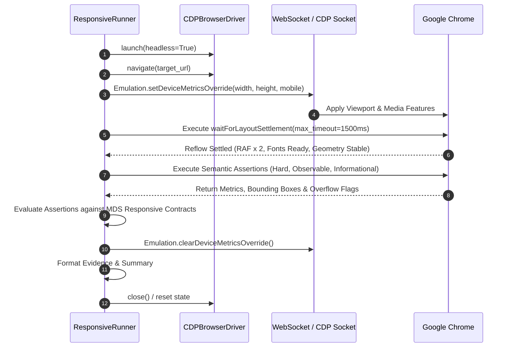

# Master Design System (MDS) — Responsive Viewport Automation Architecture
## Phase 9.7.6: Dynamic Responsive Recomposition Engine (Layer I)

**Document Type:** Architectural Blueprint & Technical Specification (Remediated)  
**Status:** ARCHITECTURE COMPLETE — PENDING IMPLEMENTATION AUTHORIZATION  
**Phase:** 9.7.6 (Responsive Viewport Automation — Layer I)  
**Date:** 2026-09-24  
**Lead Architect:** Mohamed Khalid (Senior Full Stack & Flutter Developer)  
**Target Promoted Capability:** `MDS-RWD-003` (Currently `DEFERRED` — Preserved during Architecture Phase)  
**Downstream Guard:** Phase 9.7.7 (Visual Regression Engine) STRICTLY BLOCKED  

---

## 1. Architectural Mission & Objectives

The primary objective of Phase 9.7.6 is to design the engine that promotes capability **`MDS-RWD-003`** from `DEFERRED` to an active, real-browser automation capability.

### Inviolable Core Philosophy:
> **"Responsive Design in MDS is Recomposition, Not Shrinking."**  
> *(Codified in `.agents/rules/03_responsive_and_devices.md` and `MDS/01-Foundations/03-Spacing-and-Grid.md`)*

Responsive validation inside MDS must **NEVER** degenerate into trivial assertions such as `window.innerWidth === expectedWidth` or mere verification that a CSS `@media` rule matches. Instead, the engine executes against live rendered DOM nodes in a real Chromium browser, empirically asserting observable structural adaptations:
- Primary navigation transitioning from a persistent desktop sidebar $\to$ collapsed icon rail $\to$ mobile drawer trigger.
- Multi-column grids recomposing into single-column flows to protect readability and touch ergonomics.
- Interactive controls satisfying mandatory minimum $44\times 44$px touch targets on touch/mobile viewports.
- Total absence of horizontal overflow / viewport blowout across all screens.

### Scope & Representative Coverage Rationale (RWD-001):
The proposed 17-run responsive browser automation matrix provides **representative coverage across major responsive-sensitive template families**:
1. **Dashboard Overview Family (`TMP-001`):** High-density KPI stat grids, complex page headers, global search-filter bars, and top-level navigation layout transitions.
2. **List Management Family (`TMP-002`):** Multi-column data tables, action button clusters, tabular overflow containers, and pagination controls.
3. **Form Edit Family (`TMP-004`):** Two-column form grids, stepper tab compositions, and destructive action / danger zones.

The remaining canonical templates (*Detail Entity `TMP-003`*, *Settings Workspace `TMP-005`*, *AI Workspace `TMP-006`*) and all 11 Reference Application screens remain 100% verified by the broader non-visual and reference validation layers (`test_reference_app.py`, Layer M governance, and Master Test Harness). The responsive browser matrix is intentionally targeted to eliminate combinatorial explosion while proving all critical responsive composition laws.

---

## 2. Canonical Viewport Matrix & Emulation Model

The MDS responsive architecture explicitly defines four canonical viewport tiers. No additional canonical breakpoints may be invented:

| Viewport Tier | Width | Height | Device Scale | Emulation Mode | Target Form Factor | Primary Layout Characteristics |
| :--- | :---: | :---: | :---: | :---: | :--- | :--- |
| **Mobile (`sm`)** | `320px` | `640px` | `2.0` | `mobile: true` | Small Smartphone (iPhone SE / compact Android) | Single-column flow, bottom sheets/drawer, 44px hit-box, 16px page margin |
| **Tablet (`md`)** | `768px` | `1024px` | `2.0` | `mobile: true` | Portrait iPad / Medium Tablet | Dedicated icon rail sidebar (72px), 8-col grid, 24px page margin |
| **Desktop (`lg`)**| `1024px`| `768px` | `1.0` | `mobile: false`| Standard Laptop / Monitor | Persistent 260px sidebar, 12-col grid, 1152px container max-width |
| **Wide (`xl`)**   | `1440px`| `900px` | `1.0` | `mobile: false`| High-Resolution Desktop | Persistent 260px sidebar, 12-col grid, 1440px container max-width |

### 2.1 Decoupling CSS Viewport, Browser Window, and Device Emulation (RWD-004)

To prevent confusion between browser environment settings and design system contracts, the architecture establishes strict semantic boundaries:

1. **CSS Viewport (`width` × `height` in CSS Pixels):**
   - **Status:** **Primary MDS Design Contract**.
   - **Role:** The exact dimensional canvas against which CSS `@media (max-width: ...)` queries evaluate, CSS Grid columns track, and layout flow recalculates.
   - **Verification:** Asserted via `document.documentElement.clientWidth` and `window.innerWidth`.

2. **Browser Window Dimensions:**
   - **Status:** **Host Process Container**.
   - **Role:** The physical OS-level Chromium window launched via `--window-size=1440,900`. In headless mode, this serves as an outer host bounding frame. It does **not** define responsive design contracts.

3. **CDP Emulation Device Metrics (`Emulation.setDeviceMetricsOverride`):**
   - **Status:** **Automation Control Mechanism**.
   - **Role:** The native Chrome DevTools Protocol command used to deterministically override the CSS viewport dimensions without resizing physical OS windows.

4. **`deviceScaleFactor`:**
   - **Status:** **Test-Environment Simulation Parameter**.
   - **Role:** Configured to `2.0` on Mobile and Tablet to simulate high-DPI (Retina) pixel density, and `1.0` on Desktop/Wide.
   - **Clarification:** `deviceScaleFactor` is **not an MDS design token**. It is used purely to verify that subpixel font anti-aliasing and border rounding do not trigger premature overflow.

5. **Mobile Emulation Mode (`mobile: true` vs `mobile: false`):**
   - **Status:** **Input & UA Characteristic Simulation**.
   - **Role:** 
     - At `320px` (Mobile): `mobile: true` activates mobile touch events and coarse pointer media features (`(pointer: coarse)`), testing single-column touch ergonomics.
     - At `768px` (Tablet): `mobile: true` is configured because tablets (e.g. iPads) are touch-first devices where touch-target preservation must be active. However, the **CSS layout contract remains distinct** (dedicated 72px icon rail and 8-column layout, never a stretched mobile layout).
     - At `1024px` and `1440px` (Desktop/Wide): `mobile: false` represents fine-pointer mouse interactions with hover states enabled.
   - **Inviolable Principle:** Responsive assertions evaluate CSS viewport dimensions and rendered DOM structures, **never** the emulation flags themselves.

---

## 3. The 12 MDS Responsive Dimensions

The architecture evaluates layouts across 12 distinct dimensions, classifying each by verification feasibility:

| Dimension | Description | Automation Mode | Verification Strategy |
| :--- | :--- | :---: | :--- |
| **A. Viewport Geometry** | Exact viewport dimension override | **Automated** | Read `window.innerWidth`, `document.documentElement.clientWidth`, `devicePixelRatio` |
| **B. Container Constraints** | Containment to 1152px or 1440px | **Automated** | Assert `mainContainer.getBoundingClientRect().width <= maxAllowed` |
| **C. Layout Recomposition** | Multi-column to single-column stacking | **Semantic** | Compare relative `top`/`left` offsets of sibling items; assert `gridTemplateColumns` |
| **D. Navigation Transformation**| Sidebar $\to$ Icon Rail $\to$ Drawer Button | **Semantic** | Assert `computedStyle.display`, `inlineSize`, and `#btn-mobile-nav` visibility |
| **E. Horizontal Overflow Guard** | Zero horizontal scrollbar / blowout | **Automated** | Assert `document.documentElement.scrollWidth <= clientWidth + 1.0` |
| **F. Visibility Adaptation** | Secondary headings/labels hiding | **Semantic** | Assert `computedStyle.display === 'none'` on non-critical text at compact viewports |
| **G. Interaction Mode** | Coarse pointer / Touch target emulation | **Automated** | Assert media features `(pointer: coarse)` and `(hover: none)` on mobile viewports |
| **H. Touch Target Hit-Box** | Minimum 44×44px interactive hit-box | **Automated** | Enumerate interactive elements; assert `rect.width >= 44 && rect.height >= 44` |
| **I. Typography Stability** | No truncation ellipsis on descriptive text | **Automated** | Assert `computedStyle.textOverflow !== 'ellipsis'` on headings, cards, descriptions |
| **J. Dialog & Overlay Adaptation** | Centered modal $\to$ Full-screen / drawer | **Semantic** | Trigger dialog; assert viewport coverage and position matching mobile drawer |
| **K. Data Table Adaptation** | Table container horizontal scrolling | **Semantic** | Assert table container has `overflowX === 'auto'` and does not blow out parent container |
| **L. RTL Bidirectional Symmetry** | Start-aligned layout in RTL mode | **Semantic** | Assert sidebar anchors to inline-start (right in RTL), drawer slides from start |

---

## 4. Package Structure & Module Architecture

The responsive automation engine will reside strictly inside the testing layer at `MDS/10-Testing/responsive/`:

```text
MDS/10-Testing/responsive/
├── __init__.py                    # Public API exports
├── viewport_matrix.py             # Canonical Viewport definitions & matrix configurations
├── responsive_models.py           # Strongly-typed dataclasses (Assertion, Result, Evidence)
├── responsive_runner.py           # Core CDP automation engine & layout observer
├── responsive_assertions.py       # Semantic assertion rules (Nav, Grid, Form, Touch, Overflow)
├── responsive_dispatch.py         # Capability registry & Master Harness dispatcher bridge
├── evidence.py                    # Structured JSON evidence & human-readable report formatting
├── fixtures/                      # Deterministic responsive fixtures for unit testing
│   ├── responsive_baseline.html   # Correctly recomposing baseline fixture
│   └── broken_responsive.html     # Deliberately broken fixture (horizontal blowout, shrinking)
└── README.md                      # Technical documentation & usage instructions
```

---

## 5. Domain Models & Tri-Class Assertion Model (RWD-003)

### 5.1 Formal Assertion Classification
To prevent false-green passes while avoiding false-failure flakiness, assertions are partitioned into three explicit tiers:

```python
from enum import Enum

class AssertionClass(str, Enum):
    HARD_CONTRACT = "HARD_CONTRACT"
    OBSERVABLE_BEHAVIOR = "OBSERVABLE_BEHAVIOR"
    INFORMATIONAL_MEASUREMENT = "INFORMATIONAL_MEASUREMENT"
```

1. **Class A: `HARD_CONTRACT`**
   - **Contract:** A non-negotiable rule explicitly codified in MDS foundational documentation, Agent Rules, or Reference Application architecture.
   - **Evaluation Impact:** Any failure immediately marks the assertion and the entire test run as **`FAIL`**.
   - **Examples:**
     - Container max-width constrained to `1152px` or `1440px` (`container.xl`); `1280px` strictly forbidden.
     - Mobile navigation trigger (`#btn-mobile-nav`) visible at `320px`; desktop sidebar (`.mds-ref-sidebar`) hidden.
     - Interactive controls satisfy minimum $44\times 44$px touch targets on mobile viewports.
     - Total absence of horizontal page overflow (`scrollWidth <= clientWidth + 1.0px`).

2. **Class B: `OBSERVABLE_BEHAVIOR`**
   - **Contract:** An objectively measurable layout transformation that adapts components across viewports according to responsive composition rules.
   - **Evaluation Impact:** Evaluated against concrete expected values; failure marks the assertion and run as **`FAIL`**.
   - **Examples:**
     - Stats grid column count: 3 or 4 at 1024/1440px $\to$ 2 at 768px $\to$ 1 at 320px (`grid-template-columns: 1fr`).
     - Form grid column count: 2 at 1024/1440px $\to$ 1 at 768/320px.
     - Tablet sidebar width: collapses to 72px icon rail with text labels hidden.
     - Table container: possesses `overflowX: auto` on narrow viewports without breaking parent container.

3. **Class C: `INFORMATIONAL_MEASUREMENT`**
   - **Contract:** Diagnostic telemetry collected for audit records and post-run analysis.
   - **Evaluation Impact:** **Never independently determines PASS/FAIL.**
   - **Examples:**
     - Exact bounding box coordinates (`x`, `y`, `width`, `height`).
     - Computed style values for debugging (`color`, `font-size`, `line-height`).
     - Measured container dimensions.
     - Screenshot binary references.
     - Execution duration (`duration_ms`).

### 5.2 Structured Assertion Data Model
```python
from dataclasses import dataclass, field
from typing import Optional, Any, Dict

@dataclass
class ResponsiveAssertion:
    run_id: str
    capability_id: str
    screen: str
    viewport_tier: str
    dimension: str
    assertion_class: AssertionClass
    selector: str
    assertion_name: str
    passed: bool
    expected: Any
    actual: Any
    diagnostics: Optional[str] = None
    evidence: Dict[str, Any] = field(default_factory=dict)
```

---

## 6. Browser Driver Interaction & Execution Lifecycle

The responsive engine reuses the Phase 9.7.4 standard-library `CDPBrowserDriver` without adding third-party frameworks:



---

## 7. Layout Reflow Stabilization & Settlement Algorithm (Hardened)

To eliminate false failures caused by asynchronous layout recalculation, the engine executes a deterministic settlement routine with an **explicit bounded timeout**:

```javascript
async function waitForLayoutSettlement(driver, maxTimeoutMs = 1500) {
  const startTime = Date.now();
  const script = `
    (async () => {
      // 1. Wait for 2 requestAnimationFrames to let CSS reflow execute
      await new Promise(resolve => requestAnimationFrame(() => requestAnimationFrame(resolve)));
      
      // 2. Wait for fonts if document.fonts is supported
      if (document.fonts && document.fonts.ready) {
        await document.fonts.ready;
      }

      // 3. Return geometric snapshot for variance checking
      return {
        width: document.documentElement.clientWidth,
        scrollWidth: document.documentElement.scrollWidth,
        bodyWidth: document.body.offsetWidth,
        settled: true
      };
    })()
  `;

  while (Date.now() - startTime < maxTimeoutMs) {
    try {
      const res = await driver.evaluate(script);
      if (res && res.settled && res.width > 0) {
        return { success: true, duration_ms: Date.now() - startTime, metrics: res };
      }
    } catch (e) {
      // Wait for DOM to stabilize
    }
    await sleep(50);
  }

  // Bounded timeout behavior: return deterministic failure diagnostic, never hang
  return {
    success: false,
    duration_ms: Date.now() - startTime,
    error: `Layout reflow settlement timed out after ${maxTimeoutMs}ms`
  };
}
```

---

## 8. State Isolation & Clean Session Lifecycles

To prevent state contamination across viewports:
1. **Dialog Reset:** Any open modal/dialog (such as `<mds-dialog id="dialog-mobile-nav">`) must be explicitly closed before resizing.
2. **Navigation Reset:** Viewport sweeps reset the single-page application hash route back to the base route (`#/overview`).
3. **Controls Reset:** Theme, direction, and simulation controls are reset to deterministic defaults (`theme=light`, `dir=rtl`, `density=comfortable`).
4. **Emulation Cleanup:** Each viewport step calls `Emulation.clearDeviceMetricsOverride` upon completion.
5. **Session Isolation:** Runs marked with `Fresh Session = Yes` launch a completely clean `BrowserSession` with an ephemeral temporary user profile.

---

## 9. Canonical 17-Run Execution Matrix (RWD-002)

The responsive test matrix consists of **exactly 17 deterministic, independent runs**. Every run defines an isolated execution step with explicit configuration, assertions, and evidence requirements:

### Tier 1: Canonical Recomposition Sweep (12 Independent Runs)
*Baseline Configuration: `Theme: Light`, `Density: Comfortable`, `Direction: RTL` (MDS Default First-Class Direction).*

| Run ID | Route | Screen | Width | Height | Theme | Density | Direction | Fresh Session | Expected Hard & Observable Contracts |
| :--- | :--- | :--- | :---: | :---: | :--- | :--- | :--- | :---: | :--- |
| **`RWD-RUN-001`** | `#/overview` | Overview | `320` | `640` | Light | Comfortable | RTL | **Yes** | `#btn-mobile-nav` visible; `.mds-ref-sidebar` hidden; `.mds-ref-stats-grid` cols=1; overflow $\le 321$px; touch $\ge 44$px |
| **`RWD-RUN-002`** | `#/overview` | Overview | `768` | `1024` | Light | Comfortable | RTL | No | `#btn-mobile-nav` hidden; `.mds-ref-sidebar` width=72px (rail); nav labels hidden; `.mds-ref-stats-grid` cols=2; overflow $\le 769$px |
| **`RWD-RUN-003`** | `#/overview` | Overview | `1024` | `768` | Light | Comfortable | RTL | No | `#btn-mobile-nav` hidden; `.mds-ref-sidebar` width=260px; nav labels visible; `.mds-ref-stats-grid` cols $\ge 3$; max-width $\le 1152$px |
| **`RWD-RUN-004`** | `#/overview` | Overview | `1440` | `900` | Light | Comfortable | RTL | No | `#btn-mobile-nav` hidden; `.mds-ref-sidebar` width=260px; max-width $\le 1440$px; overflow $\le 1441$px |
| **`RWD-RUN-005`** | `#/items` | Items List | `320` | `640` | Light | Comfortable | RTL | **Yes** | Filter bar stacked (`flex-direction: column`); table container has `overflowX: auto`; touch $\ge 44$px; overflow $\le 321$px |
| **`RWD-RUN-006`** | `#/items` | Items List | `768` | `1024` | Light | Comfortable | RTL | No | Table container responsive scroll active; action button cluster wrapped; overflow $\le 769$px |
| **`RWD-RUN-007`** | `#/items` | Items List | `1024` | `768` | Light | Comfortable | RTL | No | Full data table visible; pagination controls inline; max-width $\le 1152$px; overflow $\le 1025$px |
| **`RWD-RUN-008`** | `#/items` | Items List | `1440` | `900` | Light | Comfortable | RTL | No | High-throughput data layout active; max-width $\le 1440$px; overflow $\le 1441$px |
| **`RWD-RUN-009`** | `#/items/edit` | Item Edit | `320` | `640` | Light | Comfortable | RTL | **Yes** | `.mds-ref-form-grid-2` cols=1; danger zone stacked; action buttons 100% width; touch $\ge 44$px; overflow $\le 321$px |
| **`RWD-RUN-010`** | `#/items/edit` | Item Edit | `768` | `1024` | Light | Comfortable | RTL | No | `.mds-ref-form-grid-2` cols=1; stepper tabs scrollable; overflow $\le 769$px |
| **`RWD-RUN-011`** | `#/items/edit` | Item Edit | `1024` | `768` | Light | Comfortable | RTL | No | `.mds-ref-form-grid-2` cols=2; stepper tabs inline; max-width $\le 1152$px; overflow $\le 1025$px |
| **`RWD-RUN-012`** | `#/items/edit` | Item Edit | `1440` | `900` | Light | Comfortable | RTL | No | `.mds-ref-form-grid-2` cols=2; full side-by-side editing; max-width $\le 1440$px; overflow $\le 1441$px |

### Tier 2: Orthogonal Invariant Checks (5 Independent Runs)
*Targeted validation of bi-directional symmetry, density invariance, and high contrast.*

| Run ID | Route | Screen | Width | Height | Theme | Density | Direction | Fresh Session | Invariant Proved & Assertions |
| :--- | :--- | :--- | :---: | :---: | :--- | :--- | :--- | :---: | :--- |
| **`RWD-RUN-013`** | `#/overview` | Overview | `320` | `640` | Light | Comfortable | **LTR** | **Yes** | **RTL/LTR Mobile Symmetry:** Independent LTR run; asserts `#btn-mobile-nav` positions at inline-start (left) and zero `row-reverse` in CSS. |
| **`RWD-RUN-014`** | `#/overview` | Overview | `768` | `1024` | Light | Comfortable | **LTR** | No | **RTL/LTR Tablet Symmetry:** Independent LTR run; asserts 72px icon sidebar anchors to inline-start (left) with zero physical left/right margin hacks. |
| **`RWD-RUN-015`** | `#/items` | Items List | `320` | `640` | Light | **Compact** | RTL | **Yes** | **Density Touch Target Invariant:** Asserts interactive buttons retain mandatory minimum $44\times 44$px hit-box despite compact density. |
| **`RWD-RUN-016`** | `#/items` | Items List | `1024` | `768` | Light | **Compact** | RTL | No | **Density Desktop Invariant:** Asserts table row height decreases to compact standard without text truncation or horizontal overflow. |
| **`RWD-RUN-017`** | `#/overview` | Overview | `320` | `640` | **High Contrast**| Comfortable | RTL | **Yes** | **High Contrast Mobile Invariant:** Asserts high-contrast borders and active focus rings remain visible; mobile layout reflow remains intact. |

> [!NOTE]
> - **Independent Executions:** Runs `RWD-RUN-013` and `RWD-RUN-014` are completely separate, independent browser executions. They are not bundled or averaged; each produces its own discrete `ResponsiveAssertion` records.
> - **Total Budget:** Exactly **17 executions** providing exhaustive coverage across all 4 viewports, 3 template families, 2 text directions, 2 densities, and 2 themes.

---

## 10. Result Contract & Anti-False-Green Protection

The responsive engine enforces standard MDS tri-state execution semantics:

| Result Status | Condition | Contract Meaning |
| :--- | :--- | :--- |
| **`PASS`** | Engine executed all 17 runs AND zero `HARD_CONTRACT` or `OBSERVABLE_BEHAVIOR` assertions failed. | Recomposition, touch targets, and overflow validated. |
| **`FAIL`** | Any `HARD_CONTRACT` or `OBSERVABLE_BEHAVIOR` assertion failed (e.g. horizontal blowout, missing drawer button, touch target $<44$px). | Explicit responsive defect detected; includes diagnostic evidence. |
| **`DEFERRED`**| Host environment lacks Chromium binary or driver cannot connect. | Browser automation unavailable; zero false pass. |

> [!CAUTION]
> **No False-Green Rule:** An execution where `window.innerWidth == 320` but `#btn-mobile-nav` is hidden or horizontal scrollbar exists is a **hard `FAIL`**. Successfully resizing the browser does NOT constitute a pass.

---

## 11. Capability Registry & Accounting Plan

Throughout Phase 9.7.6 Architecture:
- `MDS-RWD-003` remains **`DEFERRED`** in `MDS/10-Testing/capabilities/registry.json`.
- Accounting invariant remains:
  $$\mathbf{170\ \text{Unique Defined IDs}} = \mathbf{168\ \text{Active Executable}} + \mathbf{2\ \text{Deferred}}\ (\text{MDS-RWD-003}, \text{MDS-VIS-001})$$
- Promotion of `MDS-RWD-003` to `ACTIVE` will take place strictly during the implementation phase following live browser validation.

---

## 12. Phase Status & Gate

```text
========================================================================
  PHASE 9.7.6 ARCHITECTURE COMPLETE — READY FOR IMPLEMENTATION AUTHORIZATION
  Implementation:               STRICTLY BLOCKED until authorized
  Phase 9.7.7 Visual Engine:   STRICTLY BLOCKED
========================================================================
```
