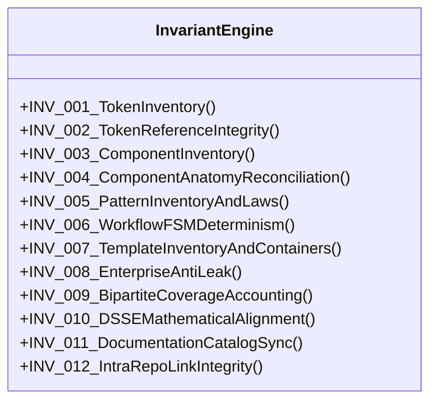
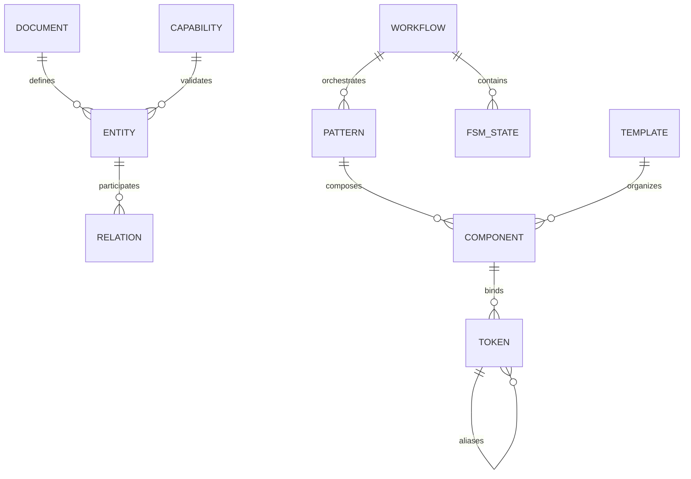

# Master Design System (MDS) — Layer M Governance Architecture
## Phase 9.7.8: Governance & Cross-Document Consistency Engine Specification (Remediated)

**Document Reference:** `MDS-ARCH-9780`  
**Layer:** Layer M (Governance & Invariants)  
**Lead Architect:** Mohamed Khalid (Senior Full Stack & Flutter Developer)  
**Status:** ARCHITECTURE REMEDIATED — READY FOR FINAL INDEPENDENT AUDIT  
**Date:** 2026-09-26  
**Target Capability:** `MDS-GOV-001` (Unified Governance & Cross-Document Consistency Engine)  
**Compliance Standard:** Pure Python 3.12 Standard Library, Zero External Dependencies, Read-Only Engine  

---

## 1. Executive Summary & Problem Space

A design system is not merely a collection of CSS stylesheets or UI components; it is a **formalized, self-referential knowledge graph**. Within the Master Design System (MDS), this graph encompasses 188 Design Tokens, 18 Layout Primitives, 19 Core Components, 8 Structural Patterns, 6 Finite State Machine Workflows, 6 Application Templates, a 5-Pillar Decision Engine (DSSE), and 170 Automated Capabilities.

As the repository expanded through Phase 9 (Token Compiler, Primitive Runtime, Component Runtime, Playground, Reference Application, and Automated Testing Suites), specifications and documentation artifacts proliferated across dozens of markdown files, JSON DTCG files, test suites, and schema registries.

### 1.1 The Drift Dilemma
In any large-scale design system, architectural decay begins with **documentation and semantic drift**:
1. A component spec references a token name that was refactored in a DTCG file.
2. A template document claims a container width of 1280px when the foundational standard is 1152px/1440px.
3. A documentation portal catalog records 44 tests while the test harness executes 48 tests and the capability registry tracks 170.
4. A workflow specification introduces a custom operational state not defined in the Universal 11-State FSM.
5. An AI agent or human author creates an ad-hoc markdown table that contradicts the Master Specification.

### 1.2 The Phase 9.7.8 Mission
Phase 9.7.8 designs the **Layer M Governance & Cross-Document Consistency Engine**, a hermetic, zero-dependency, read-only static analysis system that:
- Ingests all Markdown documents, JSON schemas, DTCG token trees, and test registries into a unified **Normalized Knowledge Graph (IR)**.
- Evaluates the Knowledge Graph against **12 Inviolable Architectural Invariants**.
- Normalizes textual references into **Canonical Semantic Concepts** to prevent synonym and phrasing mismatches.
- Evaluates test coverage via a **Typed Bipartite Coverage Model** without false numerical equivalences.
- Emits deterministic, machine-readable JSON telemetry and actionable human-readable terminal reports.
- Enforces an unyielding **Read-Only Mandate** (Zero Silent Document Mutation).

```text
┌──────────────────────────────────────────────────────────────────────────────────┐
│                    MDS GOVERNANCE & CONSISTENCY PIPELINE                         │
├──────────────────────────────────────────────────────────────────────────────────┤
│  [Source Ingestion]     Markdown AST │ DTCG JSON │ Registries │ Test ASTs        │
│                                  │                                               │
│                                  ▼                                               │
│  [Semantic Normalization] Concept Dictionary │ Synonyms │ Entity Mapping         │
│                                  │                                               │
│                                  ▼                                               │
│  [Normalized IR]        In-Memory Directed Knowledge Graph (12 Nodes, 10 Edges)  │
│                                  │                                               │
│                                  ▼                                               │
│  [Invariant Engine]     12 Declarative Invariant Rules (INV-001 to INV-012)      │
│                                  │                                               │
│                                  ▼                                               │
│  [Severity & Attribution] BLOCKER │ CRITICAL │ MAJOR │ MINOR │ ADVISORY          │
│                                  │                                               │
│                                  ▼                                               │
│  [Report Emission]      Structured JSON Artifact │ ANSI Terminal Dashboard       │
└──────────────────────────────────────────────────────────────────────────────────┘
```

---

## 2. Governance Source Hierarchy & Intra-Tier Precedence Protocol

To guarantee mathematical determinism in contradiction resolution, every file within the MDS repository is classified into one of **Five Authority Tiers** (ADR-087), and conflicts within Tier 1 are resolved via **Intra-Tier Precedence** (ADR-097):

```text
               Tier 1: Canonical Source of Truth (Authoritative Core)
               ├── Rank 1: Master Specification (MDS_MASTER_SPECIFICATION.md)
               ├── Rank 2: Canonical Token Repository (02-Tokens/*.tokens.json)
               ├── Rank 3: Layer Architecture Specs (01-Foundations to 07-Templates)
               └── Rank 4: Domain Decision Engines (DSSE Specification)
                                      │
                                      ▼
               Tier 2: Architectural Realization & Binding Contracts
                                      │
                                      ▼
               Tier 3: Derived Projections & Catalogs
                                      │
                                      ▼
               Tier 4: Operational Records & Historical Tracking
                                      │
                                      ▼
               Tier 5: Advisory Guidance & Contributor Prompts
```

### 2.1 Authority Tier Catalog

| Tier | Category | File Patterns & Documents | Authority Scope |
| :---: | :--- | :--- | :--- |
| **Tier 1** | **Canonical Source of Truth** | `MDS/MDS_MASTER_SPECIFICATION.md`<br>`MDS/02-Tokens/*.tokens.json`<br>`MDS/01-Foundations/*.md`<br>`MDS/03-Primitives/Foundational-Primitives.md`<br>`MDS/04-Components/Components-Catalog.md`<br>`MDS/05-Patterns/Patterns-Catalog.md`<br>`MDS/06-Workflows/MDS-Workflows-Architecture.md`<br>`MDS/07-Templates/MDS-Templates-Architecture.md`<br>`MDS/AGENT/DESIGN_SYSTEM_SELECTION_ENGINE.md` | Absolute source of truth for all entity names, token counts, layout constraints, component anatomy, FSM states, and math models. |
| **Tier 2** | **Architectural Realization & Contracts** | `MDS/10-Testing/capabilities/registry.json`<br>`MDS/13-Implementation/MDS-Implementation-Architecture.md`<br>`MDS/13-Implementation/*-Decision-Log.md`<br>`MDS/Runtime/**` | Concrete implementation contracts, custom element definitions, and capability registries that bind Tier 1 into executable software. |
| **Tier 3** | **Derived Projections & Catalogs** | `MDS/Documentation/Documentation-Index.json`<br>`dist/tokens/tokens.css`<br>`dist/tokens/tokens.json`<br>`dist/tokens/tokens.d.ts`<br>`MDS/Playground/index.html`<br>`MDS/Reference-Application/index.html` | Read-only compiled distributions and showcases. Must remain 100% synchronized with Tiers 1 and 2. |
| **Tier 4** | **Operational Records & History** | `docs/ROADMAP.md`<br>`docs/PROJECT_HISTORY.md`<br>`docs/AI_MEMORY.md`<br>`MDS/13-Implementation/Phase-*-Report.md`<br>`MDS/13-Implementation/Phase-*-Audit.md` | Project execution timeline, audit archives, and historical session logs. Subject to dual-mode historical validation. |
| **Tier 5** | **Advisory Guidance & Prompts** | `.agents/rules/*.md`<br>`MDS/AGENT/MDS_AGENT_RULES.md`<br>`docs/PRD.md`<br>`docs/SDD.md` | Operational rules and guardrails for human and AI contributors. Advisory; must not contradict Tier 1 or Tier 2. |

### 2.2 Intra-Tier 1 Precedence Rules (Finding G-003 Remediation)
When two documents in Tier 1 disagree, the conflict is resolved deterministically by rank:
1. **Rank 1 (Master Specification Primacy):** `MDS_MASTER_SPECIFICATION.md` holds absolute primacy over global architectural invariants (container constraints, entity counts, core design principles). If a Layer spec contradicts the Master Spec, the Layer spec is in violation.
2. **Rank 2 (Token Data Truth):** `MDS/02-Tokens/*.tokens.json` holds absolute primacy over component/pattern specs regarding raw token values, token IDs, and alias paths. If a component spec invents a token not in DTCG, the DTCG repository wins, and the component spec is flagged as invalid.
3. **Rank 3 (Layer Architecture Umbrella Primacy):** Layer umbrella documents (e.g. `04-Components/MDS-Components-Architecture.md`) take precedence over individual specimen leaf files (e.g. `Button.md`).
4. **Rank 4 (Domain Engines):** DSSE mathematical models govern design system selection and cannot redefine foundational tokens or component anatomies.
5. **Same-Rank Unresolved Conflicts:** If two documents of identical rank contradict each other, an immediate **`CRITICAL`** finding is emitted. Resolution strictly requires a formal Architecture Decision Record (ADR) approved by the Lead Architect.

---

## 3. The 12 Cross-Document Architectural Invariants

The Governance Engine evaluates 12 explicit, formal invariants across the knowledge graph:



### INV-001: Token Inventory & DTCG Cardinality
- **Contract:** Exactly **188 registered tokens** across **18 W3C DTCG files** in `MDS/02-Tokens/`.
- **Breakdown:** 141 Primitive & Semantic tokens + 47 Component tokens (24 Button, 10 Input, 13 Badge).
- **Severity:** `CRITICAL` on mismatch.

### INV-002: Token Reference & Alias Integrity
- **Contract:** Every token alias `{category.type.item.variant}` referenced in DTCG files, component specs, or runtime CSS custom properties must resolve to a valid defined token in the Tier 1 DTCG repository. Maximum alias resolution depth $\le 2$ hops. Zero circular alias references.
- **Severity:** `CRITICAL` on unresolved token; `BLOCKER` on circular alias graph.

### INV-003: Core Component Inventory & Naming Grammar
- **Contract:** Exactly **19 canonical components** across 6 functional families:
  1. *Actions:* `Button`, `IconButton`, `Link` (3)
  2. *Forms & Inputs:* `Field`, `Input`, `Textarea`, `Checkbox`, `Radio`, `Switch`, `Select` (7)
  3. *Feedback:* `Alert`, `Spinner`, `Skeleton` (3)
  4. *Data Display:* `Badge`, `Card`, `Table` (3)
  5. *Navigation & Overlays:* `Tabs`, `Dialog`, `Tooltip` (3)
- **Severity:** `CRITICAL`.

### INV-004: Component Anatomy Reconciliation & Physical Mapping Artifact (Finding G-002 Remediation)
- **Contract:** Formally distinguishes the **32-Point Canonical Design Specification Standard** from the **16-Point Executable Implementation Contract**:
  - **The Canonical Design Standard (32 Points):** Mandatory architectural blueprint enumerating all macro-design facets.
  - **The Implementation Contract (16 Points):** Mandatory deliverable standard for component specifications and custom element controllers, synthesizing the 32 design facets into 16 concrete structural headings.
  - **Layer 07 Templates:** Canonical templates natively enforce the full 32-Point Template Anatomy Standard (`MDS-Templates-Architecture.md` Section 4).

#### Complete 32-to-16 Canonical Anatomy Mapping Table (Physical Artifact)
Every single one of the 32 canonical design facets is explicitly mapped to its governing implementation heading:

| # | Canonical 32-Point Design Facet | Governing 16-Point Implementation Heading | Mapping Type | Canonical Authority & Validation Rule |
| :-: | :--- | :--- | :---: | :--- |
| **01** | `Entity / Component ID` | **Heading 1: Purpose & Semantic Role** | Many:1 | Declares unique alphanumeric identifier (e.g. `MDS-CMP-001`). Must match `registry.json`. |
| **02** | `Name` | **Heading 1: Purpose & Semantic Role** | Many:1 | Canonical component name in PascalCase and custom element tag (`mds-*`). |
| **03** | `Intent` | **Heading 1: Purpose & Semantic Role** | Many:1 | User goal and functional classification within UI architecture. |
| **04** | `Problem Solved` | **Heading 1: Purpose & Semantic Role** | Many:1 | User interface challenge resolved by the component. |
| **05** | `When to Use` | **Heading 2: When to Use** | 1:1 | Prescriptive triggering conditions; must state positive inclusion criteria. |
| **06** | `When Not to Use` | **Heading 3: When Not to Use & Anti-Patterns** | Many:1 | Explicit exclusions redirecting to alternative canonical components. |
| **07** | `Page / Visual Regions` | **Heading 4: Anatomy & Structural Diagram** | Many:1 | Ascii/visual structural breakdown of internal layout elements. |
| **08** | `Region Hierarchy` | **Heading 4: Anatomy & Structural Diagram** | Many:1 | Parent-child nesting order of internal elements; Light DOM structure. |
| **09** | `Structural Composition` | **Heading 15: Composition Rules** | Many:1 | Nesting constraints within Primitives (Stack, Inline, Surface). |
| **10** | `Lifecycle & Workflow Slots` | **Heading 8: Composition Slots** & **Heading 9: Behavior** | Cross-Cutting | Hooking points for workflow FSM transitions and action dispatch. |
| **11** | `Component Dependencies` | **Heading 15: Composition Rules** | Many:1 | Explicit inventory of primitives and child components consumed. |
| **12** | `Content Slots` | **Heading 8: Composition Slots** | Many:1 | Named injection points (leading icon, trailing icon, trigger, body). |
| **13** | `Required vs Optional Regions` | **Heading 8: Composition Slots** | Many:1 | Specification of mandatory vs progressive enhancement elements. |
| **14** | `Responsive Composition` | **Heading 12: Responsive Behavior** | Many:1 | Reflow rules across breakpoints (Mobile 320, Tablet 768, Desktop 1024/1440). |
| **15** | `Mobile Composition` | **Heading 12: Responsive Behavior** | Many:1 | Mobile touch optimizations; Recomposition over shrinking invariant. |
| **16** | `RTL Behavior` | **Heading 12: Responsive Behavior** | Many:1 | 100% CSS logical properties (`*-inline-start/end`); zero `row-reverse`. |
| **17** | `Accessibility Structure` | **Heading 11: Accessibility Guarantees** | Many:1 | Semantic HTML tag, ARIA role mapping, and accessible name calculation. |
| **18** | `Visual States` | **Heading 7: States (Visual & Experience)** | Many:1 | Default, hover, active/pressed, focused, disabled state specs. |
| **19** | `Loading Strategy` | **Heading 7: States (Visual & Experience)** | Many:1 | Skeleton shimmer and spinner loading integration; zero layout shift. |
| **20** | `Error Strategy` | **Heading 7: States (Visual & Experience)** | Many:1 | Visual error states, validation feedback, and accessible error messages. |
| **21** | `Empty Strategy` | **Heading 7: States (Visual & Experience)** | Many:1 | Zero-data display and fallback illustrations. |
| **22** | `Recovery Strategy` | **Heading 7: States (Visual & Experience)** | Many:1 | Contextual recovery actions paired with error states (Retry, Fix, Sign-in). |
| **23** | `Density Behavior` | **Heading 6: Control Heights & Sizes** | Many:1 | Heights (32px `sm`, 40px `md`, 48px `lg`), compact density support; zero 28px. |
| **24** | `Theme & Mode Behavior` | **Heading 5: Variants & Intents** & **Heading 14: Token Mapping** | Cross-Cutting | Luminance stepping in Dark Mode; High Contrast active borders. |
| **25** | `AI Integration` | **Heading 16: AI Agent Usage Rules** | Many:1 | Heuristic prompt guidelines, schema constraints, and LLM code gen rules. |
| **26** | `Navigation Context` | **Heading 9: Interaction & Behavior** | Many:1 | Focus order transitions, modal dismissal, and routing bindings. |
| **27** | `Focus Management` | **Heading 10: Keyboard APG Contracts** | Many:1 | Visible 2px focus ring (`:focus-visible`), FocusTrap on modals. |
| **28** | `Motion Behavior` | **Heading 13: Motion & Vestibular Safety** | 1:1 | Durations (150/250/350ms), easing curve, and 0ms reduced-motion collapse. |
| **29** | `Token Dependencies` | **Heading 14: Token Mapping** | 1:1 | Explicit resolution table (Component $\to$ Semantic $\to$ Primitive DTCG tokens). |
| **30** | `Anti-Patterns` | **Heading 3: When Not to Use & Anti-Patterns** | Many:1 | Concrete prohibited usage scenarios with architectural justifications. |
| **31** | `Validation Requirements` | **Heading 10: Keyboard APG** & **Heading 11: A11y Guarantees** | Cross-Cutting | Automated testing assertions (axe-core, APG keyboard matrix, contrast). |
| **32** | `Selection Criteria` | **Heading 2: When to Use** & **Heading 16: AI Usage Rules** | Cross-Cutting | PSE and TSE selection engine integration criteria. |

- **Validation Rule:** The Governance Engine parses each component specification in `04-Components/` and asserts that all 16 headings exist and that all 32 underlying canonical facets are documented. Missing facets trigger a **`MAJOR`** finding.

---

### INV-005: Pattern Inventory & The 10 Composition Laws
- **Contract:** Exactly **8 canonical patterns** across 6 problem domains (`Form-Section`, `Search-Filter-Bar`, `Data-List-Card`, `Empty-State`, `Confirmation-Dialog`, `Page-Header`, `AI-Input-Prompt`, `AI-Result-Review`).
- **Assertion:** Every pattern specification must explicitly cite compliance with the 10 Inviolable Composition Laws codified in `MDS/05-Patterns/Composition-Rules.md`.
- **Severity:** `MAJOR`.

### INV-006: Workflow Finite State Machine (FSM) Determinism
- **Contract:** Exactly **6 canonical workflows** (`Form-Submission`, `Search-Discovery`, `Destructive-Action`, `Settings-Update`, `AI-Synthesis-Review`, `Error-Recovery`).
- **FSM Topology Invariant:** All workflow state models must compose states strictly from the **Universal 11-State FSM Topology**:
  `IDLE`, `ACTIVE_INPUT`, `VALIDATING`, `CONFIRMING`, `PROCESSING`, `STREAMING`, `REVIEWING`, `SUCCESS_RESOLVED`, `ERROR_INTERCEPTED`, `FATAL_FAILURE`, `ABORTED_CANCEL`.
- **Severity:** `CRITICAL` if an unauthorized state is introduced.

### INV-007: Template Inventory & Container Scale Invariants
- **Contract:** Exactly **6 canonical templates** (`Dashboard-Overview`, `List-Management`, `Detail-Entity`, `Form-Edit`, `Settings-Workspace`, `AI-Workspace`).
- **Layout Invariant:** Every template container constraint must enforce the canonical MDS container widths:
  - Default Desktop: `1152px` (`container.default`)
  - Wide Display / High-Throughput: `1440px` (`container.wide`)
  - Any reference to unapproved widths (such as `1280px` or `1200px`) in active specs is strictly forbidden.
- **Severity:** `CRITICAL`.

### INV-008: Deferred Enterprise Anti-Leak Guard
- **Contract:** Zero implementation or unapproved inclusion of the **9 Deferred Enterprise Systems**:
  `DataGrid`, `RichTextEditor`, `Calendar`, `DateRangePicker`, `CommandSystem`, `Tree`, `Combobox`, `VirtualizedList`, `FileUploadManager`.
- **Severity:** `BLOCKER`.

---

### INV-009: Test Accounting & Bipartite Coverage Model (Finding G-001 Remediation)
- **Contract:** Formally rejects numerical equality across tiers ($170 \ne 48 \ne 141$) and establishes the **Typed Bipartite Coverage Relation** $\mathcal{R} \subseteq \mathcal{C} \times \mathcal{T}$ between Capabilities ($\mathcal{C}$, $|\mathcal{C}|=170$) and Executable Tests ($\mathcal{T}$):

```text
┌────────────────────────────────────────────────────────────────────────┐
│                   MDS TRI-DIMENSIONAL TEST ARCHITECTURE                │
├────────────────────────────────────────────────────────────────────────┤
│ Dimension 1: 170 Declarative Capabilities (registry.json)              │
│   - 133 Core Systemic Capabilities (MDS-REF, MDS-TKN, MDS-CMP, ...)    │
│   - 37 DSSE Mathematical Capabilities (MDS-DSS-001 to MDS-DSS-037)     │
│                                                                        │
│ Dimension 2: 48 Master Harness Integration Suites (run_tests.py)       │
│   - 47 Direct Domain Acceptance Tests                                  │
│   - 1 Composite Wrapper Test (MDS-DSS-004 wrapping 37 DSSE assertions) │
│                                                                        │
│ Dimension 3: 141 Subsystem Unit Discovery Tests (tests/test_*.py)      │
│   - 141 Granular Unit Test Methods across 15 Subsystem Test Modules    │
└────────────────────────────────────────────────────────────────────────┘
```

#### 1. Coverage Classification Taxonomy
Every edge $(c, \text{rel\_type}, t) \in \mathcal{R}$ carries a strict classification:
1. **`DIRECT_COVERAGE`:** Test $t$ explicitly declares capability $c$ as its primary execution target or entrypoint (e.g. 47 direct Master Harness tests target their respective capabilities; `test_reference_app.py::test_01` directly targets `MDS-REF-001`).
2. **`WRAPPED_COVERAGE`:** Test $t$ is a composite runner executing a formalized sub-suite verifying capability $c$. Specifically:
   - Master Harness Suite 13 Test 4 (`MDS-DSS-004`) wraps and executes all 37 atomic DSSE capabilities:
     $$\forall c \in \{\text{MDS-DSS-001}, \dots, \text{MDS-DSS-037}\}, \quad (c, \text{WRAPPED\_COVERAGE}, \text{run\_tests.py::MDSTestRunner.MDS-DSS-004}) \in \mathcal{R}$$
3. **`INDIRECT_COVERAGE`:** Test $t$ in `tests/` exercises internal classes, codecs, or mock fixtures supporting capability $c$ without declaring $c$ as the primary suite ID (e.g. `tests/test_visual_engine.py` provides supporting coverage for `MDS-VIS-001`).
4. **`DUPLICATE_COVERAGE`:** A capability verified by $\ge 2$ distinct tests across different test files or tiers. This is tracked as $|\text{coverage}(c)| > 1$ and represents deliberate cross-layer verification redundancy, NOT an accounting error.
5. **`UNCOVERED`:** Any capability with zero valid relations originating from $c$:
   $$\text{UNCOVERED} = \{c \in \mathcal{C} \mid \text{coverage}(c) = \emptyset\}$$
   - **Governance Assertion:** $|\text{UNCOVERED}| = 0$. If any capability is uncovered, the engine emits an immediate **`CRITICAL`** finding.

#### 2. Deterministic Coverage Computation Algorithm
During audit execution, the Governance Engine evaluates capability coverage mechanically:
- **`coverage(C)`** $\equiv \{ (C, \text{rel\_type}, T) \in \mathcal{R} \}$ (the set of all valid relations originating from capability $C$).
- **`UNCOVERED(C)`** $\iff \text{coverage}(C) = \emptyset$.
- **`DUPLICATE_COVERAGE(C)`** $\iff |\text{coverage}(C)| > 1$.
- **`WRAPPED_COVERAGE(C, T)`** $\iff T \text{ is explicitly declared as a wrapper for } C$.
- **`DIRECT_COVERAGE(C, T)`** $\iff T \text{ directly targets or asserts } C$.
- **`INDIRECT_COVERAGE(C, T)`** $\iff T \text{ validates a supporting subsystem required by } C$.

#### 3. Handling of Invalid and Stale Test References
The Governance Engine strictly prohibits broken or phantom test references:
- **Invalid Relation Type:** Any relation not matching the 5 canonical types $\to$ **`Governance ERROR`** (`CRITICAL`).
- **Missing Test Reference:** Any test file or method in $\mathcal{R}$ that does not exist physically on disk $\to$ **`Governance ERROR`** (`CRITICAL`).
- **Unknown Capability ID:** Any capability ID in test assertions not defined in `registry.json` $\to$ **`Governance ERROR`** (`CRITICAL`).
- **Zero Coverage:** Any capability with $|\text{coverage}(C)| = 0$ $\to$ **`CRITICAL Blocker`** (`BLOCKER`, Exit Code 2).

#### 4. Canonical Capability Coverage Relation Summary by Domain
The complete line-by-line mapping of all 170 individual capabilities is formally ratified in [`Phase-9.7.8-Capability-Coverage-Matrix.md`](Phase-9.7.8-Capability-Coverage-Matrix.md). The domain-level structural allocation is:

| Domain / Layer | Capabilities Count | Primary Direct Runner ($T_{\text{direct}}$) | Wrapper Runner ($T_{\text{wrapper}}$) | Supporting Unit Modules ($T_{\text{indirect}}$) | Classification |
| :--- | :---: | :--- | :---: | :--- | :---: |
| **Layer A: Reference Application (`REF`)** | 15 (`001`–`015`) | `Reference-Application/tests/test_reference_app.py` | None | `test_repo_validator.py`, `test_browser_live.py` | `DUPLICATE` |
| **Layer B: Playground Sandboxes (`PLG`)** | 13 (`001`–`013`) | `Playground/tests/test_playground.py` | None | `test_repo_validator.py`, `test_browser_live.py` | `DUPLICATE` |
| **Layer C: Component Runtime (`CRT`)** | 18 (`001`–`018`) | `Runtime/components/tests/test_components_runtime.py` | None | `test_css_scanner.py` | `DUPLICATE` |
| **Layer D: Primitive Runtime (`PRT`)** | 30 (`001`–`030`) | `Runtime/primitives/tests/test_primitives_runtime.py` | None | `test_css_scanner.py` | `DUPLICATE` |
| **Layer E: Token Runtime (`TRT`)** | 13 (`001`–`013`) | `Runtime/tokens/tests/test_token_runtime.py` | None | `test_registry_validator.py` | `DUPLICATE` |
| **Spec Contracts: Tokens (`TKN`)** | 6 (`001`–`006`) | `run_tests.py::MDSTestRunner.run_token_tests` | None | `test_css_scanner.py` | `DUPLICATE` |
| **Spec Contracts: Primitives (`PRI`)** | 5 (`001`–`005`) | `run_tests.py::MDSTestRunner.run_primitive_tests` | None | `test_css_scanner.py`, `test_repo_validator.py` | `DUPLICATE` |
| **Spec Contracts: Components (`CMP`)** | 4 (`001`–`004`) | `run_tests.py::MDSTestRunner.run_component_tests` | None | `test_css_scanner.py`, `test_repo_validator.py` | `DUPLICATE` |
| **Spec Contracts: Patterns (`PAT`)** | 3 (`001`–`003`) | `run_tests.py::MDSTestRunner.run_pattern_tests` | None | `test_repo_validator.py` | `DUPLICATE` |
| **Spec Contracts: Workflows (`WKF`)** | 4 (`001`–`004`) | `run_tests.py::MDSTestRunner.run_workflow_tests` | None | `test_repo_validator.py` | `DUPLICATE` |
| **Spec Contracts: Accessibility (`A11Y`)** | 4 (`001`–`004`) | `run_tests.py::MDSTestRunner.run_accessibility_tests` | None | `test_accessibility_live.py`, `unit.py` | `DUPLICATE` |
| **Spec Contracts: RTL (`RTL`)** | 3 (`001`–`003`) | `run_tests.py::MDSTestRunner.run_rtl_tests` | None | `test_css_scanner.py` | `DUPLICATE` |
| **Spec Contracts: Responsive (`RWD`)** | 3 (`001`–`003`) | `run_tests.py::MDSTestRunner.run_responsive_tests` | None | `test_responsive_live.py`, `unit.py` | `DUPLICATE` |
| **Spec Contracts: Experience (`EXP`)** | 3 (`001`–`003`) | `run_tests.py::MDSTestRunner.run_experience_tests` | None | None | `DIRECT` |
| **Spec Contracts: Visual (`VIS`)** | 1 (`001`) | `run_tests.py::MDSTestRunner.run_visual_tests` | None | `test_visual_engine.py`, `live.py`, `negative.py` | `DUPLICATE` |
| **Spec Contracts: Templates (`TMP`)** | 4 (`001`–`004`) | `run_tests.py::MDSTestRunner.run_template_tests` | None | `test_repo_validator.py` | `DUPLICATE` |
| **Spec Contracts: Docs (`DOC`)** | 3 (`001`–`003`) | `run_tests.py::MDSTestRunner.run_documentation_tests` | None | `test_repo_validator.py` | `DUPLICATE` |
| **DSSE Wrapper Capability (`DSS-000`)** | 1 (`000`) | `run_tests.py::MDSTestRunner.MDS-DSS-004` | None | `test_dsse.py::DSSETestSuite` | `DUPLICATE` |
| **DSSE Mathematical Core (`DSS`)** | 37 (`001`–`037`) | `10-Testing/test_dsse.py::DSSETestSuite.run_all` | `run_tests.py::MDS-DSS-004` | `test_dsse.py` assertions | `WRAPPED` |
| **TOTALS** | **170 Capabilities** | **170 Direct Relations** | **37 Wrapped Relations** | **213 Supporting Relations** | **0 Uncovered** |

#### 5. Deterministic Reconciliation Accounting
- **Registry Balance:** $170\text{ Total} = 133\text{ Core} + 37\text{ DSSE Mathematical} = 170\text{ Active} + 0\text{ Deferred} + 0\text{ Quarantined}$.
- **Master Harness Balance:** $48\text{ Suites} = 47\text{ Direct} + 1\text{ Explicit Wrapper}(37\text{ DSSE assertions})$.
- **Unit Discovery Balance:** $141\text{ Tests} = 141\text{ Discovered & Verified}$ across 15 subsystem modules.
- **Coverage Status:** $|\text{UNCOVERED}| = 0$ (100% of capabilities deterministically mapped).
- **Severity:** `CRITICAL` on any uncovered capability, missing runner entrypoint, or accounting desynchronization.

---

### INV-010: DSSE Mathematical Model Alignment
- **Contract:** The Design System Selection Engine specification (`DESIGN_SYSTEM_SELECTION_ENGINE.md`), architectural proposals, and automated tests (`test_dsse.py`) must be 100% synchronized:
  1. 5-Pillar Decoupled Model ($C_{\text{epistemic}} = C_{\text{req}} \times C_{\text{eval}} \times C_{\text{evid}}$).
  2. Hard constraint tri-state gate (`PASS`, `FAIL`, `UNKNOWN`).
  3. Decision Margin Zones: $\le 1.0\%$ Virtual Tie, $1.1\% - 3.0\%$ Tie-Break Zone, $> 3.0\%$ Decisive Lead.
  4. Rule-Based Confidence Gating (Family C: High, Medium, Low).
  5. 8 Calibration Scenarios (Cases A through H).
- **Severity:** `CRITICAL`.

### INV-011: Documentation Portal Index Synchronization
- **Contract:** `MDS/Documentation/Documentation-Index.json` must reflect the true state of the repository:
  - `tokens_total: 188`
  - `components_total: 19`
  - `patterns_total: 8`
  - `workflows_total: 6`
  - `templates_total: 6`
  - `capabilities_total: 170` (synchronized with `registry.json`)
- **Severity:** `MAJOR`.

### INV-012: Intra-Repository Link & Path Integrity
- **Contract:** Every relative and absolute markdown link (`[link text](path/to/file.md)`) and image reference across `MDS/` and `docs/` must resolve to an existing physical file on disk. Zero broken 404 links.
- **Severity:** `MAJOR`.

---

## 4. Markdown Parser Contract & AST Lexer (Finding G-006 Remediation)

The zero-dependency Markdown parser (`md_scanner.py`) implements a formal grammar lexer:

### 4.1 Supported Grammar Elements
1. **Headings:** ATX `#` through `######` with slug generation (`#heading-title`).
2. **Paragraphs & Blocks:** Multi-line text blocks with line-number tracking.
3. **Lists:** Ordered (`1. `) and Unordered (`- `, `* `), including nested lists ($\ge 2$ spaces).
4. **GFM Tables:** Pipe tables (`| col |`), parsing headers, row cells, and column alignment delimiters (`:---`, `---:`).
5. **Links & Images:** Inline `[text](url)` and ``, extracting target relative paths.
6. **Reference Links:** `[text][ref]` and bottom definitions `[ref]: url`.
7. **Code Fences:** ```` ``` ```` and ```` ```` ```` with language tags (`json`, `css`, `html`, `mermaid`, `diff`).
8. **Inline Code:** Single backtick \`code\`.
9. **Blockquotes & Alerts:** `> text` and GitHub-style alerts (`> [!NOTE]`, `> [!WARNING]`).
10. **HTML Custom Tags:** Void tags (``, `<br>`) and Custom Elements (`<mds-*>`).
11. **Escaped Characters:** `\*`, `\[`, `\]`, `\$`.

### 4.2 Parser Outcomes & Error Protocol
- **`PARSE_SUCCESS`:** File successfully lexed into an AST tree with zero unparsed lines.
- **`PARSE_PARTIAL`:** File parsed, but non-fatal syntactical anomalies encountered (e.g. table with unequal column count; malformed row skipped, error logged in telemetry, AST continues).
- **`PARSE_FAILURE`:** Unrecoverable I/O error, invalid UTF-8 byte sequence, or syntax deadlock (raises `GovernanceParseError`, logs file path, records `BLOCKER` finding).
- **Prohibition of Silent Failure:** The parser must NEVER silently discard lines. All unparsed or malformed lines are reported in the `parser_telemetry` output.

---

## 5. Knowledge Graph & Normalized IR Schema (Finding G-004 Remediation)

The Governance Knowledge Graph represents the entire design system as an in-memory directed graph with strongly-typed nodes and directional edges:



### 5.1 The 12 Node Types
1. `DocumentNode`: Markdown, JSON, or Python source file.
2. `TokenNode`: Design token defined in DTCG.
3. `PrimitiveNode`: Foundational layout or surface primitive.
4. `ComponentNode`: Core UI component (19 canonical).
5. `PatternNode`: Structural composite pattern (8 canonical).
6. `WorkflowNode`: User journey workflow (6 canonical).
7. `TemplateNode`: Application template (6 canonical).
8. `FSMStateNode`: Finite state machine state.
9. `CapabilityNode`: Capability registered in `registry.json`.
10. `DecisionNode`: Architecture Decision Record (ADR).
11. `TestNode`: Automated test suite or unit test.
12. `RuntimeArtifactNode`: Compiled CSS, JS element, or Data URI font.

### 5.2 The 10 Edge Types
1. `DEFINES`: Document $\to$ Entity.
2. `REFERENCES`: Entity $\to$ Entity.
3. `IMPLEMENTS`: Runtime/Test $\to$ Spec.
4. `DERIVES_FROM`: Token $\to$ Token (Alias).
5. `VALIDATES`: Capability/Test $\to$ Invariant.
6. `PROJECTS_TO`: Design Spec $\to$ Implementation Contract.
7. `CONSUMES`: Showcase/App $\to$ Runtime Component.
8. `CONFLICTS_WITH`: Entity $\to$ Entity (Contradiction).
9. `SUPERSEDES`: ADR $\to$ ADR (Historical update).
10. `TRANSITIONS_TO`: FSM State $\to$ FSM State.

### 5.3 Mandatory Node Metadata Schema
```python
@dataclass(frozen=True)
class KnowledgeGraphNode:
    canonical_id: str          # Unique ID (e.g. "TKN:color.brand.primary", "CMP:Button")
    concept_id: str            # Semantic Concept ID (e.g. "CONTAINER.MAX_WIDTH.DEFAULT")
    node_type: NodeType        # Enum of 12 node types
    source_file: str           # Path relative to repository root
    line_start: int            # 1-indexed start line
    line_end: int              # 1-indexed end line
    authority_tier: int        # 1 to 5
    authority_rank: int        # 1 to 4 (for Tier 1 documents)
    version: str               # Semantic version string
    lifecycle_status: str      # ACTIVE, APPROVED, DEFERRED, DEPRECATED
    raw_evidence: str          # Verbatim quoted source text
    attributes: Dict[str, Any] # Extracted structured parameters
```

---

## 6. Semantic Identity & Conflict Model (Finding G-008 Remediation)

To prevent string-matching fragility, the engine incorporates a **Canonical Concept Dictionary (`ConceptDictionary`)** mapping disparate phrases, synonyms, and localized terms to invariant semantic identities:

```json
{
  "CONTAINER.MAX_WIDTH.DEFAULT": {
    "canonical_value": "1152px",
    "aliases": [
      "standard container",
      "container.default",
      "desktop container",
      "default container max-width",
      "canonical container constraints (1152px / 1440px)"
    ]
  },
  "CONTAINER.MAX_WIDTH.WIDE": {
    "canonical_value": "1440px",
    "aliases": [
      "wide container",
      "container.wide",
      "high-throughput container",
      "wide display container"
    ]
  },
  "TOUCH_TARGET.MIN_SIZE": {
    "canonical_value": "44x44px",
    "aliases": [
      "44px min hit target",
      "44×44px",
      "presstarget contract",
      "44px touch"
    ]
  }
}
```

### 6.1 Semantic Normalization Pipeline
1. **Lexical Normalization:** Strip punctuation, collapse whitespace, normalize multiplication signs (`×` $\to$ `x`), lowercase text.
2. **Concept Matching:** Map text against alias arrays in `ConceptDictionary`.
3. **Value Extraction:** Extract dimensional numbers and units (`1280px`, `1152px`).
4. **Contradiction Evaluation:** If an extracted value contradicts `canonical_value` on the resolved Concept ID, emit a `CRITICAL` or `MAJOR` conflict. Plain string differences describing identical values pass cleanly.

---

## 7. Dual-Mode Historical Document Scope (Finding G-007 Remediation)

Historical documents (`MDS/13-Implementation/Phase-*.md`, `docs/PROJECT_HISTORY.md`) are governed by dual validation modes:

```text
┌────────────────────────────────────────────────────────────────────────┐
│                   DUAL-MODE HISTORICAL VALIDATION                      │
├───────────────────────────────────┬────────────────────────────────────┤
│ 1. Historical Semantic Mode       │ 2. Structural Integrity Mode       │
│    (EXEMPT from Current Invariants)│    (STRICTLY ENFORCED)             │
├───────────────────────────────────┼────────────────────────────────────┤
│ - Intermediate token counts (44)  │ - Valid Markdown AST syntax        │
│ - Intermediate test passes (41)   │ - Zero broken intra-repo links     │
│ - Discarded options (1280px)      │ - Valid file metadata headers      │
│ - Historical phase statuses       │ - Zero banned enterprise leaks     │
└───────────────────────────────────┴────────────────────────────────────┘
```

---

## 8. Performance Benchmark Target Qualification (Finding G-005 Remediation)

Performance metrics are formally classified as a **Performance Benchmark Target** (an engineering measurement goal to be certified upon implementation), NOT an unverified runtime invariant:

| Metric | Target Goal | Benchmark Envelope Specification |
| :--- | :---: | :--- |
| **Warm Execution** | $\le 500\text{ ms}$ | Python 3.12 64-bit, x86_64 CPU (4+ cores), NVMe SSD, warm OS filesystem cache. |
| **Cold Execution** | $\le 1200\text{ ms}$ | First execution on clean cache reading all disk assets. |
| **Repository Scale** | $\sim 150\text{ files}$ | $\sim 150$ markdown files, 18 DTCG JSON files, $\sim 15$ test files, $\sim 4,000$ lines of registries. |
| **Measurement** | Averaged | Wall-clock `time.perf_counter()` over 5 consecutive test runs. |
| **Tolerance Action** | Advisory | If execution exceeds 500ms on slower runners, emit an `ADVISORY` performance warning without failing the build. |

---

## 9. Read-Only Mandate & No Automatic Document Mutation

### Inviolable Governance Policy:
> **The Governance Engine shall NEVER automatically mutate, reformat, or edit any document in the repository.**

- **Rationale:** Automatic linting in design system specifications creates catastrophic side-effects:
  - Mangling precision-engineered ASCII tables and Mermaid diagrams.
  - Inadvertently replacing deliberate anti-pattern illustrations with "corrected" tokens.
  - Destroying git blame and attributing automated hallucinations to human architects.
- **Remediation Contract:** The engine outputs exact line numbers, git diff proposals, and remediation copy, but execution remains strictly manual and subject to human architect approval.

---

## 10. Severity Model & Exit Code Matrix

| Severity Level | Definition & Operational Impact | Example Findings | Default CI Action | Exit Code |
| :--- | :--- | :--- | :---: | :---: |
| **`BLOCKER`** | Catastrophic structural defect; invalidates build or corrupts parser | Circular token alias DAG, corrupted JSON, missing Tier 1 document | **ABORT IMMEDIATELY** | `2` |
| **`CRITICAL`** | Direct contradiction between Tier 1 authoritative specifications | Token count $\ne 188$, Component count $\ne 19$, unapproved FSM state, leaked enterprise component | **FAIL BUILD** | `1` |
| **`MAJOR`** | Desynchronization between Tier 1 source and Tier 3/4 derived catalogs | `Documentation-Index.json` count drift, broken internal markdown link, unreferenced active token | **FAIL in `--strict`**<br>(WARN in default) | `1` or `0` |
| **`MINOR`** | Non-blocking syntactic or structural inconsistency | Table column ordering drift, whitespace anomaly, heading hierarchy gap | **WARN & PASS** | `0` |
| **`ADVISORY`** | Informational suggestion or prospective deprecation notice | Suggested cross-reference, style guidance | **LOG & PASS** | `0` |

---

## 11. Command-Line Interface (CLI) Specification

```bash
# Standard Developer Audit (Human-readable terminal output)
python MDS/10-Testing/governance/governance_cli.py

# Strict CI Mode (Fails on BLOCKER, CRITICAL, or MAJOR)
python MDS/10-Testing/governance/governance_cli.py --strict

# Machine-Readable JSON Output (For CI dashboards)
python MDS/10-Testing/governance/governance_cli.py --json --output MDS/10-Testing/artifacts/governance/governance_report.json

# Targeted Rule Execution
python MDS/10-Testing/governance/governance_cli.py --rule INV-001 --rule INV-003

# Fast Pre-Commit Audit (Runs in < 150ms)
python MDS/10-Testing/governance/governance_cli.py --fast
```

---

## 12. Integration Boundaries

### 12.1 Integration with Capability Registry (`registry.json`)
In Phase 9.7.8 implementation, capability **`MDS-GOV-001`** will be registered in `registry.json`:
- Layer: `M_GOVERNANCE`
- Category: `STATIC`
- Execution: `PYTHON_UNIT`
- Severity: `CRITICAL`
- Status: `ACTIVE` upon implementation certification.

### 12.2 Integration with Master Test Harness (`run_tests.py`)
- Suite 12 (`run_documentation_tests`) invokes `GovernanceEngine().audit_all()`.
- If any `BLOCKER` or `CRITICAL` governance violation is detected, Suite 12 fails with a full terminal diagnostic breakdown.

### 12.3 Interface Boundary with Phase 9.7.9 (Historical Phase Regression Guard)
```text
┌───────────────────────────────────────────────────────────────┐
│ Phase 9.7.8 (Layer M): Current State Cross-Document Invariants │
│ Evaluates: Active working tree knowledge graph consistency   │
└───────────────────────────────┬───────────────────────────────┘
                                │ exports: MDSGovernanceGraphSnapshot (SHA-256)
                                ▼
┌───────────────────────────────────────────────────────────────┐
│ Phase 9.7.9 (Layer N): Historical Phase Regression Guard      │
│ Evaluates: Historical milestone immutability (Phase 9.1–9.6)  │
└───────────────────────────────────────────────────────────────┘
```

### 12.4 Interface Boundary with Phase 9.7.10 (Unified Orchestrator `run_all.py`)
`run_all.py` will import the Governance Engine directly:
```python
from governance.engine import GovernanceEngine
# Executed in both --fast (< 150ms) and --full (< 500ms) modes
```

---

## 13. Future Test Suite Architecture (15 Dedicated Tests)

When Phase 9.7.8 Implementation is authorized, the following 15 dedicated tests will be developed under `MDS/10-Testing/tests/`:

1. `test_gov_md_scanner_headings`: Validates heading tree parsing and anchor slug extraction.
2. `test_gov_md_scanner_tables`: Validates pipe table extraction and row dictionary conversion.
3. `test_gov_md_scanner_code_fences`: Validates language-tag isolation and anti-pattern filtering.
4. `test_gov_md_scanner_links`: Validates relative and absolute link extraction.
5. `test_gov_dtcg_parser`: Validates 18 DTCG token files parsing and hop calculation.
6. `test_gov_python_ast`: Validates safe Python AST extraction without code execution.
7. `test_gov_knowledge_graph`: Validates entity and edge creation in normalized IR.
8. `test_gov_inv_001_token_inventory`: Validates exact 188 token count enforcement.
9. `test_gov_inv_003_component_inventory`: Validates exact 19 core component enforcement.
10. `test_gov_inv_004_anatomy_reconciliation`: Validates physical 32-to-16 mapping table verification.
11. `test_gov_inv_006_workflow_fsm`: Validates 11-state FSM topology enforcement.
12. `test_gov_inv_007_container_scale`: Detects forbidden 1280px container references.
13. `test_gov_inv_008_enterprise_leak`: Proves detection of banned enterprise systems.
14. `test_gov_inv_009_bipartite_coverage`: Validates bipartite coverage model and 1-to-37 wrapper accounting.
15. `test_gov_dual_mode_historical`: Proves historical files retain link checking while exempt from current counts.

---

*Phase 9.7.8 Remediated Architecture Specification complete and submitted for Final Independent Audit.*
