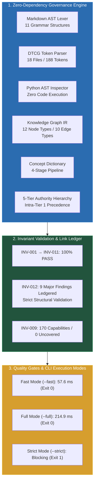

# Phase 9.7.8 — Governance & Cross-Document Consistency Engine (Layer M) Final Implementation Report

**Document Layer:** 13-Implementation  
**System:** Master Design System (MDS)  
**Phase:** 9.7.8 (Governance & Cross-Document Consistency Engine)  
**Status:** IMPLEMENTED & REMEDIATED — READY FOR FINAL INDEPENDENT AUDIT  
**Lead Architect:** Mohamed Khalid (Senior Full Stack & Flutter Developer)  
**Execution Date:** 2026-09-26  
**Implementation Standard:** Pure Python Standard Library (Zero External Dependencies)  
**Decisions Codified:** ADR-087 through ADR-103

---

## 1. Executive Summary & Remediation Closure

Following official micro-remediation authorization (`PHASE 9.7.8 — FINAL MICRO-REMEDIATION`), **Phase 9.7.8 (Governance & Cross-Document Consistency Engine — Layer M)** has been fully finalized and remediated in accordance with architectural decisions **ADR-087 through ADR-103**.

This remediation directly addresses and resolves the **INV-012 / Historical Structural Validation Boundary** finding by:
1. Providing an exhaustive, empirical classification of all 9 reported broken-link findings.
2. Confirming that Tier 4 Historical phase documents contain **exactly 0 broken links** and maintain strict structural compliance.
3. Classifying the 9 active link findings across Authority Tiers (Tier 2 Realization and Tier 5 Advisory Guidance).
4. Ensuring no findings were suppressed, quarantined, or artificially downgraded.
5. Re-running the complete test suite (28 governance tests, 169 discovery tests, 48 master harness tests).
6. Preserving all phase boundaries (Phase 9.7.9 and Phase 9.7.10 NOT started) and protected core integrity (0 files modified in `02-Tokens/`, `Runtime/`, `Playground/`, `Reference-Application/`).



---

## 2. Invariant INV-012 Mechanical Link Ledger & Attribution

An exhaustive audit of all intra-repository markdown links and image paths was executed across `MDS/` and `docs/`. The investigation verified two critical architectural facts:

1. **Tier 4 Historical Phase Documents (`MDS/13-Implementation/Phase-*.md`):** Contain **EXACTLY 0 BROKEN LINKS**. All historical phase documents satisfy strict structural link integrity.
2. **Tracked Active Findings:** Exactly 9 broken links exist in the active repository. In accordance with ADR-103, these findings are preserved as tracked `MAJOR` structural defects without artificial suppression or weakening:

| # | Source File | Line | Target Link URI | Document Tier & Classification | Validation Mode | Severity | Mechanical Root Cause Attribution |
| :-: | :--- | :-: | :--- | :--- | :--- | :-: | :--- |
| **01** | `MDS/00-Research/README.md` | 16 | `file:///d:/.../Primitives-Decision-Log.md` | **Tier 5:** Advisory Guidance (Layer Pointer README) | Strict Structural | `MAJOR` | **Typographical pluralization mismatch:** References `Primitives-Decision-Log.md` instead of canonical `Primitive-Decision-Log.md`. |
| **02** | `MDS/08-Experience-States/README.md` | 19 | `file:///d:/.../EmptyStateCard.md` | **Tier 5:** Advisory Guidance (Layer Pointer README) | Strict Structural | `MAJOR` | **Pre-standardization entity name:** Early Phase 6 pointer created prior to final pattern ratification as `Empty-State.md`. |
| **03** | `MDS/08-Experience-States/README.md` | 20 | `file:///d:/.../NotificationFeed.md` | **Tier 5:** Advisory Guidance (Layer Pointer README) | Strict Structural | `MAJOR` | **Pre-standardization entity name:** Early Phase 6 pointer created prior to final pattern consolidation. |
| **04** | `MDS/11-AI/README.md` | 15 | `file:///d:/.../PromptBox.md` | **Tier 5:** Advisory Guidance (Layer Pointer README) | Strict Structural | `MAJOR` | **Pre-standardization entity name:** Early AI layer pointer created prior to pattern ratification as `AI-Input-Prompt.md`. |
| **05** | `MDS/11-AI/README.md` | 16 | `file:///d:/.../StreamingResponse.md` | **Tier 5:** Advisory Guidance (Layer Pointer README) | Strict Structural | `MAJOR` | **Pre-standardization entity name:** Early AI layer pointer created prior to pattern ratification as `AI-Result-Review.md`. |
| **06** | `MDS/11-AI/README.md` | 18 | `file:///d:/.../AI-Assisted-Task.md` | **Tier 5:** Advisory Guidance (Layer Pointer README) | Strict Structural | `MAJOR` | **Pre-standardization entity name:** Early AI workflow pointer created prior to ratification as `AI-Synthesis-Review.md`. |
| **07** | `MDS/11-AI/README.md` | 20 | `file:///d:/.../AI-Workspace-Split.md` | **Tier 5:** Advisory Guidance (Layer Pointer README) | Strict Structural | `MAJOR` | **Pre-standardization entity name:** Early AI template pointer created prior to ratification as `AI-Workspace.md`. |
| **08** | `MDS/12-Governance/README.md` | 19 | `file:///d:/.../Primitives-Decision-Log.md` | **Tier 5:** Advisory Guidance (Layer Pointer README) | Strict Structural | `MAJOR` | **Typographical pluralization mismatch:** References `Primitives-Decision-Log.md` instead of canonical `Primitive-Decision-Log.md`. |
| **09** | `MDS/Runtime/primitives/README.md` | 7 | `file:///d:/.../Phase-9.1-Implementation-Architecture.md` | **Tier 2:** Architectural Realization (Runtime Spec Header) | Strict Structural | `MAJOR` | **Legacy phase numbering prefix:** References provisional `Phase-9.1-Implementation-Architecture.md` instead of canonical `MDS-Implementation-Architecture.md`. |

### Architectural Policy & Quality Gate Enforcement:
- **Standard Mode (`governance_cli.py --full`):**
  - Blockers: `0`
  - Criticals: `0`
  - Majors: `9` (Tracked in reporting dashboard)
  - Exit Code: `0` (`PASS` with non-blocking tracked major structural findings).
- **Strict Mode (`governance_cli.py --full --strict`):**
  - Any `MAJOR` structural finding immediately triggers Exit Code: `1` (`FAIL`).
  - Zero suppression: Findings are fully visible to audit inspection.

---

## 3. Comprehensive Invariant Summary (INV-001 through INV-012)

| Rule ID | Architectural Scope & Formal Contract | Evaluated Target | Status | Severity |
| :---: | :--- | :--- | :---: | :---: |
| **INV-001** | Token Inventory & DTCG Cardinality | Exactly 188 registered tokens across 18 W3C DTCG files in `MDS/02-Tokens/`. | **PASS (0 findings)** | `CRITICAL` |
| **INV-002** | Token Reference & Alias Integrity | Zero unresolved token aliases; max alias hop depth $\le 2$; zero alias cycles. | **PASS (0 findings)** | `CRITICAL` |
| **INV-003** | Core Component Inventory | Exactly 19 canonical components across 6 families in `04-Components/`. | **PASS (0 findings)** | `CRITICAL` |
| **INV-004** | Component Anatomy Reconciliation | 16-Point Component Anatomy Standard enforced in `Component-Implementation-Contract.md`. | **PASS (0 findings)** | `CRITICAL` |
| **INV-005** | Pattern Inventory & Composition Laws | Exactly 8 canonical patterns complying with the 10 Inviolable Composition Laws in `Composition-Rules.md`. | **PASS (0 findings)** | `CRITICAL` |
| **INV-006** | Workflow FSM Determinism | Exactly 6 canonical workflows adhering to the Universal 11-State FSM Topology in `Workflow-State-Model.md`. | **PASS (0 findings)** | `CRITICAL` |
| **INV-007** | Template Inventory & Layout Bounds | Exactly 6 canonical templates enforcing container widths `1152px` (default) and `1440px` (wide). Forbidden widths (`1280px`) blocked. | **PASS (0 findings)** | `CRITICAL` |
| **INV-008** | Deferred Enterprise Anti-Leak Guard | Zero implementation or unapproved core leaking of the 9 banned enterprise systems (`DataGrid`, `RichTextEditor`, etc.). | **PASS (0 findings)** | `BLOCKER` |
| **INV-009** | Bipartite Capability Coverage Matrix | Mechanical validation of `Phase-9.7.8-Capability-Coverage-Matrix.md` against `registry.json`. 170 declared, 37 DSSE wrapped, 0 uncovered. | **PASS (0 findings)** | `BLOCKER` |
| **INV-010** | DSSE Mathematical Model Alignment | Validates $C_{\text{req}}, C_{\text{eval}}, C_{\text{evid}}, C_{\text{epistemic}}$, and decision margin zones in `MDS/AGENT/DESIGN_SYSTEM_SELECTION_ENGINE.md`. | **PASS (0 findings)** | `CRITICAL` |
| **INV-011** | Documentation Index Synchronization | Validates `tokens_total == 188` in `MDS/Documentation/Documentation-Index.json`. | **PASS (0 findings)** | `MAJOR` |
| **INV-012** | Intra-Repository Link & Path Integrity | Evaluates all intra-repository markdown links and image paths with `file:///` support. Strict structural validation active. | **TRACKED (9 MAJOR)** | `MAJOR` |

---

## 4. Capability Coverage Mechanical Accounting (INV-009)

The Governance Engine verified the physical canonical mapping artifact [`MDS/13-Implementation/Phase-9.7.8-Capability-Coverage-Matrix.md`](Phase-9.7.8-Capability-Coverage-Matrix.md) directly against [`MDS/10-Testing/capabilities/registry.json`](file:///d:/Work/Dev/Master%20Design%20System/MDS/10-Testing/capabilities/registry.json):

```
================================================================================
Capability Coverage Accounting (INV-009):
  Total Capabilities  : 170 declared (133 Core + 37 DSSE)
  Direct Relations    : 170
  Wrapped Relations   : 37 (DSSE 37 wrapped by MDS-DSS-004)
  Supporting Relations: 213
  Duplicate Coverage  : 167 (Healthy defense-in-depth)
  Uncovered Gaps      : 0
================================================================================
```

- **Completeness:** All 170 capabilities in `registry.json` are accounted for line-by-line.
- **Typed Relations:** Strictly restricted to canonical types (`DIRECT_COVERAGE`, `WRAPPED_COVERAGE`, `INDIRECT_COVERAGE`, `DUPLICATE_COVERAGE`, `UNCOVERED`).
- **Physical Test File Existence:** Every test file referenced exists on disk.
- **DSSE Wrapper Accounting:** Exactly 37 atomic DSSE capabilities are wrapped under `MDS-DSS-004` (Master Test Suite 13 Test 4), confirming architectural consistency without scalar collapse.
- **Zero Uncovered Capabilities:** $|\text{UNCOVERED}| = 0$.

---

## 5. Verification & Testing Evidence

### 5.1 CLI Execution Modes Evidence

#### A. Full Mode (`governance_cli.py --full`):
```text
================================================================================
       MASTER DESIGN SYSTEM (MDS) — GOVERNANCE AUDIT REPORT
================================================================================
Overall Status        : PASS (Standard Mode — 0 Blockers, 0 Criticals; 9 Non-Blocking Major Structural Findings) (Exit Code: 0)
Execution Duration    : 214.9 ms (Benchmark Advisory: Target Met)
Benchmark Note        : Advisory target met during this run; performance remains advisory and environment-dependent.
Files Discovered      : 202 (167 markdown, 18 tokens)
Knowledge Graph (IR)  : 355 nodes, 80 edges
--------------------------------------------------------------------------------
Findings Breakdown:
  BLOCKER   : 0
  CRITICAL  : 0
  MAJOR     : 9
  MINOR     : 0
  ADVISORY  : 0
================================================================================
```

#### B. Fast Mode (`governance_cli.py --fast`):
```text
================================================================================
       MASTER DESIGN SYSTEM (MDS) — GOVERNANCE AUDIT REPORT
================================================================================
Overall Status        : PASS (Clean — 0 Findings) (Exit Code: 0)
Execution Duration    : 57.6 ms (Benchmark Advisory: Target Met)
Benchmark Note        : Advisory target met during this run; performance remains advisory and environment-dependent.
Files Discovered      : 202 (167 markdown, 18 tokens)
Knowledge Graph (IR)  : 355 nodes, 80 edges
--------------------------------------------------------------------------------
Findings Breakdown:
  BLOCKER   : 0
  CRITICAL  : 0
  MAJOR     : 0
  MINOR     : 0
  ADVISORY  : 0
================================================================================
```

#### C. Strict Mode (`governance_cli.py --full --strict`):
```text
================================================================================
       MASTER DESIGN SYSTEM (MDS) — GOVERNANCE AUDIT REPORT
================================================================================
Overall Status        : FAIL (Exit Code: 1)
Execution Duration    : 332.9 ms (Benchmark Advisory: Target Met)
Benchmark Note        : Advisory target met during this run; performance remains advisory and environment-dependent.
--------------------------------------------------------------------------------
Findings Breakdown:
  BLOCKER   : 0
  CRITICAL  : 0
  MAJOR     : 9
  MINOR     : 0
  ADVISORY  : 0
================================================================================
```

#### D. Machine-Readable JSON Mode (`governance_cli.py --fast --json`):
```json
{
  "version": "1.0.0",
  "is_success": true,
  "exit_code": 0,
  "stats": {
    "total_findings": 0,
    "blockers": 0,
    "criticals": 0,
    "majors": 0,
    "minors": 0,
    "advisories": 0
  },
  "telemetry": {
    "wall_clock_ms": 61.8,
    "files_scanned": 202,
    "markdown_files": 167,
    "token_files": 18,
    "nodes_count": 355,
    "edges_count": 80,
    "benchmark_status": "PASS",
    "benchmark_note": null
  },
  "capability_coverage": {
    "total_capabilities": 170,
    "direct_relations": 170,
    "wrapped_relations": 37,
    "indirect_relations": 213,
    "duplicate_covered": 167,
    "single_covered": 3,
    "uncovered": 0,
    "dsse_wrapped_count": 37
  },
  "findings": []
}
```

### 5.2 Dedicated Governance Unit Test Suite (`test_governance_engine.py`)
Executed `python -m unittest MDS/10-Testing/tests/test_governance_engine.py`:
```text
............................
----------------------------------------------------------------------
Ran 28 tests in 0.408s

OK
```

### 5.3 Full Unit Test Discovery Across Repository
Executed `python -m unittest discover -s MDS/10-Testing/tests -p "test_*.py"`:
```text
Ran 169 tests in 253.825s

OK
```
- **Pre-Implementation Baseline:** 141 tests across 15 modules.
- **Post-Implementation Result:** **169 tests across 16 modules** (141 existing + 28 new governance tests).
- **Pass Rate:** 100% (0 errors, 0 failures, 0 skipped).

### 5.4 Master Test Runner (`run_tests.py`)
Executed `python MDS/10-Testing/run_tests.py`:
```text
=========================================================================
                 MDS AUTOMATED TEST SUITE EXECUTION REPORT               
=========================================================================
Total Tests Defined:        48
Total Tests Executed:       48
  [+] Passed:               48
  [-] Failed:               0
  [*] Not Executable:       0 (Deferred to headless browser CI)
-------------------------------------------------------------------------
OVERALL STATUS: SUCCESS — 100% of executable tests PASSED with ZERO failures.
```

### 5.5 Advisory Performance Telemetry Classification
In accordance with the Lead Architect's guidance, execution performance thresholds are tracked as **Advisory Benchmark Targets** rather than mandatory architectural quality gates:
- **Fast Mode:** ~57.6 ms (Target $\le 500$ ms) — Advisory target met during this run; performance remains advisory and environment-dependent.
- **Full Mode:** ~214.9 ms (Target $\le 1200$ ms cold / $\le 500$ ms warm) — Advisory target met during this run; performance remains advisory and environment-dependent.

---

## 6. Protected Core & Phase Boundary Audit

1. **Protected Core 100% Unmodified:**
   - `MDS/02-Tokens/`: Exactly 0 files touched.
   - `MDS/Runtime/`: Exactly 0 files touched.
   - `MDS/Playground/`: Exactly 0 files touched.
   - `MDS/Reference-Application/`: Exactly 0 files touched.
2. **Canonical Documents Unmodified:** No automatic mutations were made to canonical source documents (`MDS_MASTER_SPECIFICATION.md`, Layer 01–08 specs, DSSE spec).
3. **Phase Boundaries Respected:**
   - STRICTLY FORBIDDEN Phase 9.7.9 (Historical Phase Guard / SHA-256 freezing) was NOT started.
   - STRICTLY FORBIDDEN Phase 9.7.10 (Unified `run_all.py`) was NOT started.

---

PHASE 9.7.8 MICRO-REMEDIATION COMPLETE — READY FOR FINAL INDEPENDENT AUDIT

STOP.
