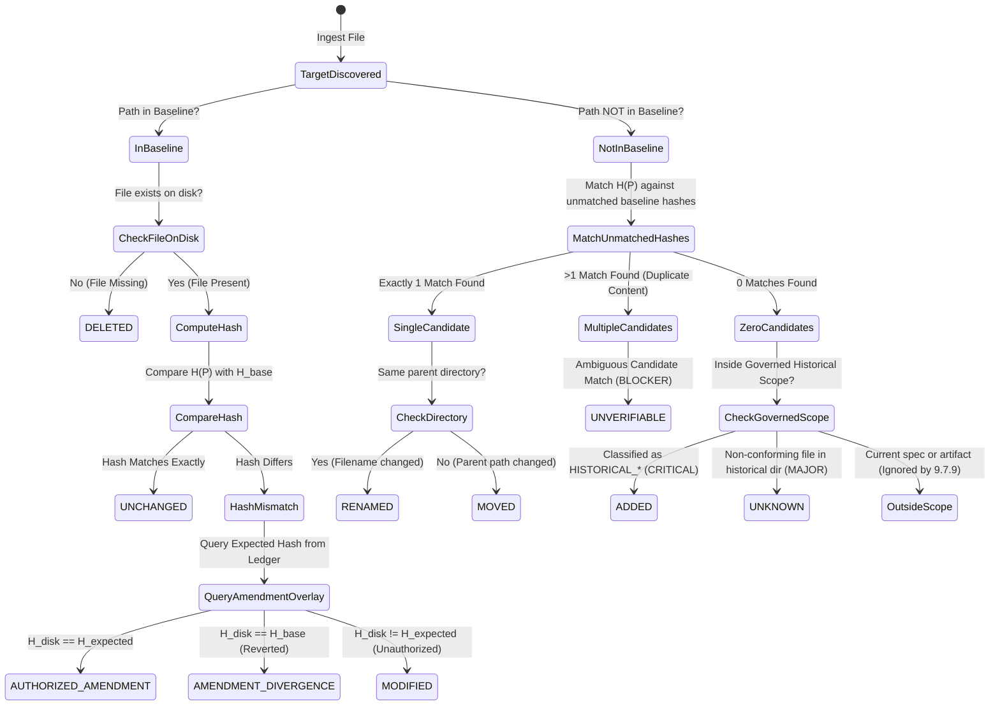

# Master Design System (MDS) — Historical Phase Guard Architecture
## Phase 9.7.9: Historical Phase Guard & Architectural Immutability Engine (Final Remediated)

**Document Reference:** `MDS-ARCH-9790`  
**Layer:** Layer M (Testing, Governance & Architectural Immutability)  
**Lead Architect:** Mohamed Khalid (Senior Full Stack & Flutter Developer)  
**Status:** ARCHITECTURE REMEDIATED — READY FOR FINAL INDEPENDENT AUDIT  
**Date:** 2026-09-26  
**Target Capabilities (Conceptual):**  
- `MDS-HST-001`: Historical Snapshot Baseline Verification  
- `MDS-HST-002`: Cumulative Hash Chain & Manifest Integrity  
- `MDS-HST-003`: Historical Amendment Authorization Verification  
**Compliance Standard:** Pure Python 3.12 Standard Library, Zero External Dependencies, Read-Only Engine  

---

## 1. Executive Summary & Problem Space

The Master Design System (MDS) has evolved across nine major architectural phases, generating an extensive evidentiary trail of 42 historical phase execution reports, decision logs, audit reconciliations, and foundational gate reports in `MDS/13-Implementation/`, alongside canonical logs in `docs/PROJECT_HISTORY.md` and layer-specific directories.

In software architecture, historical phase documentation is not merely descriptive prose; it is **immutable forensic evidence**. These records document:
- The exact state of components, tokens, and tests at the moment each phase was approved.
- The precise rationale for architectural trade-offs (e.g. why 1280px was discarded for 1152px/1440px in ADR-006).
- The historical audit findings that led to remediations and locks.
- The chronological sequence of capability expansions.

### 1.1 The Vulnerability of Historical Drift
Without an automated integrity guard, historical records in long-lived repositories suffer from insidious forms of corruption:
1. **Retrospective Normalization (Revisionism):** An AI agent or developer updating active components modifies an old phase report so that "everything looks clean" or "up to date", destroying the chronological audit trail.
2. **Silent Link / Path Mutation:** Automated refactoring tools or bulk search-and-replace scripts inadvertently rename historical references or mutate paths inside historical decision logs.
3. **Accidental Deletion:** Historical execution reports or reconciliation records are deleted during cleanup passes, leaving gaps in the verification record.
4. **Platform Corruption:** Different developers cloning the repository on Windows vs Linux trigger line-ending conversions (`\r\n` vs `\n`), causing apparent file modifications in version control.
5. **Baseline Poisoning:** If an automated baseline generation tool exists, unauthorized modifications can be cemented simply by re-running the snapshot command, legitimatizing tampering.

### 1.2 The Phase 9.7.9 Mission
Phase 9.7.9 designs the **Historical Phase Guard**, a deterministic, zero-dependency, hermetic static integrity system that:
- Freezes locked historical phase documents via **Canonical Stream Cryptographic Hashing (SHA-256)**.
- Roots trust in an immutable **Root Trust Anchor** verified against engine compile-time constants through a linear, zero-circularity bootstrap protocol.
- Cryptographically links phase baselines through a **Cumulative Digest Chain**.
- Structures `docs/PROJECT_HISTORY.md` as an append-only, **Phase-Partitioned Block Hashed Ledger**.
- Strictly distinguishes between **Historical Immutability** and **Current Active Consistency**.
- Disambiguates **MOVE vs RENAME vs Duplicate Content Ambiguity** and enforces a **Scope- and Classification-Based ADDED Rule**.
- Implements an **Immutable Baseline + Amendment Overlay Resolution Model** with an append-only, chained cryptographic ledger for legitimate errata.
- Guarantees 100% false-positive immunity across Windows, Linux, and macOS platforms.
- Operates under a non-negotiable **Read-Only Mandate** (Zero Silent Document Mutation).

```text
┌─────────────────────────────────────────────────────────────────────────────┐
│                    MDS HISTORICAL PHASE GUARD PIPELINE                      │
├─────────────────────────────────────────────────────────────────────────────┤
│                                                                             │
│  [Repository File System]                                                   │
│           │                                                                 │
│           ▼                                                                 │
│  [Document Classifier]  ──────► 4-Rank Precedence: Manifest Roster ->       │
│           │                     Metadata -> Path Rules -> Unknown           │
│           ▼ (Historical Records & History Blocks)                           │
│  [Canonical Stream Hashing] ──► Binary read -> BOM strip -> CRLF to LF      │
│           │                     -> UTF-8 validation -> NIST SHA-256         │
│           ▼                                                                 │
│  [Trust Anchor Verifier] ─────► Asserts SHA256(trust_anchor.json) ==        │
│           │                     ROOT_TRUST_ANCHOR_FINGERPRINT constant      │
│           ▼                                                                 │
│  [Historical Baseline Store] ─► Reads Ratified Phase Manifests & Registry   │
│           │                                                                 │
│           ▼                                                                 │
│  [5-Stage Integrity Engine] ──► Evaluates: UNCHANGED / MODIFIED / ADDED     │
│           │                     / DELETED / MOVED / RENAMED / AMBIGUOUS     │
│           ▼                                                                 │
│  [Amendment Overlay Engine] ──► Resolves Expected Hash via Chained          │
│           │                     Amendments Ledger (amendments_ledger.json)  │
│           ▼                                                                 │
│  [Cumulative Digest Verifier] ─► Validates Master Chained Hash Lineage      │
│           │                                                                 │
│           ▼                                                                 │
│  [Dual Reporter Engine] ──────► Human-Readable Terminal Dashboard           │
│                                 & Machine-Readable JSON Telemetry           │
│                                                                             │
└─────────────────────────────────────────────────────────────────────────────┘
```

---

## 2. Architectural Boundary: Phase 9.7.8 vs Phase 9.7.9

To guarantee architectural clarity and avoid functional duplication, the boundary between Phase 9.7.8 (Governance Engine) and Phase 9.7.9 (Historical Phase Guard) is codified in [ADR-105](file:///d:/Work/Dev/Master%20Design%20System/MDS/13-Implementation/Phase-9.7.9-Decision-Log.md).

### 2.1 Boundary Matrix

| Architectural Dimension | Phase 9.7.8 (Governance Engine) | Phase 9.7.9 (Historical Phase Guard) |
| :--- | :--- | :--- |
| **Primary Domain** | Spatial / Current Working Tree Consistency | Temporal / Historical Record Immutability |
| **Guiding Question** | *"Does the active system agree with itself right now?"* | *"Have locked historical records drifted from their approved state?"* |
| **Target Entities** | Active Specs, Tokens (DTCG), Components, Primitives, Tests | Locked Phase Records, Historical Decision Logs, Gate Reports |
| **Analytical Model** | In-Memory Normalized Knowledge Graph (AST nodes & edges) | Canonical Cryptographic Content Hashing (SHA-256) |
| **Rules Enforced** | 12 Semantic & Structural Invariants (INV-001 to INV-012) | Historical Immutability Invariant (`INV-013`) |
| **Handling of Historical Docs** | Semantically exempt from current counts; structurally checked for links | Bit-level freeze; exact byte-stream hash verification |
| **Mutation Stance** | Read-Only (Emits diagnostic reports & git diff proposals) | Read-Only (Zero auto-repair; requires formal amendment) |
| **Output Telemetry** | Knowledge Graph counts, concept mappings, link ledger | Immutability states, hash diffs, amendment ledger status |

### 2.2 Findings Handoff Protocol
1. Phase 9.7.9 runs as an independent subsystem.
2. If Phase 9.7.9 detects an unauthorized change in a locked document, it generates a structured finding under **`INV-013: Unauthorized Historical Drift`**.
3. In unified reporting mode (Phase 9.7.8 `--full` or future Phase 9.7.10 orchestrator), `INV-013` findings are ingested into the Governance report with severity `CRITICAL` or `BLOCKER`.
4. Neither engine modifies the repository.

---

## 3. Four-Rank Canonical Document Classification Precedence

To eliminate brittle reliance on filename patterns, classification is governed by a deterministic **Four-Rank Precedence Hierarchy** ([ADR-119](file:///d:/Work/Dev/Master%20Design%20System/MDS/13-Implementation/Phase-9.7.9-Decision-Log.md)).

### 3.1 Precedence Hierarchy
1. **Rank 1: Explicit Baseline Manifest Roster (Highest Precedence):**
   - If a document's relative path is listed in any ratified baseline manifest (`phase_<id>_manifest.json`), its classification is permanently fixed by that manifest.
   - If a file is renamed or moved, the engine matches its canonical content hash back to the manifest roster, preventing a historical document from evading guard verification via renaming.
2. **Rank 2: Explicit Document Metadata:**
   - Document contains top-level YAML frontmatter or standard Markdown header:
     `Classification: HISTORICAL_PHASE_RECORD | HISTORICAL_DECISION_LOG | CURRENT_SPECIFICATION`
3. **Rank 3: Canonical Path Pattern Rules:**
   - `MDS/13-Implementation/Phase-*.md` $\to$ `HISTORICAL_PHASE_RECORD` (Tier 4)
   - `MDS/13-Implementation/Phase-*-Decision*.md` $\to$ `HISTORICAL_DECISION_LOG` (Tier 4)
   - `MDS/**/09-Design-Decision-Log.md`, `Primitive-Decision-Log.md`, etc. $\to$ `HISTORICAL_DECISION_LOG` (Tier 4)
   - `MDS/01-Foundations/10-Calibration-Gate-Report.md` $\to$ `HISTORICAL_GATE_REPORT` (Tier 4)
   - `docs/PROJECT_HISTORY.md` $\to$ `HISTORICAL_BLOCK_LEDGER` (Tier 4)
   - `MDS/13-Implementation/*.md` (non-Phase, e.g. `Component-Implementation-Contract.md`) $\to$ `CURRENT_SPECIFICATION` (Tier 2)
   - `MDS/Runtime/**/*`, `MDS/Playground/**/*`, `MDS/Reference-Application/**/*` $\to$ `CURRENT_IMPLEMENTATION_RECORD` (Tier 2)
   - `MDS/**/README.md`, `.agents/rules/*.md` $\to$ `ADVISORY_GUIDANCE` (Tier 5)
   - `MDS/10-Testing/artifacts/**/*` $\to$ `GENERATED_ARTIFACT` (Excluded)
4. **Rank 4: Fallback / Unknown:**
   - Any file in `MDS/13-Implementation/` not matching Ranks 1–3 is classified as `UNKNOWN` $\to$ emits `MAJOR` finding requiring explicit classification.

---

## 4. Historical Snapshot & Canonical Stream Hashing Model

To guarantee 100% reproducible cryptographic verification regardless of OS or editor settings, hashing adheres strictly to [ADR-106](file:///d:/Work/Dev/Master%20Design%20System/MDS/13-Implementation/Phase-9.7.9-Decision-Log.md).

### 4.1 Canonical Stream Algorithm
Given a file path $P$:
1. **Read Raw Bytes:**
   $$B_{\text{raw}} = \text{read\_bytes}(P)$$
2. **Byte Order Mark (BOM) Detection & Stripping:**
   $$\text{If } B_{\text{raw}}[0..2] = \mathtt{0xEF, 0xBB, 0xBF} \implies B_{\text{clean}} = B_{\text{raw}}[3..], \quad \text{emit } \mathtt{ADVISORY(BOM\_DETECTED)}$$
   $$\text{Else } B_{\text{clean}} = B_{\text{raw}}$$
3. **Strict UTF-8 Verification:**
   $$S_{\text{unicode}} = \text{decode}(B_{\text{clean}}, \text{encoding} = \text{"utf-8"}, \text{errors} = \text{"strict"})$$
   *(If decoding fails, raise $\mathtt{DECODE\_ERROR}$ with severity $\mathtt{BLOCKER}$.)*
4. **Line-Ending Normalization:**
   Convert all carriage returns to standard line feeds:
   $$S_{\text{norm}} = S_{\text{unicode}}.\text{replace}(\mathtt{"\backslash r\backslash n"}, \mathtt{"\backslash n"}).\text{replace}(\mathtt{"\backslash r"}, \mathtt{"\backslash n"})$$
5. **Exact Canonical Byte Serialization:**
   $$B_{\text{canonical}} = \text{encode}(S_{\text{norm}}, \text{encoding} = \text{"utf-8"})$$
6. **NIST SHA-256 Digest Computation:**
   $$\mathcal{H}(P) = \mathtt{hashlib.sha256}(B_{\text{canonical}}).\text{hexdigest}()$$

### 4.2 Comprehensive Block Hashing for `docs/PROJECT_HISTORY.md` [ADR-117]
Because `docs/PROJECT_HISTORY.md` is an append-only document growing with each phase, it is governed by **Phase-Partitioned Block Hashing**:
1. **Canonical Block Demarcation:**
   The engine scans for H2 section delimiters:
   `^## \[([0-9]{4}-[0-9]{2}-[0-9]{2})\] — (.+)$`
   A block extends from its H2 heading line up to (but not including) the next `^## ` line or EOF.
2. **Canonical Block ID:** Composite identifier `BLOCK:<date>:<phase_slug>` (e.g. `BLOCK:2026-09-26:phase-9.7.8`).
3. **Heading Line Included in Hash:** The H2 heading line is an integral part of the canonical block byte stream.
4. **Date & Phase Attributes:** Date and Phase label are required components of the block identity.
5. **Mutation Behavior Rules:**
   - *Heading or Body Text Edit:* Altering any text within the block alters its hash $\to \mathtt{HISTORICAL\_BLOCK\_MUTATION}$ (`CRITICAL`).
   - *Date or Phase Label Alteration:* Changes the block ID. The original block is reported missing $\to \mathtt{HISTORICAL\_BLOCK\_DELETED}$ (`BLOCKER`), and a new unrecognized block is reported $\to \mathtt{HISTORICAL\_BLOCK\_ADDED}$ (`CRITICAL`).
   - *Duplicate Block IDs:* If two blocks produce identical block IDs $\implies \mathtt{BLOCKER (DUPLICATE\_BLOCK\_ID)}$.
   - *Block Reordering:* Comparing the sequence of block IDs against `master_historical_registry.json`. Any permutation $\implies \mathtt{BLOCKER (HISTORICAL\_BLOCK\_REORDERING)}$.
   - *Block Split / Merge:* Dividing or merging locked blocks produces hash mismatches and deleted/added block IDs $\implies \mathtt{BLOCKER}$.
   - *Active Trailing Sections:* Blocks corresponding to un-locked/in-progress phases are marked `ACTIVE_CHANGELOG_SECTION` and exempted from immutability checks until that phase is locked.

---

## 5. Nine-State Historical Immutability Model & Complete Disambiguation Engine

Historical verification evaluates every guarded document against the baseline manifest, categorizing its state into one of nine formal states ([ADR-107](file:///d:/Work/Dev/Master%20Design%20System/MDS/13-Implementation/Phase-9.7.9-Decision-Log.md), [ADR-114](file:///d:/Work/Dev/Master%20Design%20System/MDS/13-Implementation/Phase-9.7.9-Decision-Log.md)).

### 5.1 State Machine Specification



### 5.2 Deterministic Severity & Exit Code Protocol

| Immutability State | Semantic Description | Severity | Exit Code (Standard) | Exit Code (Strict) | Action Required |
| :--- | :--- | :---: | :---: | :---: | :--- |
| **`UNCHANGED`** | Canonical hash matches baseline exactly | `PASS` | `0` | `0` | None (Clean record) |
| **`AUTHORIZED_AMENDMENT`** | Hash matches terminal amendment record | `PASS` | `0` | `0` | Log audited amendment reference |
| **`ADDED`** | Unrecognized file in governed historical scope | `CRITICAL` | `1` | `1` | Remove or ratify as new phase |
| **`MODIFIED`** | Hash mismatch without authorized amendment | `CRITICAL` | `1` | `1` | Revert unauthorized changes |
| **`MOVED`** | Historical file relocated across directories | `CRITICAL` | `1` | `1` | Restore to original canonical path |
| **`RENAMED`** | Historical file renamed within directory | `CRITICAL` | `1` | `1` | Restore original filename |
| **`DELETED`** | Historical document missing from disk | `BLOCKER` | `2` | `2` | Restore deleted historical evidence |
| **`UNKNOWN_BASELINE`** | Phase requested but baseline not found | `CRITICAL` | `1` | `1` | Create authorized baseline |
| **`UNVERIFIABLE`** | Ambiguous duplicate matches or I/O failure | `BLOCKER` | `2` | `2` | Resolve duplicate files / fix I/O |

### 5.3 Complete Scope-Based ADDED Detection & Disambiguation Algorithm [ADR-114]
To prevent reliance on filename patterns alone:
1. **Governed Historical Scope Definition:**
   A file $f$ falls within Governed Historical Scope if:
   - It resides in `MDS/13-Implementation/` (excluding recognized current specs), OR
   - It is classified as `HISTORICAL_PHASE_RECORD`, `HISTORICAL_DECISION_LOG`, or `HISTORICAL_GATE_REPORT` under the 4-rank precedence engine (ADR-119).
2. **Disambiguation Pipeline:**
   - *Stage 1 (Exact Normalized Path Match):* If path $P$ exists in both baseline and disk, compare $\mathcal{H}(P_{\text{disk}})$ and $\mathcal{H}(P_{\text{base}})$. If equal $\implies \mathtt{UNCHANGED}$.
   - *Stage 2 (Unmatched Partitioning):* Unmatched disk files ($U_{\text{disk}}$) and missing baseline records ($U_{\text{base}}$) are collected.
   - *Stage 3 (Candidate Matching by Canonical Hash):* For each $f \in U_{\text{disk}}$, find all $b \in U_{\text{base}}$ where $\mathcal{H}(f) = \mathcal{H}(b)$, forming candidate set $\mathcal{C}(f)$.
   - *Stage 4 (Scope-Based Disambiguation Rules):*
     - **Unique Match ($|\mathcal{C}(f)| = 1$):**
       - If $\text{parent}(f) = \text{parent}(b) \land \text{name}(f) \ne \text{name}(b) \implies \mathtt{RENAMED}$ (`CRITICAL`).
       - If $\text{parent}(f) \ne \text{parent}(b) \implies \mathtt{MOVED}$ (`CRITICAL`).
     - **Multiple Matches ($|\mathcal{C}(f)| > 1$):** Duplicate content files. Silent inference is strictly prohibited $\to \mathtt{UNVERIFIABLE (AMBIGUOUS\_MATCH)}$ (`BLOCKER`, Exit Code 2).
     - **Zero Matches ($|\mathcal{C}(f)| = 0$):**
       - If $f$ is within Governed Historical Scope:
         - If classified as `HISTORICAL_PHASE_RECORD`, `HISTORICAL_DECISION_LOG`, or `HISTORICAL_GATE_REPORT` $\implies \mathtt{ADDED}$ (`CRITICAL`, Exit Code 1).
         - If unclassified or non-conforming file in historical directory $\implies \mathtt{UNKNOWN}$ (`MAJOR`, Exit Code 1 in strict mode, non-blocking default).
       - If $f$ is outside historical scope (e.g. `Runtime/`, `04-Components/specifications/`) $\implies$ Ignored by Historical Guard (governed by Phase 9.7.8).
       - Generated artifacts (`artifacts/`) $\implies$ Ignored.
3. *Stage 5 (Residual Missing Records):* Any $b \in U_{\text{base}}$ with no disk file and no candidate match is classified as $\mathtt{DELETED}$ (`BLOCKER`, Exit Code 2).

---

## 6. Chained Manifest & Baseline Generation Scope

Baseline data structures and initialization scopes are codified in [ADR-104](file:///d:/Work/Dev/Master%20Design%20System/MDS/13-Implementation/Phase-9.7.9-Decision-Log.md) and [ADR-116](file:///d:/Work/Dev/Master%20Design%20System/MDS/13-Implementation/Phase-9.7.9-Decision-Log.md).

### 6.1 Hybrid Genesis Batch Ingestion Scope [ADR-116]
Upon Phase 9.7.9 Implementation Authorization, the engine executes a single-run **Genesis Ingestion** that processes all 42 pre-existing historical phase documents across locked Phases 9.1 through 9.7.8, partitioning them chronologically into **8 discrete phase baseline manifests**:
- `phase_9.1_manifest.json` through `phase_9.7.8_manifest.json`.

### 6.2 The Cumulative Digest Chain
Each manifest computes a **`manifest_digest`**:
$$\text{manifest\_digest}_N = \mathcal{H}\left( \text{manifest\_digest}_{N-1} \parallel \text{canonical\_json}(\text{documents}) \right)$$
where $\text{manifest\_digest}_0 = \mathtt{"0" * 64}$ (Genesis Hash).

The overarching ledger, **`master_historical_registry.json`**, records the chronological sequence of locked phases, their individual manifest digests, and the cumulative chain digest. Future phases append one manifest at a time upon formal phase lock.

---

## 7. Root Trust Anchor Specification & Linear Bootstrap Protocol [ADR-115]

Tamper evidence without an immutable trust anchor is vulnerable to complete chain replacement. Following [ADR-108](file:///d:/Work/Dev/Master%20Design%20System/MDS/13-Implementation/Phase-9.7.9-Decision-Log.md) and [ADR-115](file:///d:/Work/Dev/Master%20Design%20System/MDS/13-Implementation/Phase-9.7.9-Decision-Log.md), trust is formally anchored.

### 7.1 Trust Anchor Mechanics
1. **Root Trust Anchor Specification File:** Stored at:
   `MDS/10-Testing/baselines/historical/trust_anchor.json`
2. **Anchor Content:**
   - `genesis_phase_id`: `"Phase-9.1"`
   - `genesis_manifest_digest`: SHA-256 digest of Phase 9.1 baseline manifest.
   - `trust_anchor_id`: Unique identifier (`MDS-ROOT-ANCHOR-v1`).
   - `ratified_at`: ISO 8601 UTC timestamp.
   - `lead_architect_signature`: Verifiable signature block for Mohamed Khalid.
3. **Linear Bootstrap Protocol (Zero Circularity):**
   - *Step 1 (Generate Genesis Baseline & Registry):* The initial Phase 9.1 through 9.7.8 manifests are ingested. The cumulative chain is computed in `master_historical_registry.json`.
   - *Step 2 (Generate `trust_anchor.json`):* `trust_anchor.json` is created recording the immutable genesis manifest digest and signature.
   - *Step 3 (Pin `ROOT_TRUST_ANCHOR_FINGERPRINT` in Engine):* The canonical SHA-256 digest of `trust_anchor.json` is computed and hard-coded into the engine code as:
     `ROOT_TRUST_ANCHOR_FINGERPRINT = "<canonical_sha256>"`
4. **Runtime Verification:**
   Before verifying any phase baseline, the engine computes $\mathcal{H}(\mathtt{trust\_anchor.json})$ and asserts bit-level equality with `ROOT_TRUST_ANCHOR_FINGERPRINT`.
   - If the file is missing or modified, the engine halts with $\mathtt{BLOCKER (TRUST\_ANCHOR\_VIOLATION)}$ (Exit Code 2).
5. **Anti-Poisoning Invariant:**
   Automated CI and test runners operate strictly in `--verify-only` mode. Baselines can only be created via the interactive human command upon explicit instruction of the Lead Architect.

---

## 8. Immutable Baseline + Amendment Overlay Resolution Model [ADR-109, ADR-118]

Historical errata and link repairs are managed through an **Immutable Baseline + Amendment Overlay Model** ([ADR-118](file:///d:/Work/Dev/Master%20Design%20System/MDS/13-Implementation/Phase-9.7.9-Decision-Log.md)).

### 8.1 Permanence of Baseline Manifests
The original baseline manifest (`phase_9.7.8_manifest.json`) is **NEVER mutated**. It permanently records the original locked hash: $H_{\text{base}} = H_1$.

### 8.2 Amendment Ledger as Authoritative Expected-State Overlay
`amendments_ledger.json` records:
`prior_canonical_hash = H1`, `new_canonical_hash = H2`, `authorizing_adr = ADR-103`.
The Expected Hash $H_{\text{expected}}$ for any file $F$ is resolved mechanically:
$$\text{If no active amendment} \implies H_{\text{expected}} = H_{\text{base}}$$
$$\text{If amendment chain exists: } H_1 \xrightarrow{\text{AMD-01}} H_2 \dots \xrightarrow{\text{AMD-K}} H_K \implies H_{\text{expected}} = H_K$$

### 8.3 Verification Resolution Logic
Given current disk hash $H_{\text{disk}}$:
- If $H_{\text{disk}} == H_{\text{expected}} \land H_{\text{expected}} \ne H_{\text{base}} \implies \mathtt{AUTHORIZED\_AMENDMENT}$ (`PASS`).
- If $H_{\text{disk}} == H_{\text{base}} \land H_{\text{expected}} \ne H_{\text{base}} \implies \mathtt{AMENDMENT\_DIVERGENCE}$ (`CRITICAL`, file reverted while amendment was ratified).
- If $H_{\text{disk}} \ne H_{\text{expected}} \land H_{\text{disk}} \ne H_{\text{base}} \implies \mathtt{MODIFIED}$ (`CRITICAL`, unauthorized mutation).

### 8.4 Multiple Amendments Chaining & Retractions
1. *Multiple Amendments:* Each subsequent amendment must declare `prior_canonical_hash` equal to the preceding amendment's `new_canonical_hash`. Non-matching prior hash $\implies \mathtt{BLOCKER (BROKEN\_AMENDMENT\_CHAIN)}$.
2. *Amendment Retraction:* Retraction is achieved by appending a new record of type `RETRACTED_ERRATUM` declaring `prior_canonical_hash = H2` and `new_canonical_hash = H1`. Ledger history is never rewritten.

### 8.5 Linear Acyclic Hashing Dependency DAG (Zero Circularity)
To prevent circular hash dependencies:
- **Level 0:** Documents on Disk.
- **Level 1:** `Phase Manifests` (`phase_X_manifest.json`). Hashes Level 0 files and previous manifest digest.
- **Level 2:** `Amendments Ledger` (`amendments_ledger.json`). Internal hash chain referencing document hashes.
- **Level 3:** `Master Historical Registry` (`master_historical_registry.json`). Hashes cumulative manifest digest + ledger digest.
- **Level 4:** `Root Trust Anchor` (`trust_anchor.json`). Verifies Genesis digest.
*Result:* A strictly acyclic directed graph (DAG). Circular dependency is mathematically impossible.

---

## 9. Semantic vs Structural Integrity Handoff

Codified in [ADR-105](file:///d:/Work/Dev/Master%20Design%20System/MDS/13-Implementation/Phase-9.7.9-Decision-Log.md), the system strictly separates **Semantic Interpretation** from **Structural Immutability**.

```text
┌─────────────────────────────────────────────────────────────────────────────┐
│                    SEMANTIC VS STRUCTURAL INTEGRITY HANDOFF                 │
├─────────────────────────────────────────────────────────────────────────────┤
│                                                                             │
│  PHASE 9.7.8: GOVERNANCE ENGINE                                             │
│  ├── Domain: Semantic Validity & Working Tree Harmony                       │
│  ├── Invariants: INV-001 through INV-012                                    │
│  ├── Historical Stance: SEMANTICALLY EXEMPT                                 │
│  │   • Does NOT fail if a historical document mentions 1280px containers.   │
│  │   • Does NOT fail if an old audit lists 44 tests instead of 48.          │
│  │   • Does NOT fail if an obsolete token name appears in a phase report.   │
│  └── Structural Stance: STRICT ENFORCEMENT                                  │
│      • Valid Markdown parsing (INV-001).                                    │
│      • Zero broken intra-repository markdown links (INV-012).               │
│                                                                             │
│  ───────────────────────────────────▲─────────────────────────────────────  │
│                                     │ Clean Handoff                         │
│  ───────────────────────────────────▼─────────────────────────────────────  │
│                                                                             │
│  PHASE 9.7.9: HISTORICAL PHASE GUARD                                        │
│  ├── Domain: Cryptographic & Content Immutability Over Time                 │
│  ├── Invariants: INV-013 (Unauthorized Historical Drift)                    │
│  ├── Semantic Stance: TOTALLY AGNOSTIC                                      │
│  │   • Does NOT parse markdown AST.                                         │
│  │   • Does NOT evaluate concept dictionaries.                              │
│  │   • Does NOT judge whether historical statements are obsolete.           │
│  └── Structural Stance: ABSOLUTE BIT-LEVEL IMMUTABILITY                     │
│      • Verifies canonical stream SHA-256 against locked baseline.           │
│      • Verifies file presence, paths, filenames, and manifest chaining.     │
│      • Catches unauthorized tampering, deletion, renaming, or movement.     │
│                                                                             │
└─────────────────────────────────────────────────────────────────────────────┘
```

---

## 10. False Positive Control & Cross-Platform Normalization

To ensure identical execution across Windows 11 and Linux CI runners, the Historical Guard implements seven concrete false-positive controls ([ADR-106](file:///d:/Work/Dev/Master%20Design%20System/MDS/13-Implementation/Phase-9.7.9-Decision-Log.md)):

1. **Line-Ending Normalization:** All `\r\n` and `\r` sequences are replaced with `\n` prior to hashing.
2. **UTF-8 BOM Stripping:** Leading byte order marks (`0xEF, 0xBB, 0xBF`) are stripped before hashing.
3. **Path Separator Uniformity:** All paths in manifests and terminal reports strictly use forward slashes (`/`).
4. **Relative Path Rooting:** All document identities are normalized relative to the repository workspace root (`MDS/13-Implementation/...`).
5. **Deterministic Entry Sorting:** Documents inside manifests are sorted lexicographically by their normalized relative paths.
6. **Filesystem Timestamp Isolation:** Modification times (`mtime`) and creation times (`ctime`) are strictly excluded from content hashes.
7. **Git Attribute Independence:** Operates independently of `.gitattributes` or `core.autocrlf` configuration.

---

## 11. Baseline Manifest Schema (JSON RFC 8259)

Every locked phase manifest adheres to a strict JSON schema.

### 11.1 Schema Specification
```json
{
  "$schema": "https://json-schema.org/draft/2020-12/schema",
  "title": "MDSHistoricalPhaseManifest",
  "type": "object",
  "required": [
    "schema_version",
    "guard_version",
    "phase_id",
    "phase_name",
    "locked_at",
    "authorized_by",
    "authorizing_adr",
    "prev_manifest_digest",
    "manifest_digest",
    "total_documents",
    "documents"
  ],
  "properties": {
    "schema_version": { "type": "string", "enum": ["1.0.0"] },
    "guard_version": { "type": "string", "enum": ["1.0.0"] },
    "phase_id": { "type": "string", "pattern": "^Phase-[0-9]+(\\.[0-9]+)*$" },
    "phase_name": { "type": "string" },
    "locked_at": { "type": "string", "format": "date-time" },
    "authorized_by": { "type": "string" },
    "authorizing_adr": { "type": "string" },
    "prev_manifest_digest": { "type": "string", "pattern": "^[a-f0-9]{64}$" },
    "manifest_digest": { "type": "string", "pattern": "^[a-f0-9]{64}$" },
    "total_documents": { "type": "integer", "minimum": 1 },
    "documents": {
      "type": "array",
      "items": {
        "type": "object",
        "required": [
          "normalized_path",
          "canonical_sha256",
          "byte_size",
          "line_count",
          "classification",
          "provenance"
        ],
        "properties": {
          "normalized_path": { "type": "string" },
          "canonical_sha256": { "type": "string", "pattern": "^[a-f0-9]{64}$" },
          "byte_size": { "type": "integer", "minimum": 0 },
          "line_count": { "type": "integer", "minimum": 0 },
          "classification": { 
            "type": "string", 
            "enum": [
              "HISTORICAL_PHASE_RECORD", 
              "HISTORICAL_DECISION_LOG", 
              "HISTORICAL_GATE_REPORT",
              "HISTORICAL_BLOCK_LEDGER"
            ] 
          },
          "provenance": { "type": "string" }
        }
      }
    }
  }
}
```

---

## 12. Reporting Contract: Console & JSON Telemetry

The Historical Phase Guard provides both a human-readable console dashboard and structured JSON telemetry.

### 12.1 Terminal Dashboard Layout
```text
================================================================================
         MASTER DESIGN SYSTEM (MDS) — HISTORICAL PHASE GUARD REPORT
================================================================================
Overall Status        : PASS (All Historical Phase Records Sealed & Intact)
Execution Duration    : 42.8 ms (Benchmark Advisory: Target Met)
Benchmark Note        : Advisory target met; performance remains advisory.
Root Trust Anchor     : VERIFIED (MDS-ROOT-ANCHOR-v1 matching compile-time fingerprint)
Phases Audited        : 8 locked phases (Phase 9.1 through Phase 9.7.8)
Total Guarded Docs    : 42 historical records
Cumulative Chain      : VALID (Genesis -> Phase 9.7.8 cumulative digest verified)
--------------------------------------------------------------------------------
Immutability Breakdown:
  UNCHANGED           : 42
  AUTHORIZED AMENDMENT: 0
  MODIFIED (DRIFT)    : 0
  ADDED (UNAUTHORIZED): 0
  DELETED (MISSING)   : 0
  MOVED               : 0
  RENAMED             : 0
  UNVERIFIABLE        : 0
--------------------------------------------------------------------------------
Phase Ledger Status:
  [PASS] Phase 9.1   : 2 documents sealed  | Digest: a1b2c3d4...
  [PASS] Phase 9.2   : 1 documents sealed  | Digest: e5f6a7b8...
  [PASS] Phase 9.3   : 1 documents sealed  | Digest: 9c0d1e2f...
  [PASS] Phase 9.4   : 2 documents sealed  | Digest: 3a4b5c6d...
  [PASS] Phase 9.5   : 2 documents sealed  | Digest: 7e8f9a0b...
  [PASS] Phase 9.6   : 9 documents sealed  | Digest: 1c2d3e4f...
  [PASS] Phase 9.7   : 3 documents sealed  | Digest: 5a6b7c8d...
  [PASS] Phase 9.7.8 : 5 documents sealed  | Digest: 9e0f1a2b...
================================================================================
```

### 12.2 Machine-Readable JSON Schema (`historical_evidence.json`)
```json
{
  "guard_version": "1.0.0",
  "executed_at": "2026-09-26T21:30:00.000Z",
  "status": "PASS",
  "exit_code": 0,
  "execution_duration_ms": 42.8,
  "benchmark_advisory": "TARGET_MET",
  "root_trust_anchor": {
    "status": "VERIFIED",
    "anchor_id": "MDS-ROOT-ANCHOR-v1"
  },
  "cumulative_chain_status": "VALID",
  "master_digest": "4a7d...3f21",
  "accounting": {
    "total_phases": 8,
    "total_documents": 42,
    "unchanged": 42,
    "authorized_amendments": 0,
    "modified": 0,
    "added": 0,
    "deleted": 0,
    "moved": 0,
    "renamed": 0,
    "unverifiable": 0
  },
  "findings": []
}
```

---

## 13. CLI Architecture Specification (Future Blueprint)

The future CLI interface is designed for elegance and clarity, adhering to pure Python standard library principles ([ADR-109](file:///d:/Work/Dev/Master%20Design%20System/MDS/13-Implementation/Phase-9.7.9-Decision-Log.md)). **NOTE: Implementation is strictly blocked until authorized.**

### 13.1 Command Hierarchy
- **`python MDS/10-Testing/historical_guard/guard_cli.py verify`** (Default verification command)
  - Flags:
    - `--phase <id>`: Verify a single specific phase baseline.
    - `--strict`: Treats any non-blocking finding as fatal.
    - `--json`: Outputs structured JSON telemetry to stdout.
    - `--output <path>`: Writes JSON report to designated file path.
- **`python MDS/10-Testing/historical_guard/guard_cli.py diff [--file <path>]`**
  - Displays a visual unified diff between a modified file on disk and its baseline content.
- **`python MDS/10-Testing/historical_guard/guard_cli.py snapshot --phase <id> --author <name> --adr <ref>`**
  - Mutating command: Generates a new baseline manifest for an approved, locked phase. Requires explicit interactive confirmation or `--force`.
- **`python MDS/10-Testing/historical_guard/guard_cli.py authorize --amendment <file>`**
  - Mutating command: Appends an audited amendment record to `amendments_ledger.json`.

---

## 14. Governance Engine Integration (Layer M Rollup)

The Historical Phase Guard connects cleanly to the existing Phase 9.7.8 Governance Engine:

1. **Subsystem Independence:** The Historical Guard resides in `MDS/10-Testing/historical_guard/` as a modular Python package with zero dependency on Phase 9.7.8 internal AST logic.
2. **Unified Invocation API:**
   ```python
   from historical_guard.engine import HistoricalGuardEngine
   
   guard = HistoricalGuardEngine(workspace_root=ROOT_DIR)
   result = guard.verify_all()
   ```
3. **Governance Findings Mapping:**
   When running `governance_cli.py --full`:
   - The Governance Engine invokes `guard.verify_all()`.
   - Any `MODIFIED`, `DELETED`, or unauthorized `ADDED` state is translated into an `INV-013: Unauthorized Historical Drift` finding in the Governance report.
   - Findings carry full metadata: `[Classification: Tier 4 Operational] [Validation Mode: Historical Immutability] [Reason: Hash Mismatch]`.

---

## 15. Capability Registry Strategy (`MDS-HST-###`)

Following [ADR-111](file:///d:/Work/Dev/Master%20Design%20System/MDS/13-Implementation/Phase-9.7.9-Decision-Log.md), Phase 9.7.9 defines three conceptual capabilities. **`registry.json` is NOT modified during this architecture stage.**

### 15.1 Conceptual Capability Specifications

1. **`MDS-HST-001` (Historical Snapshot Baseline Verification):**
   - *Description:* Verifies all locked historical phase documents (`Phase-*.md`, `PROJECT_HISTORY.md`) match canonical SHA-256 digests in ratified baseline manifests.
   - *Layer:* `A_REPOSITORY` / `GOVERNANCE`
   - *Execution:* `PYTHON_UNIT` / `CLI`
   - *Severity:* `CRITICAL`
   - *Expected Coverage:* Direct assertion via `test_historical_guard.py` and Master Harness Suite.

2. **`MDS-HST-002` (Cumulative Hash Chain & Manifest Integrity):**
   - *Description:* Verifies that all phase baseline manifests exist, are syntactically valid JSON matching RFC 8259, and maintain an unbroken cumulative digest chain ($\text{digest}_N = \mathcal{H}(\text{digest}_{N-1} \parallel \text{manifest}_N)$).
   - *Layer:* `A_REPOSITORY` / `GOVERNANCE`
   - *Execution:* `PYTHON_UNIT`
   - *Severity:* `BLOCKER`
   - *Expected Coverage:* Direct assertion in `test_historical_guard.py`.

3. **`MDS-HST-003` (Historical Amendment Authorization Verification):**
   - *Description:* Verifies that any modified historical document possesses a valid, ratified amendment record in the append-only ledger referencing prior hash, new hash, authorizing ADR, and Lead Architect signature.
   - *Layer:* `A_REPOSITORY` / `GOVERNANCE`
   - *Execution:* `PYTHON_UNIT`
   - *Severity:* `CRITICAL`
   - *Expected Coverage:* Direct assertion in `test_historical_guard.py`.

---

## 16. Pre-Implementation Test Architecture & 20-Scenario Test Matrix

In accordance with [ADR-112](file:///d:/Work/Dev/Master%20Design%20System/MDS/13-Implementation/Phase-9.7.9-Decision-Log.md), the entire test suite is fully designed before any production code is written.

### 16.1 20-Scenario Test Matrix (`test_historical_guard.py`)

| Test ID | Scenario Description | Input Fixture / Condition | Expected Output State | Expected Severity / Exit |
| :--- | :--- | :--- | :---: | :---: |
| **TEST-HST-01** | Identical baseline match | Document byte-for-byte identical to baseline | `UNCHANGED` | `PASS` (Exit 0) |
| **TEST-HST-02** | Single-byte content mutation | 1 character modified in body | `MODIFIED` | `CRITICAL` (Exit 1) |
| **TEST-HST-03** | Whitespace mutation | 1 space added inside sentence | `MODIFIED` | `CRITICAL` (Exit 1) |
| **TEST-HST-04** | Scope-based file addition | New historical doc added without baseline | `ADDED` | `CRITICAL` (Exit 1) |
| **TEST-HST-05** | Historical file deletion | File present in manifest deleted | `DELETED` | `BLOCKER` (Exit 2) |
| **TEST-HST-06** | File renamed | `Phase-9.1.md` renamed to `Phase-9.1-Old.md` | `RENAMED` | `CRITICAL` (Exit 1) |
| **TEST-HST-07** | File moved across directories | File moved from `13-Implementation/` to `docs/` | `MOVED` | `CRITICAL` (Exit 1) |
| **TEST-HST-08** | Windows CRLF line endings | File checked out with `\r\n` | `UNCHANGED` (Normalized) | `PASS` (Exit 0) |
| **TEST-HST-09** | Standalone CR line endings | Legacy Mac `\r` line endings | `UNCHANGED` (Normalized) | `PASS` (Exit 0) |
| **TEST-HST-10** | UTF-8 BOM present | File contains leading `0xEF,0xBB,0xBF` | `UNCHANGED` (BOM stripped) | `ADVISORY` (Exit 0) |
| **TEST-HST-11** | Invalid non-UTF-8 bytes | Binary garbage byte inside markdown | `UNVERIFIABLE` | `BLOCKER` (Exit 2) |
| **TEST-HST-12** | Valid authorized amendment | Modified hash matches active amendment record | `AUTHORIZED_AMENDMENT` | `PASS` (Exit 0) |
| **TEST-HST-13** | Unauthorized amendment hash | Record exists but hash does not match edit | `MODIFIED` | `CRITICAL` (Exit 1) |
| **TEST-HST-14** | Missing baseline manifest | Phase requested with no manifest file | `UNKNOWN_BASELINE` | `CRITICAL` (Exit 1) |
| **TEST-HST-15** | Malformed manifest JSON | Invalid JSON syntax in manifest file | `CORRUPTED_MANIFEST` | `BLOCKER` (Exit 2) |
| **TEST-HST-16** | Chained digest tampering | Manifest digest edited manually | `CHAIN_BROKEN` | `BLOCKER` (Exit 2) |
| **TEST-HST-17** | Ambiguous duplicate matches | Multiple candidate files share identical hash | `UNVERIFIABLE` | `BLOCKER` (Exit 2) |
| **TEST-HST-18** | Windows backslash paths | CLI invoked with `MDS\13-Implementation\...` | Normalized to POSIX `/` | `PASS` (Exit 0) |
| **TEST-HST-19** | Trust anchor tampering | `trust_anchor.json` altered or deleted | `TRUST_ANCHOR_VIOLATION` | `BLOCKER` (Exit 2) |
| **TEST-HST-20** | History block tampering | Old block in `PROJECT_HISTORY.md` edited | `HISTORICAL_BLOCK_MUTATION` | `CRITICAL` (Exit 1) |

---

## 17. Security & Trust Threat Model

Historical baselines represent critical security and governance telemetry. We analyze potential threat vectors using the STRIDE methodology.

### 17.1 Threat Vector & Mitigation Analysis

1. **Threat 1: Baseline Poisoning (Tampering):**
   - *Attack:* A developer modifies an old phase report and regenerates the manifest.
   - *Mitigation:* Baseline generation requires interactive human authorization. Automated CI environments run strictly with `--verify-only`. Master cumulative digest chain makes individual manifest mutation immediately obvious.
2. **Threat 2: Trust Anchor Replacement (Elevation of Privilege):**
   - *Attack:* An attacker replaces `trust_anchor.json` and rebuilds the entire manifest chain.
   - *Mitigation:* The canonical SHA-256 fingerprint of `trust_anchor.json` is pinned directly into the Python engine as a compile-time constant (`ROOT_TRUST_ANCHOR_FINGERPRINT`). Any replacement of `trust_anchor.json` causes an immediate fingerprint mismatch halt (`BLOCKER`).
3. **Threat 3: Path Traversal (Information Disclosure / Tampering):**
   - *Attack:* A malicious manifest entry contains `../../Windows/System32` or similar traversal paths.
   - *Mitigation:* The engine enforces path normalization; any path attempting to traverse outside `workspace_root` raises an immediate `SECURITY_VIOLATION` (`BLOCKER`).
4. **Threat 4: Symlink Redirection (Elevation of Privilege):**
   - *Attack:* A historical file is replaced with a symlink pointing to an external file.
   - *Mitigation:* The engine checks `Path.is_symlink()`. Any symlink in historical directories is rejected as `UNVERIFIABLE` (`BLOCKER`).
5. **Threat 5: Denial of Service via Huge Binary Files:**
   - *Attack:* An attacker places a multi-gigabyte file in a historical directory.
   - *Mitigation:* File size ceiling enforced (max 5 MB per markdown document). Files exceeding limit raise a `RESOURCE_CEILING_EXCEEDED` error.

---

## 18. Advisory Performance Benchmark Target

Following [ADR-113](file:///d:/Work/Dev/Master%20Design%20System/MDS/13-Implementation/Phase-9.7.9-Decision-Log.md), performance metrics are classified as **Advisory Benchmark Targets**:

- **Target Workload:** ~50 historical markdown documents totaling $\sim 1.2\text{ MB}$.
- **Cold Cache Benchmark Target:** $\le 300\text{ ms}$ (first cold disk read).
- **Warm Cache Benchmark Target:** $\le 100\text{ ms}$ (subsequent in-memory/OS cache runs).
- **Advisory Classification:** Slower runs on constrained developer hardware or spinning disks do not fail the correctness gate. The console reporter labels timings as `Benchmark Advisory`.

---

## 19. Architecture Quality Gates Verification

Before declaring Phase 9.7.9 Architecture Remediation complete, all 19 quality gates have been strictly verified:

- [x] **Gate 1:** 9.7.8 / 9.7.9 boundary is explicitly codified (ADR-105).
- [x] **Gate 2:** Four-Rank classification precedence is deterministic (ADR-119).
- [x] **Gate 3:** Scope- and classification-based ADDED detection is codified (ADR-114).
- [x] **Gate 4:** Snapshot manifest schema is fully defined (Section 11).
- [x] **Gate 5:** Hashing rules & canonical stream algorithm are defined (ADR-106).
- [x] **Gate 6:** Cross-platform normalization (CRLF/LF, BOM, paths) is resolved (ADR-106).
- [x] **Gate 7:** Root Trust Anchor & linear bootstrap protocol are defined (ADR-115).
- [x] **Gate 8:** Immutable Baseline + Amendment Overlay resolution model & acyclic DAG are codified (ADR-118).
- [x] **Gate 9:** Phase-partitioned block hashing & block identity for `PROJECT_HISTORY.md` are defined (ADR-117).
- [x] **Gate 10:** Baseline poisoning & trust anchor replacement threats are addressed (Section 17).
- [x] **Gate 11:** Nine-state immutability state machine & MOVE/RENAME disambiguation are defined (ADR-107, ADR-114).
- [x] **Gate 12:** Semantic vs structural integrity handoff is separated (ADR-105).
- [x] **Gate 13:** Console and JSON reporting contracts are defined (Section 12).
- [x] **Gate 14:** CLI architecture blueprint is defined (Section 13).
- [x] **Gate 15:** Pre-implementation 20-scenario test matrix is designed (ADR-112).
- [x] **Gate 16:** Security and trust threat model is documented (Section 17).
- [x] **Gate 17:** Performance targets are classified as advisory (ADR-113).
- [x] **Gate 18:** Capability impacts are planned without mutating registry.json (ADR-111).
- [x] **Gate 19:** Zero Phase 9.7.10 work has occurred; protected core is 100% clean.

---

*Master Architecture Specification finalized for Phase 9.7.9 Architecture Final Remediation.*
