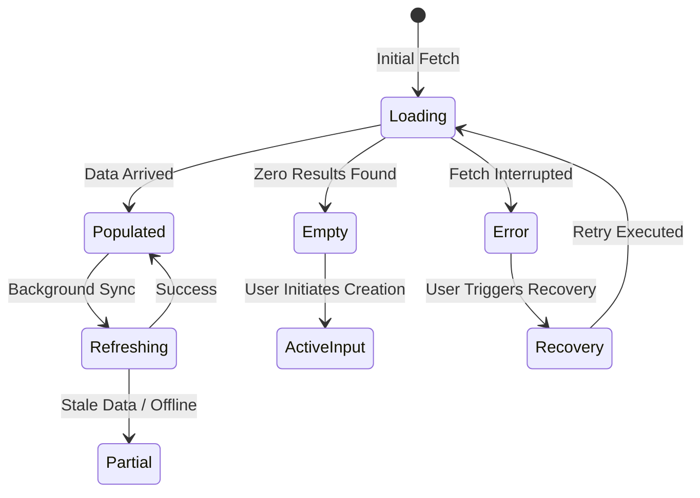

# MDS Theme & State Architecture Specification

**Layer:** 13-Implementation  
**Target Specification:** [`MDS-Implementation-Architecture.md`](file:///d:/Work/Dev/Master%20Design%20System/MDS/13-Implementation/MDS-Implementation-Architecture.md)  
**Status:** APPROVED  
**Lead Architect:** Mohamed Khalid (Senior Full Stack & Flutter Developer)  
**Ratification Date:** 2026-09-20  
**Target Consumer:** Phase 9.2 (Tokens), Phase 9.4 (Components), Phase 9.5 (Playground)  

---

## 1. Architectural Mission

The **Theme & State Architecture** defines how multi-dimensional aesthetic, operational, and lifecycle parameters cascade through the MDS runtime.

Two core systems are defined:
1. **Multi-Dimensional Theme Engine:** Governs Modes, Presets, Density tiers, and Directionality without component logic branching.
2. **Unified State Architecture:** Bridges micro-level component interactive states with macro-level application experience states.

---

## 2. Multi-Dimensional Theme Engine

MDS theming is multi-dimensional ($\text{Mode} \times \text{Preset} \times \text{Density} \times \text{Direction}$), operating entirely via token re-aliasing.

### 2.1 The Four Thematic Axes

```text
Axis            Supported Values                                Default
─────────────────────────────────────────────────────────────────────────────
1. Mode         light | dark | high-contrast                    light
2. Preset       soft-modern | refined | expressive              soft-modern
3. Density      comfortable | compact | dense (deferred 28px)   comfortable
4. Direction    rtl | ltr                                       rtl
```

### 2.2 Strict Theme Cascading Precedence

Theme overrides follow a deterministic, mathematically defined cascade order established in ADR-005:

$$\text{Base Tokens} \longrightarrow \text{Brand Palette} \longrightarrow \text{Mode} \longrightarrow \text{Preset} \longrightarrow \text{Density} \longrightarrow \text{Direction}$$

```mermaid
graph LR
    Base[1. Base Tokens] --> Brand[2. Brand Palette]
    Brand --> Mode[3. Mode: Light / Dark / High-Contrast]
    Mode --> Preset[4. Preset: Refined / Soft-Modern / Expressive]
    Preset --> Density[5. Density: Comfortable / Compact]
    Density --> Direction[6. Direction: RTL / LTR]

    style Base fill:#2D3748,stroke:#4A5568,color:#fff
    style Brand fill:#2B6CB0,stroke:#3182CE,color:#fff
    style Mode fill:#2C7A7B,stroke:#319795,color:#fff
    style Preset fill:#6B46C1,stroke:#805AD5,color:#fff
    style Density fill:#C05621,stroke:#DD6B20,color:#fff
    style Direction fill:#744210,stroke:#975A16,color:#fff
```



### 2.3 Runtime Switching Mechanism
Themes are applied declaratively to the root `<html>` or any container via HTML data-attributes:

```html
<html lang="ar" dir="rtl" 
      data-mode="dark" 
      data-preset="soft-modern" 
      data-density="comfortable">
```

- **Zero JavaScript Overhead:** All switching is executed instantly by the browser's native CSS engine.
- **Nested Contextual Theming:** Subtrees can override themes independently (e.g. a dark sidebar inside a light application shell):
  ```html
  <aside data-mode="dark" class="app-sidebar">...</aside>
  ```

---

## 3. The 3 Visual Presets

MDS presets modulate visual expression without altering component APIs or DOM structure:

1. **Soft Modern (Default Baseline):**
   - Radii: 10px (`radius.md`) default; soft organic forms.
   - Borders: 1px subtle neutral border (`neutral.200` in light, `neutral.800` in dark).
   - Elevation: Soft ambient shadows paired with surface luminance stepping.
2. **Refined Minimal:**
   - Radii: 4px (`radius.sm`) crisp geometry.
   - Borders: 1px high-definition border; strictly flat elevation discipline (elevation level 0).
   - Ideal for developer terminals, IDE panels, and density-critical admin tables.
3. **Expressive:**
   - Radii: 14px (`radius.lg`) pill-soft contours.
   - Accents: Dynamic royal sapphire gradients and fluid micro-interactions.
   - Ideal for AI generative workspaces, consumer creative studios, and marketing showcases.

---

## 4. The 3 Density Tiers

1. **Comfortable (Default):**
   - Control Heights: 40px (`size.control.md`), 48px (`size.control.lg`).
   - Padding: 16px (`space.4`) card insets, 12px field padding.
2. **Compact:**
   - Control Heights: 32px (`size.control.sm`), 40px (`size.control.md`).
   - Padding: 12px (`space.3`) card insets, 8px field padding.
   - Touch Target: Guaranteed $\ge 44 \times 44\text{px}$ on touch devices via `PressTarget`.
3. **Dense (Deferred):**
   - Ultra-dense 28px controls (`size.control.xs`) remain formally **DEFERRED** per Phase 3.5 Gate until validated by complex enterprise tables.

---

## 5. Unified State Architecture

MDS distinguishes between **Micro-Level Component States** and **Macro-Level Experience States**:

```text
┌─────────────────────────────────────────────────────────────┐
│ Macro-Level Experience State (Page / Workflow Lifecycle)    │
│ ┌─────────────────────────────────────────────────────────┐ │
│ │ Micro-Level Component States                            │ │
│ │ (Default → Hover → Active → Focus → Disabled)           │ │
│ └─────────────────────────────────────────────────────────┘ │
└─────────────────────────────────────────────────────────────┘
```

### 5.1 Macro-Level Experience State Taxonomy
Every view, container, and workflow template must account for the complete experience taxonomy:



1. **`Loading`:** Indeterminate state with geometric skeleton screens (no content jumping).
2. **`Refreshing`:** Background revalidation preserving existing interactive content with an indicator.
3. **`Empty`:** Zero-state with an illustration, descriptive message, and clear call-to-action button.
4. **`Partial`:** Degraded experience displaying cached content with an offline warning banner.
5. **`Success / Populated`:** Standard nominal presentation of entity data.
6. **`Error`:** Failure presentation paired with non-destructive data retention.
7. **`Recovery`:** Dedicated remediation path contextually matched to the error cause.

### 5.2 Contextual Recovery Pairing Table

| Failure Cause | Error Treatment | Mandatory Recovery Action |
| :--- | :--- | :--- |
| **Network Disconnect** | Offline banner (`neutral.700`) | `"إعادة المحاولة"` (Retry request) with exponential backoff |
| **Validation Error** | Inline field error message | Jump focus to first invalid field; preserve all valid inputs |
| **Auth Session Expired** | Session timeout modal | Re-authenticate inline via modal; preserve drafted form payload |
| **Data Conflict (409)** | Diff comparison banner | `"مراجعة التغييرات"` (Side-by-side resolution UI) |
| **Entity Not Found (404)**| Empty state with search input | `"العودة إلى القائمة الرئيسية"` (Safe fallback navigation) |
| **Permission Denied (403)**| Access restricted panel | `"طلب صلاحية"` (Request role elevation from admin) |
