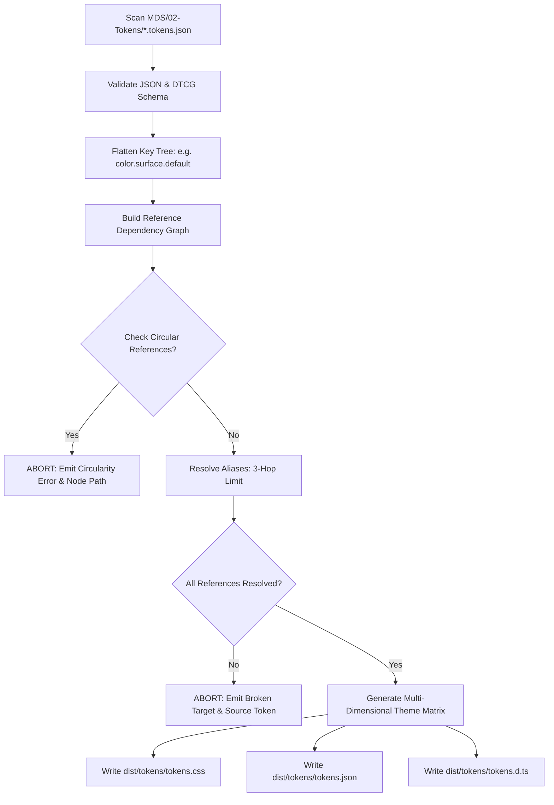

# MDS Token Runtime Architecture & DTCG Compilation Strategy

**Layer:** 13-Implementation  
**Target Specification:** [`MDS-Implementation-Architecture.md`](file:///d:/Work/Dev/Master%20Design%20System/MDS/13-Implementation/MDS-Implementation-Architecture.md)  
**Status:** APPROVED  
**Lead Architect:** Mohamed Khalid (Senior Full Stack & Flutter Developer)  
**Ratification Date:** 2026-09-20  
**Implementation Phase:** Phase 9.2 (Token Runtime)  

---

## 1. Architectural Mission

The **Token Runtime** is the automated bridge between the machine-readable design specifications in `MDS/02-Tokens/` (W3C Design Tokens Community Group format) and the executable code executed by browsers and client applications.

The token runtime guarantees:
1. **Single Source of Truth:** All values originate in the 18 `.tokens.json` files in `MDS/02-Tokens/`.
2. **Zero Value Invention:** The compiler produces 100% deterministic outputs from the canonical source.
3. **Multi-Dimensional Theme Resolution:** Generates cascading CSS custom properties for Light, Dark, High Contrast, Refined, Compact, and RTL/LTR without runtime overhead.
4. **Compile-Time Validation:** Detects circular references, missing alias targets, and schema violations before any runtime code is loaded.

---

## 2. Canonical Token Inventory & File Structure

The token repository contains exactly **18 files** defining **188 registered tokens**:

```text
MDS/02-Tokens/
├── primitives/                      # Tier 1: Platform-Agnostic Raw Values (109 tokens)
│   ├── color.tokens.json            # 41 tokens (Brand 50-950, Neutral 0-1000, Semantics)
│   ├── typography.tokens.json       # 17 tokens (Fonts, Sizes, Weights, Line Heights)
│   ├── space.tokens.json            # 11 tokens (4px modular scale: space.0 through space.16)
│   ├── shape.tokens.json            # 10 tokens (Border radii: none to full, border widths)
│   ├── size.tokens.json             # 8 tokens (Control heights 32/40/48px, icon scale)
│   ├── elevation.tokens.json        # 4 tokens (Level 0 Flat to Level 3 Overlay)
│   ├── motion.tokens.json           # 7 tokens (Durations 0/150/250/350ms, easings)
│   ├── layer.tokens.json            # 5 tokens (Z-indices: base, sticky, dropdown, modal, toast)
│   └── opacity.tokens.json          # 6 tokens (0% to 100% opacity tiers)
│
├── semantic/                        # Tier 2: Contextual Purpose Mappings (29 tokens)
│   ├── color.tokens.json            # 21 tokens (surface, text, border, feedback semantics)
│   └── space.tokens.json            # 8 tokens (layout, component, inset, gap semantics)
│
├── components/                      # Tier 3: Component-Specific Tokens (47 tokens)
│   ├── button.tokens.json           # 24 tokens (variants, sizes, interactive states)
│   ├── input.tokens.json            # 10 tokens (field heights, borders, focus, validation)
│   └── badge.tokens.json            # 13 tokens (intents, pill radius, padding)
│
└── themes/                          # Multi-Dimensional Overrides (18 override tokens)
    ├── mode.dark.tokens.json         # 9 surface & text luminance overrides
    ├── mode.high-contrast.tokens.json# 3 AAA high-contrast borders & text overrides
    ├── density.compact.tokens.json  # 3 compact height & padding overrides
    └── preset.refined.tokens.json   # 3 minimal border radius & elevation overrides
```

---

## 3. Compilation Pipeline Architecture (`compile_tokens.py`)

The token compilation is executed by a lightweight, native Python 3.12 script (`MDS/02-Tokens/compile_tokens.py` to be built in Phase 9.2). It operates without external dependencies (no Node modules, no npm vulnerabilities).

### 3.1 Pipeline Flowchart



### 3.2 Compilation Stages:
1. **Stage 1: Ingestion & Parsing:**
   - Reads all 18 JSON files using standard UTF-8 parsing.
   - Reconstructs dotted token paths (e.g. `color.brand.600`, `component.button.primary.background`).
2. **Stage 2: Graph Construction & Circularity Check:**
   - Constructs a Directed Acyclic Graph (DAG) of token references.
   - Detects circular dependencies using Tarjan's strongly connected components algorithm or simple depth-first cycle traversal.
3. **Stage 3: Alias Resolution:**
   - Traverses token aliases (formatted as `{group.subgroup.token}`).
   - Resolves values down to concrete primitives within a strict $\le 3$ hop limit (Component $\to$ Semantic $\to$ Primitive).
4. **Stage 4: Multi-Dimensional Cascading Generation:**
   - Evaluates base tokens into the default `:root` block.
   - Evaluates theme override files and generates scoped CSS blocks (`[data-mode="dark"]`, `[data-mode="high-contrast"]`, `[data-preset="refined"]`, `[data-density="compact"]`).
5. **Stage 5: Output Emission:**
   - Formats outputs into distribution targets (`dist/tokens/`).

---

## 4. Runtime Token Output Artifacts

The compiler produces three distinct distribution artifacts:

### 4.1 Artifact 1: `dist/tokens/tokens.css` (Web Runtime)
Contains all CSS custom properties wrapped in `@layer mds.tokens` to guarantee isolated specificity:

```css
@layer mds.tokens {
  :root {
    /* Primitives - Typography */
    --mds-font-family-primary: 'Cairo', -apple-system, BlinkMacSystemFont, 'Segoe UI', Roboto, sans-serif;
    --mds-font-family-mono: 'JetBrains Mono', monospace;
    --mds-font-size-base: 16px;
    --mds-line-height-normal: 1.5;
    --mds-arabic-leading-boost: 0.15;

    /* Primitives - Spacing (4px base) */
    --mds-space-0: 0px;
    --mds-space-1: 4px;
    --mds-space-2: 8px;
    --mds-space-3: 12px;
    --mds-space-4: 16px;
    --mds-space-6: 24px;
    --mds-space-8: 32px;
    --mds-space-12: 48px;

    /* Semantics - Surfaces & Borders */
    --mds-color-surface-canvas: #f8fafc;
    --mds-color-surface-default: #ffffff;
    --mds-color-text-primary: #0f172a;
    --mds-color-brand-default: #2563eb;
    --mds-color-border-subtle: #e2e8f0;
    --mds-color-border-focus: #2563eb;

    /* Components - Button */
    --mds-button-height-md: 40px;
    --mds-button-padding-inline-md: 16px;
    --mds-button-radius: 10px;
  }

  /* Theme Overrides: Dark Mode */
  [data-mode="dark"] {
    --mds-color-surface-canvas: #020617;
    --mds-color-surface-default: #0f172a;
    --mds-color-text-primary: #f8fafc;
    --mds-color-border-subtle: #1e293b;
  }

  /* Theme Overrides: High Contrast */
  [data-mode="high-contrast"] {
    --mds-color-border-subtle: #000000;
    --mds-color-border-focus: #ffff00;
    --mds-color-text-primary: #000000;
  }

  /* Preset Overrides: Refined Minimal */
  [data-preset="refined"] {
    --mds-radius-md: 4px;
    --mds-button-radius: 4px;
  }

  /* Density Overrides: Compact */
  [data-density="compact"] {
    --mds-button-height-md: 32px;
    --mds-button-padding-inline-md: 12px;
    --mds-space-component-padding: 12px;
  }
}
```

### 4.2 Artifact 2: `dist/tokens/tokens.json` (Machine-Readable Catalog)
Provides a flat, pre-resolved JSON dictionary enabling sub-millisecond lookup by AI agents, testing tools, and design tooling:

```json
{
  "version": "1.0.0",
  "tokens_total": 188,
  "tokens": {
    "color.brand.600": {
      "value": "#2563eb",
      "type": "color",
      "tier": "primitive"
    },
    "color.surface.canvas": {
      "value": "#f8fafc",
      "resolved_from": "neutral.50",
      "type": "color",
      "tier": "semantic"
    },
    "component.button.primary.background": {
      "value": "#2563eb",
      "resolved_from": "color.brand.default",
      "type": "color",
      "tier": "component"
    }
  }
}
```

### 4.3 Artifact 3: `dist/tokens/tokens.d.ts` (TypeScript Type Definitions)
Provides static autocomplete and type safety for downstream TypeScript projects:

```typescript
export type MDSTokenName =
  | '--mds-font-family-primary'
  | '--mds-font-size-base'
  | '--mds-space-4'
  | '--mds-color-brand-default'
  | '--mds-color-surface-canvas'
  | '--mds-button-height-md';

export interface MDSTokenDictionary {
  [token: string]: string;
}
```

---

## 5. Verification & Anti-Regressive Integration

The token compiler output is continuously verified by `MDS/10-Testing/run_tests.py` (Suite 1: Token & Schema Integrity):
- `MDS-TKN-001`: Asserts exactly 18 source DTCG files exist.
- `MDS-TKN-002`: Asserts 100% valid JSON syntax.
- `MDS-TKN-003`: Asserts the token registry matches exactly 188 tokens.
- `MDS-TKN-004`: Asserts 100% clean graph linkage (0 broken aliases).
- `MDS-TKN-005`: Asserts zero raw hex in consumer stylesheets.
- `MDS-TKN-006`: Asserts all 4 multi-dimensional theme override files are present.
