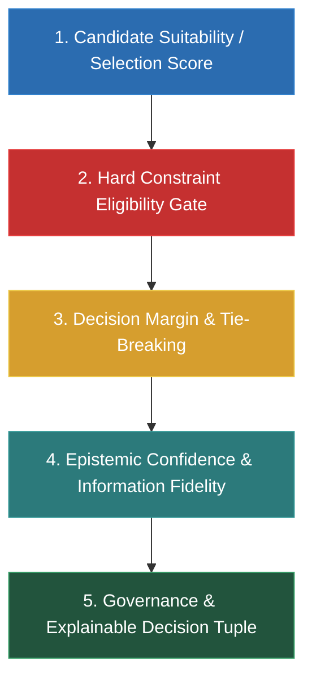
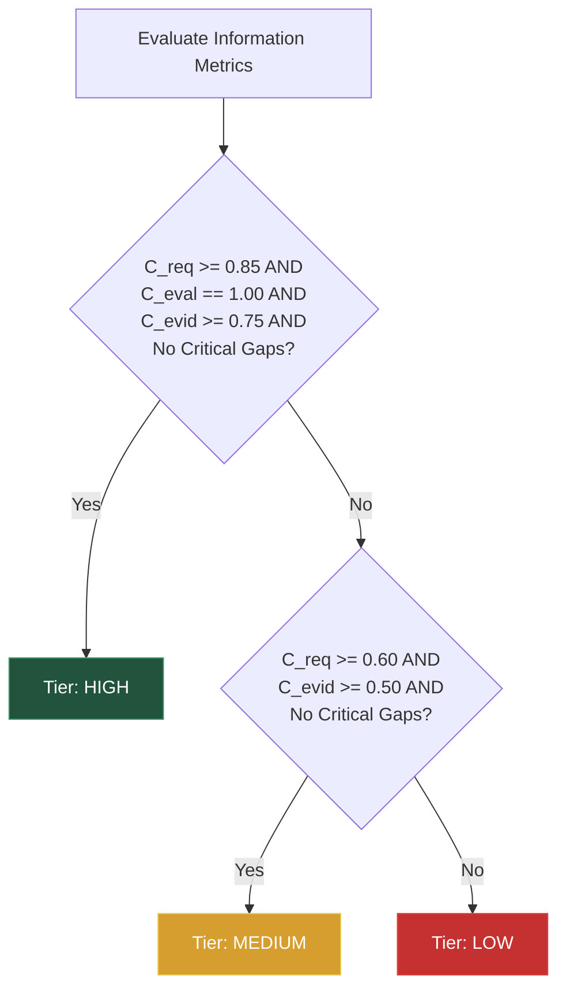

# Design System Selection Engine (DSSE) — Approved Mathematical Specification

**Document Version:** 1.0.0 (Locked & Approved)  
**Status:** **APPROVED MATHEMATICAL SPECIFICATION**  
**Lead Architect:** Mohamed Khalid (Senior Full Stack & Flutter Developer)  
**Approval Date:** 2026-09-20  
**Authority:** Canonical Design System Selection Engine for MDS and Target Projects  

---

## 1. Executive Mission & Architectural Foundations

The **Design System Selection Engine (DSSE)** evaluates internal and external design system candidates across 12 architectural dimensions to determine the optimal UI foundation for any digital product.

### The Decoupled 5-Pillar Decision Model
DSSE strictly enforces the architectural separation of five fundamentally different operational concepts. They are **never** collapsed into a single scalar confidence number:



### Core Axiom: Suitability $\ne$ Epistemic Confidence
- **Suitability (Selection Score):** Answers *"How well does this design system fit the project's technical and visual needs?"*
- **Epistemic Confidence:** Answers *"How complete, verified, and trustworthy is the information used to make this evaluation?"*
- **Eligibility (Hard Constraints):** Answers *"Does the candidate satisfy all mandatory non-negotiable architectural gates?"*
- **Decision Margin ($\Delta$):** Answers *"Is the winner's lead decisive, narrow, or a virtual tie?"*

A candidate winning by a massive score lead does **not** equal high confidence if project requirements are incomplete. Conversely, two elite candidates in a virtual tie can possess 100% epistemic confidence despite a 0.5% decision margin.

---

## 2. The 12 Canonical Evaluation Dimensions

Every candidate design system is evaluated against the 12 standardized MDS dimensions:

| ID | Dimension | Description & Scope |
| :---: | :--- | :--- |
| **$D_1$** | **Platform Fit** | Target runtime alignment: Flutter (Mobile/Tablet/Desktop/Web) vs Next.js/React (Web/Dashboard) vs Native. |
| **$D_2$** | **Design Language & Aesthetics** | Visual alignment: Refined Minimal vs Soft Modern vs Expressive personality. |
| **$D_3$** | **Accessibility & Compliance** | WCAG 2.1/2.2 AA/AAA capabilities, screen reader support, keyboard focus trapping, high-contrast modes. |
| **$D_4$** | **Localization & RTL** | First-class Arabic bidirectional layout, CSS logical properties, text expansion, script leading adjustments. |
| **$D_5$** | **Information Density & Data Ergonomics** | Comfortable (touch-first) vs Compact (admin/data-dense) density tiers, table readability, hit-box safety. |
| **$D_6$** | **Component Ecosystem Breadth** | Inventory completeness: atomic actions, form controls, navigation, feedback, overlays. |
| **$D_7$** | **Architectural Extensibility** | 3-tier DTCG token model, semantic aliasing, component tokens, headless primitives. |
| **$D_8$** | **Responsive Recomposition** | Structural reorganization across viewports (320px–1440px), dedicated tablet master-detail layouts. |
| **$D_9$** | **Enterprise Needs** | RBAC integration, complex filter panels, batch actions, audit logs, DataGrid / spreadsheet requirements. |
| **$D_{10}$** | **AI-Native Needs** | Prompt surfaces, streaming live region decoupling (AF-001), human-in-the-loop validation, token budgets. |
| **$D_{11}$** | **Customization Needs** | Deep multi-dimensional theme overrides, white-labeling, preset switching without API mutation. |
| **$D_{12}$** | **Developer Ecosystem** | Community maturity, official documentation quality, package health, TypeScript/Dart type safety. |

---

## 3. Pillar 1: Candidate Suitability (Selection Score)

### 3.1 Standardized 10-Point Dimension Score ($s(S, d)$)
Each candidate $S$ receives an objective score $s(S, d) \in [0.0, 10.0]$ on one decimal precision:
- `0.0 – 1.9`: **Absent / Incompatible** (No native support; severe architectural impedance).
- `2.0 – 3.9`: **Rudimentary / Fragile** (Requires heavy third-party workarounds; high technical debt).
- `4.0 – 5.9`: **Adequate / Generic** (Standard out-of-the-box support; lacks specialized tailoring).
- `6.0 – 7.9`: **Strong / Mature** (Native support, well-documented, clean ergonomics).
- `8.0 – 10.0`: **Best-in-Class / Tailored** (Industry-leading alignment; zero impedance).

### 3.2 Standardized 5-Tier Project Dimension Weights ($w(d)$)
The project requirements profile assigns an importance multiplier $w(d)$ to each dimension $d$:

| Semantic Priority | Multiplier $w(d)$ | Engineering Criteria |
| :--- | :---: | :--- |
| **Critical** | `1.00` | Non-negotiable core capability directly tied to project survival. |
| **High** | `0.75` | Major strategic priority; significant productivity or UX impact. |
| **Medium** | `0.50` | Standard requirement; important but has acceptable trade-offs. |
| **Low** | `0.25` | Minor convenience or secondary workflow. |
| **Not Applicable (N/A)** | `0.00` | Explicitly irrelevant to project domain (e.g., AI-Native for a static utility). |

*Handling Omitted Dimensions:* Any dimension omitted from the project declaration defaults strictly to $w(d) = 0.00$ in scoring, but explicitly penalizes **Requirements Coverage ($C_{\text{req}}$)**.

### 3.3 Score Normalization Algorithm
Let $D_{\text{active}} = \{d \in \{1, \dots, 12\} \mid w(d) > 0\}$ be the set of active project dimensions.

The raw weighted score is:
$$\text{RawScore}(S) = \sum_{d \in D_{\text{active}}} \Big( s(S, d) \times w(d) \Big)$$

The maximum theoretical attainable score for this project profile is:
$$\text{MaxAttainableScore} = 10.0 \times \sum_{d \in D_{\text{active}}} w(d)$$

The Normalized Selection Score is:
$$\text{SelectionScore}(S) = \begin{cases} \left( \dfrac{\text{RawScore}(S)}{\text{MaxAttainableScore}} \right) \times 100\% & \text{if } \sum_{d \in D_{\text{active}}} w(d) > 0 \\ 0.0\% & \text{if } \sum_{d \in D_{\text{active}}} w(d) = 0 \end{cases}$$

---

## 4. Pillar 2: Hard Constraints & Eligibility Gate

Hard constraints are mandatory, non-negotiable architectural requirements (e.g., *"Must natively compile to Flutter without WebViews"*, *"Must support Arabic RTL without third-party patching"*).

### 4.1 Tri-State Eligibility Evaluation
Every declared hard constraint $h \in H$ is evaluated as:
$$\text{eval}(S, h) \in \{\text{PASS}, \text{FAIL}, \text{UNKNOWN}\}$$

### 4.2 Operational Gating Rules
1. **$\text{FAIL} \implies \mathbf{DISQUALIFIED}$:**
   - Candidate $S$ is immediately disqualified from winning:
     $$\text{SelectionScore}(S) \longleftarrow 0.0\% \quad \text{and} \quad \text{EligibilityStatus} \longleftarrow \mathbf{DISQUALIFIED}$$
   - The system is placed under `alternativesRejected` with the violated constraint cited.
2. **$\text{UNKNOWN} \implies \mathbf{MANDATORY\ HUMAN\ REVIEW}$:**
   - If a candidate cannot be verified on a hard constraint, the engine **MUST NOT** automatically clear the candidate or assume a pass.
   - It triggers $\text{HumanReviewRequired} = \mathbf{true}$ with reason: `"Hard constraint verification state is UNKNOWN"`.
3. **$\text{PASS} \implies \mathbf{ELIGIBLE}$:**
   - Candidate proceeds to decision ranking based on its Selection Score.

---

## 5. Pillar 3: Decision Margin & Deterministic Tie-Breaking

### 5.1 Decision Margin ($\Delta$)
The Decision Margin measures the score lead of the #1 ranked candidate $S_{(1)}$ over the runner-up $S_{(2)}$:
$$\Delta = \text{SelectionScore}(S_{(1)}) - \text{SelectionScore}(S_{(2)})$$

### 5.2 Decision Margin Governance Zones
$$\begin{array}{rll}
\Delta \le 1.0\% & \implies \mathbf{Virtual\ Tie} & (\text{Mandatory Human Review Required}) \\
1.0\% < \Delta \le 3.0\% & \implies \mathbf{Tie-Break\ Zone} & (\text{Execute Deterministic Tie-Break Cascade}) \\
\Delta > 3.0\% & \implies \mathbf{Decisive\ Lead} & (\text{Decisive Mathematical Separation})
\end{array}$$

### 5.3 Deterministic Tie-Break Sequence
When candidates fall within the Tie-Break Zone ($1.0\% < \Delta \le 3.0\%$), the engine executes this strict sequence:
1. **Critical Dimensions Lead:** Compare scores restricted strictly to dimensions where $w(d) = 1.00$.
2. **Primary Platform Fit:** Compare score on Dimension 1 (`Platform Fit`).
3. **Accessibility & RTL Combined:** Sum scores on Dimension 3 (`Accessibility`) and Dimension 4 (`Localization & RTL`).
4. **Developer Ecosystem Maturity:** Compare score on Dimension 12 (`Developer Ecosystem`).
5. **Human Escalation:** If candidates remain within $\le 1.0\%$ after the cascade, set $\text{HumanReviewRequired} = \mathbf{true}$.

---

## 6. Pillar 4: Epistemic Confidence Model (Information Fidelity)

Epistemic confidence reflects whether the inputs and benchmark data are sufficient to trust the decision.

### 6.1 The Conjunctive Mathematical Model
$$C_{\text{epistemic}} = C_{\text{req}} \times C_{\text{eval}} \times C_{\text{evid}}$$

Where $C_{\text{req}}, C_{\text{eval}}, C_{\text{evid}} \in [0.0, 1.0]$. The conjunctive formulation ensures that a failure in any single information pillar collapses confidence appropriately.

### 6.2 Factor 1: Requirements Coverage ($C_{\text{req}}$)
Measures the proportion of the 12 dimensions that have been explicitly declared by the project stakeholder:
$$C_{\text{req}} = \frac{|\{d \in \{1, \dots, 12\} \mid \text{explicit priority declared, including N/A}\}|}{12}$$

- **Explicit N/A Rule:** A dimension explicitly marked `N/A` ($w=0.00$) counts as **specified** (the stakeholder consciously evaluated and excluded it).
- **Omission Rule:** An unmentioned dimension is **unspecified** and penalizes $C_{\text{req}}$.

### 6.3 Factor 2: Evaluation Coverage ($C_{\text{eval}}$)
Measures whether the candidate has verified benchmark ratings across the project's active dimensions:
$$C_{\text{eval}} = \frac{|\{d \in D_{\text{active}} \mid S \text{ has an empirical benchmark rating}\}|}{|D_{\text{active}}|}$$

- If only 1 dimension is active and it is rated, $C_{\text{eval}} = 1.00$.

### 6.4 Factor 3: Evidence Quality ($C_{\text{evid}}$)
Measures the empirical depth and verifiability of the data supporting the active dimensions.

#### Standardized Discrete Evidence Taxonomy:
- `TIER_CODE_AUDITED` = `1.00`: Direct repository inspection, unit tests, or production codebase audit.
- `TIER_OFFICIAL_DOCS` = `0.75`: Official vendor documentation or formal W3C/DTCG specification.
- `TIER_COMMUNITY` = `0.50`: Third-party benchmarks, community articles, or ecosystem consensus.
- `TIER_INFERRED` = `0.25`: AI agent inference or architectural extrapolation.
- `TIER_UNKNOWN` = `0.00`: Missing data or unverified assumption.

#### Importance-Weighted Average:
Evidence quality is weighted by the project's dimension priorities so that weak evidence on a `Low` dimension does not disproportionately degrade confidence:
$$C_{\text{evid}} = \frac{\sum_{d \in D_{\text{active}}} \Big( w(d) \times \text{evidenceTier}(S, d) \Big)}{\sum_{d \in D_{\text{active}}} w(d)}$$

---

## 7. Pillar 5: Rule-Based Confidence Gating (Family C)

Rather than enforcing arbitrary scalar float cutoffs, the **Confidence Tier** is determined via deterministic, explainable rule-based gating:



### 7.1 Tier Definitions:
1. **`HIGH` Tier:**
   - $C_{\text{req}} \ge 0.85$ (At least 11/12 dimensions explicitly declared)
   - $C_{\text{eval}} = 1.00$ (All active project dimensions fully rated)
   - $C_{\text{evid}} \ge 0.75$ (Evidence is backed by official documentation or code audits)
   - Zero critical information omissions.
2. **`MEDIUM` Tier:**
   - $C_{\text{req}} \ge 0.60$ (At least 8/12 dimensions declared)
   - $C_{\text{evid}} \ge 0.50$ (Evidence is backed by verified community or official sources)
   - Zero critical information omissions.
3. **`LOW` Tier:**
   - Triggered if $C_{\text{req}} < 0.60$ OR $C_{\text{evid}} < 0.50$ OR any `Critical` dimension ($w=1.00$) lacks verified evidence.

---

## 8. Governance & Human Review Triggers

The DSSE produces automated recommendations, but mandates human architect intervention under specific failure conditions:

### Mandatory Human Review Trigger Matrix:
| Trigger Condition | Classification | Human Review Action |
| :--- | :--- | :--- |
| **$\text{eval}(S, h) = \text{UNKNOWN}$** | Critical Constraint Ambiguity | Verify technical platform capability before adoption. |
| **$\Delta \le 1.0\%$** | Virtual Tie | Select between top candidates based on strategic non-technical factors. |
| **Unresolved Tie-Break Cascade** | Indistinguishable Candidates | Architect reviews qualitative trade-offs. |
| **Confidence Tier = `LOW`** | Insufficient Epistemic Certainty | Conduct requirements gathering interview with project stakeholders. |
| **Critical Dimension Unrated** | Information Deficit | Audit source repository to establish verified rating. |

Whenever $\text{HumanReviewRequired} = \mathbf{true}$, the engine must populate `humanReviewReasons` with clear, human-readable explanations.

---

## 9. Canonical Explainable Decision Tuple Output Schema

The output of the DSSE conforms to this standard JSON structure:

```json
{
  "$schema": "https://json-schema.org/draft/2020-12/schema",
  "selectionReport": {
    "projectProfile": {
      "projectName": "Global Health Logistics Platform",
      "context": "Cross-platform healthcare management and field telemetry",
      "declaredDimensionsCount": 12,
      "activeDimensionsCount": 10
    },
    "recommendation": {
      "selectedSystem": "MDS",
      "selectionScore": 88.4,
      "rank": 1
    },
    "decisionMargin": {
      "delta": 10.2,
      "classification": "Decisive Lead",
      "tieBreakTriggered": false
    },
    "epistemicConfidence": {
      "score": 0.925,
      "tier": "High",
      "metrics": {
        "requirementsCoverage": 1.00,
        "evaluationCoverage": 1.00,
        "evidenceQuality": 0.925
      }
    },
    "hardConstraints": {
      "status": "All Passed",
      "evaluatedCount": 3,
      "disqualifiedCount": 1
    },
    "ranking": [
      { "rank": 1, "system": "MDS", "score": 88.4, "status": "Eligible" },
      { "rank": 2, "system": "Google Material Design 3", "score": 78.2, "status": "Eligible" },
      { "rank": 3, "system": "IBM Carbon", "score": 0.0, "status": "Disqualified (Failed Flutter hard constraint)" }
    ],
    "governance": {
      "humanReviewRequired": false,
      "humanReviewReasons": []
    },
    "selectedConfiguration": {
      "preset": "Soft Modern",
      "density": "Compact",
      "mode": "Light",
      "primaryDirection": "RTL",
      "primaryFont": "Cairo (Google Fonts) / JetBrains Mono (Code)"
    }
  }
}
```

---

## 10. Proprietary Boundary Notice

External design systems (Material 3, Fluent 2, Carbon, Polaris, Primer, Ant Design) remain independent trademarks and projects. DSSE references their published capabilities solely for objective technical benchmarking and architectural routing.
