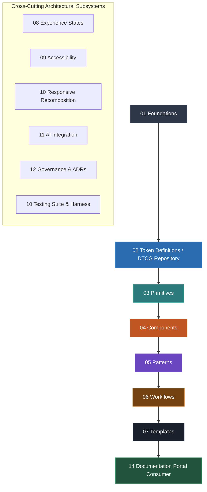

# MDS — Master Design System Specification
**Version:** 1.0.0 (Official Architecture Baseline)  
**Status:** MDS ARCHITECTURE BASELINE v1.0.0 — APPROVED  
**Lead Architect:** Mohamed Khalid (Senior Full Stack & Flutter Developer)  
**Baseline Ratification Date:** 2026-09-20  

---

## 1. Core Philosophy & Visual Manifesto

**MDS (Master Design System)** is an adaptive, human-readable, and machine-readable design system engine built on disciplined restraint, structural clarity, and expressive precision.

### Core Visual Philosophy
> **Refined Foundation + Soft Modern Expression + Controlled Expressiveness**

- **Primary Personality:** Modern · Refined · Soft · Restrained
- **Core Operating Principle:** *Calm by default, expressive when needed.*

### Visual Richness Hierarchy
MDS achieves premium visual richness intentionally through:
1. **Typography & Hierarchy:** Clear scale, contextual leading (+0.15 for Arabic), and high legibility.
2. **Spatial Composition:** Systematic parent-owned spacing on a 4px base modular grid.
3. **Surface Layering:** Controlled elevation planes (Depth Triad: Flat → Raised → Floating → Overlay).
4. **Interaction States:** Distinct, tactile feedback for hover, active, focus, and contextual recovery.
5. **Meaningful Accents:** Purposeful accents that direct attention rather than decorate.

**What MDS Rejects:**
- Excessive multi-stop gradients
- Heavy, arbitrary glassmorphism and blur effects
- Deep, noisy decorative drop shadows
- Gratuitous, unmotivated UI animations
- Meaningless decorative visual noise
- Raw hex color codes in consumer stylesheets (100% token-driven via `var(--mds-*)`)
- Hardcoded physical margins/paddings (100% CSS Logical Properties)
- Functional `flex-direction: row-reverse` (WCAG 2.4.3 focus order protection)

---

## 2. Architecture & Layer Boundaries

MDS is strictly structured as a unidirectional composition hierarchy across 14 layers. **Lower layers must NEVER depend on higher layers.**



### Architectural Responsibility Boundaries:
- **Foundations (Layer 01):** High-level design principles, spatial concepts, semantic roles, typographic philosophies, and behavioral constraints. Foundations define policies, not platform variables.
- **Token Repository (Layer 02):** Canonical single source of truth for concrete token definitions (188 DTCG tokens across 18 JSON files: 14 base + 4 multi-dimensional theme overrides; 47 component tokens).
- **Primitives (Layer 03):** 5 Layout primitives (`Container`, `Stack`, `Inline`, `Grid`, `Cluster`), Surface Depth Triad, 4 Accessibility primitives, and vendor-agnostic Icon contract.
- **Components (Layer 04):** 19 approved core components across 6 families (17 Implemented, 2 Specified). Strictly consume tokens; never hardcode local values.
- **Patterns (Layer 05):** 8 canonical composite patterns solving recurring interface problems. Governed by 10 Inviolable Composition Laws and Pattern Selection Engine.
- **Workflows (Layer 06):** 6 canonical multi-step user task progressions. Governed by Universal 11-State FSM, non-destructive state retention, and the Security Triad.
- **Templates (Layer 07):** 6 canonical full-page archetypes with slot-based layouts. Governed by 32-Point Anatomy and Template Selection Engine.
- **Documentation Portal (Layer 14):** Zero-dependency static portal serving as a read-only consumer and interactive showcase of the entire design system. Never becomes a source of truth.

### Dependency Rules:
- **Allowed:** `Template` → `Workflow` → `Pattern` → `Component` → `Primitive` → `Token` → `Foundation`.
- **Forbidden:** Lower layers importing from higher layers (e.g. `Component` importing from `Pattern`).
- **Cross-Cutting Systems:** Accessibility, Responsive Recomposition, Motion, Themes, Experience States, AI Design Layer, Testing, and Governance traverse across all layers without violating hierarchy.

---

## 3. Visual Presets & Personalities

MDS supports multiple visual personalities without mutating component architecture or public APIs:

1. **Refined Minimal:** Strict discipline, minimal radii, subtle borders, high information density. Ideal for developer tools and administrative utilities.
2. **Soft Modern (Default):** Warm, soft radii (`radius.md` = 10px), organic surface separation, calm chromatic neutrals, refined elevation. Default standard for consumer, enterprise, and dashboard products.
3. **Expressive:** Dynamic accent contrast, fluid micro-interactions, tailored for AI-native workflows, creative studios, and premium consumer flagships. Never forced globally.

---

## 4. Modes, Themes & Color Strategy

### Modes & Themes
- **Light Mode:** High-clarity chromatic neutral surfaces (`color.surface.canvas` = `#f8fafc`) with calculated contrast ratios.
- **Dark Mode:** Intentional luminance re-mapping using layered surface tones (`#020617` → `#0f172a` → `#1e293b`). **Dark mode is NOT a naive mathematical color inversion of Light mode.**
- **High Contrast Mode:** First-class accessibility theme targeting WCAG AAA contrast ratios (≥ 7:1 for text, ≥ 4.5:1 for interactive elements) with explicit solid borders.
- **Density Overrides:** Default (Comfortable) and Compact density themes dynamically adjusting padding and spatial tokens without reducing touch targets below 44×44px.

### Multi-Dimensional Theme Resolution Sequence
Theme overrides follow a deterministic cascading resolution sequence:
$$\text{Primitive Token Baseline} \longrightarrow \text{Semantic Theme Overrides} \longrightarrow \text{Component Theme Overrides}$$

### Color Foundation Roles
- **Brand Colors:** Royal Sapphire primary brand scale (`color.brand.600` = `#2563eb`).
- **Semantic Colors:** Status-driven tokens (`Success`, `Warning`, `Danger`, `Info`). **Color must never be the sole carrier of state or information (WCAG 1.4.1).**
- **Neutral Scales:** Balanced Slate Chromatic Neutrals (`neutral.0` through `neutral.1000`).
- **Data Visualization:** Accessible palettes calibrated for multi-series charts.

---

## 5. Density & Interaction Hit-Box Standard

MDS provides two operational density tiers:
- **Comfortable (Default):** Standard for mobile, general web, and touch-first tablet interactions.
- **Compact:** Optimized for data-dense dashboards, tables, and high-throughput administrative workflows.

### Control Heights & Touch Target Invariants:
- **Compact Control Height (`sm`):** 32px
- **Standard Control Height (`md`):** 40px
- **Touch-First Control Height (`lg`):** 48px
- **Mandatory Minimum Touch Target:** **44×44px** (MDS requires a minimum 44×44px interactive target as an internal design-system rule. This is stricter than the applicable WCAG minimum target-size requirement where relevant, enforced via invisible `PressTarget` hit-box wrapper or pseudo-elements regardless of visual control height).

---

## 6. Token Architecture (3-Tier DTCG Model)

Tokens follow the W3C Design Tokens Community Group (DTCG) specification across three tiers:

```
[Primitive Tokens]  -->  e.g., color.brand.600 | space.scale.4 | radius.md
       ↓
[Semantic Tokens]   -->  e.g., color.action.primary.default | color.surface.default
       ↓
[Component Tokens]  -->  e.g., component.button.primary.background.default
```

### Canonical Token Counts:
- **Total Registered Tokens:** **188 Tokens** across 18 DTCG JSON files:
  - 14 Base token files (`color`, `typography`, `space`, `radius`, `elevation`, `motion`, `size`, `border`, `opacity`, `z-index`, `breakpoint`, `button`, `input`, `badge`).
  - 4 Multi-dimensional theme override files (`theme.dark`, `theme.high-contrast`, `theme.compact`, `theme.expressive`).
- **Component-Specific Tokens:** Exactly **47 tokens** (`button.tokens.json` = 21, `input.tokens.json` = 16, `badge.tokens.json` = 10).
- **Integrity Status:** 0 broken alias references, 0 circular dependencies, 0 raw hex values in consumer styles.

---

## 7. Foundations Specification (Layer 01)

### 7.1 Typography
- **Multilingual Strategy:** First-class parity for Arabic (RTL) and Latin (LTR).
- **Primary Typeface:** **Cairo** (Google Fonts) for Arabic + Latin text.
- **Monospace Typeface:** **JetBrains Mono** for code, tokens, identifiers, and tabular telemetry data.
- **Typographic Foundations:**
  - Semantic roles: Display, Heading, Body, Label, Caption, Numeric (tabular figures).
  - Context-aware line height: Arabic typography mandates an intentional **+0.15 increased leading** relative to Latin baselines to preserve diacritic clarity and avoid vertical clipping.
  - Scale: Discretized scale (12px, 14px, 16px, 20px, 24px, 30px, 36px, 48px; see `01-Foundations/01-Typography.md`).
  - Ellipsis Rule: No `TextOverflow.ellipsis` on descriptive/informational text; layouts must wrap gracefully.

### 7.2 Spacing & Modular Grid
- **Base Grid:** 4px modular spacing scale (`space.0` = 0px to `space.16` = 64px).
- **Parent-Owned Spacing:** Children never dictate outer margins. Containers (`Stack`, `Inline`, `Grid`) own inter-element spacing.
- **Detailed Specification:** See `01-Foundations/03-Spacing-and-Grid.md`.

### 7.3 Shape & Border Radii
- **Refined Softness:** Default 10px radius (`radius.md`) for standard buttons, inputs, and cards.
- **Contextual Concentricity:** Nested surface fills maintain coherent curvature: $R_{\text{inner}} \approx \max(0, R_{\text{outer}} - \text{Padding})$.
- **Border Hierarchy:** 1px subtle/resting (`border.width.thin`), 1.5px interactive, 2px focus ring (`border.width.thick`).
- **Detailed Specification:** See `01-Foundations/04-Shape-and-Border.md`.

### 7.4 Elevation & Depth Triad
Elevation communicates spatial hierarchy and interaction priority:
- **Level 0 (Flat):** Canvas background (`#f8fafc` / `#020617`), flush surfaces (0px shadow, 1px subtle border).
- **Level 1 (Raised):** Cards, standard list items, resting interactive containers (`shadow.sm`).
- **Level 2 (Floating):** Menus, popovers, dropdown panels (`shadow.md`).
- **Level 3 (Overlay):** Modal dialogs, drawer sheets, system toasts (`shadow.lg`).
- **Dark Mode Stepping:** Progressive surface lightening (`neutral.950` → `900` → `800` → `700`).
- **Detailed Specification:** See `01-Foundations/05-Elevation.md`.

### 7.5 Layout, Breakpoints & RTL
- **12-Column Responsive Fluid Grid:** Breakpoints at 320px (Mobile), 768px (Tablet), 1024px (Desktop), 1440px (Wide).
- **Canonical Containers:**
  - Standard Container Max-Width: **1152px** (`container.lg`)
  - Wide Container Max-Width: **1440px** (`container.xl`)
  - *Constraint: 1280px container width is strictly prohibited in MDS.*
- **RTL First-Class:** 100% CSS Logical Properties (`margin-inline-start`, `padding-inline-end`). Zero `flex-direction: row-reverse`.

### 7.6 Motion
- **Core Principle:** *"Motion should explain change, not decorate it."*
- **Curves & Durations:** Deceleration curve (`cubic-bezier(0.2, 0, 0, 1)`) with durations: Instant (0ms), Fast (150ms), Normal (250ms), Slow (350ms).
- **Accessibility:** Mandatory support for `prefers-reduced-motion` reducing transitions to `motion.duration.instant` (0ms).
- **Detailed Specification:** See `01-Foundations/06-Motion.md`.

---

## 8. Core Primitives Catalog (Layer 03)

Layer 03 provides atomic layout, surface, accessibility, and visual primitives:

1. **Layout Primitives (5 Canonical Primitives):**
   - `Container`: Viewport containment adhering to 1152px / 1440px boundaries with automatic inline-centering.
   - `Stack`: Vertical unidirectional layout owning cross-child vertical rhythm via token spacing.
   - `Inline`: Horizontal unidirectional flow with optional wrapping and logical alignment.
   - `Grid`: 12-column modular grid primitive with responsive column spans and gutter control.
   - `Cluster`: Non-wrapping or wrapping compact grouping for tags, chips, and metadata badges.
2. **Surface Suite & Depth Triad:**
   - `Canvas` (Level 0 flush background), `Default` (Level 1 surface), `Raised` (Level 2 elevated panel), `Overlay` (Level 3 modal plane).
3. **Accessibility Primitives (4 Canonical Primitives):**
   - `VisuallyHidden`: Clips screen-reader-only labels without removing them from the a11y tree.
   - `FocusTrap`: Constrains keyboard Tab focus inside active dialogs and drawer overlays.
   - `LiveRegion`: ARIA live region wrapper supporting `polite` and `assertive` screen reader announcements.
   - `ReducedMotion`: Dynamic motion dampening controller respecting user system accessibility preferences.
4. **Icon Primitive:**
   - Vendor-agnostic SVG icon contract with 24px default optical sizing and 4-tier RTL directional mirroring taxonomy (Directional, Informational/Static, Metaphorical, Script-Specific).

---

## 9. Core Components Catalog (Layer 04)

MDS defines exactly **19 Core Components** across 6 functional families. Each component adheres to the **16-Point Component Anatomy Standard**:

| Family | Component | Status | Verification Tier | Key Architectural Contracts |
| :--- | :--- | :--- | :--- | :--- |
| **Actions** | `Button` | Implemented | Automated & Showcase | 32/40/48px heights, 44×44px hit-box, 4 variants (primary, secondary, outline, ghost) |
| **Actions** | `IconButton` | Implemented | Automated & Showcase | Enclosed icon with explicit accessible name and 44×44px hit-box |
| **Actions** | `Link` | Implemented | Automated & Showcase | Inline vs Standalone, focus ring, external link rel security attributes |
| **Inputs** | `Field` | Implemented | Automated & Showcase | Composite wrapper uniting Label, Control, HelperText, and ErrorMessage |
| **Inputs** | `Input` | Implemented | Automated & Showcase | Text input with leading/trailing adornment slots, validation states |
| **Inputs** | `Textarea` | Implemented | Automated & Showcase | Multiline text entry with character counter, auto-resize constraints |
| **Inputs** | `Checkbox` | Implemented | Automated & Showcase | Unchecked, Checked, Indeterminate tri-state with native keyboard support |
| **Inputs** | `Radio` | Implemented | Automated & Showcase | Radio group selection with roving tabindex keyboard navigation |
| **Inputs** | `Switch` | Implemented | Automated & Showcase | Instant boolean toggle with `role="switch"` semantics |
| **Inputs** | `Select` | Implemented | Automated & Showcase | Strict tier separation: Native OS `<select>` baseline vs Custom Listbox overlay |
| **Feedback** | `Alert` | Implemented | Automated & Showcase | Contextual message box (Info, Success, Warning, Danger) with optional action CTA |
| **Feedback** | `Spinner` | Implemented | Automated & Showcase | Indeterminate animated loading indicator with accessible `aria-busy` role |
| **Feedback** | `Skeleton` | Implemented | Automated & Showcase | Content-mimicking placeholder pulses avoiding jarring layout shifts |
| **Data Display** | `Badge` | Implemented | Automated & Showcase | Compact status indicator (Neutral, Brand, Success, Warning, Danger) |
| **Data Display** | `Card` | Implemented | Automated & Showcase | Elevated surface container with Header, Body, and Footer slot segmentation |
| **Data Display** | `Table` | Implemented | Automated & Showcase | Tabular data grid with sticky headers, numeric column alignment, row hover |
| **Navigation** | `Tabs` | Implemented | Automated & Showcase | Tablist/Tab/Tabpanel composite with ArrowKey navigation and selection bar |
| **Overlays** | `Dialog` | Specified | Specification Complete | Modal dialog with backdrop blur, FocusTrap, and safe initial focus placement |
| **Overlays** | `Tooltip` | Specified | Specification Complete | Non-interactive contextual helper with hover/focus triggers and collision detection |

### Strict Enterprise Deferral Boundary:
Exactly **9 Complex Enterprise Systems** are strictly deferred and prohibited from ad-hoc implementation in the core library:
1. `DataGrid` (Complex virtualized spreadsheet table with inline editing and sorting)
2. `RichTextEditor` (WYSIWYG document editor)
3. `Calendar` (Full-month interactive calendar engine)
4. `DateRangePicker` (Dual-calendar range selection engine)
5. `CommandSystem` (Global fuzzy command palette `Cmd+K`)
6. `Tree` (Multi-level hierarchical collapsible tree view)
7. `Combobox` (Multi-select asynchronous autocomplete dropdown)
8. `VirtualizedList` (Infinite scrolling viewport virtualization)
9. `FileUploadManager` (Chunked multi-file upload manager with progress queue)

---

## 10. Canonical Patterns Catalog (Layer 05)

MDS defines exactly **8 Canonical Patterns** across 6 distinct problem domains, governed by the **10 Inviolable Composition Laws** (`Composition-Rules.md`) and selected via the **8-Stage Pattern Selection Engine** (`Pattern-Selection-Rules.md`):

1. **`AppNavigation` (Navigation & Orientation):** Responsive multi-tier application shell featuring horizontal top bar, collapsible sidebar navigation, and user profile slot.
2. **`FilterBar` (Data Discovery & Querying):** Multi-criteria query panel uniting search input, structured filter dropdowns, active filter badge chips, and clear-all triggers.
3. **`FormLayout` (Creation & Data Entry):** Single-column and two-column responsive form structures with section dividers, contextual validation summaries, and sticky action footers.
4. **`NotificationFeed` (Feedback & Status):** Flyout notification center managing transactional alerts, unread counters, and chronological status feeds.
5. **`EmptyStateCard` (Feedback & Status):** Contextual zero-data container with illustrative icon, explanatory guidance, and primary recovery action CTA.
6. **`WizardStepper` (Workflow Guidance):** Linear and non-linear multi-step workflow header visualizing step progression, completion states, and active stage focus.
7. **`PromptBox` (AI Interaction):** Contextual AI input surface uniting multiline expandable input, model selection chip, context attachment slot, and token budget counter.
8. **`StreamingResponse` (AI Interaction):** Progressive token-by-token AI output container enforcing the **AF-001 Streaming Decoupling Standard** (speech live region throttled to terminal completion).

---

## 11. Canonical Workflows Catalog (Layer 06)

MDS defines exactly **6 Canonical Workflows** governing end-to-end task flows, state lifecycles, and user safety:

1. **`Destructive-Action`:** High-stakes deletion and irreversible operation flow. Enforces initial focus placement on `Cancel` (never `Delete`), two-factor verification, and recovery grace periods.
2. **`Multi-Step-Form`:** Complex progressive data entry across sequential stages with non-destructive draft preservation, step-level validation, and resumable session states.
3. **`Checkout-Payment`:** Financial and transactional checkout workflow enforcing strict idempotency keys, dual-stage submission confirmation, and contextual payment failure recovery.
4. **`Search-Filtering`:** Asynchronous deep search workflow with query debouncing, multi-filter composition, empty-state branching, and URL state synchronization.
5. **`Authentication-Session`:** Secure credential entry, multi-factor authentication (MFA), graceful session expiration warnings, and non-destructive in-place re-authentication.
6. **`AI-Assisted-Task`:** Generative AI co-creation workflow enforcing human-in-the-loop validation, draft previewing, explicit diff inspection, and strict non-auto-persist guarantees.

### Universal 11-State Workflow FSM:
All workflows execute within an authoritative, deterministic 11-State Finite State Machine:
$$\text{IDLE} \to \text{INITIALIZING} \to \text{ACTIVE\_EDITING} \to \text{VALIDATING} \to \text{CONFIRMATION\_PENDING} \to \text{PROCESSING} \to \text{SUCCESS\_FINAL}$$
With dedicated recovery branches: $\text{RETRY\_BACKOFF}$, $\text{CANCELLED}$, $\text{SYSTEM\_ERROR}$, $\text{SESSION\_EXPIRED}$.

### The Security Triad:
MDS workflows strictly decouple three distinct operational concepts:
$$\mathbf{\text{User Confirmation}} \ne \mathbf{\text{Authentication (AuthN)}} \ne \mathbf{\text{Authorization (AuthZ)}}$$

---

## 12. Canonical Page Templates Catalog (Layer 07)

MDS defines exactly **6 Canonical Page Templates** across 6 functional categories, governed by the **32-Point Template Anatomy Standard** and the **8-Stage Template Selection Engine (TSE)**:

1. **`Dashboard-Executive` (Dashboard & Analytics):** Metric KPI scorecards, multi-series data visualization slots, quick-action rail, and executive activity feeds.
2. **`List-Management-Master` (List & Data Exploration):** Integrated search/filtering panel, high-density data table, batch selection toolbar, and pagination controls.
3. **`Detail-Entity-Overview` (Detail & Entity Inspection):** Entity header with status badge and actions, 2-column or 3-column split view, tabbed sub-entity panels, and audit metadata rail.
4. **`Form-Workflow-Stepped` (Form & Wizard Entry):** Full-page focused wizard layout with progress stepper, field grouping card, sticky bottom action bar, and exit-draft dialogs.
5. **`Content-Editorial-Article` (Content & Document Presentation):** Focused reading canvas with 720px optimized line-length container, table of contents side navigation, author metadata, and related resources.
6. **`AI-Workspace-Split` (AI Interaction & Generation):** Dual-pane conversational workspace featuring interactive prompt composer and contextual generation canvas with live preview and history.

---

## 13. Experience States Invariants (Layer 08)

MDS treats system and user experience states as first-class architectural contracts:

### Universal State Policy:
> **Every relevant screen, container, or data surface must define appropriate Loading, Empty, Partial, Success, and Error behavior. Recovery actions must be contextual to the failure root cause.**

### Contextual Recovery Pairing:
- **Network failure** → Retry with exponential backoff
- **Invalid input / Validation failure** → Fix (focus shifts to first invalid field)
- **Permission denied** → Request access CTA / Administrator contact guidance
- **Authentication expired** → In-place re-authentication modal preserving dirty state
- **Concurrency conflict** → Review diff & resolve
- **Deleted resource** → Restore from archive / Navigate to parent list
- **Destructive operation** → Undo toast within 10-second grace window

---

## 14. Responsive Architecture & Device Strategy (Layer 10)

### Recomposition, Not Shrinking:
MDS does not scale desktop elements down mechanically. Layouts recompose structurally across viewports:
- **Mobile (< 768px):** Single-column stacked layouts, bottom sheets for overlays, sticky bottom action bars, minimum 44×44px hit-boxes.
- **Tablet (768px – 1023px):** Dedicated master-detail / dual-pane layouts. Never stretch mobile layouts or squash desktop layouts.
- **Desktop (1024px – 1439px):** Persistent multi-column navigation, rich data tables, hover and tooltip parity. Standard container: **1152px**.
- **Wide Screens (≥ 1440px):** Content containment via **1440px** wide container max-width to protect line-length legibility.

---

## 15. Accessibility & Assistive Technology Architecture (Layer 09)

MDS enforces strict WCAG 2.1 AA / 2.2 AA conformance across all layers:

### The 7-Facet Non-Equivalence Law:
MDS strictly distinguishes between:
1. Automated Code Linting / Token Syntax Checks
2. Specification Verification (Design contracts, ARIA role mapping)
3. Physical Assistive Technology Testing (NVDA, VoiceOver, TalkBack on hardware)

### Calibrated Test Matrix & Physical Deferral:
- **Matrix Scope:** 33 calibrated test cases covering 8 Patterns and 6 Workflows across 7 accessibility dimensions.
- **Physical AT Status:** NVDA / VoiceOver / TalkBack tests are formally cataloged and retained as **DEFERRED TO DEDICATED PHYSICAL QA LAB** (Phase 8.1.1).
- **Key Accessibility Architectural Findings (AF):**
  - **AF-001:** AI streaming live regions must decouple visual token rendering from screen reader announcements, announcing only upon completion.
  - **AF-002:** Destructive confirmation dialogs must place initial keyboard focus on the `Cancel` button, never the destructive action button.
  - **AF-003:** Focus restoration lifecycles must return focus to the exact triggering element upon modal closure.
  - **AF-004:** High Contrast Mode must enforce explicit 2px borders on all interactive controls.
  - **AF-005:** Focus rings must maintain a minimum 3:1 contrast ratio against both background and component surfaces.

---

## 16. Automated Test Suite & Regression Harness (Layer 10 / Testing)

MDS features a centralized, zero-dependency Python regression testing harness (`MDS/10-Testing/run_tests.py`):

### Test Execution Summary:
- **Total Tests Defined:** **44 Tests** across 12 specialized suites:
  1. Suite 1: Token & Schema Integrity (`MDS-TKN-001` through `006`) — 6 tests
  2. Suite 2: Core Primitives Contracts (`MDS-PRI-001` through `005`) — 5 tests
  3. Suite 3: Component Contracts & Inventory (`MDS-CMP-001` through `004`) — 4 tests
  4. Suite 4: Pattern Compositions & Laws (`MDS-PAT-001` through `003`) — 3 tests
  5. Suite 5: Workflow FSM Determinism (`MDS-WKF-001` through `004`) — 4 tests
  6. Suite 6: Accessibility Contracts (`MDS-A11Y-001` through `004`) — 4 tests (1 deferred)
  7. Suite 7: RTL & Bidirectional Rules (`MDS-RTL-001` through `003`) — 3 tests
  8. Suite 8: Responsive Design Contracts (`MDS-RWD-001` through `003`) — 3 tests (1 deferred)
  9. Suite 9: Experience States Invariants (`MDS-EXP-001` through `003`) — 3 tests
  10. Suite 10: Visual Regression (`MDS-VIS-001`) — 1 test (1 deferred)
  11. Suite 11: Templates Architecture (`MDS-TMP-001` through `004`) — 4 tests
  12. Suite 12: Documentation Portal (`MDS-DOC-001` through `004`) — 4 tests
  13. Suite 13: DSSE Mathematical Architecture (`MDS-DSS-001` through `004`) — 4 tests
- **Execution Results:** **45 Executed & PASSED (100% pass rate)**, 0 Failed, **3 Deferred to Headless Browser CI** (`MDS-A11Y-004`, `MDS-RWD-003`, `MDS-VIS-001`).

---

## 17. Documentation Portal (Layer 14)

The MDS Documentation Portal (`MDS/Documentation/`) serves as the interactive visual showcase, catalog, and developer documentation interface:

### Portal Architectural Principles:
- **Strict Consumer Stance:** The Documentation Portal is strictly a read-only consumer of token files and canonical markdown specifications. It is **never** a source of truth.
- **Zero External Dependencies:** Built with pure semantic HTML5, 100% token-driven CSS, and vanilla ES6 JavaScript. Requires zero `node_modules` or runtime bundlers.
- **Machine-Readable Index:** `MDS/Documentation/Documentation-Index.json` provides an instant derived catalog index for AI agents and client-side search.
- **Features:** Deep-link hash routing (`#/tokens`, `#/components`, `#/patterns`, `#/workflows`, `#/templates`), live token color swatches with one-click copy, dynamic multi-faceted search, theme switcher (Light, Dark, High Contrast), RTL toggle (`dir="rtl"` default), and interactive workflow FSM simulator.

---

## 18. Architectural Invariant Summary Table

| Architectural Dimension | Canonical Specification Value | Source of Truth |
| :--- | :--- | :--- |
| **Total DTCG Tokens** | **188 Tokens** (14 base + 4 theme override files) | `MDS/02-Tokens/**/*.tokens.json` |
| **Component Tokens** | **47 Tokens** (`button` = 24, `input` = 10, `badge` = 13) | `MDS/02-Tokens/components/` |
| **Core Components** | **19 Components** across 6 families (17 Implemented, 2 Specified) | `MDS/04-Components/**/*.md` |
| **Deferred Systems** | **9 Complex Enterprise Systems** strictly deferred | `MDS/04-Components/` |
| **Canonical Patterns** | **8 Patterns** across 6 domains (governed by 10 Composition Laws) | `MDS/05-Patterns/**/*.md` |
| **Canonical Workflows** | **6 Workflows** (governed by 11-State Universal FSM & Security Triad) | `MDS/06-Workflows/**/*.md` |
| **Canonical Templates** | **6 Page Templates** (governed by 32-Point Anatomy Standard) | `MDS/07-Templates/**/*.md` |
| **Primary Typeface** | **Cairo** (Arabic + Latin) & **JetBrains Mono** (Code/Telemetry) | `MDS/01-Foundations/01-Typography.md` |
| **Arabic Leading Delta** | **+0.15 Context-Aware Line Height** for Arabic script | `MDS/01-Foundations/01-Typography.md` |
| **Standard Container** | **1152px** (`container.lg` max-width; 1280px is strictly forbidden) | `MDS/01-Foundations/03-Spacing-and-Grid.md` |
| **Wide Container** | **1440px** (`container.xl` max-width) | `MDS/01-Foundations/03-Spacing-and-Grid.md` |
| **Minimum Hit-Box** | **44×44px** internal design-system mandatory minimum | `MDS/01-Foundations/03-Spacing-and-Grid.md` |
| **Control Heights** | **32px** (Compact / `sm`), **40px** (Standard / `md`), **48px** (Large / `lg`) | `MDS/01-Foundations/03-Spacing-and-Grid.md` |
| **RTL Layout Standard** | **100% CSS Logical Properties**, **0 `row-reverse`**, RTL by default | `.agents/rules/05_typography_and_rtl.md` |
| **DSSE Mathematical Model**| **Approved 5-Pillar Model**, Rule-Based Gating, 0 stale TBDs | `MDS/AGENT/DESIGN_SYSTEM_SELECTION_ENGINE.md` |
| **Regression Test Suite** | **48 Tests Defined**: 45 Passed (100% executable), 3 Deferred to CI | `MDS/10-Testing/run_tests.py` |
