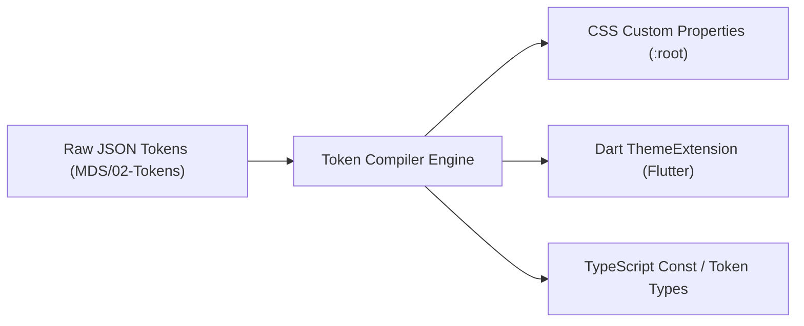

# Software Design Document (SDD) — Master Design System (MDS)

## 1. System Architecture & Layer Boundaries

MDS adopts a strict, unidirectional layered architecture. Lower layers never depend on higher layers:

```
[01 Foundations] (Typography, Cairo Font, 4px Base Grid, Elevation, Shape)
       ↓
[02 Tokens] (Primitives → Semantics → Components)
       ↓
[03 Primitives] (Container, Stack, Inline, Text, Surface, FocusRing)
       ↓
[04 Components] (Button, Input, Card, Modal, EmptyState, ErrorState)
       ↓
[05 Patterns] (FilterPanel, DataGrid, SearchExperience)
       ↓
[06 Workflows] (CheckoutFlow, Onboarding, Authentication)
       ↓
[07 Templates] (DashboardTemplate, MasterDetailTablet, LandingTemplate)
```

---

## 2. Token Pipeline & Compilation Flow



1. **Token Source:** Defined in modular JSON files within `MDS/02-Tokens/`.
2. **Compiler Engine:** Validates schema, resolves semantic aliases against primitives, and exports target artifacts:
   - Web: `tokens.css` with CSS variables for Light, Dark, and High-Contrast modes.
   - Flutter: `mds_tokens.dart` declaring color schemes, text themes (binding the selected font family once approved), and spacing constants.
   - TypeScript: `tokens.d.ts` for type safety in Next.js apps.

---

## 3. Cross-Cutting Systems
- **Experience States:** Standardized state models (Loading, Empty, Error, Recovery) implemented at the primitive level.
- **RTL & Localization:** Universal integration of Cairo font, automatic direction mirroring for navigation icons, logical CSS properties (`padding-inline`).
- **A11y Engine:** Automated verification of color contrast (WCAG AA/AAA standards) and keyboard trap prevention.
- **Security Engine:** HTML sanitization on rich text components, SVG vector sanitization, client-side input defense boundaries.

---

## 4. Testing & Verification Strategy (TDD)
- **Token Contract Tests:** Ensure all semantic tokens resolve to valid primitive definitions and meet WCAG AA contrast.
- **Widget / Unit Tests:** Verify Flutter widgets with `flutter test` under LTR and RTL directions.
- **A11y Tests:** Automated axe-core audits on React components to ensure zero accessibility violations.
- **Code Size Enforcement:** Linter rules preventing any source file from exceeding 500 lines.
